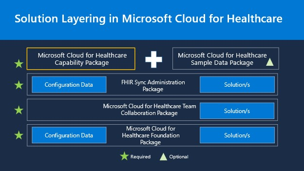

The healthcare data model defines a common language for healthcare business entities and can be further extended. It is based on the Fast Healthcare Interoperability Resources (FHIR) standards framework. It consists of 20+ FHIR/HL7 resources that form the core data constructs that drive Microsoft Cloud for Healthcare. The healthcare data model uses some out-of-the-box tables from the following applications:

- Dynamics 365 Customer Service

- Dynamics 365 Field Services

- Dynamics 365 Marketing

The entity reference for the Dynamics 365 solutions in Microsoft Cloud for Healthcare is available in the [Overview of Microsoft Cloud for Healthcare entities](/common-data-model/schema/core/industrycommon/healthcare/healthcare-overview/?azure-portal=true) Common Data Model documentation.

## Common Data Model in the healthcare cloud

The core data constructs that comprise the data model for Microsoft Cloud for Healthcare reside in the layer between Dataverse and the Microsoft Azure FHIR Sync Agent. It sits right on top of Microsoft Azure, which is also an ingestion layer for multiple electronic medical records (EMRs) or connected devices.

> [!div class="mx-imgBorder"]
> 

Common Data Model is instantiated through Dataverse, making this data available to Microsoft Power Platform. Then, all healthcare experiences for better care and insights will display through applications and services above this layer. For example, Microsoft Power Apps portals and Microsoft Azure Health Bot enable care coordination and Microsoft Dynamics 365 Customer Insights.

## Healthcare capabilities and the healthcare data model

Each Microsoft Cloud for Healthcare capability is associated with a subset of the healthcare data model, depending on the accompanying scenarios. The following screenshot shows that each layer produces the components of the healthcare data model on the target tenant.

> [!div class="mx-imgBorder"]
> 

Each Microsoft Cloud for Healthcare capability follows the same structure and layering. At the base is Microsoft Cloud for Healthcare Foundation Package, which has a set of solutions and configuration data. The second package layer is the Microsoft Cloud for Healthcare Team collaboration package, and the third is the Microsoft Cloud for Healthcare FHIR Sync Administration package.

On top of these three layers is the final package, which is based on your selected capabilities. For example, if you choose to install Care Management, the Microsoft Cloud for Healthcare capability package would be for care management. Similarly, if you choose Patient Outreach, the Microsoft Cloud for Healthcare capability package would be for patient outreach.

## Healthcare data model (preview)

The Microsoft healthcare data model is available for preview on the Microsoft Cloud Solution Center at solutions.microsoft.com. The solution doesn't have dependencies. It contains the entities, relationships, resources, and other processes to manage your healthcare data, including clinical communication, appointments, encounters, care teams, procedures, medications, and more.

For more information, see [Healthcare overview](/common-data-model/schema/core/industrycommon/healthcare/healthcare-overview/?azure-portal=true).

> [!div class="mx-imgBorder"]
> 

## Deprecation of Dynamics 365 Healthcare Accelerator

The Microsoft healthcare data model originated as part of Dynamics 365 Healthcare Accelerator, which was deprecated on November 13, 2020, and is no longer available. The healthcare data model has since been updated and is available through Microsoft Cloud for Healthcare. If you need to migrate from Dynamics 365 Healthcare Accelerator to Microsoft Cloud for Healthcare, go to the [Accelerator deprecation article](/dynamics365/industry/healthcare/accelerator-deprecation/?azure-portal=true
) on Microsoft Docs.
