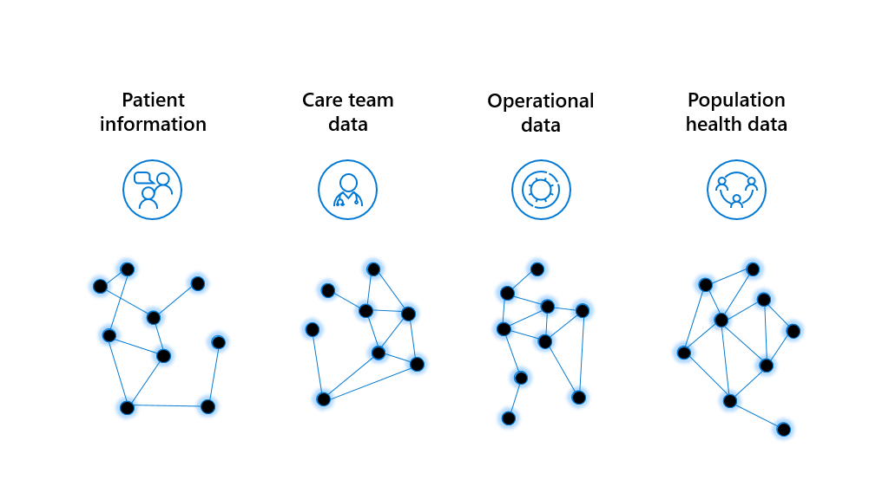
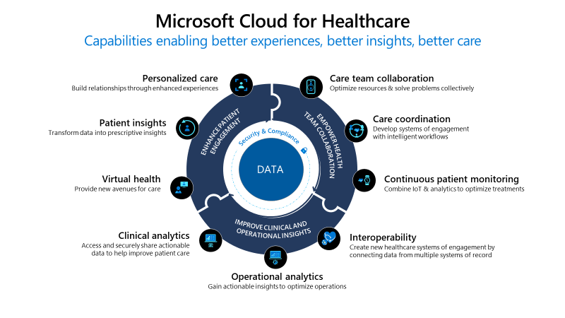

Microsoft Cloud for Healthcare provides healthcare organizations with tools to help manage health data at scale. Cloud for Healthcare helps healthcare organizations improve the patient experience, coordinate care, and drive operational efficiency, while helping to support security, compliance, and interoperability of health data.

The following sections discuss how healthcare is currently in transition and how Microsoft Cloud for Healthcare is helping to transform the healthcare journey.

## Healthcare in transition

The healthcare industry has already been burdened by longstanding trends, such as aging populations, provider burnout, and patient dissatisfaction. Since the COVID-19 pandemic, healthcare organizations have been forced to rethink established norms and operational best practices.

While new technologies have always promised significant clinical and operational benefits for healthcare organizations, COVID-19 has turned them from nice-to-haves to imperatives.

> [!div class="mx-imgBorder"]
> 

 > [!NOTE]
 > For more information, see the following resource links (numbers corresponding with reference numbers in the preceding screenshot): 

 > 1. [McKinsey COVID-19 Consumer Survey](https://www.mckinsey.com/~/media/McKinsey/Industries/Healthcare%20Systems%20and%20Services/Our%20Insights/Telehealth%20A%20quarter%20trillion%20dollar%20post%20COVID%2019%20reality/Telehealth-A-quarter-trilliondollar-post-COVID-19-reality.pdf/?azure-portal=true), May 2020

 > 2. [Deloitte](https://www2.deloitte.com/us/en/insights/focus/tech-trends/2017/dark-data-analyzing-unstructured-data.html/?azure-portal=true)

 > 3. PwC, 2017

 > 4. Becker's Hospital Review, [2017](https://www.beckershospitalreview.com/healthcare-information-technology/healthcare-breaches-cost-6-2b-annually.html/?azure-portal=true) and [2020](https://www.beckershospitalreview.com/cybersecurity/healthcare-data-breaches-up-55-1-in-2020-report-finds.html/?azure-portal=true)

As shown in the previous diagram, the healthcare industry is experiencing transition in the following areas:  

- **Virtual health** - Many patients are looking for new opportunities for using technology when managing their health. As consumers, patients are accustomed to managing other aspects of their lives, such as finances and shopping online. In May 2020, 76 percent of patients were interested in trying telehealth and 46 percent of patients were already using it to replace canceled, in-person visits.

- **Interoperability** - Improving remote patient engagement requires integrated and seamless data exchange to ensure that providers can access key patient insights. Unfortunately, 90 percent of the data that healthcare providers have available to them is currently unstructured and largely inaccessible for data-driven decisions.

- **Health outcomes** - With large volumes of unstructured data, providers must spend excessive time trying to glean insights from that data. In fact, up to 70 percent of the time that providers spend analyzing data is wasted on ingestion and unification. This factor stands as a major barrier to improving clinical, operational, and financial data.

- **Security pressures** - Even if healthcare organizations can't currently make efficient use of their data, large volumes of data put them at increased security risk. The healthcare industry continues to lead with the highest cost for data breaches. In 2020, healthcare data breaches cost $13.2 billion, over double the annual data breach cost of $6.2 billion in 2017. In response, regulators are increasing the pressure on healthcare organizations to maintain data compliance and protect their patients' sensitive information. As a result, they help ensure security, compliance, and privacy for health records because patient data is foundational to a technology-based approach to healthcare.

## Data source interoperability

Modern healthcare organizations have data coming from a myriad of sources. Patients enter their **personal information** when first contacting their primary care providers, who then augment that information with **clinical data** about the patient's health. Health providers can also compare their patients' data against **population health data** to understand broader trends that affect patient populations. Additionally, while healthcare organizations' primary goal might be to serve patients and deliver the best care outcomes possible, they must also manage **operational data** to maintain their facilities and ensure the efficient delivery of care.

> [!div class="mx-imgBorder"]
> 

Ingesting and managing several different forms of data requires many systems. Electronic medical records (EMR) and electronic health records (EHR) systems might house structured data to help make actionable insights easier. However other unstructured data sources, such as device and sensor data, SDoH data, imaging data, voice data, financial data, and operational data, make analyzing data to reveal actionable insights difficult. Because different organizations use different systems and tools, it's nearly impossible to create a consolidated view of the patient as they travel from provider to provider.

To overcome these challenges, healthcare organizations must harness the power of their data.

> [!div class="mx-imgBorder"]
> 

 > [!NOTE]
 > For more information on the preceding diagram, see [World Economic Forum](https://www.weforum.org/agenda/2019/12/four-ways-data-is-improving-healthcare/?azure-portal=true), 2019

The problem isn't a lack of data, it's a lack of interoperability and integration across data systems. Today, the average healthcare system produces over 50 petabytes of data across upwards of 10 siloed systems every year. After that data has been integrated and analyzed, it can reveal powerful insights to enhance patient care, health team efficacy, and organizational performance.

To fully realize the power and promise of their data, healthcare organizations must take a unified, holistic approach to system integration and optimization. This approach will help them unlock powerful data insights that transform patient care, improve operational efficiencies, and reduce risk to the organization. 

The following sections explain how Microsoft Cloud for Healthcare provides a foundation that supports these principles.

## Priority healthcare scenarios

Microsoft Cloud for Healthcare provides integrated and trusted capabilities. These capabilities unify structured and unstructured data to reveal actionable insights from intelligent data analytics and drive efficiency by automating high-value workflows.

> [!div class="mx-imgBorder"]
> 

These capabilities support three priority scenarios, which are highlighted by Microsoft Cloud for Healthcare in the following ways:

-   **Enhance patient engagement** - Enable patient data to flow securely across the care continuum, creating individualized patient experiences and delivering virtual health tools to facilitate communication between providers and patients.

-   **Empower health team collaboration** - Expedite the health teams' ability to coordinate care, collaborate on a shared, unified view of the patient, and continually monitor patients across remote locations.

-   **Improve clinical and operational insights** - Unite data siloes and apply advanced analytics and AI to reveal actionable insights to help make better, smarter clinical, and operational decisions. You can even trigger automated workflows based on patient or staff actions and predictive analytics.

Microsoft Cloud for Healthcare is built around **protecting health information** to support end-to-end security and privacy, manage evolving compliance regulations, and continually improve data governance and trust.

## Featured healthcare capabilities

Nine capabilities are enabled through the three provider-centric customer scenarios. Each capability is composable, meaning that you can deploy them one at a time or in groups. Customers can also use their existing investments in Microsoft Cloud technologies by applying these capabilities to solutions that are already deployed in their environment.

The nine capabilities are:

- **Personalized care** - Build relationships through enhanced experiences that are personalized for each patient.

- **Patient insights** - Transform data into prescriptive insights.

- **Virtual health** - Provide new avenues for care through text, voice, video, and chat bots.

- **Care team collaboration** - Optimize resources and solve problems collectively.

- **Care coordination** - Develop systems of engagement with intelligent workflows.

- **Continuous patient monitoring** - Combine the Internet of Medical Things (IoMT) and analytics to optimize treatments.

- **Interoperability** - Create new healthcare systems of engagement by connecting data from multiple datasets.

- **Operational analytics** - Gain actionable insights to optimize operations.

- **Clinical analytics** - Access and help securely share actionable data to help improve patient care.

> [!div class="mx-imgBorder"]
> 

These capabilities have been built with the desired outcome of delivering better patient experience, better insights that drive positive change, and overall better care across the entire care continuum.

Microsoft Cloud for Healthcare will support accelerated health transformation into the future, with trusted cloud capabilities for customers and partners that span the most important needs for healthcare organizations.

