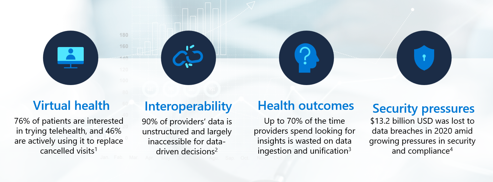
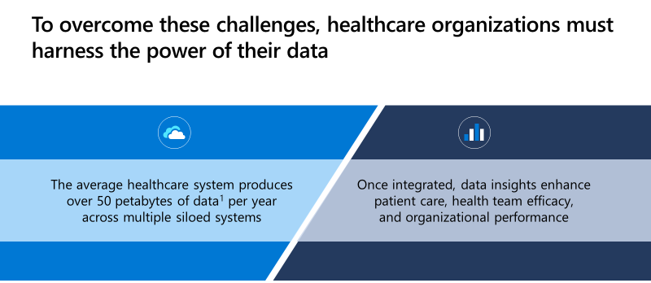
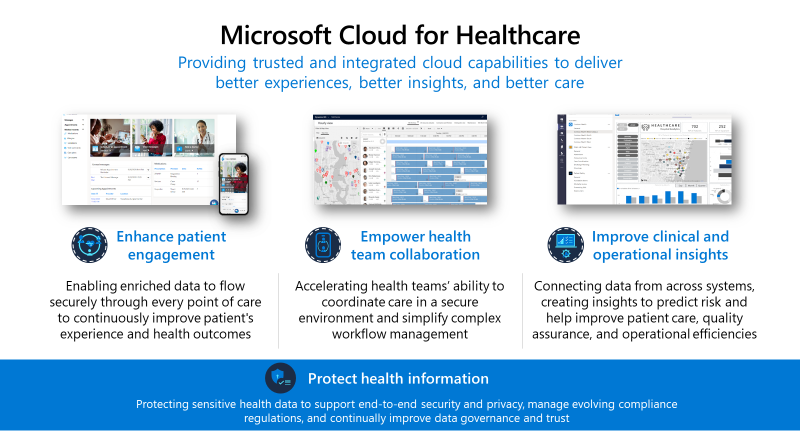

Microsoft Cloud for Healthcare provides capabilities to manage health data at scale and make it easier for healthcare organizations to improve the patient experience, coordinate care, and drive operational efficiency, while helping support security, compliance, and interoperability of health data.

Let's see how healthcare is currently in transition and how Microsoft Cloud for Healthcare is helping transform the healthcare journey.

## Healthcare in transition

The healthcare industry has already been burdened by longstanding trends like aging populations, provider burnout, and patient dissatisfaction. And now, since the COVID-19 pandemic, healthcare organizations have been forced to rethink established norms and operational best practices.

While new technologies have always promised significant clinical and operational benefits for healthcare organizations, COVID-19 has turned them from nice-to-haves to imperatives.

> [!div class="mx-imgBorder"]
> 

- [McKinsey COVID-19 Consumer Survey](https://www.mckinsey.com/~/media/McKinsey/Industries/Healthcare%20Systems%20and%20Services/Our%20Insights/Telehealth%20A%20quarter%20trillion%20dollar%20post%20COVID%2019%20reality/Telehealth-A-quarter-trilliondollar-post-COVID-19-reality.pdf/?azure-portal=true), May 2020

- [Deloitte](https://www2.deloitte.com/us/en/insights/focus/tech-trends/2017/dark-data-analyzing-unstructured-data.html/?azure-portal=true)

- PwC, 2017

- Becker's Hospital Review, [2017](https://www.beckershospitalreview.com/healthcare-information-technology/healthcare-breaches-cost-6-2b-annually.html/?azure-portal=true) and [2020](https://www.beckershospitalreview.com/cybersecurity/healthcare-data-breaches-up-55-1-in-2020-report-finds.html/?azure-portal=true)

**Virtual health:** Many patients are looking for new opportunities to leverage technology when managing their health. As consumers, patients are used to managing other aspects of their lives like finances and shopping online. In May 2020, 76% of patients were interested in trying telehealth and 46% of patients were already using it to replace canceled in-person visits.

**Interoperability:** Improving remote patient engagement requires integrated and seamless data exchange to ensure providers can access key patient insights. Unfortunately, 90% of the data healthcare providers have available to them is currently unstructured and largely inaccessible for data-driven decisions.

**Health outcomes:** With such large volumes of unstructured data, providers must spend exorbitant amounts of time trying to glean any insights from that data. In fact, up to 70% of the time providers spend analyzing data is wasted on ingestion and unification. This stands as a major barrier to improving clinical, operational, and financial data.

**Security pressures:** Even if healthcare organizations can't currently make efficient use of their data, such large volumes of data put them at increased security risk. The healthcare industry continues to lead with the highest cost for data breaches. In 2020, healthcare data breaches cost \\$13.2 billion, over double the annual data breach cost of \\$6.2 billion in 2017. In response, regulators are increasing the pressure on healthcare organizations to maintain data compliance and protect their patients' sensitive information. Thus, ensuring security, compliance, and privacy for health records and patient data is foundational to a technology-based approach to healthcare.

## Data source interoperability

Modern healthcare organizations have data coming from a myriad of sources. Patients input their **personal information** when first contacting their primary care providers, who then augment that information with **clinical data** about the patient's health. Health providers can also compare their patients' data against **population health data** to understand broader trends affecting patient populations. And while healthcare organizations' primary goal may be to serve patients and deliver the best care outcomes possible, they also must manage **operational data** to maintain their facilities and ensure the efficient delivery of care.

> [!div class="mx-imgBorder"]
> 

Ingesting and managing many different forms of data requires a plethora of systems. While EMR and EHR systems may house structured data, other unstructured data sources, anything from device and sensor data, SDoH data, imaging data, -omic data, and voice data, to financial and operational data make analyzing data to reveal actionable insights difficult. And because different organizations use different systems and tools, it's nearly impossible to create a consolidated view of the patient as they travel from provider to provider.

To overcome these challenges, healthcare organizations must harness the power of their data.

> [!div class="mx-imgBorder"]
> 

- [World Economic Forum](https://www.weforum.org/agenda/2019/12/four-ways-data-is-improving-healthcare/?azure-portal=true), 2019

The problem isn't a lack of data, it's a lack of interoperability and integration across data systems. Today, the average healthcare system produces over 50 petabytes of data across upwards of 10 siloed systems every year. Once that data has been integrated and analyzed, it can reveal powerful insights to enhance patient care, health team efficacy, and organizational performance.

In order to fully realize the power and promise of their data, healthcare organizations must take a unified, holistic approach to system integration and optimization, unlocking powerful data insights that transform patient care, improve operational efficiencies, and reduce risk to the organization. Let's see how Microsoft Cloud for Healthcare provides a foundation supporting these principles.

## Priority Healthcare scenarios

The Microsoft Cloud for Healthcare provides integrated and trusted capabilities that unify structured and unstructured data to reveal actionable insights from intelligent data analytics and drive efficiency by automating high-value workflows.

> [!div class="mx-imgBorder"]
> 

These capabilities support three main scenarios: **enhancing patient engagement**, **empowering health team collaboration**, and **improving clinical and operational insights**. These priority scenarios are highlighted by Microsoft Cloud for Healthcare in the following ways:

-   **Enhancing patient engagement** by enabling patient data to flow securely across the care continuum, creating individualized patient experiences, and delivering virtual health tools to facilitate communication between providers and patients

-   **Empowering health team collaboration** by making it faster and easier to coordinate care, collaborate on shared, a unified view of the patient, and continually monitor patients across remote locations.

-   **Improving clinical and operational insights** by uniting data siloes and applying advanced analytics and AI to reveal actionable insights to make better, smarter clinical, and operational decisions. You can even trigger automated workflows based on patient or staff actions and predictive analytics.

Critically, the Microsoft Cloud for Healthcare is built around **protecting health information** to support end-to-end security and privacy, manage evolving compliance regulations, and continually improve data governance and trust.

## Featured Healthcare capabilities

There are the nine capabilities enabled through our three provider-centric customer scenarios. Each of these capabilities is composable, meaning they can be deployed one at a time or in groups. Customers can also leverage their existing investments in Microsoft Cloud technologies by applying these capabilities to solutions already deployed in their environment.

The nine capabilities include the following:

- **Personalized care**: Build relationships through enhanced experiences personalized for each patient.

- **Patient insights**: Transform data into prescriptive insights.

- **Virtual health**: Provide new avenues for care through text, voice, video, and chat bots.

- **Care team collaboration**: Optimize resources and solve problems collectively.

- **Care coordination**: Develop systems of engagement with intelligent workflows.

- **Continuous patient monitoring**: Combine IoMT and analytics to optimize treatments.

- **Interoperability**: Create new healthcare systems of engagement by connecting data from multiple datasets.

- **Operational analytics**: Gain actionable insights to optimize operations.

- **Clinical analytics**: Access and securely share-actionable data to help improve patient care.

> [!div class="mx-imgBorder"]
> 

All of this is built with the desired outcome of delivering better patient experience, delivering better insights that drive positive change, and overall better care across the entire care continuum.

The Microsoft Cloud for Healthcare will support accelerated health transformation into the future, with trusted cloud capabilities for customers and partners spanning the most important needs for healthcare organizations.

