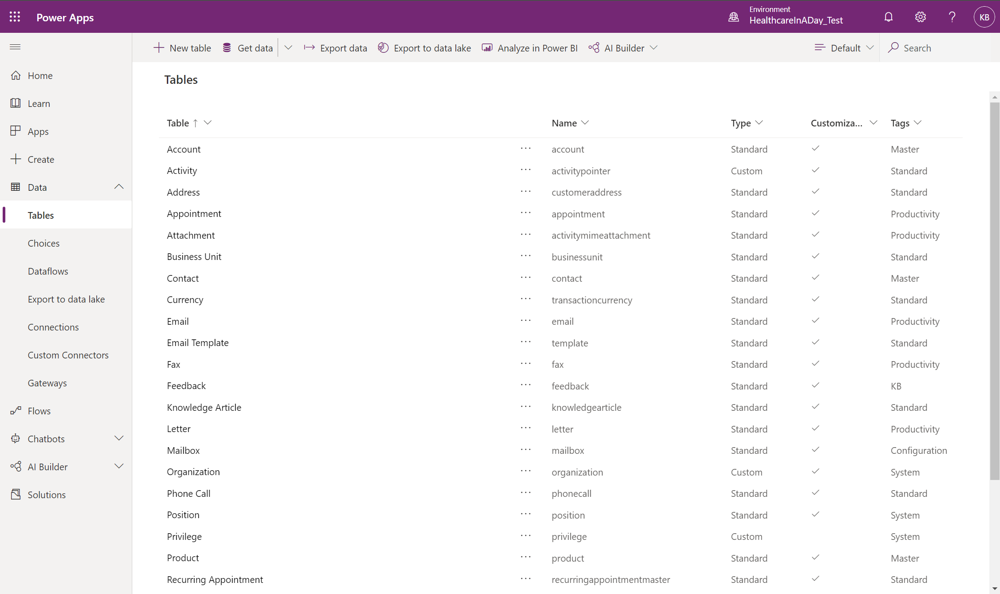
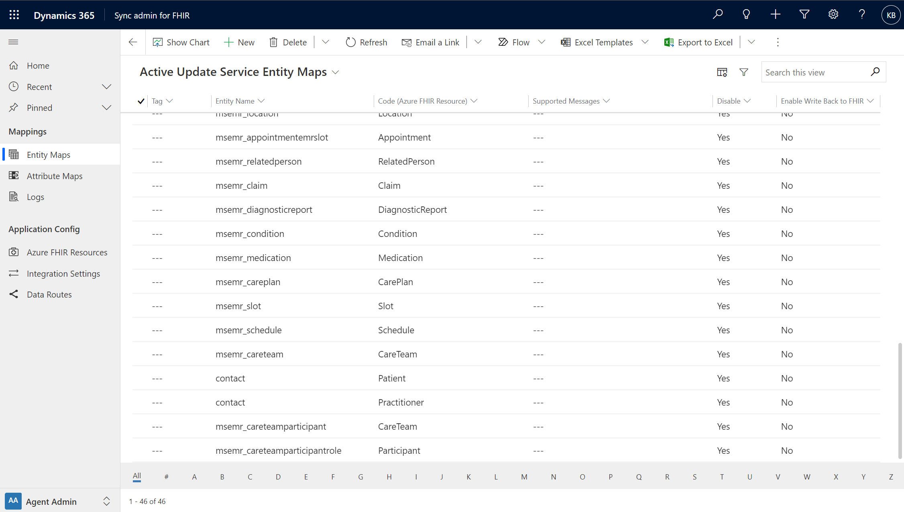
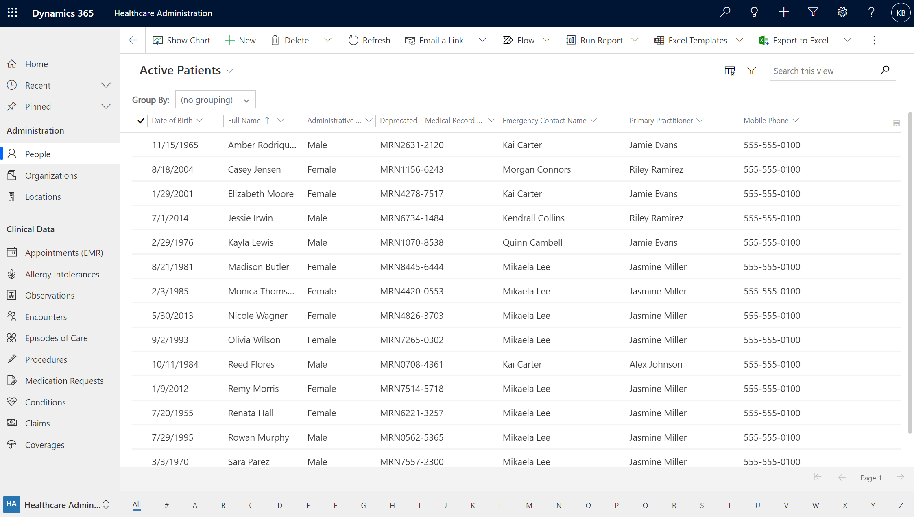

The Microsoft Cloud for Healthcare provides a single hub to connect data from across systems, creating insights to predict risk and help improve patient care, quality assurance, and operational efficiencies.

-   **Data interoperability**: Simplify data governance and compliance by unifying data on a single, secure data platform

-   **Operational analytics**: Improve operational efficiency by synchronizing management efforts across clinicians and administrators

-   **Clinical analytics**: Transform health outcomes using data-driven insights to improve clinical decision-making and care experiences

> [!div class="mx-imgBorder"]
> 

Create new healthcare systems of engagement by connecting data from multiple datasets through the Microsoft Cloud for Healthcare, gaining actionable insights that help optimize operations and help lead to better health outcomes and more satisfying patient experiences. See more on how Microsoft Cloud for Healthcare improves clinical and operational insights on Microsoft Docs at [Improve clinical and operational insights](/industry/healthcare/improve-clinical-operational-insights/?azure-portal=true).

## Featured Healthcare applications and services

The applications provided by Microsoft Cloud for Healthcare that focus primarily on improving operational and clinical insights are the following:

**Dataverse**: Securely store and manage data that's used by business applications.

**Azure Healthcare APIs (preview)**: Use a set of managed API services and frameworks that's dedicated to the healthcare industry to enable workflows to improve healthcare and offer scalable and secure healthcare solutions.

**Sync admin for FHIR**: Support data flows between Dataverse and FHIR-compliant EHR systems, simplifying data admin duties for data mapping and allowing users to see transaction logs.

**Healthcare Administration**: Manage all clinical and operational data in one place.

> [!div class="mx-imgBorder"]
> 

### Dataverse

Dataverse lets you securely store and manage data used by business applications. Data within Dataverse is stored within a set of tables. A table is a set of rows and columns. Each column in the table is designed to store a certain type of data (for example, name or address). Dataverse includes a base set of standard tables that cover typical scenarios, but you can also create custom tables specific to your organization and populate them with data by using Power Query. App makers can then use Power Apps to build rich applications that use this data.

> [!div class="mx-imgBorder"]
> 

Learn more on Microsoft docs at [Microsoft Dataverse documentation](/powerapps/maker/data-platform/?azure-portal=true).

There are various features included in Dataverse, including the following:

-   **Security:** Rich security model to protect the data integrity and privacy of users while promoting efficient data access and collaboration. Combine business units, role-based security, row-based security, and column-based security to define the overall access to information.

-   **Store & Manage Data**: Standard and custom tables provide a secure and cloud-based storage option for your data and metadata.

-   **Quickly Access & Build Apps against your Data**: Data from your Dynamics 365 applications is also stored within Dataverse, allowing you to quickly build apps that use your Dynamics 365 data and extend your apps with Power Apps.

-   **Reusable Business Logic**: Define calculated columns, business rules, workflows, and business process flows to ensure data quality and drive business processes.

-   **Built-in Validations**: Create business rules to validate data across multiple columns and tables. Provide warning and error messages regardless of the app used to create the data.

-   **Integration with Other Systems**: Connect to the devices, apps, systems, services, and popular SaaS offerings that contain the data for your business. Dataverse has a deep integration with Microsoft's cloud services such as Azure, Dynamics 365, and Microsoft 365, plus access to many connectors in Power Automate and Azure Logic Apps.

### Azure Healthcare APIs (preview)

Azure Healthcare APIs is a set of managed API services based on open standards and frameworks, including Fast Healthcare Interoperability Resources (FHIR) and Digital Imaging Communications in Medicine (DICOM), that enable workflows to improve healthcare and offer scalable and secure healthcare solutions. It does this through insights by bringing PHI datasets together and connecting them end-to-end with tools for machine learning, analytics, and AI.

Using a set of managed API services and frameworks dedicated to the healthcare industry is important and beneficial because health data collected from patients and healthcare consumers can be fragmented from across multiple systems, device types, and data formats. 

> [!div class="mx-imgBorder"]
> 

Azure Healthcare APIs is the evolved version of Azure API for FHIR and offers additional technology and services. Existing customers can continue using the product without disruption to the service.

Learn more on Microsoft docs at [Azure Healthcare APIs documentation](/azure/healthcare-apis/?azure-portal=true) and on Azure at [Azure Healthcare APIs](https://azure.microsoft.com/services/healthcare-apis/?azure-portal=true).

There are various features included in Azure Healthcare APIs, including the following:

-   **Rapidly Exchange Data**: Allows for the exchange of data via consistent, RESTful, FHIR APIs based on the HL7 FHIR specification. Connect with any system that leverages FHIR APIs for read, write, search, and other functions.

-   **Control Data Access at Scale:** Provide increased security and reduce administrative workload by determining access based on role definitions for your environment.

-   **Audit Logs and Tracking**: Quickly track where your data is going with built-in audit logs. Track access, creation, modification, and reads within each data store.

-   **Linked Services**: Support multiple health data standards for exchanging structured data. A single collection of Azure Healthcare APIs enables you to deploy multiple instances of different service types (FHIR Service, DICOM Service, and IoT Connector) that seamlessly work with one another.

-   **Enrich Disparate Data Sets**: Utilize tools to quickly combine disparate health datasets and standardize data in the cloud.

-   **Gain Insights from real-time PHI data:** Use connectors to Azure Synapse Analytics, Azure Machine Learning, and Power BI to generate insights from real-world data.

-   **End to End Data Pipeline**: Build a scalable end-to-end data pipeline that helps secure your protected health information (PHI) data workflows.

### Sync admin for FHIR

Sync admin for FHIR is a model-driven app that helps the Azure FHIR Sync Agent give healthcare admins control over data flowing between Azure-based FHIR systems and [Microsoft Dataverse](/powerapps/maker/common-data-service/data-platform-intro/?azure-portal=true). It has ready-made, customizable entity and attribute maps, and tools to manage them. It allows protected patient data to be available directly in your Microsoft Cloud for Healthcare solution powered by Dynamics 365, while remaining in its original system when at rest.

> [!div class="mx-imgBorder"]
> 

Learn more about Sync admin for FHIR on Microsoft Docs at [Overview of Sync admin for FHIR](/dynamics365/industry/healthcare/configure-sync-clinical-data/?azure-portal=true).

There are various features included in Sync admin for FHIR, including the following:

-   **Configure Azure FHIR Resources**: Because you can't see inside of FHIR entities directly to see all the resources, the FHIR Sync Agent defines all the resources in an entity. The FHIR resources are primarily used in entity maps.

-   **Create/Manage Entity & Attribute Maps**: Extensible and configurable framework to create your own entity and attribute maps or use ready-made maps for FHIR data used by Microsoft Cloud for Healthcare solutions. Using a familiar interface, admins can enable, disable, archive, and modify these maps to fit current EHR systems.

-   **Analyze FHIR Sync Data**: Allow map administrators to view and interact with user data flowing into the system, which helps them understand and troubleshoot the data.

-   **Dataverse Logs**: Understand the transactions that are occurring inside Dataverse and how the data is flowing, including why something is or isn't sent over to the Azure Service Bus.

-   **Manage Integration Settings**: Access the Dataverse environment variables that define and control the integration of Azure FHIR and Dataverse.

### Healthcare administration

Healthcare Administration is a model-driven app that healthcare organizations can use to manage clinical and operational data.

> [!div class="mx-imgBorder"]
> 

There are various features included in Healthcare Administration, including the following:

-   **Holistic View of Clinical Data**: Find all clinical data in one place, including claims and coverages.

-   **Manage Operational Information**: Manage operational information including people, organization accounts, and locations.

-   **Manage Patient Information**: Manage patient or practitioner information.

-   **Manage Settings**: Manage settings for the Patient Access portal location and organizer email for instant virtual appointments.
