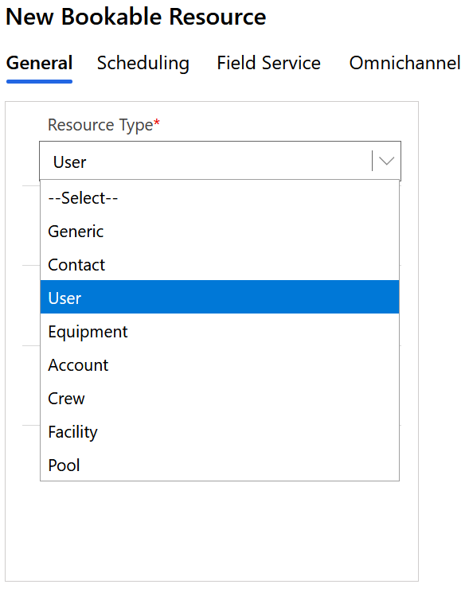
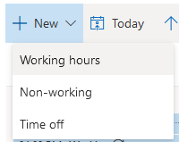
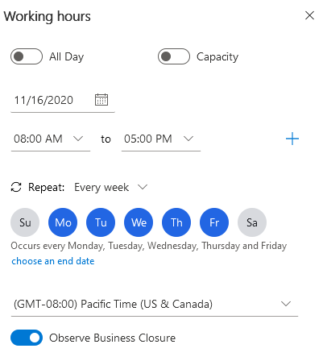
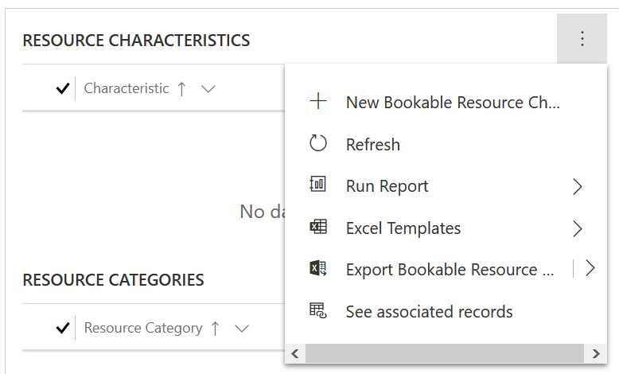
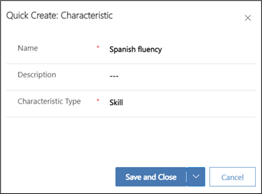
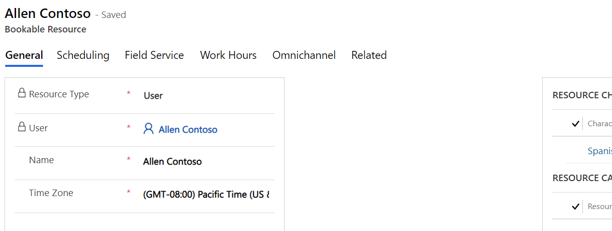

In this exercise, you will learn how to create a bookable resource that you can use for scheduling a Home Health work order. A bookable resource in Microsoft Cloud for Healthcare is anything that needs to be scheduled. Often, a bookable resource includes people, equipment, and physical spaces (facilities). You will need to create a bookable resource before scheduling a Home Health work order.

Each resource can have different attributes that distinguish it from others, including:

- Characteristics (such as Accounting)
	
- Categories (such as Manager)
	
- Territories (such as Washington State)
	
- Organizational Unit (such as Seattle Service Delivery)
	
- Location (such as Location Agnostic)
	
- Resource Type (such as User)

To create a bookable resource in the Home Health application, follow these steps:

1.  Go to [https://make.powerapps.com](https://make.powerapps.com/?azure-portal=true).

1.  Open the Microsoft Dynamics 365 Field Service app.

	> [!div class="mx-imgBorder"]
	> 

1.  In the lower left of the navigation pane, change the area from **Service** to **Resources**.

	> [!div class="mx-imgBorder"]
	> 

1.  You will be directed to the **Bookable Resources** entity. Select **+ New** on the command bar to create a new bookable resource.

	> [!div class="mx-imgBorder"]
	> 

1.  Select **Resource Type**, which is a classification that describes who or what the resource is and how the resource relates to your organization. In this case, select **User**, who is a person and a member of your organization that needs access to the Field Service Mobile app.

	> [!div class="mx-imgBorder"]
	> 

1.  Pick a **User** and then select their **Time Zone**.

	> [!div class="mx-imgBorder"]
	> 

1.  Select **Scheduling** to decide where the resource starts and ends their workday for scheduling and routing purposes. Three options that you can choose from when selecting the **Start/End location** for the bookable resource are:

	-   **Location Agnostic** - Select this option if the location of this resource is not required for the business need and doesn't need to be considered during the scheduling process. If the work location of a requirement is set to **on site**, location agnostic resources will not return in results.
	
	-   **Resource Address** - Select this option if the resource starts and ends their day at a unique location. The exact location is derived from the latitude and longitude values on the related user, account, or contact records, depending on the resource type. 
	
	-   **Organizational Unit** - Select this option if the resource starts and ends the day at an organizational unit, which typically represents a company location.

	In this case, select **Location Agnostic**.

	> [!div class="mx-imgBorder"]
	> 

1.  Select the **Field Service** tab to optionally configure other aspects of the bookable resource. **Save** the record.

1.  After you have saved the bookable resource, you can set the working hours of the resource. Working hours are considered by the following entities:

	-   The schedule board, by displaying working and nonworking hours as different colors.
	
	-   The schedule assistant, by only displaying resources that are working in the result.
	
	-   Resource Scheduling Optimization, which automatically books requirements to resources that are working.

	Select the **Show Work Hours** button on the command bar.

	> [!div class="mx-imgBorder"]
	> 

1. Select **+New > Working hours**.

	> [!div class="mx-imgBorder"]
	> 

1. Choose the **date** that you want the working schedule to begin on, the beginning and end **time** of working hours (such as 8:00 AM to 5:00 PM), along with a **Repeat** option (such as **Every week**), and then clear the **Sunday** and **Saturday** options. Select **Save**.

	> [!div class="mx-imgBorder"]
	> 

1. Return to the **General** tab and create a resource characteristic by selecting **+ New Bookable Resource Characteristic**.

	> [!div class="mx-imgBorder"]
	> 

1. In the **Skill Name** field, select the magnifying glass and then select **+ New Characteristic**.

	> [!div class="mx-imgBorder"]
	> 

1. A quick create form for Characteristic will appear. We want to assign a characteristic to the bookable resource. In this case, the user can speak Spanish fluently. Type "**Spanish fluency**" for the **Name** and select **Save & Close.**

	> [!div class="mx-imgBorder"]
	> 

1. Back on the Bookable Resource Characteristic quick create form, the Skill Name should be populated with the new Spanish fluency characteristic. Select **Save & Close**.

	> [!div class="mx-imgBorder"]
	> 

	> [!NOTE]
	> Characteristics represent a resource's skills and certifications. This could be concrete, like a CPR certification; more general, like accounting or web development experience; or as simple as security clearance for a specific building or fluency in the Spanish language.

1. Your bookable resource (user) now has working hours configured and the proper characteristics applied.

	> [!div class="mx-imgBorder"]
	> 

1. For more data in the system, create **two** more **Bookable Resources** following the same process. For each of them, select **Contact** as the **Resource Type** and choose any **Contact** in the system. Choose **Location Agnostic** just as before and select **Save**. Configure the **Work Hours** the same as the previous Bookable Resource. Add characteristics as you see fit and select **Save & Close**.

**Congratulations**! You have created a Bookable Resource. In the next task, we will use this bookable resource to help configure the Schedule Board.

