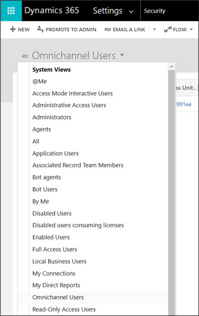
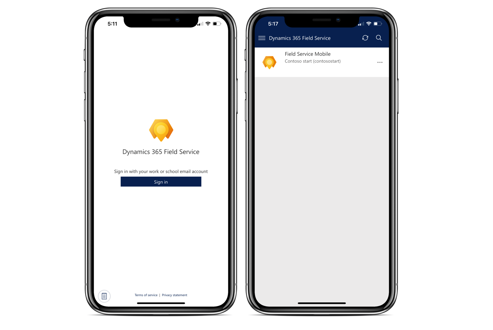
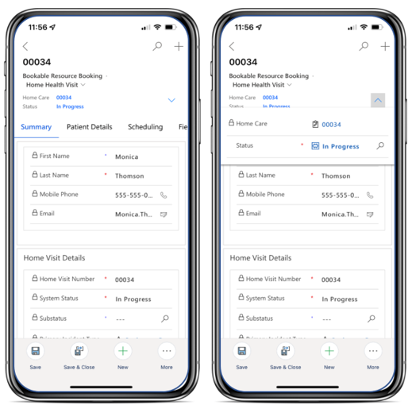
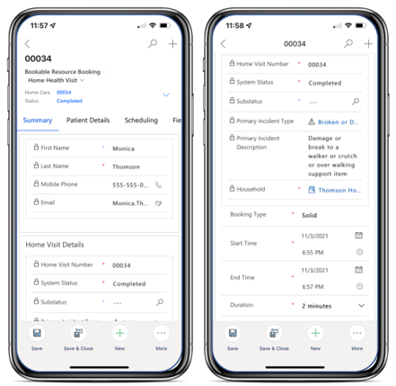
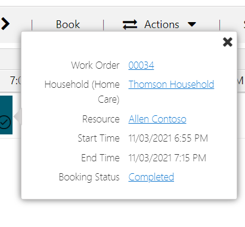
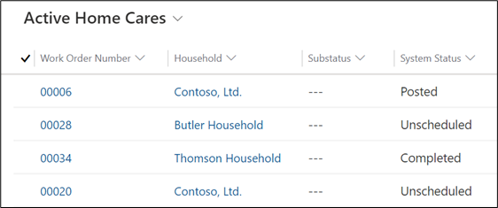

In this exercise, you will learn about the Field Service Mobile app and how to use care management components from the perspective of a nurse or a physical therapist who is out in the field working with a patient. This exercise goes through the installation process, shows how to set up Home Health users and security profiles, and demonstrates how to use the app to complete work orders.

[The Dynamics 365 Field Service Mobile app](/dynamics365/field-service/mobile-power-app-overview/?azure-portal=true) is designed and optimized for mobile health workers to view Dynamics 365 Home Health work orders and patient information. This mobile app is built on Microsoft Power Platform and is customizable to your business needs with the same admin console as all Dynamics 365 business apps.

Field Service Mobile app is available natively for Apple iOS and Google Android phones and tablets, and it offers technicians many capabilities that they need to perform on-site customer service, such as:

-   A calendar view of assigned jobs

-   Support for picture, video, and asset barcode scanning

-   Customer signature capture

-   Offline capabilities so that mobile health workers can continue viewing and recording work in areas without internet

The following screenshot shows a calendar view of scheduled work orders.

> [!div class="mx-imgBorder"]
> 

## Task 1: Assign security roles to Field Service mobile users

In this task, you will assign the **Field Service - Resource** role to Home Health workers.

1.  Go to [https://make.powerapps.com](https://make.powerapps.com/?azure-portal=true).

1.  Select the **gear icon** in the upper-right corner, and then go to **Advanced settings**.

	> [!div class="mx-imgBorder"]
	> 

1.  You will be navigated to the classic view. If it takes a while to load, refresh the page.

	> [!div class="mx-imgBorder"]
	> 

1.  Select **Settings** and then select **Security**.

	> [!div class="mx-imgBorder"]
	> 

1.  Select **Users**.

	> [!div class="mx-imgBorder"]
	> 

1.  The view will be set as Omnichannel Users. Change the view to show **Enabled Users**.

	> [!div class="mx-imgBorder"]
	> 

	> [!div class="mx-imgBorder"]
	> 

1.  Find and select the user to whom you want to assign the **Field Service Mobile - Resource** role and then select **Manage Roles**.

	> [!div class="mx-imgBorder"]
	> 

1.  Scroll down to select the **Field Service - Resource** security role and then select **OK**.

	> [!div class="mx-imgBorder"]
	> 

Congratulations, you have assigned the Field Service - Resource role to a Field Service Mobile Home Health user in Microsoft Cloud for Healthcare. This user will be able to use the Field Service Mobile application as a home health user.

## Task 2: Download the Field Service Mobile app and sign in

In this task, you will download the Field Service Mobile app to an iOS or Android device and then sign in.

1.  Go to the app store on your iOS or Android device and search for **Dynamics 365 Field Service**.

1.  Download the **Field Service (Dynamics 365)** app, as shown in the following screenshot. It's the mobile app that is built on Microsoft Power Platform.

	> [!div class="mx-imgBorder"]
	> 

1.  Launch the app and then **sign in** with the Microsoft Cloud for Healthcare username and password for the user whom you assigned the **Field Service - Resource** security role to in the previous task.

	> [!div class="mx-imgBorder"]
	> 

Congratulations, you have downloaded and signed in to the Field Service Mobile app as a Home Health user in Microsoft Cloud for Healthcare.

## Task 3: Use the Field Service Mobile app to manage Home Health work orders

In this task, you will assign a Home Health work order to your Home Health bookable resource. Next, you will view and update the work order in the Field Service Mobile app and then view those changes in the Microsoft Cloud for Healthcare Home Health app.

1.  On your mobile device, sign in to the Field Service Mobile app as your bookable resource user. If you encounter a message that states, "Contact your administrator for access to your organization's mobile apps," select the menu icon in the upper left and set the **Show non-production apps** toggle to **Yes** (because the list shows production apps by default).

	> [!div class="mx-imgBorder"]
	> 

1.  In the list of environments, find the Microsoft Cloud for Healthcare environment that you have been working in. From that environment, you will find the Home Health work order in the calendar view, shown in an **In Progress** state.

	> [!div class="mx-imgBorder"]
	> 

1. Select to open the work order. Notice that the **Status** shows as **In Progress**. Expand the status field using the blue arrow in the upper right.

	> [!div class="mx-imgBorder"]
	> 

1. Select the magnifying glass next to the status field to modify the value. **Remove** In progress from the selected values by selecting the x next to it.

	> [!div class="mx-imgBorder"]
	> 

1. Select the **Completed** option for **Booking Status** to close the Work Order.

	> [!div class="mx-imgBorder"]
	> 

1. Select **Save** in the upper right corner. The Work order has been completed and the time values have reflected based on the start time and when we completed the order.

	> [!div class="mx-imgBorder"]
	> 

1. We are now finished with the mobile app. Go back to the **Home Health app**.

1. You'll see on the **schedule board** the work order has been updated to show the reflected time and status.

	> [!div class="mx-imgBorder"]
	> 

1. Select **Home Care** on the site map and find **Work Order 00034**. You will see that the **System Status** has been updated to "Completed".

	> [!div class="mx-imgBorder"]
	> 

	> [!div class="mx-imgBorder"]
	> 

**Congratulations!** You have assigned a Home Health Work Order to a Home Health Bookable Resource, made updates to the work order in the Field Service mobile app, and then viewed those changes in the Microsoft Cloud for Healthcare Home Health app. For more information on the Field Service mobile app, see [Install and set up the Field Service (Dynamics 365) mobile app](/dynamics365/field-service/mobile-power-app-get-started/?azure-portal=true).