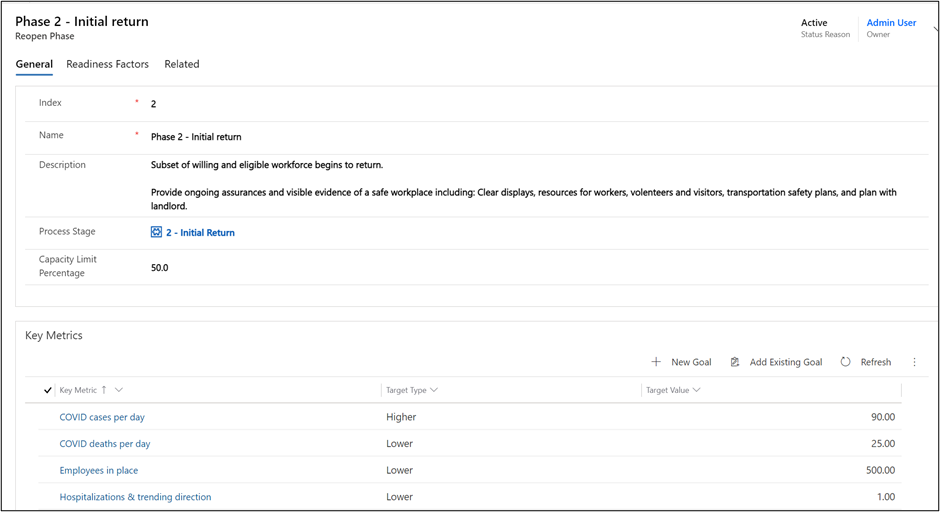
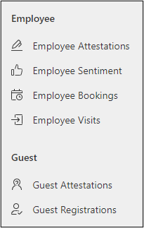
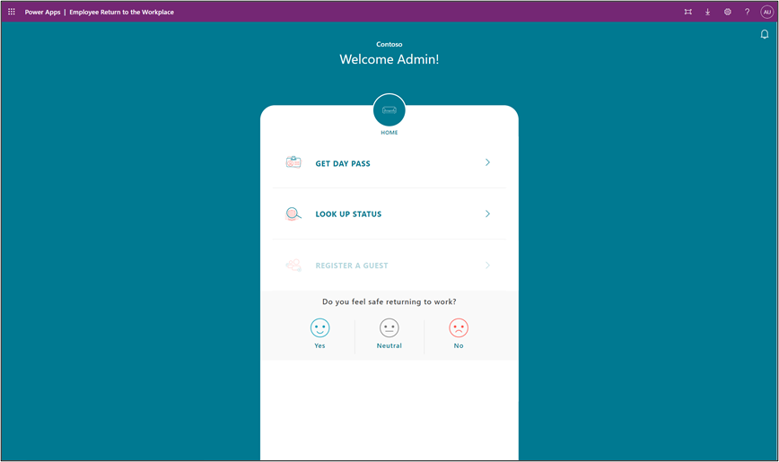
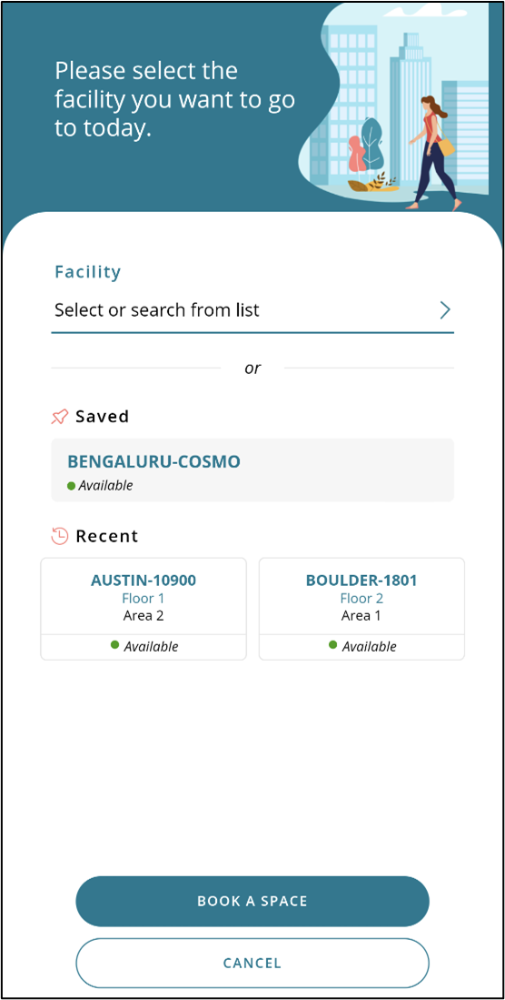
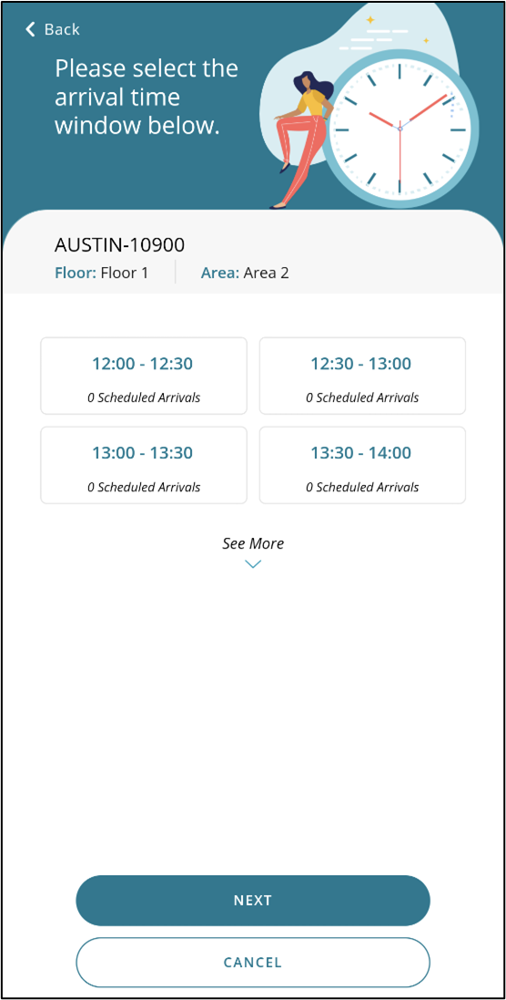
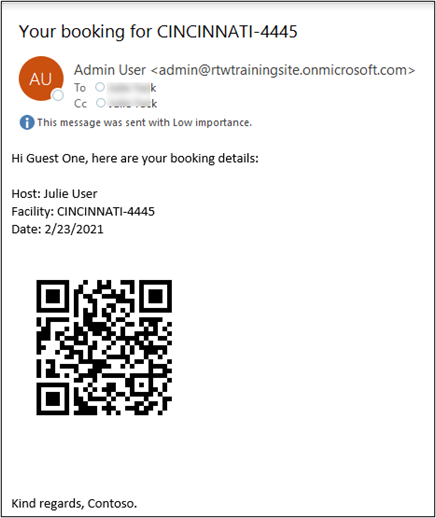

Businesses are eager to reopen and need to be informed of the risks and plans. The Return to the Workplace solution has several assets to help businesses prepare for and facilitate reopening safely.

## Location Readiness dashboard 

The Location Readiness dashboard is a Power BI dashboard that helps you to integrate insights into your own data and global sources in a unified view. You can view the dashboard in the model-driven apps or directly from the [Power BI website](https://powerbi.microsoft.com). The dashboard allows you to filter by one or many geographical locations, from worldwide to country or region level, throughout. Additionally, you can view results as a map or tabular view. Like all Power BI dashboards in the Return to Workplace solution, you can drill into the data to view more details as needed.

The **System at a Glance** tab shows data that is related to reopening phases, confirmed cases, fatalities, and the effective reproductive number, also known as the *R number*.

> [!div class="mx-imgBorder"]
> 

**Facilities at a Glance** tracks return phases, readiness tasks, and occupancy rates across facilities globally.

> [!div class="mx-imgBorder"]
> 

The **Employee Activity** tab provides insights into employee, visitor, and guest app usage, alongside the gauging of their sentiment around their return to workplace experiences, with impromptu flexible date filtering.

> [!div class="mx-imgBorder"]
> 

## Workplace Care Management 

The Workplace Care Management *model-driven* app lets you manage your team and their care as it relates to virus exposure and its impact on the workplace.

> [!div class="mx-imgBorder"]
> 

> [!div class="mx-imgBorder"]
> 

The dashboard in this app shows an overall view of tracked employee case data. From the dashboard, you can drill into any records that require action. This dashboard uses native to model-driven apps dashboard functionality to display the records in easy-to-view rows in a grid.

The **Employee Cases** feature allows you to track progress of employees who might have been exposed to COVID-19. You can determine their monitoring needs, necessary lengths for restricted building access, and more. The guided business process on the **Employee Case** form helps you keep track of the phases of certain individuals, from exposure investigation to monitoring and on to resolution.

> [!div class="mx-imgBorder"]
> 

Employee records are managed as contacts in Microsoft Dataverse. The same employee data is used across all Return to the Workplace apps, such as the Facility Safety Management app. The only difference is the purpose for which they are used.

Employee case managers are internal users in the system. They can help track and monitor progress of employee cases. For a user to be a case manager, you must assign the **Return to the Workplace - Health and Safety Leader** security role to their user record.

## Facility Safety Management

The Facility Safety Management *model-driven* app helps you keep track of the return-to-work guidelines across your organization's locations and many associated details, such as facility types, occupancy levels, and locations. The app allows users to track multiple locations and areas within each location.

### Solution setup area

The solution setup area of the Facility Safety Management app is used to control the data that internal and external users see in their Employee Return to the Workplace canvas/portal app for building access and daily health checks. It supports several different configurations of one or multiple sites. Each location can have different rules for returning based on their own geographic indicators and local policies. This factor ensures that the app can scale from a small or medium organization that is tracking a single location to a global organization with facilities across multiple countries.

For a geographically colocated organization, facilities can be linked to multiple locations. As a result, you are able to track the facility's reopening criteria based on a location and then apply different rules based on localized factors. You can also take advantage of HTML formatting to present a user-friendly page with emphasis on the issues that are important to your organization.

> [!div class="mx-imgBorder"]
> 

### Facility area 

The **Facility Management** area primarily tracks the detailed facility information and the passes that are issued for entry to the facilities.

#### Facility management group

After you have set up your geographic areas, you can define your specific facilities. The facilities can be individual or groups, and each facility can store details for occupancy by floor or by area.

> [!div class="mx-imgBorder"]
> 

When the facility is configured with its floors and areas (rooms), the occupancy will be calculated for you based on the data that you have provided for occupancy standards based on the phase of reopening of the facility.

The following screenshot shows an example of a facility that has partially reopened with 50 percent capacity allowed. This policy will be enforced when employees, guests, and other visitors try to sign up for day passes.

> [!div class="mx-imgBorder"]
> 

The policy is defined by you, where you provide key metrics to consider, capacity limitations to apply, and other details to help those who are making the decisions move a facility to a certain reopening phase.

> [!div class="mx-imgBorder"]
> 

#### Employee and guest groups

When a facility is in a phase that allows the workforce to return in any capacity, you will be able to view the passes for employees and guests and the related additional information. When an employee confirms the health questions, and after they have attested to meeting the requirements, the system will create a record with that confirmation. These records might be required when proving that you are honoring the local requirements for occupancy limitations. The **Employee Sentiment** option is where your team can share how they feel about returning, which might change daily. This feature will allow you to monitor the sentiment and offer resources to individuals or groups that might be uneasy or stressed about returning to work.

> [!div class="mx-imgBorder"]
> 

## Employee Return to the Workplace app

As an authenticated user, you can schedule a time for your building entry by using the Employee Return to the Workplace *canvas app*. The app allows you to review the status of a facility to determine eligibility of building entry, share employee sentiment of the safety of returning to work, and submit necessary information for obtaining a building entry pass. Users need to have at least one of the Return to the Workplace security roles associated with their user record. For more information, see [Get started with security roles in Dataverse](https://docs.microsoft.com/learn/modules/get-started-security-roles/?azure-portal=true).

The Employee Return to the Workplace app is designed for a phone screen layout but can also be consumed in a browser, if necessary.

> [!div class="mx-imgBorder"]
> 

> [!div class="mx-imgBorder"]
> 

The following steps show how to submit information and obtain a building pass. Some information comes from Dataverse, while some of it will create records in Dataverse. As a manager, you can view and edit this information in the Facility Safety Management app.

> [!div class="mx-imgBorder"]
> 

1.  Make sure that you are shown as the signed-in user and that your default facility choice is correct.

1.  After a pass has been issued, select the **Pass** button to go directly to the pass or passes that you need to present and scan for building entry. Prior to issuing a pass, this area will display your default work location.

1.  Select **Get Day Pass** to start the process of obtaining a day pass.

1.  Look up the status of a facility.

1.  Register a guest for building access. This option will only be active when you already have a day pass for the user.

1.  Choose the sentiment that best reflects your comfort level for returning to work.

The following sections further explain the previously mentioned screens.

You can begin by following the day pass process on the facility selection screen. On this screen, you can select **Saved** and **Recent** locations, but you can also search for all facilities from a list.

> [!div class="mx-imgBorder"]
> 

Within the selected facility, select the specific location.

> [!div class="mx-imgBorder"]
> 

If the location that you have selected is enforcing intervals for building entries, such as every 30 minutes to avoid crowding in the reception area, then you will be presented with the available options for an entry time.

> [!div class="mx-imgBorder"]
> 

Review and accept the daily health check.

> [!div class="mx-imgBorder"]
> 

Review and agree, or disagree, with the daily health attestation.

> [!div class="mx-imgBorder"]
> 

After you have completed these steps, you will be issued a pass. The pass contains a QR code for simple, no-touch scanning for building access.

> [!div class="mx-imgBorder"]
> 

After you have secured your own entry pass, you can follow a similar process for guest access. Each guest will be issued their own pass. If you (the sponsor) cancel your day pass, then your guest's pass will also be canceled.

> [!div class="mx-imgBorder"]
> 

You can present the pass on behalf of your guest, or you can share it with them through the email that you provided during the signup process. The pass can then be presented by the guest for scanning at building entry.

> [!div class="mx-imgBorder"]
> 

#### Stay at home

If the user does not attest to the statements concerning health and risk, they are then prompted to stay home, and no pass will be issued for the day. You could use a [Power Automate flow](https://docs.microsoft.com/learn/modules/build-more-flows/8-flow-event-d365/?azure-portal=true) to automatically create an employee case to use for tracking the details that you need to follow the progress of the employee's return to work when they feel better.

> [!div class="mx-imgBorder"]
> 

## Return to the Workplace portal

Non-authenticated users such as contractors, vendors, and other suppliers still need access to your facilities. They can use the portal as they would the canvas app, but without the need to be a Microsoft Azure Active Directory (Azure AD) authenticated user. The portal offers many standard types of authentication, including the ability to restrict who can access the portal to submit a building pass request.

The following video shows the screens that take the user quickly through the process and help make the passes retrievable to present at the time of entry.

> [!VIDEO https://www.microsoft.com/videoplayer/embed/RWABEt/]

For more information, see [Get Started with Power Apps portals](https://docs.microsoft.com/learn/paths/get-started-power-apps-portals/?azure-portal=true).
