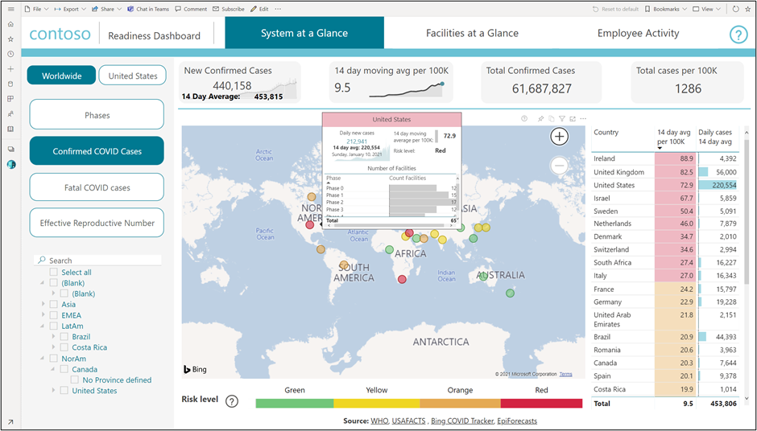
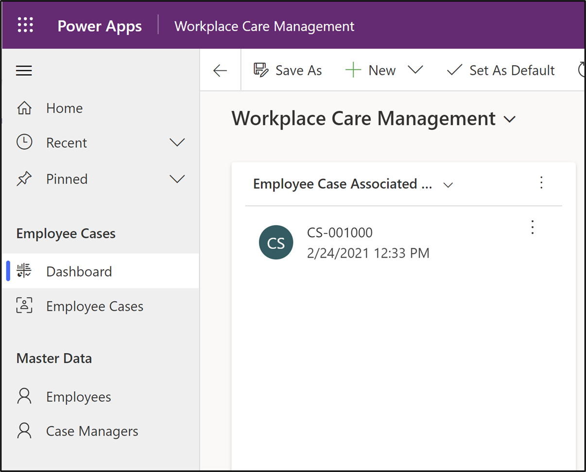
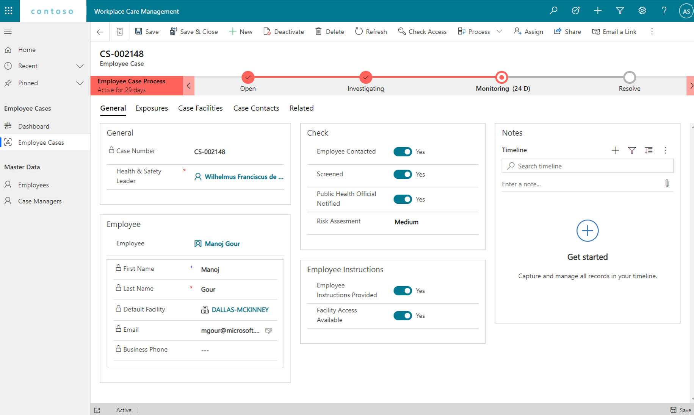
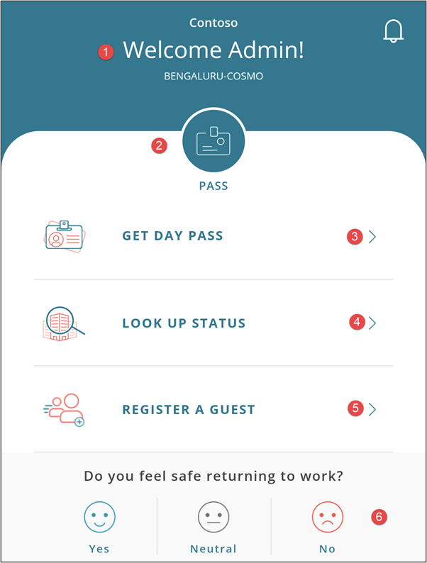
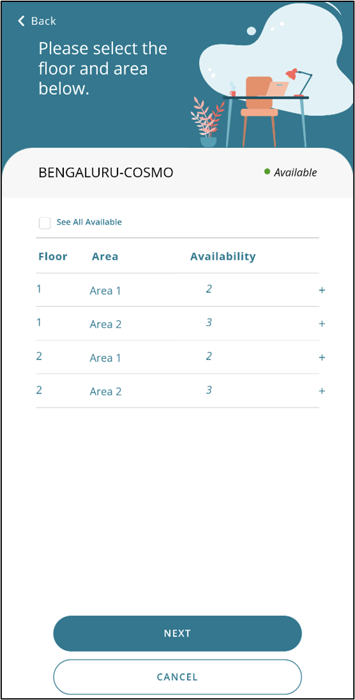
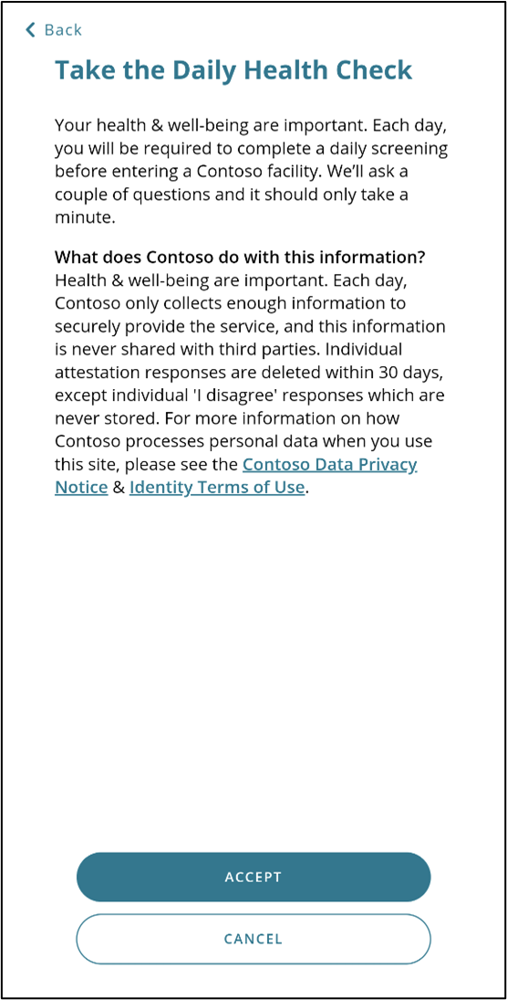
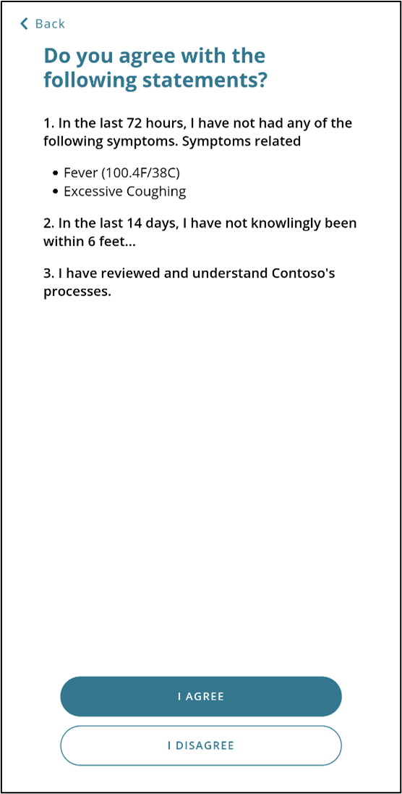
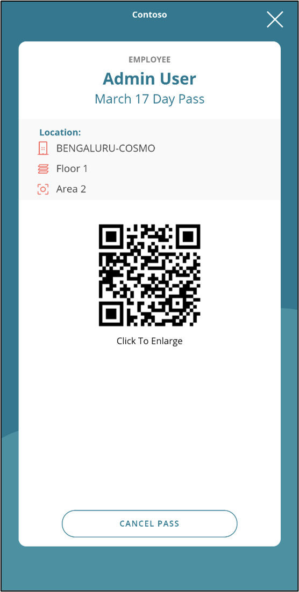
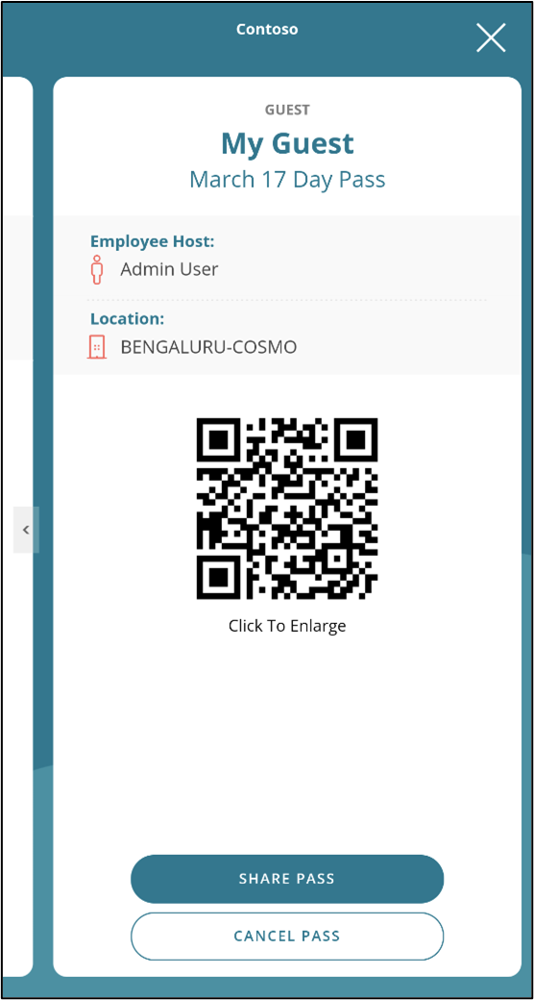

Businesses are eager to reopen and need to be informed of the risks and plans. The Return to the Workplace solution has several assets to help businesses prepare for and facilitate reopening safely.

## Location Readiness dashboard 

The **Location Readiness dashboard** is a Power BI dashboard that offers you to interrogate insights to your own data, and global sources in a unified view. The dashboard can be viewed in the model-driven apps, or directly from PowerBI.com. It allows filtering by one or many geographical locations from worldwide to country level throughout. Results can be viewed as map or tabular view. Like all Power BI dashboards in the Return to Workplace solution, you can drill into the data to view more details as needed.

**System at a Glance** shows data related to reopening phases, confirmed cases, fatalities, and the effective reproductive number, also known as the 'R number'.

> [!div class="mx-imgBorder"]
> 

**Facilities at a Glance** tracks return phases, readiness tasks and occupancy rates across facilities globally.

> [!div class="mx-imgBorder"]
> 

**Employee Activity** provides insights into employee, visitor, and guest app usage alongside gauging their sentiment around their return to workplace experiences, with flexible date filtering on the fly.

> [!div class="mx-imgBorder"]
> 

## Workplace Care Management 

The **Workplace Care Management** *model-driven* app lets you manage your team and their care as it relates to virus exposure and its impact on the workplace.

> [!div class="mx-imgBorder"]
> 

> [!div class="mx-imgBorder"]
> 

The dashboard in this app shows an all-up view of tracked employee case data. From here, you can drill into any records that require action. This dashboard uses native to model-driven apps dashboard functionality to display the records in easy to view rows in a grid.

Employee cases allow you to track progress of employees who may have been exposed to COVID-19. You can determine their monitoring needs, necessary lengths for restricted building access, and more. The guided business process on the employee case form helps you keep track of the phases of the individuals from exposure investigation, through monitoring and to resolution.

> [!div class="mx-imgBorder"]
> 

Employee records are managed as Contacts in Dataverse. The same employee data is used across all the Return to the Workplace apps like the Facility Safety Management app. The only difference is the purpose for which they are used.

Employee Case Managers are internal users in the system. They can help track and monitor progress of employee cases. For a user to be a Case Manager, you must assign the **Return to the Workplace - Health and Safety Leader** security role to their user record.

## Facility Safety Management

The **Facility Safety Management** *model-driven* app lets you keep track of the return-to-work guidelines across your organization's locations and many associated details such as facility types, occupancy levels and locations. The app allows users to track multiple locations and areas within each location.

### Solution setup area

The solution setup area of this model-driven app is used to control the data internal and external users see in their respective **Employee Return to the Workplace** *canvas/portal app* for building access and daily health checks*.* It supports several different configurations of one, or multiple sites. Each location can have different rules for returning based on their own geographic indicators and local policies. This ensures it can easily scale from a small or medium organization tracking a single location or up to a global organization with facilities across multiple countries.

For a geographically colocated organization, facilities can be linked to multiple locations. Then you are able to track the facilities reopening criteria based on a location and apply different rules based upon localized factors. You can also take advantage of HTML formatting to present to users an easy to consume page with emphasis on the things that are important to your organization.

> [!div class="mx-imgBorder"]
> 

### Facility area 

The facility management area primarily tracks the detailed facility information and the passes that are issued for entry to the facilities.

#### Facility management group

Once you have set up your geographic areas, you can define your specific facilities. The facilities can be individual or groups, and each facility can store details for occupancy by floor or by area.

> [!div class="mx-imgBorder"]
> 

When the facility is configured with its floors and areas (rooms) the occupancy will be calculated for you based on the data, you have provided for occupancy standards based on the phase of reopening of the facility.

Below is an example of a facility partially reopened with 50% capacity allowed. This policy will be enforced when employees, guests, and other visitors try to sign up for day passes.

> [!div class="mx-imgBorder"]
> 

The policy is defined by you where you provide key metrics to consider, capacity limitations to apply and other details to help those making the decisions to move a facility to a certain reopening phase.

> [!div class="mx-imgBorder"]
> 

#### Employee and guest groups

When a facility is in a phase that allows the workforce to return in any capacity, you will be able to view the passes for employees and guests and the related additional information. When an employee confirms the health questions, when they attest to meeting the requirements, the system will create a record with that confirmation. These records may be required when proving you are honoring the local requirements for occupancy limitations. Employee sentiment is where your team can share how they feel about returning. This may change from day to day. This will allow you to monitor the sentiment and offer resources to individuals or groups that may be uneasy or stressed about returning to work.

> [!div class="mx-imgBorder"]
> 

## Employee Return to the Workplace app

As an authenticated user you can schedule a time for your building entry using the **Employee Return to the Workplace** *canvas app*. The app allows you to review status of a facility to determine eligibility of building entry, share their sentiment of the safety of returning to work, and submit information needed to obtain a building entry pass. Users need to have at least one of the Return to the Workplace security roles associated with their user record. You can learn how to do that by visiting this [learning path](https://docs.microsoft.com/learn/modules/get-started-security-roles/?azure-portal=true).

The app is designed for a phone screen layout but can also be consumed in browser if needed.

> [!div class="mx-imgBorder"]
> 

> [!div class="mx-imgBorder"]
> 

The following steps will allow a user to submit their information and obtain a building pass. Some of this information comes from Dataverse, and some of it will create records in Dataverse. As a manager you can see and edit this in the **Facility Safety Management** *model-driven* app.

> [!div class="mx-imgBorder"]
> 

1.  This is the logged in user, and their default facility choice.

1.  Once a pass has been issued, click here to go directly to the pass, or passes to present and scan for building entry. Prior to issuing a pass, this will display your default work location.

1.  Start the process of obtaining a day pass.

1.  Look up the status of a facility.

1.  Register a guest for building access. This will only be active once you already have a day pass for the user.

1.  Choose your comfort level for returning to work.

Let's look into some more details for the screens mentioned above.

The day pass process for the user to follow will begin on the facility selection screen. You will see here saved and recent locations but will be able to select from all facilities.

> [!div class="mx-imgBorder"]
> 

Within the selected facility, select the specific location.

> [!div class="mx-imgBorder"]
> 

If the location you have selected is enforcing intervals for building entries, such as every 30 minutes to avoid crowding in the reception area, you will then be presented with the available options for an entry time.

> [!div class="mx-imgBorder"]
> 

Review and accept the daily health check.

> [!div class="mx-imgBorder"]
> 

Review and accept, or reject, the daily health attestation.

> [!div class="mx-imgBorder"]
> 

Once you have completed these steps, you will be issued a pass. The pass contains a QR code for easy, no-touch scanning for building access.

> [!div class="mx-imgBorder"]
> 

Once you have secured your own entry pass, you can follow a similar process for guest access. Each guest will be issued their own pass. If the guest's sponsor cancels their day pass, the pass of the guest will also be canceled.

> [!div class="mx-imgBorder"]
> 

You can present the pass on behalf of your guest or share it with them via the email you provided during the signup process. The pass can then be presented by the guest for scanning at building entry.

> [!div class="mx-imgBorder"]
> 

#### Stay at home

If the user does not attest to the statements provided concerning health and risk, they are then prompted to stay home, and no pass will be issued for the day. You could use a [Power Automate flow](https://docs.microsoft.com/learn/modules/build-more-flows/8-flow-event-d365/?azure-portal=true) to automatically create an employee case to use to track the details you need to follow the progress of the employee's return to work when they feel better.

> [!div class="mx-imgBorder"]
> 

## Return to the Workplace portal

Non-authenticated users such as contractors, vendors, and other suppliers still need access to your facilities. They can use the portal to do much the same as the canvas app, but without the need to be an AAD authenticated user. The portal offers many standard types of authentication including the ability to restrict who can access the portal to submit a building pass request.

As you can see in the video below, the screens walk the user quickly through the process and make the passes easily retrievable to present at the time of entry.

> [!VIDEO https://www.microsoft.com/videoplayer/embed/]

To learn more about customizing the portal, you can review this [learning path](https://docs.microsoft.com/learn/paths/get-started-power-apps-portals/?azure-portal=true).