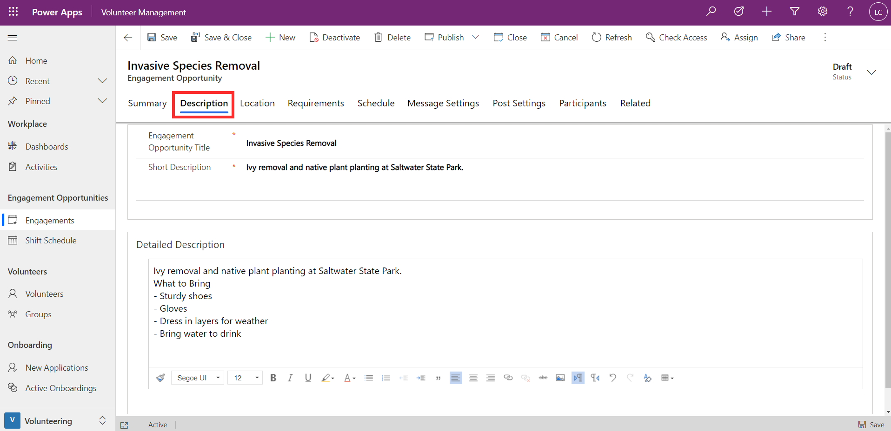
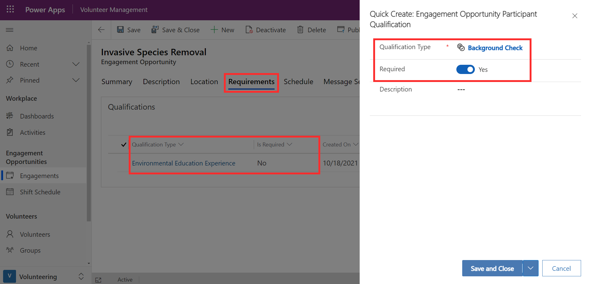
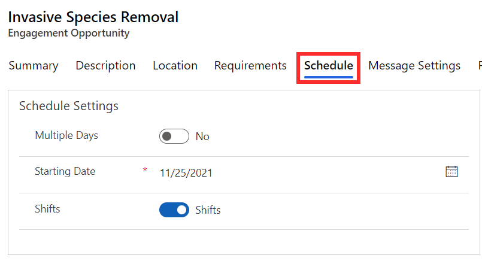
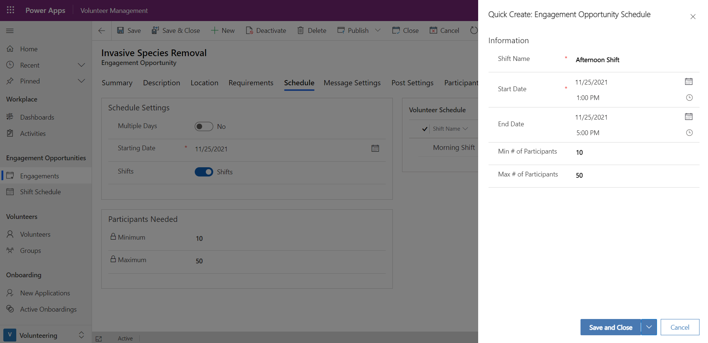
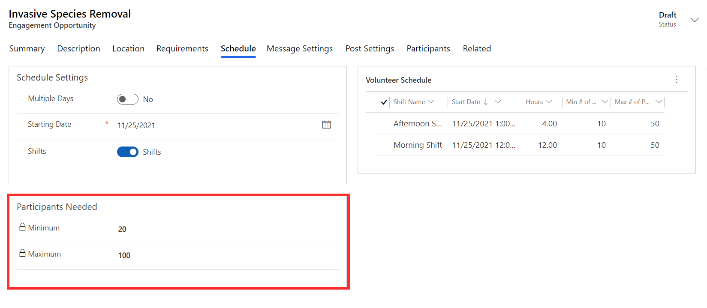

Engagement opportunities are accessed and created from the Engagements area of Volunteer Management.

## Description

From the Description tab of the engagement opportunity, you can provide a name and a short and detailed description for the opportunity. The name and short description will appear on the front page of the portal listing in Volunteer Engagement, and the detailed description will be available when volunteers click through to view more information.

> [!div class="mx-imgBorder"]
> 

## Location

You can provide details about the location of the opportunity and set the location type as either virtual, on location, or a combination of both. If it is on location, you can specify the address details. You can choose to publish this information to the portal in the Post Settings tab, if you want volunteers to be able filter their selections in the Volunteer Engagement portal by city or state.

You can link a primary contact for the location, so that you have quick and easy reference and contact details for the key point of contact at your location or venue. The location contact is for internal use only and will not be published to the portal.

> [!div class="mx-imgBorder"]
> 

## Requirements

Requirements can be either qualifications or preferences of participants.

Qualifications are linked via a lookup to qualifications that you set up in the app as needed for your organization (Refer to Module: Configure Settings for Volunteer Management). You can specify whether each qualification is required or not. For example, as shown below, it may be preferred, but not necessary, for participants to have Environmental Education Experience, whereas a Background Check is required.

> [!div class="mx-imgBorder"]
> 

Preferences allow you to align engagement opportunities with volunteers who are interested in a particular area. Preferences can be maintained against both volunteers and engagement opportunities, which helps finding and matching the right volunteers for the opportunity.

> [!div class="mx-imgBorder"]
> 

Qualifications and preferences associated with volunteer engagements will be published to the Volunteer Engagement portal and will be available for volunteers to use to filter their selections.

## Schedule

The Schedule tab of the engagement opportunity allows you to specify a start date for the opportunity, whether it spans multiple days, and if there should be different shifts.

> [!div class="mx-imgBorder"]
> 

If you enable shifts for the engagement opportunity, you will then be able to create them from the Volunteer Schedule section. To create a shift, provide a name, start and end date/time, and the minimum and maximum number of participants required or allowed for that shift.

> [!div class="mx-imgBorder"]
> 

The Participants Needed section allows you to enter in the minimum and maximum participants for the whole engagement opportunity. If shifts are enabled, this section will be read-only and will be automatically calculated based on the numbers specified in the shifts.

> [!div class="mx-imgBorder"]
> 

## Message Settings

The Message Settings tab of the opportunity allows you to set up automated messages to participants at specific stages of the engagement.

For example, in the case where volunteers need to be approved prior to being signed up for an opportunity, you may want to send an automated message once they are approved. You could set up a message as shown below.

> [!div class="mx-imgBorder"]
> 

The **send when** column can be set so that the message is delivered when a volunteer signs up, has their sign-up approved, or once the engagement is completed. In each case, you provide a subject and text that the message will contain.

## Post Settings

The Post Settings tab of an engagement opportunity is where you can configure the details that should be made public, that is, visible to volunteers via the Volunteer Engagement portal. You can switch the toggle to Yes if the address and city set up in the location details should be displayed on the portal. For virtual engagements, you can specify if the URL for joining is displayed or not.

The toggle **automatically approve all applicants** determines how applicants are approved for the opportunity. If switched to Yes, all applicants will be automatically approved once they sign up. This is suitable for any engagement where there are no mandatory requirements or background checks. However, if you would like to check each applicant and manually approve them, this should be switched to No.

> [!div class="mx-imgBorder"]
> 

## Publish

Once you are ready to publish out the engagement opportunity, you can select the **Publish** button in the task bar at the top of the opportunity. **Publish to the web** will make the opportunity visible on the portal where volunteers can sign up to participate. However, you can choose to **privately publish** if you do not want the opportunity to be visible on the portal. Once published, the status of the engagement opportunity will change.

> [!div class="mx-imgBorder"]
> 

Now you are ready to start receiving and managing applications. Refer to Module 4: Onboard and Approve Volunteers. 

## Summary

The Summary tab provides you with an overview of the engagement opportunity. The Sign Up Status section allows you to easily view the number of volunteers signed up for the opportunity or shift, the number of volunteers who need to be approved, the number of cancellations, and the countdown of days until the opportunity date. You can also see and manage the participant list and the timeline of activities related to the opportunity.

> [!div class="mx-imgBorder"]
> 

If automated messages were set up for the opportunity, you will see these sent messages appear in the timeline. If you would like to send out a new message at any time, you can select **Message Participants** to type in a message to all participants.

> [!div class="mx-imgBorder"]
> 
