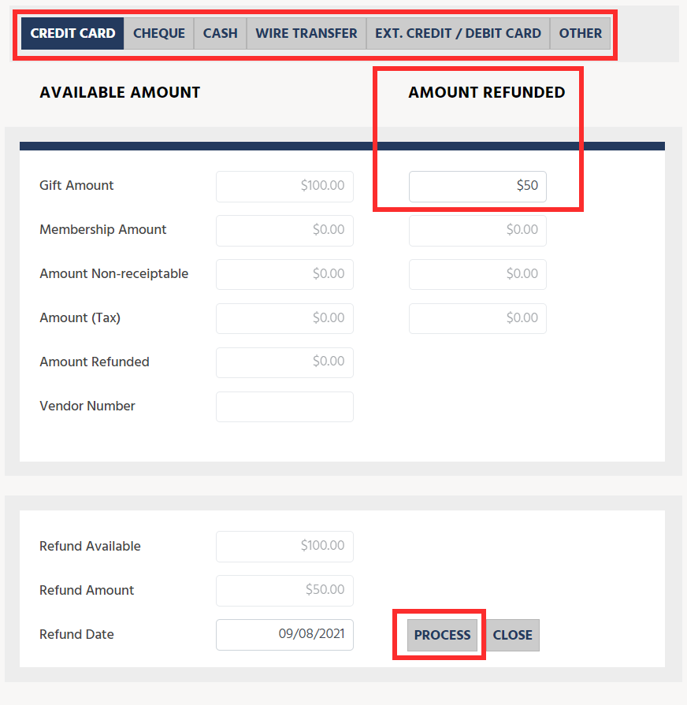
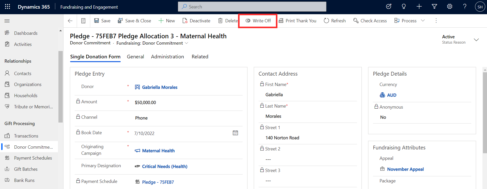

Fundraising and Engagement provides the ability to refund a partial or full amount of a gift back to the donor. In the case of unfulfilled donor commitments, the write off process allows you to track the donor's activity and balance the account.

## Refunding a gift

Refunds can be generated by clicking the **Refund Gift** button, located in the task bar at the top of a transaction record.

> [!div class="mx-imgBorder"]
> 

This will open a pop-up window where you can specify the gift amount that should be refunded, which may be the full amount or partial. In the example shown below, the full amount of the donation was \$100 and this appears in the **available amount** column. You can specify the refund value in the **amount refunded** column.

> [!div class="mx-imgBorder"]
> 

Clicking **Process** will generate a refund for the specified amount. As a result, a refund record will be created and can be found in the **Refunds** tab of the transaction. The status of the transaction as seen in the top right side of the transaction record will change from completed to **refunded**.

> [!div class="mx-imgBorder"]
> 

From the refund record, you can access details about the refund including the associated gift and amount refunded.

> [!div class="mx-imgBorder"]
> 

Note that if a gift had an associated receipt and was refunded, the receipt will need to be voided manually.

## Writing off a pledge

If a donor commitment is unfulfilled or the amount of the pledge changes, rather than deactivating the record, you can initiate a write off process. This allows you to track the activity of the change in a pledge. A write off can be for either the full or partial amount of a pledge.

To initiate a write off, click the **Write Off** button located in the task bar at the top of the donor commitment record.

> [!div class="mx-imgBorder"]
> 

This will open a pop-up window where you can specify the amount of the write off. As shown in the screenshot, Gabriella Morales had a donor commitment for \$50,000. If she can now only commit to a pledge of \$10,000, you can enter the difference of \$40,000 in the write off pop-up window.

> [!div class="mx-imgBorder"]
> 

After clicking **Complete**, the new pledge amount of \$10,000 will display as the remaining balance on the donor commitment record. The status of the donor commitment will change from active to **write off**.

> [!div class="mx-imgBorder"]
> 
