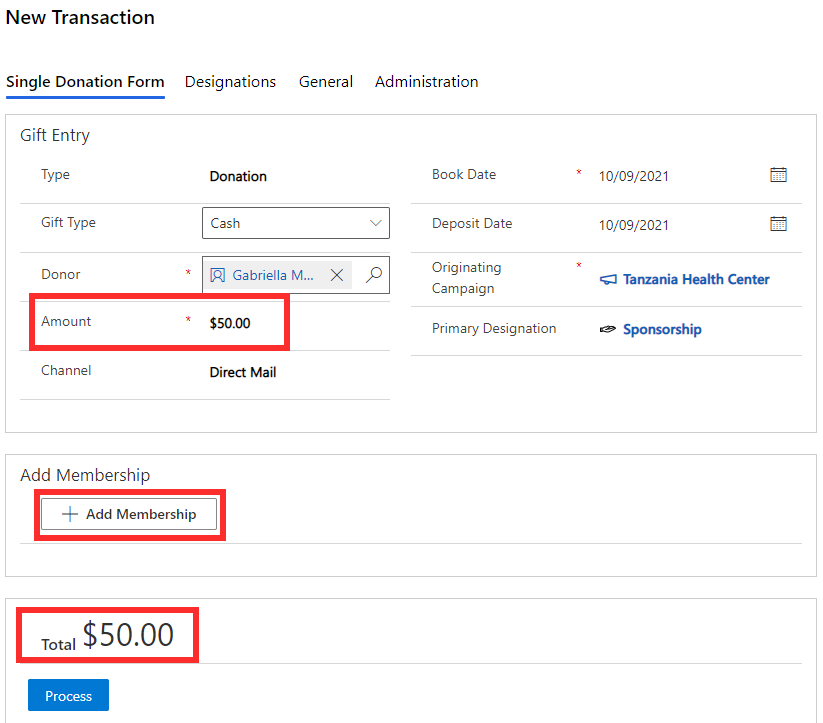
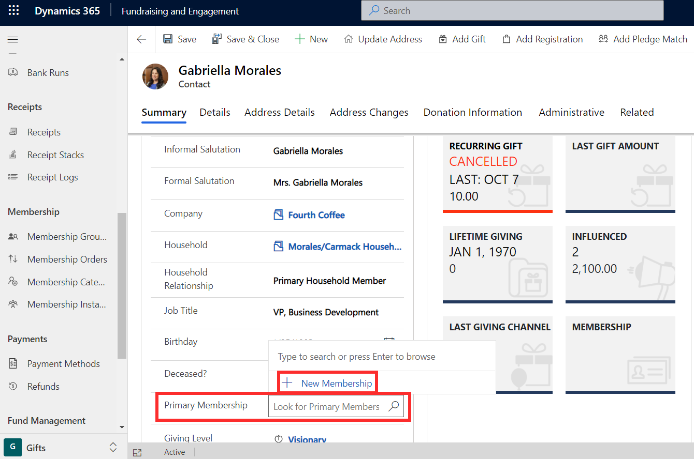
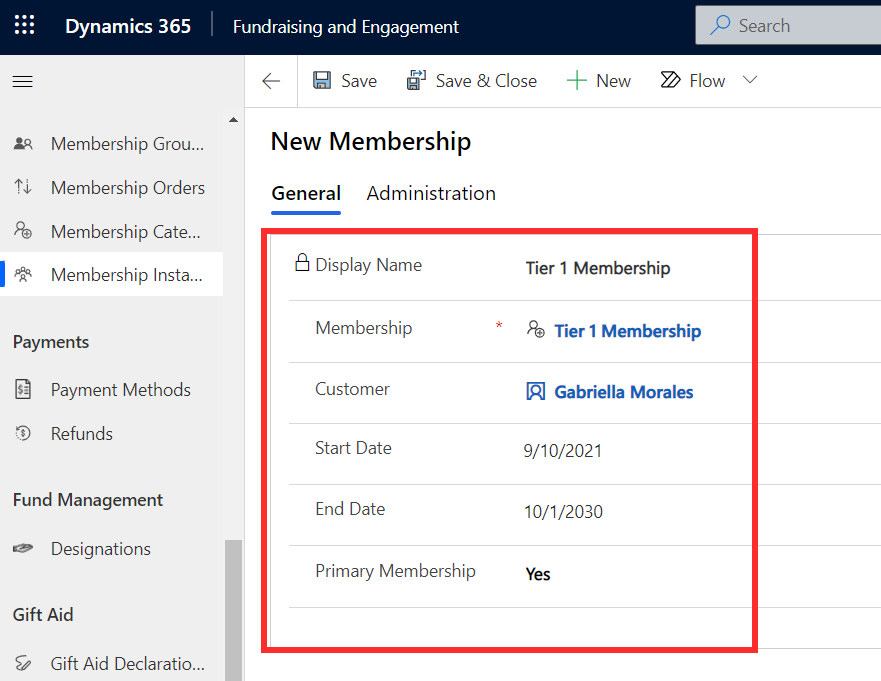

In Fundraising and Engagement, there are two methods for adding membership to a constituent:

- From a transaction record
- From the constituent's record

## Add membership from a transaction record

This method is typically used when the constituent is making a donation and you are adding a membership as part of that. Let's say that a constituent, Gabriella Morales, wants to donate \$\50. She also would like to sign up for the Family Sponsorship Membership. A transaction is being created for the donation amount of \$50. Click the +**Add Membership** button on the transaction form to add a membership to the transaction.

> [!div class="mx-imgBorder"]
> 

You can now select the membership group, then membership category for the constituent to be assigned to. If there is a cost associated with the membership, as shown in the screenshot below, the membership cost will update in the **total** and **amount** columns on the transaction. After specifying the membership group, the list of membership categories is sorted based on the order list that has been configured.

> [!div class="mx-imgBorder"]
> 

Once the transaction is processed, the total payment received from Gabriella will be \$\200. This includes the \$\50 donation and \$150 payment for membership. She will now be a member of Family Sponsorship Membership.

Membership can be added via transaction even if the constituent only wants to sign up for membership without making a donation. In this case, the amount entered on the transaction form can be left blank. Once the membership is selected, the associated cost will be updated on the amount column.

## Add membership from a constituent record

Membership can also be added to a constituent via the contact or organization record. Membership cannot be added for a household record. This method of adding membership should be used if there is no associated cost. If there is a cost associated with membership, it must be added via the transaction method so that the payment can be processed.

In this example, let's say that we would like to give Gabriella Morales the status of 'Tier 1 Membership', which is a membership category without any associated cost. From Gabriella's contact record, we can click **+New Membership** in the **Primary Membership** column. Primary Membership is a lookup column and can only contain one value. While Gabriella can be part of multiple memberships, here on the form we can nominate one as her primary membership.

> [!div class="mx-imgBorder"]
> 

**+New Membership** will launch a form where we can create a new membership instance for Gabriella.

> [!div class="mx-imgBorder"]
> 

The customer column will autopopulate with a link to the constituent's record. Membership column is a lookup to the membership category that you want to assign. An end date can optionally be specified for the constituent's membership. It can also be indicated whether this membership instance will be assigned as the primary membership for the constituent. Since the membership instance was saved as the primary membership in this example, it will appear on Gabriella's contact record in the primary membership column.

You can view all memberships associated to a constituent from the **Memberships** tab of their record.

> [!div class="mx-imgBorder"]
> 

