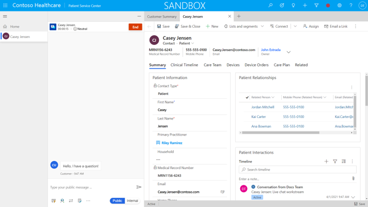
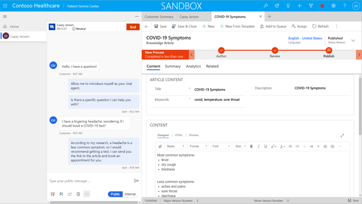
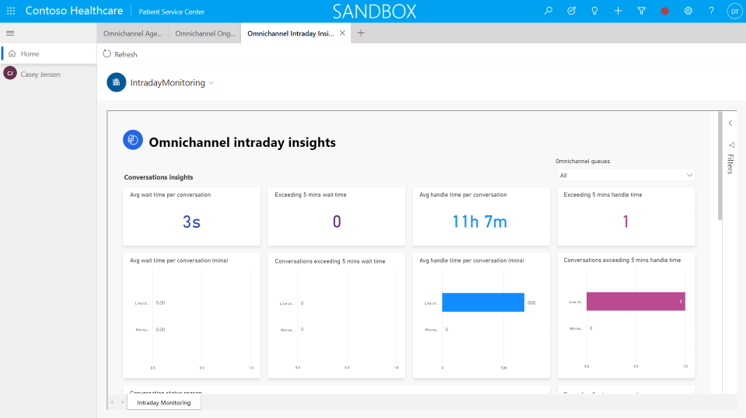

The Patient Service Center app eases communication between healthcare call center agents and patients through channels such as live chat and SMS.

The Patient Service Center is an extension of Microsoft [Dynamics 365 Omnichannel for Customer Service](https://docs.microsoft.com/learn/modules/getting-started-omnichannel/). The Patient Service Center app is a model-driven Power App that can be configured, modified, or extended as required by a particular medical organization's requirements.

A medical organization (hospital, public health, or other healthcare provider) can provide agent services to patients to get real-time interaction, diagnosis, and advice potentially avoiding time consuming appointments or misdirected treatments.

## Omnichannel agent dashboard

A healthcare agent will use the Patient Service Center app to monitor incoming communications from patients. For example, an existing patient can start a chat from the Patient Access portal, or can be redirected from the Azure Health Bot once the patient has exhausted the available automated responses. Once the chat is started, the healthcare agent will have access to the patient's contact information, chat transcription history (from Azure Health Bot) and medical details.

> [!div class="mx-imgBorder"]
> 

The agent can accept the chat, or it can be diverted to queue for the next available agent.

The agent can respond using a series of predefined responses and follow an agent script that is tailored to specific healthcare information. The agent also has the option of consulting with another agent or passing the conversation to another agent (potentially a specialist that is better equipped to answer specific questions).

The agent can take a series of actions, such as looking up a knowledge article, opening a case, or setting up an appointment.

> [!div class="mx-imgBorder"]
> 

The sentiment of the patient can also be tracked so the agent can respond appropriately.

> [!div class="mx-imgBorder"]
> 

The chat information is stored against the patient record in Dataverse. So other practitioners or advisors can use that information if providing treatments or procedures while using other Microsoft Cloud for Healthcare apps or integrated EMR systems.

## Intraday monitoring

A supervisor or manager of a healthcare call center can monitor the performance and analytics of the agents using the Omnichannel intraday insights dashboard. The dashboard can show metrics such as wait times, average conversation length, and other items.

> [!div class="mx-imgBorder"]
> 

> [!VIDEO https://www.microsoft.com/videoplayer/embed/]
