In this exercise, you will do the following:

- Configure an external website to display the Healthcare Patient Portal template

- Modify the Healthcare Patient Portal to display the proper company name.

- Create a registration code and invite a patient to create an account for the website

- Log in as the patient to navigate the features of the healthcare portal

The **Healthcare Patient Portal** is a template installed in your environment by the Patient Access module in Microsoft Cloud Solution Center when Microsoft Cloud for Healthcare was deployed.

A **Portal** is an external website that allows for communication between a company and its users. In this case, the Lamna Healthcare Company wants an external website for their patients to access their medical history and communicate effectively with the institution. The Healthcare Patient Portal template tailors the website's user interface for a healthcare company focusing on secure communication, information access, and an overall improved patient experience.

Here's what you will see after configuring and logging into the Healthcare Patient Portal:

> [!div class="mx-imgBorder"]
> 

Learn more about Portals on Microsoft Docs [here](/en-us/powerapps/maker/portals/?azure-portal=true#).

### Task 1: Configure the Healthcare Patient Portal

Prior to deploying Microsoft Cloud for Healthcare, you created a portal in your environment using the **Customer Self-Service** template. This was a prerequisite to deploy the Patient Access module.

Lamna Healthcare wants to associate the previously installed Customer Self-Service portal with the **Healthcare Patient Portal** template, so the correct website is displayed to the user. The following steps will guide you through how to bind your website to the proper template and restart the portal for changes to apply.

We will first open the Portal to show the Customer Self-Service template currently bound. After the configuration steps in this task, you will see the new Healthcare Patient Portal user interface.

1. Using an In-Private or Incognito window, navigate to [http://make.powerapps.com](http://make.powerapps.com/?azure-portal=true).

1. Select the correct environment from the upper right **Environment** drop-down.

    > [!div class="mx-imgBorder"]
    > 

1. Select **Apps** on the left navigation bar.

    > [!div class="mx-imgBorder"]
    > 

1. Find the **Healthcare Patient Portal** you created. It should be the only app where Type is Portal. You can also search for it in the Search bar in the upper right corner

    > [!div class="mx-imgBorder"]
    > 

1. Select the app name to **open** the **Healthcare Patient Portal**. You may also select More Commands (...) > Browse or select Browse on the top command bar to open it.

    > [!div class="mx-imgBorder"]
    > 

1. You should see the **Customer Self-Service template** shown in the Healthcare Patient Portal.

    > [!div class="mx-imgBorder"]
    > [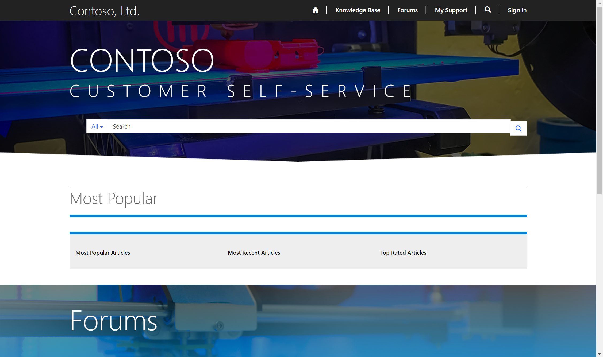](../media/6-self-service.png#lightbox)

1. **Close** the Healthcare Patient Portal website. Now you'll configure it to the Healthcare Patient Portal template.

1. Return to the Power Apps screen in the Apps section. Select the **Healthcare Patient Portal** app if it isn't already selected.

1. Select **More Commands (...)** > **Settings** or select Settings on the top command bar. This will bring out the **Portal settings** panel on the right.

    > [!div class="mx-imgBorder"]
    > [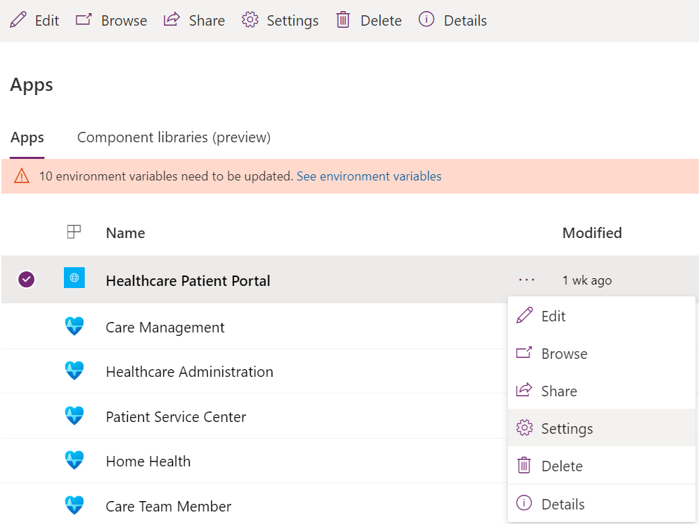](../media/7-settings.png#lightbox)

1. In **Portal settings**, under **Advanced options**, select **Administration**.

    > [!div class="mx-imgBorder"]
    > 

1. Selecting Administration will open a new window, the **Power Apps Portals admin center,** where you can do portal administrative tasks.

1. You should be landed in the **Portal Details** tab of the Power Apps Portals admin center**.**

    > [!div class="mx-imgBorder"]
    > 

1. Scroll down to **Update Portal Binding >** **Select** **Website Record**.

    > [!div class="mx-imgBorder"]
    > 

1. Open the **Select Website Record** drop-down and change the current value (Customer Self-Service) to **Healthcare Patient Portal.** This will bind the Healthcare Patient Portal template with this portal URL and show the proper user interface to the user.

    > [!div class="mx-imgBorder"]
    > [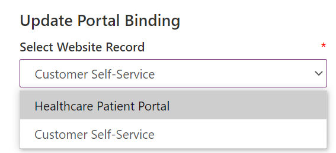](../media/11-select-website-record.png#lightbox)

1. Select **Update**.

    > [!div class="mx-imgBorder"]
    > 

1. Select **Portal Actions** section on the left navigation. Then select **Restart.**

    > [!div class="mx-imgBorder"]
    > 

1. When prompted, confirm the **Restart** for the portal. This will allow the change to take effect.

    > [!div class="mx-imgBorder"]
    > 

1. Wait 1-5 minutes for the portal to restart. (Feel free to refill water or stretch your legs!)

1. Navigate back to the Healthcare Patient Portal in [http://make.powerapps.com](http://make.powerapps.com/?azure-portal=true).

    > [!div class="mx-imgBorder"]
    > [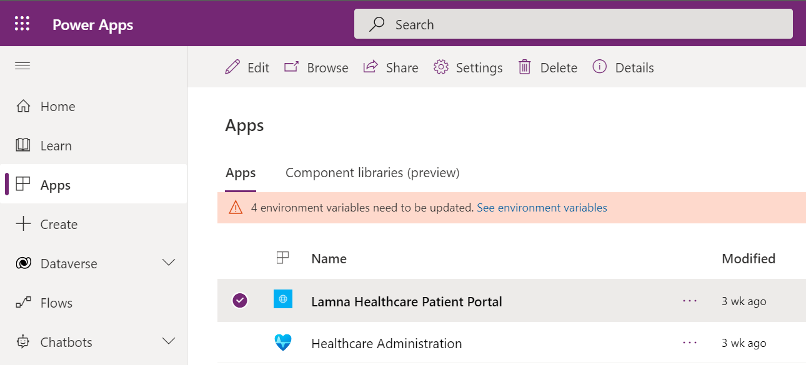](../media/15-power-apps.png#lightbox)

1. If you see the following error, the portal is still restarting.
    > [!div class="mx-imgBorder"]
    > 

1. Once the Portal is opened and running properly, it should look like the following:

    > [!div class="mx-imgBorder"]
    > [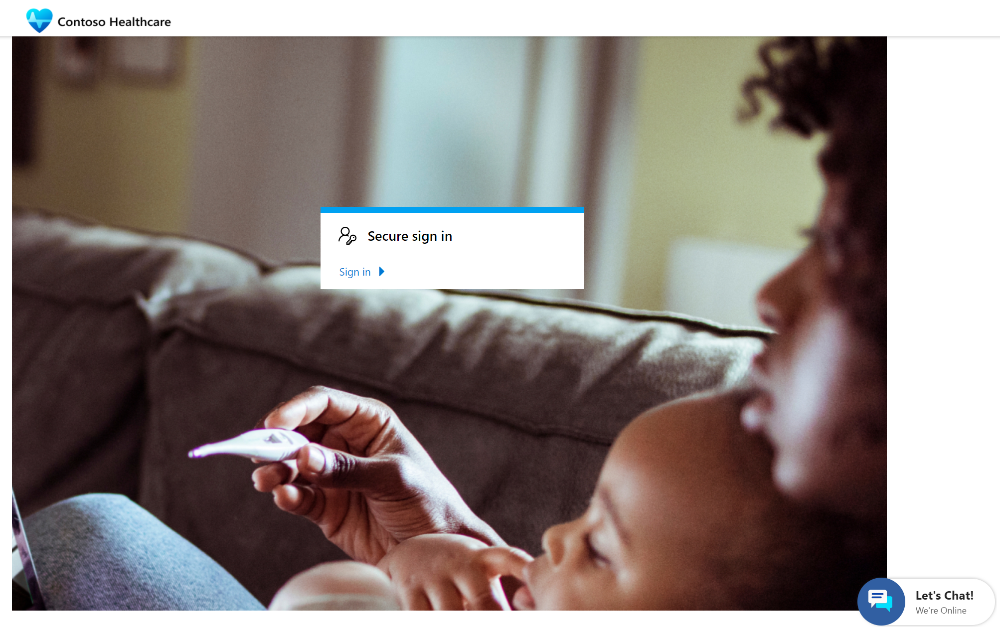](../media/17-secure-sign.png#lightbox)

**Congratulations!** You completed the post deployment step to configure the Healthcare Patient Portal template deployed from Patient Access. After updating the bindings and restarting the portal, the website now shows as Healthcare Patient Portal template rather than Customer Self-Service.

### Task 2: Modify Company Name in Patient Portal

In this task, we will edit the Patient Portal website to align the name with Lamna Healthcare Company since the template uses a generic company name.

1. Navigate to **Apps** in [http://make.powerapps.com](http://make.powerapps.com/?azure-portal=true).

1. Select the **Healthcare Patient Portal** app and click **More Commands (...) >** **Edit**.

    > [!div class="mx-imgBorder"]
    > 

1. The Patient Portal designer will load after getting thing ready.

    > [!div class="mx-imgBorder"]
    > 

1. Once loaded, you should see **Contoso Healthcare** in the upper left of the design screen. The name may be overlapping the logo but will display properly on the website.

    > [!div class="mx-imgBorder"]
    > [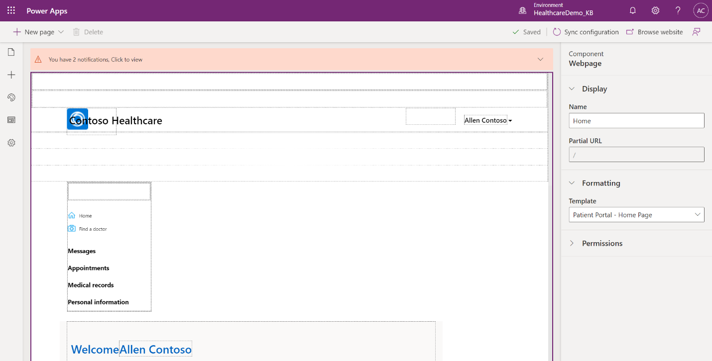](../media/20-contoso-healthcare.png#lightbox)

1. Select the text box that reads Contoso Healthcare and change it to **Lamna Healthcare**.

    > [!div class="mx-imgBorder"]
    > 

1. The page should automatically save the changes. You can verify in the command bar that it says **Saved**, has the green check mark, and on hover shows the correct saved time.

    > [!div class="mx-imgBorder"]
    > 

1. Select **Sync Configurations** in the command bar to sync data to CDS.

    > [!div class="mx-imgBorder"]
    > 

1. It may take a moment to load the preview.

    > [!div class="mx-imgBorder"]
    > 

1. Once configurations are completed syncing, select **Browse website** on the command bar.

    > [!div class="mx-imgBorder"]
    > 

1. The Healthcare Patient Portal should open, and you should see the **Lamna Healthcare** company name in the upper left corner.

    > [!div class="mx-imgBorder"]
    > 

**Congratulations!** You completed modifying the Healthcare Patient Portal to display the correct company name.

### Task 3: Invite a patient to the Portal

Now that the Patient Portal is ready to go, we need to allow Lamna Healthcare patients to create accounts.

In this task, you will learn how to **create an invitation code** for patients to sign up and use the Healthcare Patient Portal. Since **Casey Jensen** will be accessing the patient portal to fill her medication in this lab, we will create an account for her.

1. Open the **Healthcare Administration** app in [http://make.powerapps.com](http://make.powerapps.com/?azure-portal=true).

    > [!div class="mx-imgBorder"]
    > 

1. In the Administration section of the sitemap, select **People**. You will see the **Active Patients** grid view. Open the **Casey Jensen** patient record so we can obtain an invitation code for her to use.

    > [!div class="mx-imgBorder"]
    > 

1. On the Casey Jensen patient record, select **Create Invitation** from the top command bar. It should be near the right side.

    > [!div class="mx-imgBorder"]
    > 

1. You may have to expand more options to see this command in the drop-down.

    > [!div class="mx-imgBorder"]
    > 

1. A **New Invitation** form will appear. You don't need to make any changes. Select **Save.** Once saved, an invitation code will be created for the patient. Let's retrieve it.

    > [!div class="mx-imgBorder"]
    > 

1. Go to the **Advanced** tab on the Invitation record. Copy and store the **Invitation Code** for accessing the Patient Portal in the next task.

    > [!div class="mx-imgBorder"]
    > [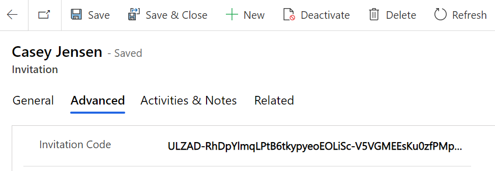](../media/32-advanced.png#lightbox)

**Congratulations!** You have successfully created an invitation code for Casey to register an account in the Patient Portal.

### Task 4: Redeem invitation code and sign into Patient Portal

In this task, you will **transition personas** and act as Casey, who just received an invitation code to the Healthcare Patient Portal and are excited to register and navigate its features.

1. Navigate back to the **Healthcare Patient Portal** in [http://make.powerapps.com](http://make.powerapps.com/?azure-portal=true).

    > [!div class="mx-imgBorder"]
    > 

1. In the Patient Portal, select **Sign in**.

    > [!div class="mx-imgBorder"]
    > 

1. After the sign-in page loads, select the **Redeem invitation** tab.

    > [!div class="mx-imgBorder"]
    > [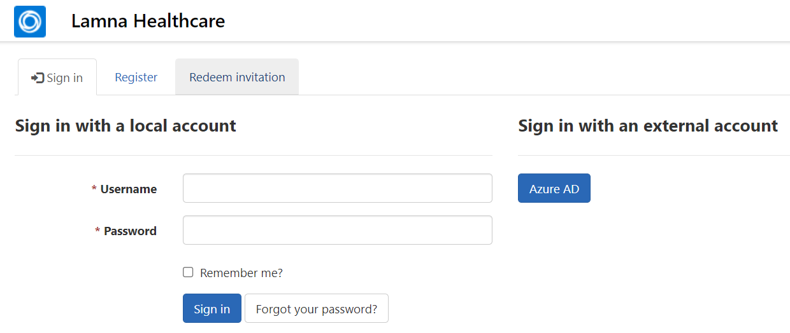](../media/34-redeem-invitation.png#lightbox)

1. Paste the **Invitation code** you stored for Casey Jensen. Select **Register.**

    > [!div class="mx-imgBorder"]
    > 

1. Register a new local account for Casey Jensen with the following recommended details:

    a.  **Email**: Casey.Jensen\@contoso.com (should autofill)

    b.  **Username**: CaseyJensen

    c.  **Password**: Make up your own. Note the password to use for sign-in later.

    > [!div class="mx-imgBorder"]
    > [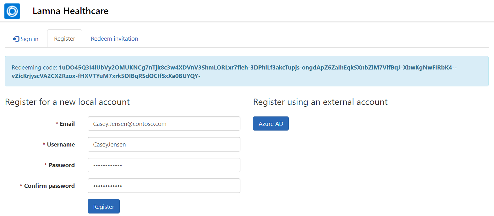](../media/36-register-account.png#lightbox)

1. Select **Register**. After selecting Register, you should be signed into the Patient Portal.

**Congratulations!** You have successfully redeemed an invitation to register an account for Casey Jensen and signed in.

### Task 5: Navigate the Patient Access Portal

In this task, you will continue as **Casey** and navigate the features of the Patient Portal.

1. After registering an account in the **Patient Access Portal**, you may be welcomed by Casey's profile page on first login. You may also be welcomed by the homepage. If so, continue to step 3.

    > [!div class="mx-imgBorder"]
    > [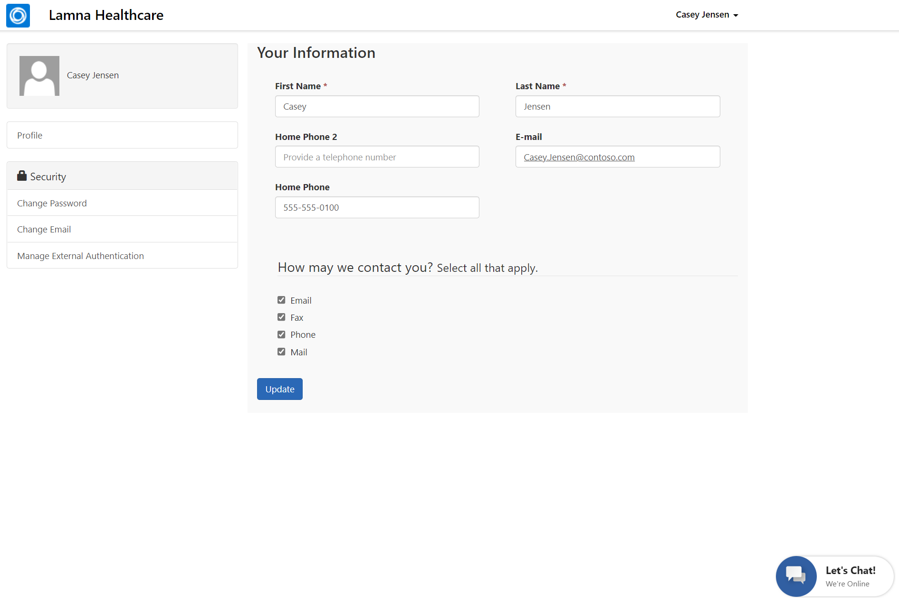](../media/37-information.png#lightbox)

1. Select **Lamna Healthcare** company name/logo in the upper left to go to the Homepage.

    > [!div class="mx-imgBorder"]
    > 

1. You will be navigated to the Patient Portal **Homepage**.

    > [!div class="mx-imgBorder"]
    > 

1. In the center of the homepage, you will see **shortcuts** to **schedule an appointment**, **view messages**, or **find a doctor**.

    > [!div class="mx-imgBorder"]
    > 

1. Below the shortcuts, you will see current patient information including **unread messages**, **upcoming appointments**, and **current medications**.

    > [!div class="mx-imgBorder"]
    > [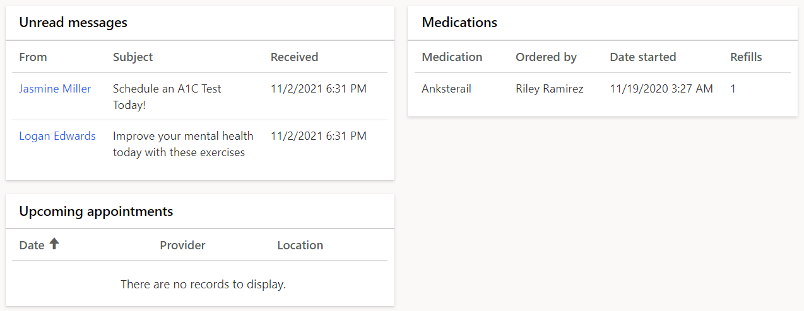](../media/41-unread-messages.png#lightbox)

1. In the left navigation bar, you will see all available options for navigation in the Patient Portal. Select each option to see what's available and each associated screen.

    > [!div class="mx-imgBorder"]
    > 

1. **Home** command will direct you to the homepage.

1. **Find a** **doctor** shows a list of practitioners with associated information.

    > [!div class="mx-imgBorder"]
    > 

1. **Messages** allows a secure method to send and receive messages to healthcare professionals. Expand Messages on the navigation bar to see both the **Inbox** and **Sent** messages.

    > [!div class="mx-imgBorder"]
    > 

1. Expand **Appointments** to check **upcoming** and **schedule** **new** appointments. Scheduling new appointments allows for **clinic** or **virtual** appointments, which also include instant virtual appointments. The Virtual Visit Lab will go through the process of booking an instant virtual appointment.

    > [!div class="mx-imgBorder"]
    > 

1. Check **Medical records** including **medications**, **allergies**, **conditions, visit summaries**, **care plans**, and **care team**. You can see a full overview and filter by date and type.

    > [!div class="mx-imgBorder"]
    > 

1. Lastly, there is **Personal information**, including **emergency contacts** and insurance **coverages**.

    > [!div class="mx-imgBorder"]
    > 

    > [!div class="mx-imgBorder"]
    > 

1. The Azure Health Bot icon shows at the lower right-hand corner of the screen. You may start a conversation by clicking **Let's Chat** button to open the virtual assistant.

    > [!div class="mx-imgBorder"]
    > 

1. In the final exercise, we will have a full conversation with the bot, but for now we will close and continue.

    > [!div class="mx-imgBorder"]
    > [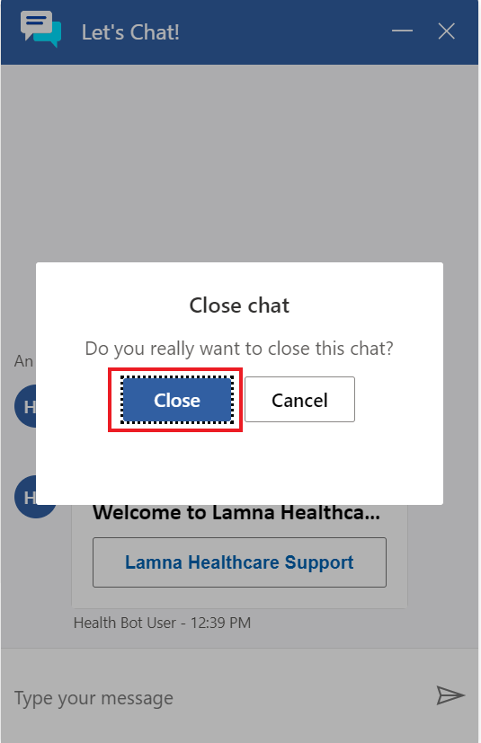](../media/50-close-chat.png#lightbox)

1. You may access the patient Profile page at any time by selecting the patient's name in the upper right drop-down and selecting **Profile**.

    > [!div class="mx-imgBorder"]
    > [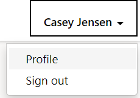](../media/51-profile.png#lightbox)

1. Here you can customize the patient profile as needed. For now, we will keep it the same.

    > [!div class="mx-imgBorder"]
    > [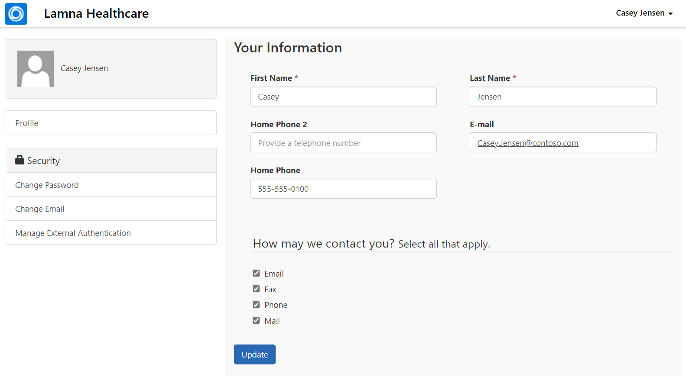](../media/52-customize-profile.png#lightbox)

1. You may log out of the Patient Portal by selecting the patient's name in the upper right drop-down and selecting **Sign Out**.

    > [!div class="mx-imgBorder"]
    > 

1. You should be redirected back to the sign-in page.

    > [!div class="mx-imgBorder"]
    > 

**Congratulations!** You have navigated the Patient Portal to see what information and communication is available to the Patient.

In this exercise, you learned how to configure the Patient Access Portal to display as the Healthcare Patient Portal, modify the portal to display the company name, invite patients to register to the website, and navigate the website features.
