In this exercise, you will complete the following tasks:

- Set up an external website to display the Healthcare Patient Portal template.

- Modify Healthcare Patient Portal to display the proper company name.

- Create a registration code and invite a patient to create an account for the website.

- Sign in as the patient to navigate the features of the healthcare portal.

**Healthcare Patient Portal** is a template that is installed in your environment by the Patient Access module in Microsoft Cloud Solution Center when Microsoft Cloud for Healthcare was deployed.

A *portal* is an external website that allows for communication between a company and its users. In this case, the Lamna Healthcare Company wants an external website for their patients to access their medical histories and communicate effectively with the institution. The Healthcare Patient Portal template tailors the website's user interface (UI) for a healthcare company, focusing on providing more secure communication, information access, and an overall improved patient experience.

The following image shows an example of the welcome page that displays after you have configured and signed in to the Healthcare Patient Portal.

> [!div class="mx-imgBorder"]
> 

For more information, see [Microsoft Power Apps portals documentation](/en-us/powerapps/maker/portals/?azure-portal=true#).

### Task 1: Set up the Healthcare Patient Portal

Prior to deploying Microsoft Cloud for Healthcare, you created a portal in your environment by using the **Customer Self-Service** template. Creating this portal was a prerequisite for deploying the Patient Access module.

Lamna Healthcare wants to associate the previously installed Customer Self-Service portal with the **Healthcare Patient Portal** template so that the correct website is displayed to the user. The following steps will guide you through the process of binding your website to the proper template and restarting the portal for changes to apply.

First, open the portal to view the Customer Self-Service template that is currently bound. After you have completed the configuration steps in this task, the new Healthcare Patient Portal user interface (UI) will display.

1. While using an In-Private or Incognito window, go to [http://make.powerapps.com](http://make.powerapps.com/?azure-portal=true).

1. Select the correct environment from the **Environment** dropdown menu in the upper-right corner.

    > [!div class="mx-imgBorder"]
    > 

1. Select **Apps** on the left navigation bar.

    > [!div class="mx-imgBorder"]
    > 

1. Find the **Healthcare Patient Portal** that you created. It should be the only app where **Type** is shown as **Portal**. Alternatively, you can search for it in the search bar in the upper-right corner.

    > [!div class="mx-imgBorder"]
    > 

1. Select the app name to open the **Healthcare Patient Portal**. You can also select **More Commands (...) > Browse** or select **Browse** on the command bar to open it.

    > [!div class="mx-imgBorder"]
    > 

   The **Customer Self-Service** template should be shown in the Healthcare Patient Portal.

    > [!div class="mx-imgBorder"]
    > 

1. Close the Healthcare Patient Portal website. Now, you'll configure it to the Healthcare Patient Portal template.

1. Return to the **Power Apps** screen in the **Apps** section. Select the **Healthcare Patient Portal** app if it isn't already selected.

1. Select **More Commands (...) > Settings** or select **Settings** on the top command bar. This action will display the **Portal settings** panel on the right.

    > [!div class="mx-imgBorder"]
    > 

1. In **Portal settings**, under **Advanced options**, select **Administration**.

    > [!div class="mx-imgBorder"]
    > [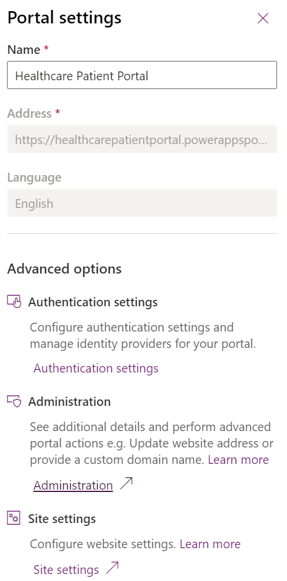](../media/8-advanced-options.png#lightbox)

1. Selecting **Administration** will open a new window, **Power Apps portals admin center**, where you can complete portal administrative tasks.

1. Make sure that you are in the **Portal Details** tab of the **Power Apps portals admin center** window.

    > [!div class="mx-imgBorder"]
    > 

1. Scroll down to **Update Portal Binding > Select Website Record**.

    > [!div class="mx-imgBorder"]
    > 

1. Open the **Select Website Record** dropdown menu and change the current value (Customer Self-Service) to **Healthcare Patient Portal**. This change will bind the Healthcare Patient Portal template with this portal URL and will show the proper UI to the user.

    > [!div class="mx-imgBorder"]
    > 

1. Select **Update**.

    > [!div class="mx-imgBorder"]
    > 

1. Select the **Portal Actions** section on the left navigation and then select **Restart**.

    > [!div class="mx-imgBorder"]
    > [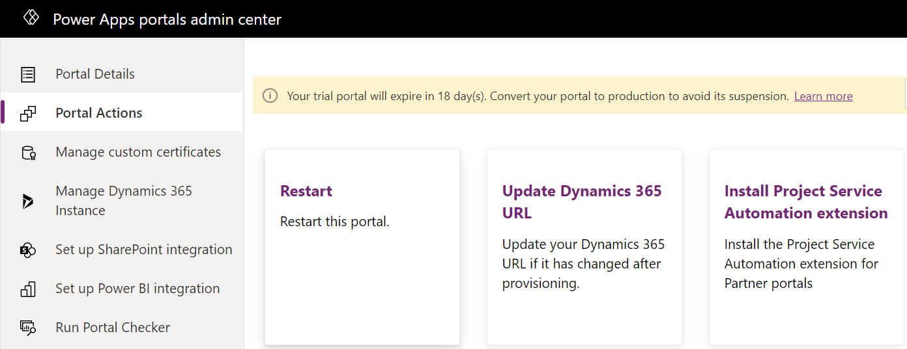](../media/13-portal-actions-restart.png#lightbox)

1. When prompted, confirm the **Restart** for the portal. This action will allow the change to take effect.

    > [!div class="mx-imgBorder"]
    > [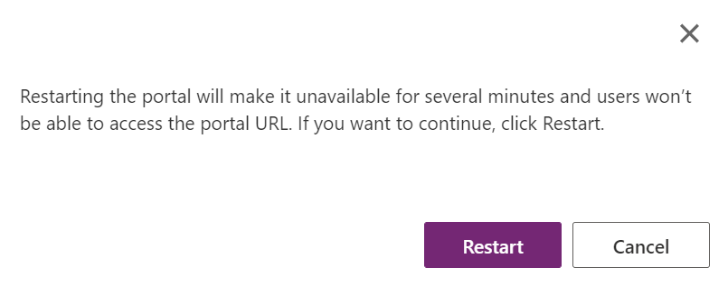](../media/14-restart.png#lightbox)

1. Wait 1-5 minutes for the portal to restart.

1. Return to the Healthcare Patient Portal by going to [http://make.powerapps.com](http://make.powerapps.com/?azure-portal=true).

    > [!div class="mx-imgBorder"]
    > 

   If the following error displays, the portal is still restarting.
    > [!div class="mx-imgBorder"]
    > [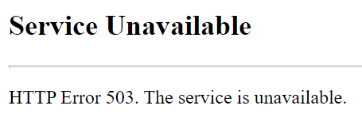](../media/16-service-unavailable.png#lightbox)

   When the portal is opened and running properly, it should look similar to the following image.

    > [!div class="mx-imgBorder"]
    > 

Congratulations, you have completed the post deployment step to set up the Healthcare Patient Portal template that is deployed from Patient Access. After you have updated the bindings and restarted the portal, the website should now show as **Healthcare Patient Portal** template rather than **Customer Self-Service**.

### Task 2: Modify the company name in the Healthcare Patient Portal

In this task, you will edit the Healthcare Patient Portal website to align the name with Lamna Healthcare Company because the template uses a generic company name.

1. Go to the **Apps** section in [http://make.powerapps.com](http://make.powerapps.com/?azure-portal=true).

1. Select the **Healthcare Patient Portal** app and then select **More Commands (...) > Edit**.

    > [!div class="mx-imgBorder"]
    > [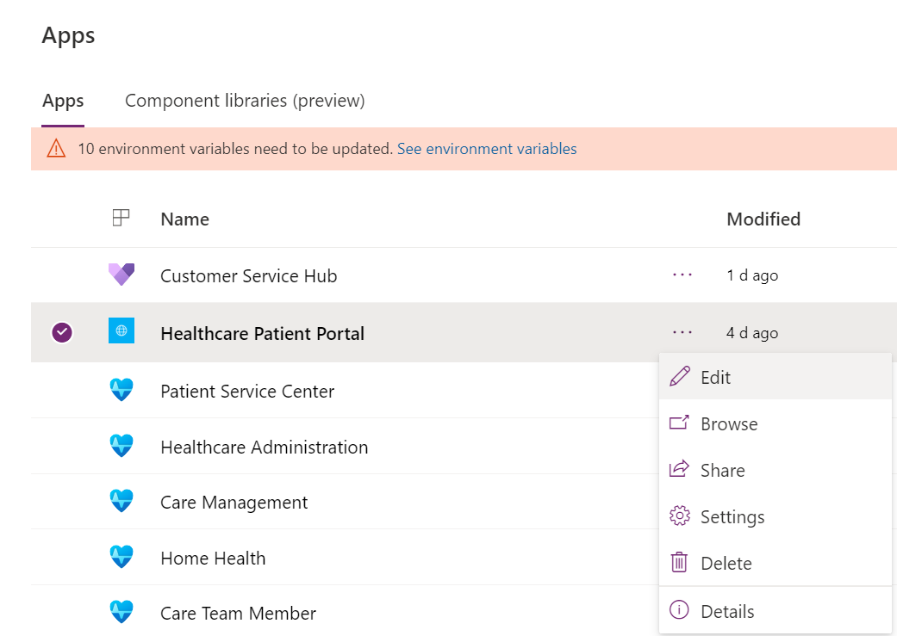](../media/18-more-commands.png#lightbox)

   The Healthcare Patient Portal designer will load after it gets the editing components ready.

    > [!div class="mx-imgBorder"]
    > 

1. After the page has been loaded, **Contoso Healthcare** should show in the upper-left corner of the design screen. The name might overlap the logo, but it will display properly on the website.

    > [!div class="mx-imgBorder"]
    > 

1. Select the text box that reads **Contoso Healthcare** and change it to **Lamna Healthcare**.

    > [!div class="mx-imgBorder"]
    > 

1. The page should automatically save the changes. Verify in the command bar that it says **Saved** and includes the green check mark. Then, hover the cursor over **Saved** to ensure that it shows the correct saved time.

    > [!div class="mx-imgBorder"]
    > 

1. Select **Sync configuration** in the command bar to sync data to Microsoft Dataverse.

    > [!div class="mx-imgBorder"]
    > 

   It might take a moment to load the preview.

    > [!div class="mx-imgBorder"]
    > 

1. After configurations have completed syncing, select **Browse website** on the command bar.

    > [!div class="mx-imgBorder"]
    > 

   The Healthcare Patient Portal should open, showing the **Lamna Healthcare** company name in the upper-left corner.

    > [!div class="mx-imgBorder"]
    > 

Congratulations, you have completed modifying the Healthcare Patient Portal to display the correct company name.

### Task 3: Invite a patient to the portal

Now that the Healthcare Patient Portal is ready, you can allow Lamna Healthcare patients to create accounts.

In this task, you will create an invitation code for patients to sign up and use the Healthcare Patient Portal. Additionally, you will create an account for Casey Jensen, who will access the patient portal to refill medication in this lab.

1. Open the **Healthcare Administration** app in [http://make.powerapps.com](http://make.powerapps.com/?azure-portal=true).

    > [!div class="mx-imgBorder"]
    > [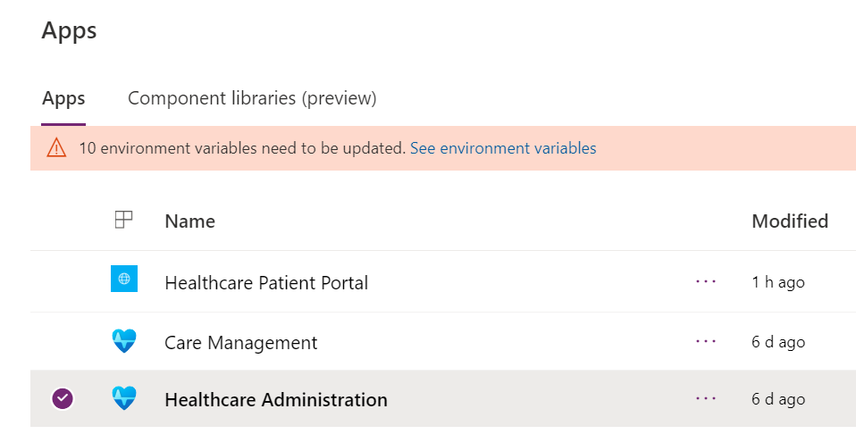](../media/27-healthcare-administration.png#lightbox)

1. In the **Administration** section of the sitemap, select **People**, which will display the **Active Patients** grid view. Open the **Casey Jensen** patient record so that you can obtain an invitation code for Casey to use.

    > [!div class="mx-imgBorder"]
    > 

1. On the Casey Jensen patient record, select **Create Invitation** in the upper-right corner of the command bar.

    > [!div class="mx-imgBorder"]
    > 

   You might have to expand more options to find the **Create Invitation** command in the dropdown menu.

    > [!div class="mx-imgBorder"]
    > 

1. A **New Invitation** form will appear. You don't need to change anything. Select **Save**, and then an invitation code will be created for the patient.

    > [!div class="mx-imgBorder"]
    > [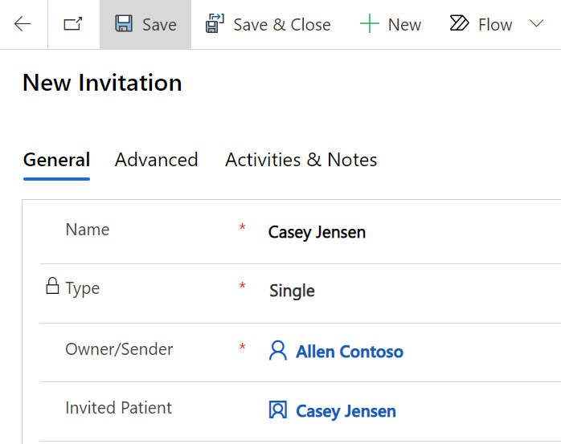](../media/31-new-invitation.png#lightbox)

1. To retrieve the patient code, go to the **Advanced** tab on the **Invitation** record. Copy and store the **Invitation Code** for accessing the Healthcare Patient Portal in the next task.

    > [!div class="mx-imgBorder"]
    > 

Congratulations, you have successfully created an invitation code for Casey to register an account in the Healthcare Patient Portal.

### Task 4: Redeem invitation code and sign into Patient Portal

In this task, you will transition personas and act as Casey, who just received an invitation code to the Healthcare Patient Portal and is about to register and navigate its features.

1. Return to the **Healthcare Patient Portal** in [http://make.powerapps.com](http://make.powerapps.com/?azure-portal=true).

    > [!div class="mx-imgBorder"]
    > 

1. In the Healthcare Patient Portal, select **Sign in**.

    > [!div class="mx-imgBorder"]
    > 

1. After the sign-in page loads, select the **Redeem invitation** tab.

    > [!div class="mx-imgBorder"]
    > 

1. Paste the invitation code that you stored for Casey Jensen. Select **Register**.

    > [!div class="mx-imgBorder"]
    > 

1. Register a new local account for Casey Jensen with the following recommended details:

    -  **Email** - Casey.Jensen\@contoso.com (should autofill)

    -  **Username** - CaseyJensen

    -  **Password** - Make up your own. Note the password to use for sign-in later.

    > [!div class="mx-imgBorder"]
    > 

1. Select **Register** and then you should be signed in to the Healthcare Patient Portal.

Congratulations, you have successfully redeemed an invitation to register an account for Casey Jensen and have signed in.

### Task 5: Navigate the Patient Access portal

In this task, you will continue as Casey and navigate the features of the Healthcare Patient Portal.

1. After registering an account in the Patient Access portal, you might be welcomed by Casey's profile page on first sign-in. Additionally, you might be welcomed by the home page. If so, continue to step 3.

    > [!div class="mx-imgBorder"]
    > 

1. Select the **Lamna Healthcare** company name/logo in the upper-left corner to go to the home page.

    > [!div class="mx-imgBorder"]
    > [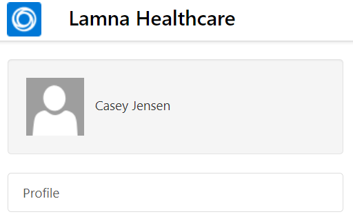](../media/38-lamna-logo.png#lightbox)

   You will be directed to the Lamna Healthcare Patient Portal home page.

    > [!div class="mx-imgBorder"]
    > [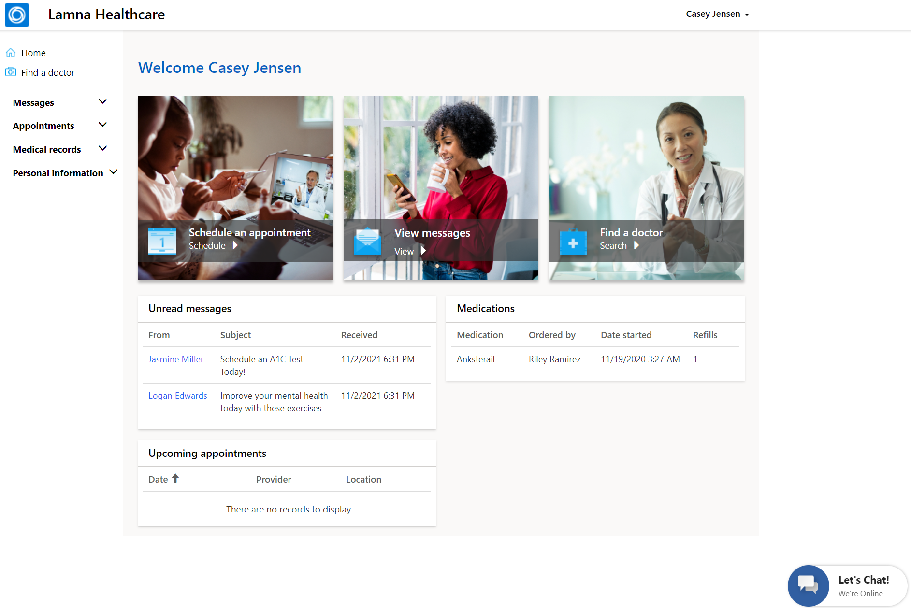](../media/39-homepage.png#lightbox)

   The center of the home page shows shortcuts to **Schedule an appointment**, **View messages**, or **Find a doctor**.

    > [!div class="mx-imgBorder"]
    > 

   Under the shortcuts, a section shows current patient information, including **Unread messages**, **Upcoming appointments**, and **Medications**.

    > [!div class="mx-imgBorder"]
    > 

1. The left navigation bar contains all available options for navigation in the Healthcare Patient Portal. Select each option to discover what's available and to view each associated screen.

    > [!div class="mx-imgBorder"]
    > 

1. Select **Home** to return to the home page.

1. Select **Find a doctor** to view a list of practitioners with associated information.

    > [!div class="mx-imgBorder"]
    > 

1. Selecting **Messages** allows for a more secure method to send and receive messages to healthcare professionals. Expand **Messages** on the navigation bar to view the **Inbox** and **Sent** messages.

    > [!div class="mx-imgBorder"]
    > 

1. Expand **Appointments** to check upcoming appointments and to schedule new appointments. Scheduling new appointments allows for clinic or virtual appointments, including instant virtual appointments. The Virtual Visit lab will go through the process of booking an instant virtual appointment.

    > [!div class="mx-imgBorder"]
    > [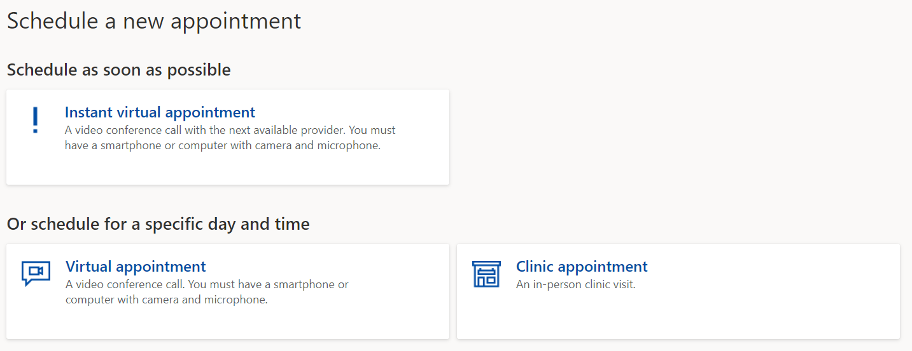](../media/45-schedule-appointment.png#lightbox)

1. In the **Overview** section, review the medical records, including medications, allergies, conditions, visit summaries, care plans, and care team. You can view a full overview and filter by date and type.

    > [!div class="mx-imgBorder"]
    > 

1. In the **Personal information** section, review the emergency contacts and insurance coverages.

    > [!div class="mx-imgBorder"]
    > 

    > [!div class="mx-imgBorder"]
    > 

1. Locate the Azure Health Bot icon in the lower-right corner of the screen. You can start a conversation by selecting the **Let's Chat** button to open the virtual assistant.

    > [!div class="mx-imgBorder"]
    > [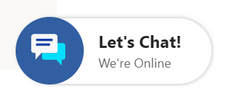](../media/49-chat.png#lightbox)

   In the final exercise, you will have a full conversation with the bot; for now, you can select **Close** and then continue with this lab.

    > [!div class="mx-imgBorder"]
    > 

1. Access the patient profile page by selecting the patient's name in the dropdown menu in the upper-right corner and then selecting **Profile**.

    > [!div class="mx-imgBorder"]
    > 

1. On the patient profile page, you can customize the patient profile as needed. For now, keep it the same.

    > [!div class="mx-imgBorder"]
    > 

1. Sign out of the Healthcare Patient Portal by selecting the patient's name in the dropdown menu in the upper-right corner and then selecting **Sign out**.

    > [!div class="mx-imgBorder"]
    > [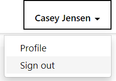](../media/53-sign-out.png#lightbox)

   You should be redirected to the sign-in page.

    > [!div class="mx-imgBorder"]
    > 

Congratulations, you have navigated the Healthcare Patient Portal to discover the information and communication that are available to the patient.

In this exercise, you learned how to set up the Patient Access portal to display as the Healthcare Patient Portal, modified the portal to display the company name, invited patients to register to the website, and navigated the website features.
