Lamna Healthcare Company wants to ensure that they have proper tools in place to provide the best service and guidance during patient interactions.

Patient Service Center has a **Productivity** pane, an auxiliary work area that contains tools that support or expedite an agent's tasks when they're engaging with patients. During a patient engagement, the pane will be shown next to the patient record information, and the agent can collapse or expand it as needed.

For more information, see [Productivity pane overview](/dynamics365/omnichannel/administrator/productivity-pane/?azure-portal=true#).

Agents can use the **Agent scripts** tool in the **Productivity** pane to help with patient care. Agent scripts provide guidance for a specific situation and can help organizations be unified, accurate, and effective while also being more efficient with patients. The scripts ensure that only company-endorsed information is being shared, help reduce error, and improve customer satisfaction.

In this exercise, you will create and set up an agent script to appear in the **Productivity** pane in Patient Service Center. The following screen shows the **Productivity** pane on the right, with the **Agent scripts** tab showing.

> [!div class="mx-imgBorder"]
> 

### Task 1: Assign the Productivity tools administrator role

In this task, you will assign the necessary roles to your user to create and use agent scripts. Specifically, you will add the **Productivity tools administrator** and **Productivity tools user** roles. The **Productivity tools administrator** can complete any action (create/read/write/append/delete) on the agent script, whereas the **Productivity tools user** role only has read capabilities. Because you are creating the roles, you will need the administrator role.

For more information, see [Assign roles and enable users for Omnichannel for Customer Service](/dynamics365/omnichannel/administrator/add-users-assign-roles#understand-roles-and-their-privileges/?azure-portal=true#).

1. While using an In-Private or Incognito window, go to [http://make.powerapps.com](http://make.powerapps.com/?azure-portal=true).

1. Select the correct environment from the **Environment** dropdown menu in the upper-right corner.

    > [!div class="mx-imgBorder"]
    > 

1. Select the **gear icon** in the upper-right corner and then select **Advanced settings**.

    > [!div class="mx-imgBorder"]
    > 

1. A new window should open and direct you to Dynamics 365. If it takes a while to load, reload the page, which will prompt the page to load faster.

1. In **Dynamics 365**, select **Settings > Security.

    > [!div class="mx-imgBorder"]
    > 

1. Under **Security**, select **Users**.

    > [!div class="mx-imgBorder"]
    > 

1. Switch the **System Views** dropdown menu from **Omnichannel Users** to **Enabled Users** for the grid view so that your user will show in the list.

    > [!div class="mx-imgBorder"]
    > 

1. While in the **Enabled User** list, scroll down to find your user, or you can use the search bar. Select your user and then select **Manage Roles** on the command bar.

    > [!div class="mx-imgBorder"]
    > 

1. Scroll down and select the following two roles for your user. Select **OK**.

    -  **Productivity tools administrator**

    -  **Productivity tools user**

    > [!div class="mx-imgBorder"]
    > [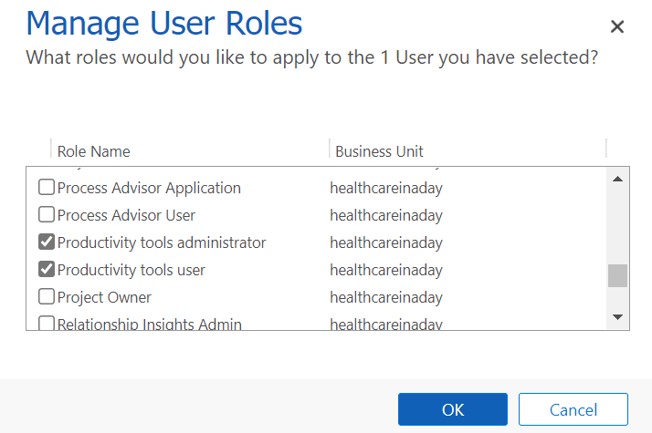](../media/62-manage-user-roles.png#lightbox)

> [!NOTE]
> You will assign more roles in this lab. We recommend that you leave the user screen open.

Congratulations, you've successfully assigned the necessary **Productivity tools** user roles to set up and use agent scripts.

### Task 2: Create an agent script

In this task, you will create an agent script in the Omnichannel Administration app. This script will guide the agent to validate patient information when a conversation is initiated between a patient and an agent in Patient Service Center. The script will have two steps: one to confirm phone information and another to verify insurance information. This task will guide you through creation of this agent script and its steps.

1. In Power Apps, select **Apps** on the left navigation bar.

    > [!div class="mx-imgBorder"]
    > 

1. Open the **Omnichannel Administration** app.

    > [!div class="mx-imgBorder"]
    > [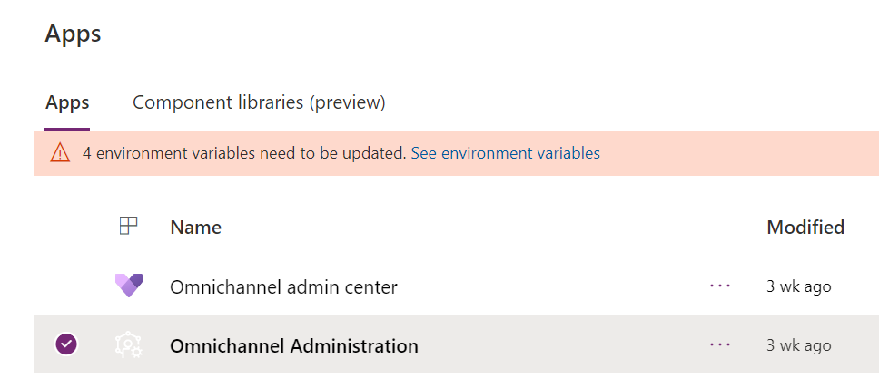](../media/10-omnichannel-administration.png#lightbox)

1. On the left navigation bar, under **Agent Experience**, select **Agent scripts** and then select **+ New**.

    > [!div class="mx-imgBorder"]
    > [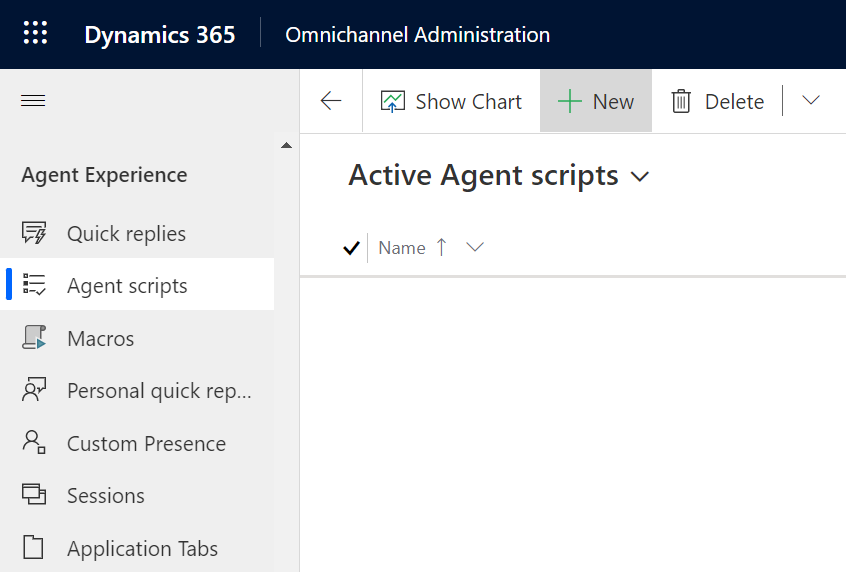](../media/67-agent-scripts.png#lightbox)

1. For the **New Agent script** record, specify the following information:

    -  **Name** - Validate Patient Information

    -  **Unique Name** - msdyn_ValidatePatientInformation

    > [!div class="mx-imgBorder"]
    > [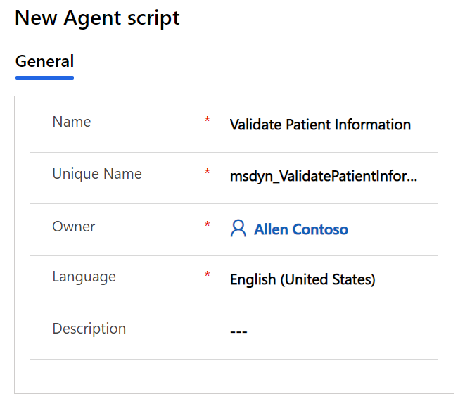](../media/68-new-agent-script.png#lightbox)

1. Select **Save**. The **New Agent script steps** option should appear on the right.

    > [!div class="mx-imgBorder"]
    > 

1. In the **Agent script steps** section, select **+ New Agent script step**.

    > [!div class="mx-imgBorder"]
    > 

1. The **Quick Create: Agent script step** form will appear. Specify the following fields:

    1. **Name** - Confirm Phone Number

    1. **Unique Name** - msdyn_ConfirmPhone

    1. **Order** - 1

    1. **Action type** - Text

    1. **Text instructions** - Ask patient to confirm phone number.

    > [!div class="mx-imgBorder"]
    > [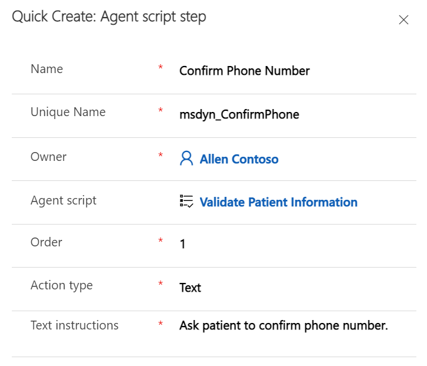](../media/71-quick-create.png#lightbox)

1. Select **Save and Close**. Now, you can add another step.

1. In the **Agent script steps** section, select **+ New Agent script step** again.

    > [!div class="mx-imgBorder"]
    > 

1. Another **Quick Create: Agent script step** form will appear. Specify the following fields:

    1. **Name** - Verify Insurance Information

    1. **Unique Name** - msdyn_VerifyInsuranceInformation

    1. **Order** - 2

    1. **Action type** - Text

    1. **Text instructions** - Ask Patient for Insurance Provider and ID #. Verify their response matches insurance information on file.

        > [!div class="mx-imgBorder"]
        > [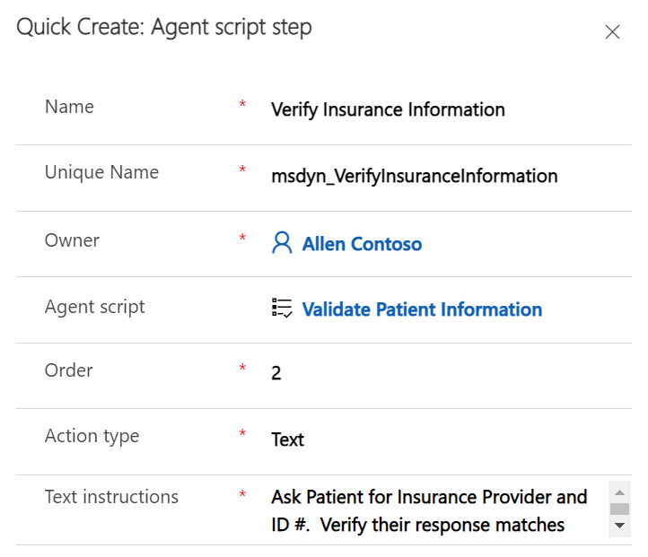](../media/73-agent-script-step-two.png#lightbox)

    1. Select **Save and Close**. Both steps should now be in the **Agent script steps** table.
        > [!div class="mx-imgBorder"]
        > 

1. The agent script is now complete. Select **Save & Close**.

    > [!div class="mx-imgBorder"]
    > [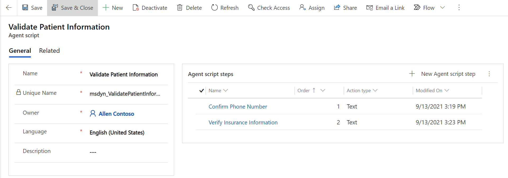](../media/80-save-close.png#lightbox)

Congratulations, you have completed creating an agent script with two steps to validate patient information, including phone number and insurance information.

### Task 3: Associate the agent script with a session template

In this task, you will associate the agent script with a session template so that it will load for agents based on the type of session that they've opened. You will be associating the agent script that you created with the **Default chat session**. This default chat session opens during an escalation to an agent in Patient Service Center.

1. Open the **Omnichannel Administration** app in Power Apps if you aren't already in it.

    > [!div class="mx-imgBorder"]
    > 

1. In the left navigation bar, under **Agent Experience**, select **Sessions**.

    > [!div class="mx-imgBorder"]
    > [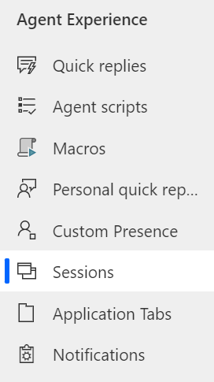](../media/81-sessions.png#lightbox)

1. Select the **Chat session - default** session template. Double-click or select **Edit** on the command bar to open the **Chat session - default** record.

    > [!div class="mx-imgBorder"]
    > [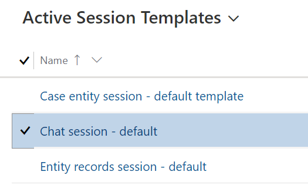](../media/82-active-session-templates.png#lightbox)

1. Associate this session with the agent script.

    > [!div class="mx-imgBorder"]
    > [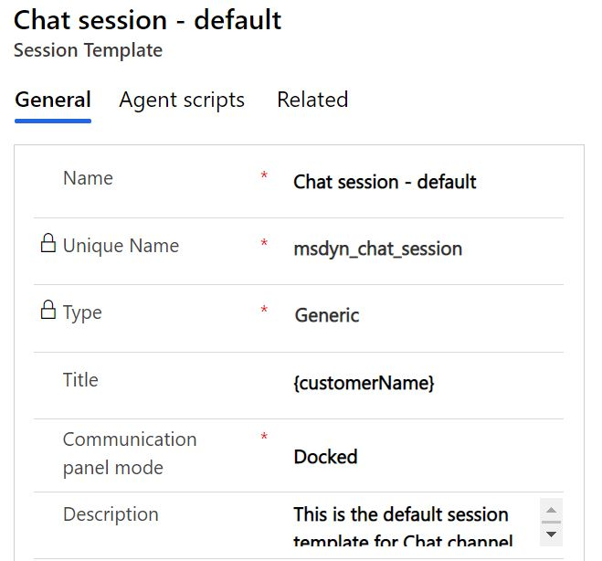](../media/83-default.png#lightbox)

1. Select the **Agent scripts** tab. In the **Agent scripts** section, select **Add Existing Agent script**.

    > [!div class="mx-imgBorder"]
    > 

   The **Lookup Records** pane should appear on the right.

    > [!div class="mx-imgBorder"]
    > [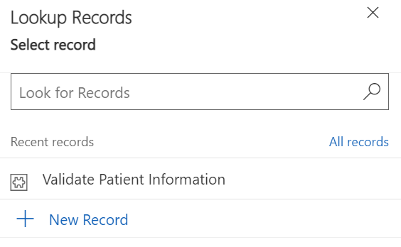](../media/85-lookup-records.png#lightbox)

1. In the **Look for Records** box, select the **search icon** (magnifying glass).
    > [!div class="mx-imgBorder"]
    > [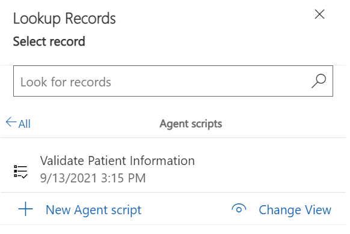](../media/86-search-icon.png#lightbox)

1. Select the **Validate Patient Information** agent script from the list and then select **Add**.

    > [!div class="mx-imgBorder"]
    > [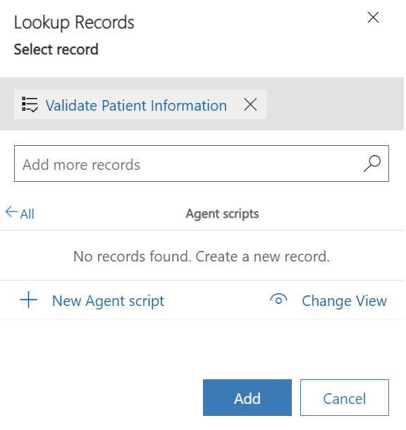](../media/87-add-record.png#lightbox)

   The **Chat session - default** session template should have the **Validate Patient Information** agent script.

    > [!div class="mx-imgBorder"]
    > [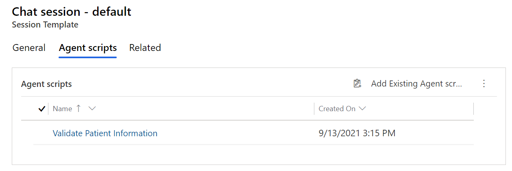](../media/88-validate-information.png#lightbox)

Congratulations, you have successfully created an agent script with two steps and associated the agent script with the default chat session. Now, your agents can use this script during a default chat session with a patient.
