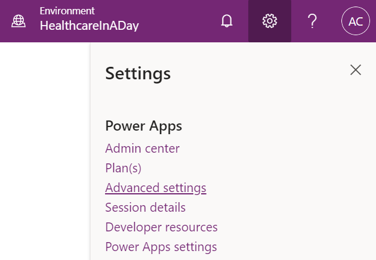
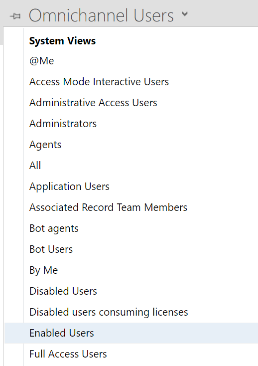
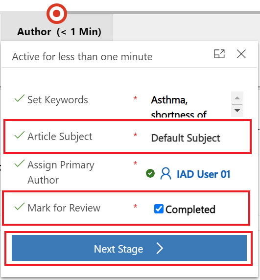
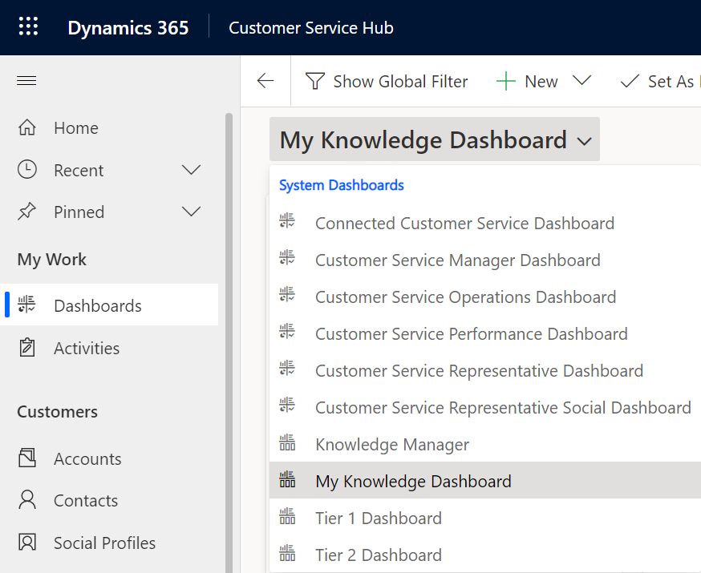
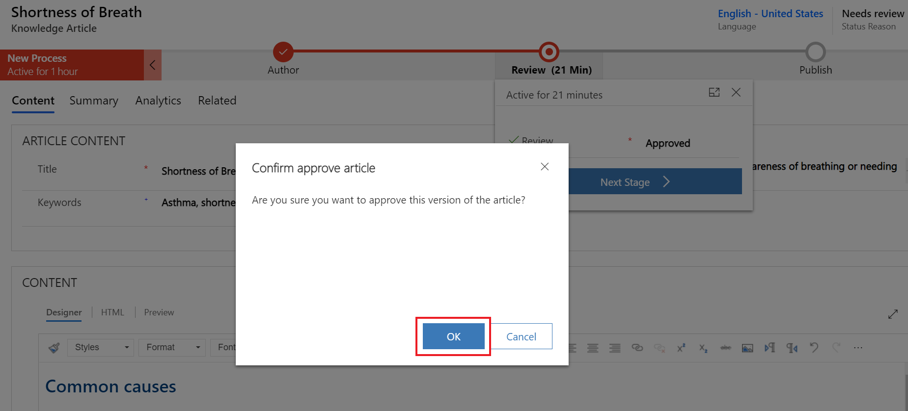

In this exercise, you will learn how to create and manage **Knowledge Articles** that can address any number of issues your customers would like to discuss during the patient service center conversation. These knowledge articles will appear in the productivity pane in Patient Service Center through searching and AI-enabled suggestions.

> [!div class="mx-imgBorder"]
> 

### Task 1: Assign Knowledge Manager user role

In this task, we will assign the necessary user role to create and view knowledge articles.

1. If you kept the User Settings page up from the previous exercise, navigate to that page and skip to step 8, otherwise continue with the following steps.

1. Navigate to [http://make.powerapps.com](http://make.powerapps.com/?azure-portal=true), select the **gear icon** in the upper right corner and navigate to **Advanced settings**.

    > [!div class="mx-imgBorder"]
    > 

1. A new window should open and navigate to Dynamics 365. If it takes a while to load, reload the page. It should then load faster.

1. In **Dynamics 365**, select **Settings** in the command bar and go to **Security**.

    > [!div class="mx-imgBorder"]
    > 

1. Under Security, select **Users**.

    > [!div class="mx-imgBorder"]
    > 

1. Switch the view drop-down from Omnichannel Users to **Enabled Users** for the grid view so that your user will show in the list.

    > [!div class="mx-imgBorder"]
    > 

1. While in the Enabled User list, scroll down to **find your user** or use the **Search** bar.

    > [!div class="mx-imgBorder"]
    > 

1. Select your user and select **Manage Roles**.

    > [!div class="mx-imgBorder"]
    > 

1. There are three roles you can choose for [create/read permissions for Knowledge Articles](/dynamics365/customer-service/customer-service-hub-user-guide-knowledge-article#create-a-knowledge-article/?azure-portal=true#).

    1. Knowledge Manager

    1. Customer Service Manager

    1. Customer Service Representative

1. For this lab, select the **Knowledge Manager** role.

    > [!div class="mx-imgBorder"]
    > 

1. Also ensure you have the **System Administrator** role.

    > [!div class="mx-imgBorder"]
    > 

1. Select **OK** to close the Manage User Roles window and accept changes.

**Congratulations!** You have assigned the proper roles to create and read knowledge articles.

### Task 2: Configure Knowledge Management settings

In this task, you will learn about the Knowledge Management Settings available.

1. In [http://make.powerapps.com](http://make.powerapps.com/?azure-portal=true), open the **Customer Service Hub** app.

    > [!div class="mx-imgBorder"]
    > 

1. In Customer Service Hub**,** on the left navigation bar, go to the bottom-left corner where there's a drop-down that says **Service**. Select it and change the area to **Service Management**.

    > [!div class="mx-imgBorder"]
    > 

1. Once in the Service Management area, on the left navigation, scroll down to **Knowledge Base Management** section and select **Settings.**

    > [!div class="mx-imgBorder"]
    > 

1. **Record Types** allows you to configure the record types you want to turn on for knowledge management. The grid may take a moment to load.

    1. The list will include all entities that are available for an N:N relationship.

    1. Knowledge management is enabled for **Case** table by default. Because our scenario will also use the Case table, **we don't need to add any additional tables at this time.**

    > [!div class="mx-imgBorder"]
    > 

1. For Support Portal Connection, this allows you to integrate an external portal for publishing knowledge articles.

    1. Selecting Yes would share the knowledge article as a link in the email sent to the customer.

    1. Selecting No would share the article content inserted in the email body.

    1. Keep as **No** as we will not be integrating an external portal connection

    > [!div class="mx-imgBorder"]
    > 

1. In the **Knowledge Articles Feedback** section, keep **Enable users to provide feedback on knowledge articles from search control** set to **Yes**. This will allow users to provide feedback on knowledge articles opened from knowledge search control.

    > [!div class="mx-imgBorder"]
    > 

**Congratulations!** You have successfully reviewed the Knowledge Base Management Settings.

### Task 3: Create knowledge article

1. In **Customer Service Hub,** on the left navigation bar, go to the bottom-left corner where you previously modified the drop-down. Change it back from Service Management to **Service**.

    > [!div class="mx-imgBorder"]
    > 

1. In the sitemap, navigate to **Service** > **Knowledge Articles**.

    > [!div class="mx-imgBorder"]
    > 

1. Select **+New** on the command bar.

    > [!div class="mx-imgBorder"]
    > 

1. You should be on the **Content** tab of a new knowledge article

    > [!div class="mx-imgBorder"]
    > 

1. On the **Article Content section** tab of the new knowledge article, specify the following details for a knowledge article on asthma and shortness of breath:

    1. **Title**: Shortness of Breath

    1. **Keywords**. Asthma, shortness of breath, trouble breathing, albuterol, inhaler

    1. **Description**: Uncomfortable sensation or awareness of breathing or needing to breathe.

        > [!div class="mx-imgBorder"]
        > 

    1. In the **Content** section, copy and paste the content for your knowledge article.

    **Common causes**

    - Shortness of breath is not always related to an underlying condition. It may be caused by:
    - Aerobic exercise
    - Intense physical activity
    - High altitude with lower oxygen levels
    - Poor cardiovascular fitness
    - Anxiety
    - Being obese
    - General weakness

    **Treatment**

    **Self-treatment:** Self-care steps that may be helpful in some less- serious cases:

    - Stop smoking
    - Avoid exposure to pollutants, allergens, and environmental toxins
    - Lose weight if overweight
    - Avoid exertion at elevations
    - Take slow even breaths
    - When you breathe out, put your lips together, like slowly blowing out a candle (Pursed Lip Breathing)

    **See a doctor if you notice:**
    - Chest pain or pressure
    - Inability to function

    **See a doctor immediately if you notice:**
    - Fever or a change in the amount, color, or thickness of sputum
    - Breathlessness does not go away after resting for 30 minutes
    - Swelling in the feet and ankles
    - Trouble breathing when you lie flat
    - High fever, chills, and cough
    - Wheezing
    - Worsening of pre- existing shortness of breath

1. Select **Save**.

    > [!div class="mx-imgBorder"]
    > 

1. The Business Process flow bar at the top of the form helps you to drive the article towards completeness. On the Business process bar, select **Author**. The business step options should pop out below.

    > [!div class="mx-imgBorder"]
    > 

1. Add the **Article Subject:** Default Subject. This is the subject of the article to help with searches.

1. Check the box for **Mark for Review** as Mark Complete.

1. In the **Assign Primary Author** drop-down list, you may choose a person who is responsible for maintaining the article content. By default, the user who creates the article is the primary author. For this training, we will keep it as our user.

1. Select **Next** Stage to mark the article complete and ready for review.

    > [!div class="mx-imgBorder"]
    > 

1. The knowledge article is now in the review stage of the business process flow and is ready for review.

    > [!div class="mx-imgBorder"]
    > 

**Congratulations!** You have successfully created a knowledge article for Shortness of Breath and marked it for review.

### Task 4: Review and publish knowledge article

To ensure accuracy of the knowledge article, typically someone else would review and approve it. For this training exercise, you will mark the article reviewed and approved yourself. Quick note that this task also requires the Knowledge Manager role or another that can approve knowledge articles.

1. In Customer Service Hub, navigate to **Service** > **Dashboards** and use the drop-down to choose the **My** **Knowledge Dashboard**.

    > [!div class="mx-imgBorder"]
    > 

1. Select the **Shortness of Breath** knowledge article in **My Active Articles** stream.

    > [!div class="mx-imgBorder"]
    > 

1. On the Business process bar, in the **Review** stage and in the **Review** drop-down, select **Approve**.

    > [!div class="mx-imgBorder"]
    > 

1. Select **OK** when prompted to **Confirm approve article.**

    > [!div class="mx-imgBorder"]
    > 

1. Select **Next Stage** to move to Publish stage.

    > [!div class="mx-imgBorder"]
    > 

1. You should now be in the **Publish** stage and **Status Reason** should have changed to **Approved.**

    > [!div class="mx-imgBorder"]
    > 

**Congratulations!** You have successfully reviewed and approved the knowledge article. We will show you how to publish the Knowledge Articles to be available during patient service center calls.

### Task 5: Publish your knowledge article

In this task, you will learn how to publish the knowledge article so it's live and ready to be used.

1. In your **Shortness of Breath** Knowledge Article, Select the **Publish** stage.

    a.  For **Set Product Associated** check the box **Completed.**

    b.  Add an **Expiration Date** for one year from now.

    c.  Select **Finish.**

    > [!div class="mx-imgBorder"]
    > 

1. Once you select Finish, the business process flow should show as completed.

    > [!div class="mx-imgBorder"]
    > 

1. Now you can specify the additional Publish details. On the command bar to go **More** > **Publish**.

    > [!div class="mx-imgBorder"]
    > 

1. Specify the following details (see screenshot below):

    a.  **Publish**: Now

    b.  **Published Status:** Published

    c.  **Expiration State**: Published

    d.  **Expiration Status**: Published

    e.  **Publish approved related translations with Article**, choose Yes.

1. Select **Publish.**

    > [!div class="mx-imgBorder"]
    > 

**Congratulations!** You have successfully reviewed and published the knowledge article. You will see this knowledge article in Patient Service Center when testing the final escalation.

There's a lot you can do with Knowledge Articles, and this only touches on a small portion of capabilities. Check out additional knowledge article references to learn more:

> [Knowledge Management](/dynamics365/industry/healthcare/use-patient-service-center#knowledge-management/?azure-portal=true#)
>
> [Knowledge Articles](/omnichannel/administrator/knowledge-management-oc/?azure-portal=true#)
>
> [Create and manage knowledge articles](/dynamics365/customer-service/customer-service-hub-user-guide-knowledge-article/?azure-portal=true#)
>
> [Search and Share Knowledge Articles](/dynamics365/omnichannel/agent/agent-oc/oc-search-knowledge-articles/?azure-portal=true#)
