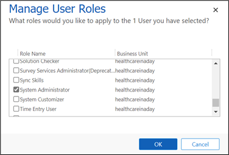
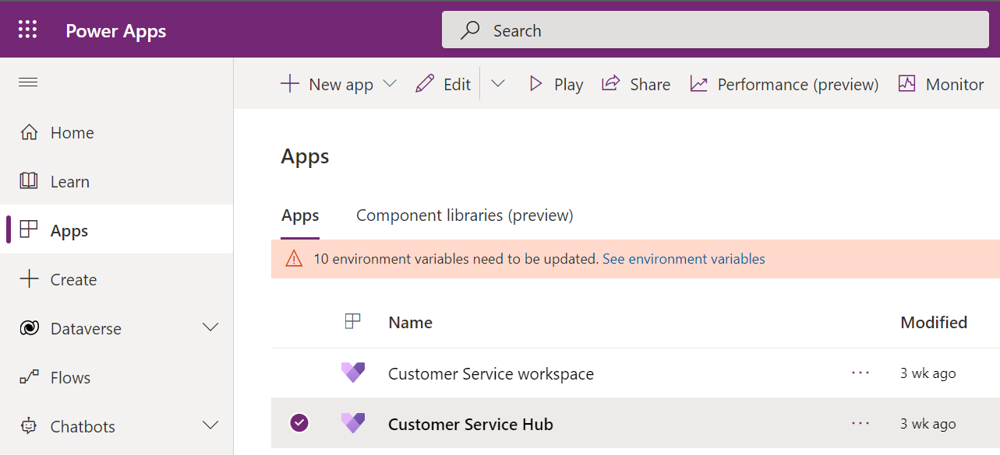
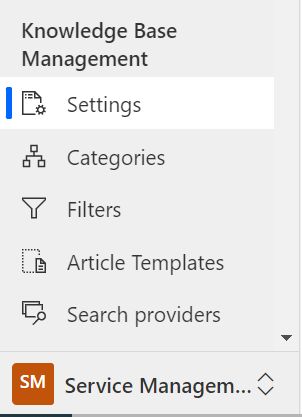
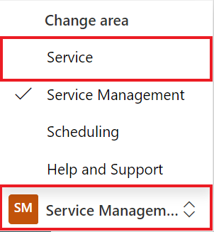
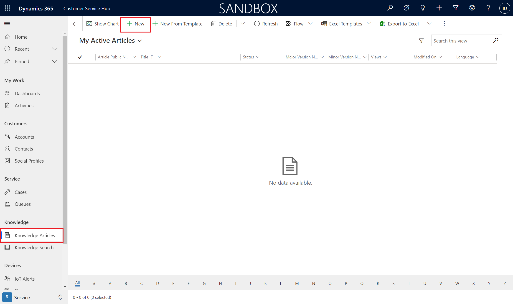
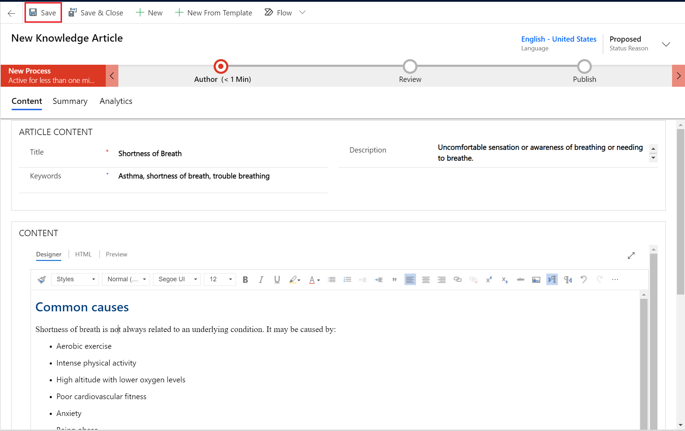
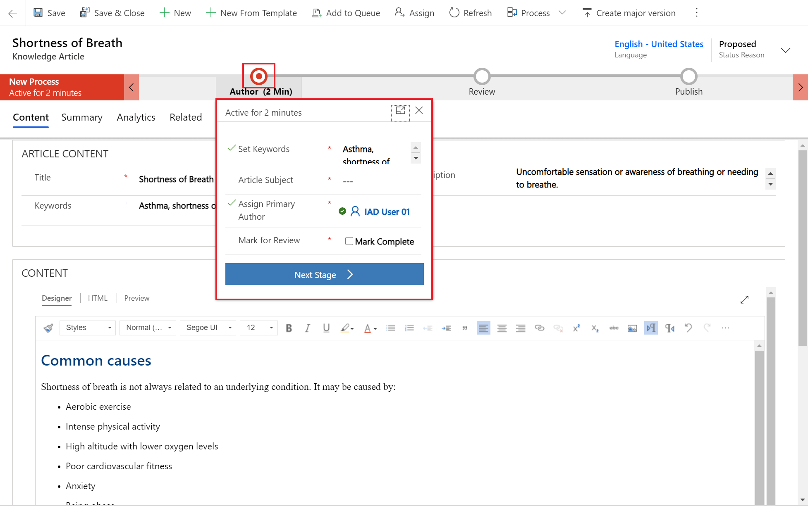
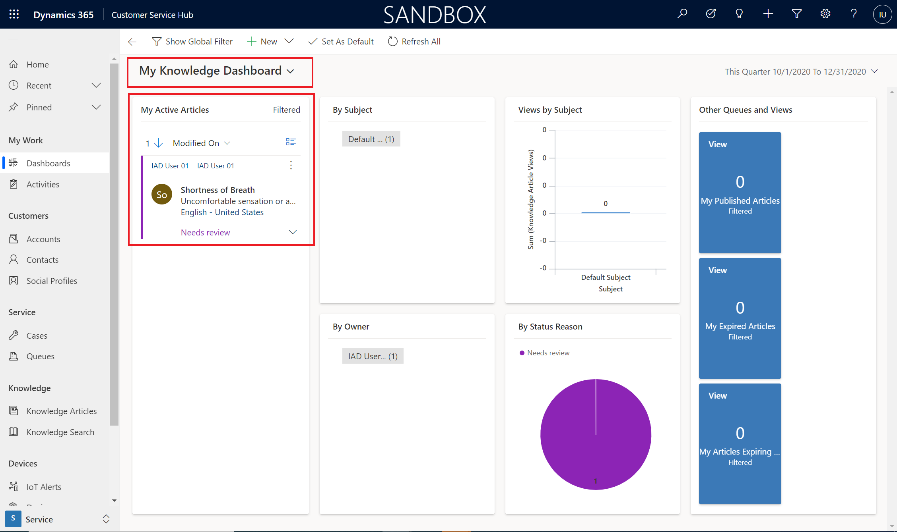

In this exercise, you will learn how to create and manage knowledge articles that can address numerous issues that your customers want to discuss during the Patient Service Center conversation. These knowledge articles will appear in the **Productivity** pane in Patient Service Center through searching and AI-enabled suggestions.

> [!div class="mx-imgBorder"]
> 

### Task 1: Assign the Knowledge Manager user role

In this task, you will assign the necessary user role to create and view knowledge articles.

1. If you kept the **User Settings** page open from the previous exercise, go to that page and then skip to step 7. Otherwise, continue with the following steps.

1. Go to [http://make.powerapps.com](http://make.powerapps.com/?azure-portal=true), select the **gear icon** in the upper-right corner, and then select **Advanced settings**.

    > [!div class="mx-imgBorder"]
    > 

   A new window should open and direct you to Dynamics 365. If it takes a while to load, reload the page, which will prompt it to load faster.

1. In **Dynamics 365**, select **Settings > Security**.

    > [!div class="mx-imgBorder"]
    > 

1. Under **Security**, select **Users**.

    > [!div class="mx-imgBorder"]
    > 

1. Switch the **System Views** dropdown menu from **Omnichannel Users** to **Enabled Users** for the grid view so that your user will show in the list.

    > [!div class="mx-imgBorder"]
    > 

1. While in the **Enabled Users** list, scroll down to find your user or use the search bar.

    > [!div class="mx-imgBorder"]
    > 

1. Select your user and then select **Manage Roles**.

    > [!div class="mx-imgBorder"]
    > 

1. Three roles that you can choose for [create/read permissions for knowledge articles](/dynamics365/customer-service/customer-service-hub-user-guide-knowledge-article#create-a-knowledge-article/?azure-portal=true#) are:

    - Knowledge Manager

    - Customer Service Manager

    - Customer Service Representative

   For this lab, select the **Knowledge Manager** role.

    > [!div class="mx-imgBorder"]
    > 

1. Ensure that you have the **System Administrator** role.

    > [!div class="mx-imgBorder"]
    > 

1. Select **OK** to close the **Manage User Roles** window and accept changes.

Congratulations, you have assigned the proper roles to create and read knowledge articles.

### Task 2: Set up Knowledge Management settings

In this task, you will learn about the Knowledge Management settings that are available.

1. In [http://make.powerapps.com](http://make.powerapps.com/?azure-portal=true), open the **Customer Service Hub** app.

    > [!div class="mx-imgBorder"]
    > 

1. In Customer Service Hub, select the **Service** dropdown menu in the lower-left corner and then change the area to **Service Management**.

    > [!div class="mx-imgBorder"]
    > 

1. While in the **Service Management** area, scroll down to the **Knowledge Base Management** section and select **Settings**.

    > [!div class="mx-imgBorder"]
    > 

1. In the **Settings** area, select **Record Types**, which will allow you to set up the record types that you want to turn on for knowledge management. The grid might take a moment to load.

    - The list will include all entities that are available for a many-to-many (N:N) relationship.

    - Knowledge management is enabled for the Case table by default. Because this scenario will also use the Case table, you don't need to add more tables at this time.

    > [!div class="mx-imgBorder"]
    > 

1. In **Settings**, the **Support portal connection** area allows you to integrate an external portal for publishing knowledge articles.

    - Selecting **Yes** will share the knowledge article as a link in the email that is sent to the customer.

    - Selecting **No** will share the article content that is inserted in the email body.

    Keep this selection as **No** because you won't be integrating an external portal connection.

    > [!div class="mx-imgBorder"]
    > 

1. In the **Knowledge Articles Feedback** section in **Settings**, keep the **Enable users to provide feedback on knowledge articles from search control** toggle set to **Yes**. This setting allows users to provide feedback on knowledge articles that are opened from knowledge search control.

    > [!div class="mx-imgBorder"]
    > 

Congratulations, you have successfully reviewed the Knowledge Base Management settings.

### Task 3: Create a knowledge article

In this task, you will create a knowledge article.

1. In **Customer Service Hub**, scroll to the lower-left corner where you previously modified the dropdown menu. Change the menu from **Service Management** to **Service**.

    > [!div class="mx-imgBorder"]
    > 

1. In the site map, go to **Service > Knowledge Articles**.

    > [!div class="mx-imgBorder"]
    > 

1. Select **+ New** on the command bar.

    > [!div class="mx-imgBorder"]
    > 

   This selection will direct you to the **Content** tab of the **New Knowledge Article** section.

    > [!div class="mx-imgBorder"]
    > 

1. In the **Article Content** area of the **New Knowledge Article** section, specify the following details for a knowledge article on asthma and shortness of breath:

    - **Title** - Shortness of Breath

    - **Keywords** - Asthma, shortness of breath, trouble breathing, albuterol, inhaler

    - **Description** - Uncomfortable sensation or awareness of breathing or needing to breathe.

        > [!div class="mx-imgBorder"]
        > 

1. In the **Content** section under the **Article Content** area, copy and paste the following content for your knowledge article.

    **Common causes**

    Shortness of breath is not always related to an underlying condition. It might be caused by:
    - Aerobic exercise
    - Intense physical activity
    - High altitude with lower oxygen levels
    - Poor cardiovascular fitness
    - Anxiety
    - Being obese
    - General weakness

    **Treatment**

    **Self-treatment:** Self-care steps that might be helpful in some less-serious cases:

    - Stop smoking
    - Avoid exposure to pollutants, allergens, and environmental toxins
    - Lose weight if overweight
    - Avoid exertion at elevations
    - Take slow, even breaths
    - When you breathe out, put your lips together, like slowly blowing out a candle (pursed lip breathing)

    **See a doctor if you notice:**
    - Chest pain or pressure
    - Inability to function

    **See a doctor immediately if you notice:**
    - Fever or a change in the amount, color, or thickness of sputum
    - Breathlessness does not go away after resting for 30 minutes
    - Swelling in the feet and ankles
    - Trouble breathing when you lie flat
    - High fever, chills, and cough
    - Wheezing
    - Worsening of pre-existing shortness of breath

1. Select **Save**.

    > [!div class="mx-imgBorder"]
    > 

1. The business process flow bar at the top of the form will help you to drive the article toward completion. On the business process bar, select **Author**. The business step options should display in a pop-up window.

    > [!div class="mx-imgBorder"]
    > 

1. Add the **Article Subject** as **Default Subject**, which is the subject of the article to help with searches.

1. Select the **Mark for Review** checkbox to show as **Completed**.

1. In the **Assign Primary Author** dropdown list, you can choose a person who is responsible for maintaining the article content. By default, the user who creates the article is the primary author. For this training, keep this person as your user.

1. Select **Next Stage** to mark the article as complete and ready for review.

    > [!div class="mx-imgBorder"]
    > 

The knowledge article is now in the **Review** stage of the business process flow and is ready for review.

   > [!div class="mx-imgBorder"]
   > 

Congratulations, you have successfully created a knowledge article titled **Shortness of Breath** and have marked it for review.

### Task 4: Review and publish a knowledge article

Typically, to ensure accuracy of the knowledge article, someone else should review and approve it. However, for this training exercise, you will mark the article as reviewed and approved instead. This task also requires the Knowledge Manager role or another role that can approve knowledge articles.

1. In **Customer Service Hub**, go to **Service > Dashboards** and use the **System Dashboards** dropdown menu to select **My Knowledge Dashboard**.

    > [!div class="mx-imgBorder"]
    > 

1. Select the **Shortness of Breath** knowledge article in the **My Active Articles** stream.

    > [!div class="mx-imgBorder"]
    > 

1. On the business process bar, in the **Review** stage and in the **Review** dropdown menu, select **Approved**.

    > [!div class="mx-imgBorder"]
    > 

1. Select **OK** when prompted to **Confirm approve article**.

    > [!div class="mx-imgBorder"]
    > 

1. Select **Next Stage** to move to the **Publish** stage.

    > [!div class="mx-imgBorder"]
    > 

You should now be in the **Publish** stage and **Status Reason** should have changed to **Approved**.

    > [!div class="mx-imgBorder"]
    > 

Congratulations, you have successfully reviewed and approved the knowledge article. Next, you will learn how to publish the knowledge article to be available during Patient Service Center calls.

### Task 5: Publish your knowledge article

In this task, you will learn how to publish the knowledge article so that it's live and ready to be used.

1. In your **Shortness of Breath** knowledge article, select the **Publish** stage.

    a.  For **Set Product Associated**, select **Completed**.

    b.  In the **Set Expiration Date** field, set the date for one year from now.

    c.  Select **Finish**.

    > [!div class="mx-imgBorder"]
    > 

1. After you select **Finish**, the business process flow will show as **Completed**.

    > [!div class="mx-imgBorder"]
    > 

1. On the command bar, to go **More options (...) > Publish** to specify more **Publish** stage details. 

    > [!div class="mx-imgBorder"]
    > 

1. Specify the following details (as shown in the following screenshot):

    -  **Publish** - Now

    -  **Published Status** - Published

    -  **Expiration State** - Published

    -  **Expiration Status** - Published

    -  **Publish approved related translations with Article** - Yes

1. Select **Publish**.

    > [!div class="mx-imgBorder"]
    > 

Congratulations, you have successfully reviewed and published the knowledge article. You can view this knowledge article in Patient Service Center when testing the final escalation.

You can accomplish numerous tasks with knowledge articles, and this module mentions only a small portion of capabilities. For more information about knowledge articles, see the following documentation:

> [Knowledge Management](/dynamics365/industry/healthcare/use-patient-service-center#knowledge-management/?azure-portal=true#)
>
> [Knowledge Articles](/omnichannel/administrator/knowledge-management-oc/?azure-portal=true#)
>
> [Create and manage knowledge articles](/dynamics365/customer-service/customer-service-hub-user-guide-knowledge-article/?azure-portal=true#)
>
> [Search and share knowledge articles](/dynamics365/omnichannel/agent/agent-oc/oc-search-knowledge-articles/?azure-portal=true#)
