In this exercise, you will test the end-to-end escalation experience you configured for the patient and service center agent. Starting from when the patient logs into the portal website, continuing with a health bot conversation, and ending with an escalation to a human agent who can provide proper care in Dynamics 365 with Agent Scripts and Knowledge Articles.

The following screen shows Patient Service Center after a patient has been escalated to a call agent. This lab will conclude by bringing together all the components we've set up in previous exercises and show how the call agent can give personalized experiences with proposed insights directly in the application.

> [!div class="mx-imgBorder"]
> [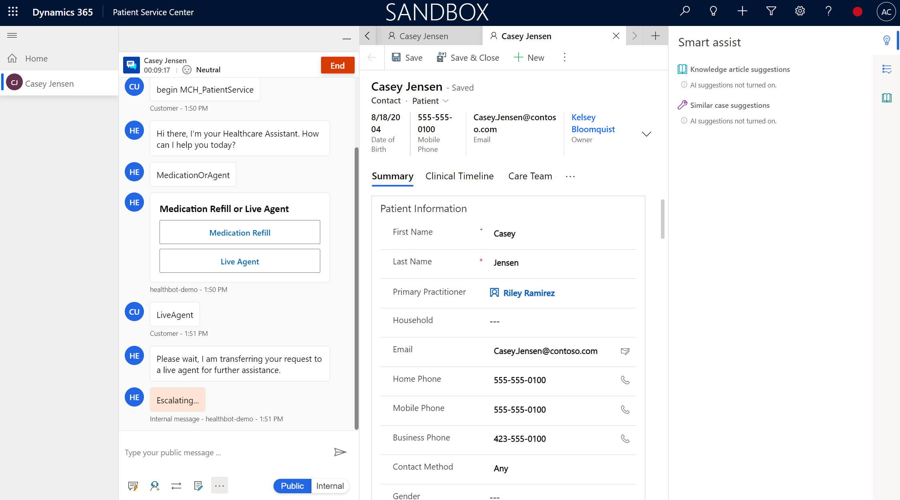](../media/124-escalated-sandbox.png#lightbox)

### Task 1: Log into Patient Portal and Patient Service Center

1. Navigate to [http://make.powerapps.com](http://make.powerapps.com/?azure-portal=true) and open the **Healthcare Patient Portal**.

1. Sign into the Patient Portal as **Casey Jensen** using the credentials you created.

    > [!div class="mx-imgBorder"]
    > [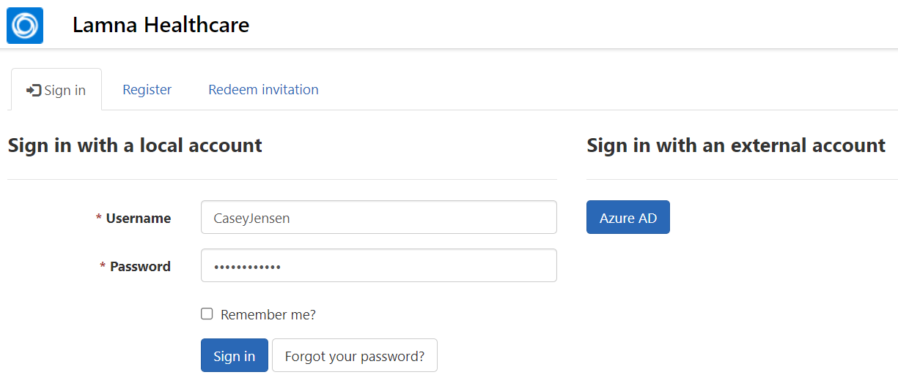](../media/125-local-account-sign.png#lightbox)

1. You should be directed to the **Homepage**. If you are on the profile page, select the Lamna Healthcare name/logo in the upper-left corner to navigate to the homepage.

    > [!div class="mx-imgBorder"]
    > [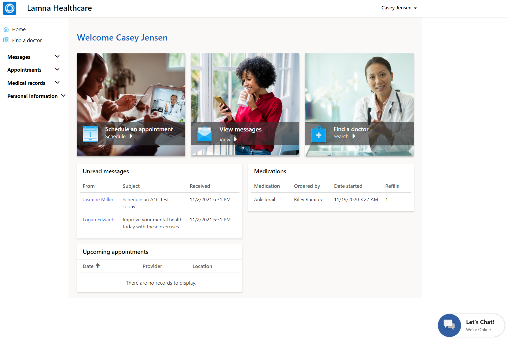](../media/126-lamna-homepage.png#lightbox)

1. Your patient is ready in the Patient Portal. Now we need to make sure an agent is available for them when the Health Bot needs to escalate.

    > [!NOTE]
    > Before opening Patient Service Center, make sure you have completed adding the Omnichannel agent role to your user as shown in the Azure Health Bot lab.

1. If you didn't assign the Omnichannel agent role in Azure Health Bot lab, navigate to users in Dynamics 365, selected your user,select **Manage Roles**, assign the **Omnichannel agent** role, and select **OK**. Changes may take 15 minutes to reflect properly.

    > [!div class="mx-imgBorder"]
    > [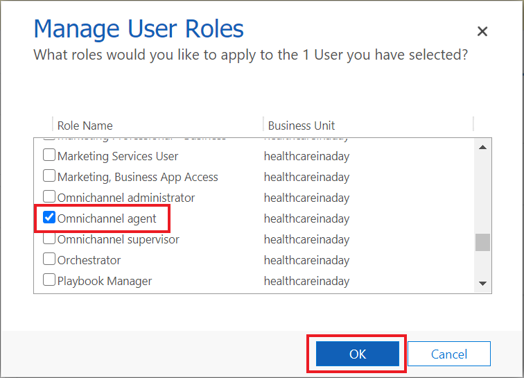](../media/127-manage-omnichannel-agent.png#lightbox)

1. Navigate to Apps and open the **Patient Service Center** app.

    > [!div class="mx-imgBorder"]
    > 

1. In the **Patient Service Center**, you should see a "Loading..." splash screen that goes through percentages. This ensures the live agent status is captured properly.

    > [!div class="mx-imgBorder"]
    > 

1. If you don't see the splash screen and/or the presence indicator is continuously spinning or grayed out, escalation into the Patient Service Center app from the health bot won't work properly.

    1. Refresh again or close and reopen Patient Service Center until the splash screen appears. You may need to close all other apps or close incognito altogether and sign back in.

    1. If you assigned the Omnichannel agent role, it may take up to 15 minutes to apply and for the presence to show for your user.

1. Once your presence indicator is green, you are ready to accept patient escalations.

    > [!div class="mx-imgBorder"]
    > 

    > [!div class="mx-imgBorder"]
    > 

**Congratulations!** You've successfully logged in as both the patient and the live agent. Now it's time to start the Health Bot conversation.

### Task 2: Patient escalates through Azure Health Bot to live agent

1. Select the **Let's Chat** Health Bot chat widget in the bottom-right corner of the portal.

    > [!div class="mx-imgBorder"]
    > [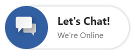](../media/132-chat-online.png#lightbox)

1. The Health Bot should go through the same conversation you created in Azure Health Bot lab. If the conversation doesn't start up, check the following:

    a.  Make sure you set the automatic Welcome message in the Health Bot portal.

    b.  Check the settings you did in Azure Health Bot lab (Teams and Human handoff enabled). Also make sure you added the widget snippet to the Patient Healthcare chat widget code in Portal Management.

1. Select **Lamna Healthcare Support** button to start a support conversation.

    > [!div class="mx-imgBorder"]
    > 

1. The Health Bot responds with options to refill a medication or escalate to a live agent.

    > [!div class="mx-imgBorder"]
    > 

1. First, select **Medication Refill** since Casey wants to refill her inhaler medication. Fill in Casey Jensen's **name** and **email** along with Albuterol inhaler for **medication requested**.

    > [!div class="mx-imgBorder"]
    > [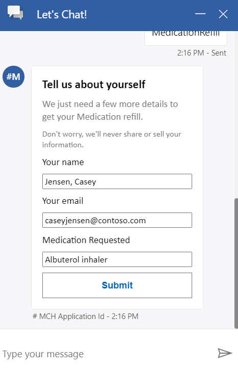](../media/135-medication-refill.png#lightbox)

1. Select **Submit**. Notice the **response** confirming your request.

    > [!div class="mx-imgBorder"]
    > 

1. Let's say that Casey was out of refills for her medication. For this case, let's test escalating to a live agent to refill her medication another way.

1. **Close** the Azure Health Bot chat.

    > [!div class="mx-imgBorder"]
    > 

1. Select **Let's Chat** to open a new Health Bot conversation.

    > [!div class="mx-imgBorder"]
    > 

1. Select **Lamna Healthcare Support**.

    > [!div class="mx-imgBorder"]
    > 

1. Select **Live Agent** in the next prompt to escalate to an agent.

    > [!div class="mx-imgBorder"]
    > [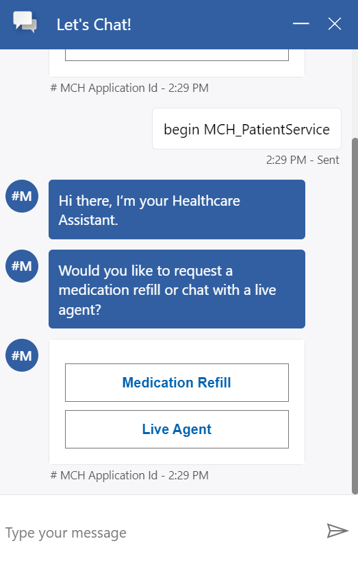](../media/140-live-agent.png#lightbox)

1. You will see the chat notifies you **An agent will be with you in a moment.**

    > [!div class="mx-imgBorder"]
    > 

1. Now let's switch over to the **Patient Service Center** app so you can accept the escalation as an agent.

1. Notice in the upper right corner there is a **Chat request** from your user.

    > [!div class="mx-imgBorder"]
    > 

1. Select **Accept** to start a conversation with the patient.

    > [!div class="mx-imgBorder"]
    > 

1. The page should reload and show the patient record, active chat, and productivity pane as seen below. Your status should now show as red (busy).

    > [!div class="mx-imgBorder"]
    > [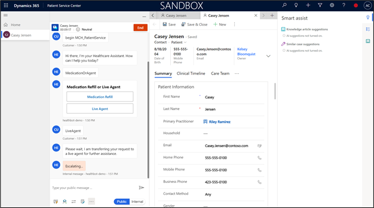](../media/144-red-busy.png#lightbox)

1. See the chat directly embedded on the left-hand side. Try out the command bar below the chat to see various options such as **auto-replies**, **adding/transferring agents**, etc.

    > [!div class="mx-imgBorder"]
    > 

1. You can also chat with internal employees only by selecting **Internal**. Select **Public** again to include the patient in chat.

    > [!div class="mx-imgBorder"]
    > 

1. You may also notice the **patient sentiment analysis** in the top of the chat.

    > [!div class="mx-imgBorder"]
    > 

1. Go to the **Patient Portal**. As Casey, type **"Thank you very much!"** in the chat.

    > [!div class="mx-imgBorder"]
    > 

1. Go back to **Patient Service Center** and notice that the **patient sentiment analysis** has changed from neutral to slightly positive from the patient feedback in chat.

    > [!div class="mx-imgBorder"]
    > 

    > [!div class="mx-imgBorder"]
    > 

1. Now let's navigate the **Productivity Pane** on the right side of the screen, including Smart assist, Agent scripts, and Knowledge articles. You can expand and collapse this panel as needed.

    > [!div class="mx-imgBorder"]
    > 

1. The **Smart assist** tab will show suggested articles and cases based off the chat discussion. We haven't configured the smart assist so these will not show at this time. As we expand this training, we'll add steps for this functionality.

    > [!div class="mx-imgBorder"]
    > 

1. Select the **Agent script** tab and complete steps by selecting the button to the right of the step name. The text will turn green, and a check mark will appear to the left of the step name.

    > [!div class="mx-imgBorder"]
    > [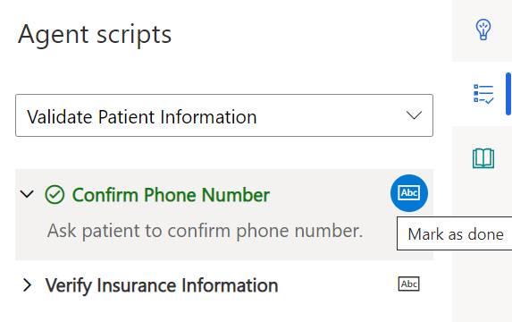](../media/153-confirm-phone.png#lightbox)

    > [!div class="mx-imgBorder"]
    > [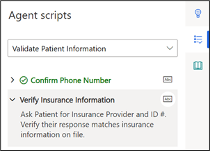](../media/154-verify-insurance.png#lightbox)

1. Go to **Knowledge Article** tab and **search** for "Breath" or "Inhaler". Notice your article appears.

    > [!div class="mx-imgBorder"]
    > 

1. You can **select** the knowledge article in the list to open in the larger tab.

    > [!div class="mx-imgBorder"]
    > [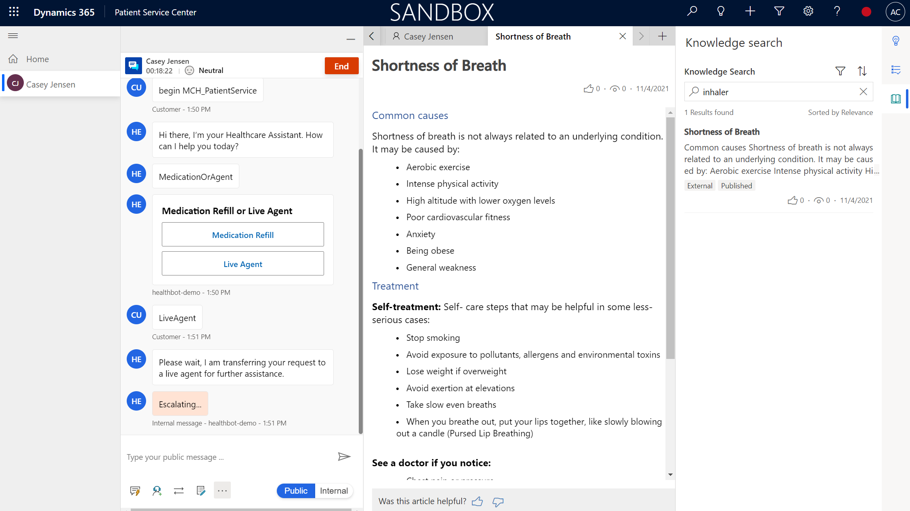](../media/156-select-article.png#lightbox)

1. You may also launch the knowledge article pane from the chat options.

    > [!div class="mx-imgBorder"]
    > 

1. In the **Knowledge Article** pane, you can search for articles.

    > [!div class="mx-imgBorder"]
    > 

1. When completed with the conversation, the agent can select **End** to stop the conversation.

    > [!div class="mx-imgBorder"]
    > 

1. Once you had ended the conversation, you can still chat internally. You may also close the session on the left-hand side of the screen.

    > [!div class="mx-imgBorder"]
    > 

1. After closing the session, you'll be navigated to the Omnichannel Agent Dashboard and your status will turn green (available).

    > [!div class="mx-imgBorder"]
    > 

**Congratulations!** You completed the full experience from logging in as a patient to the portal, conversing with the Health Bot, and escalating into Patient Service Center to navigate the features as a live agent.
