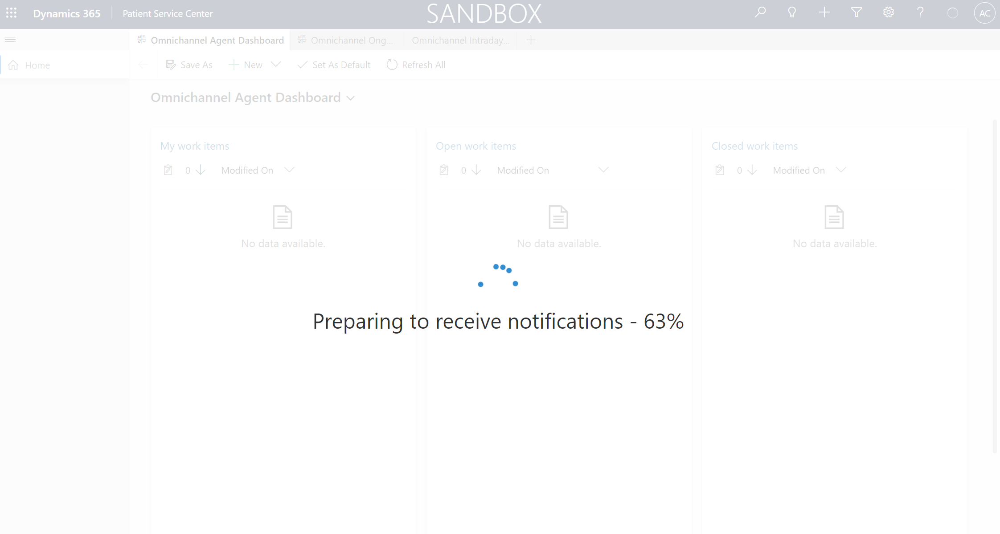
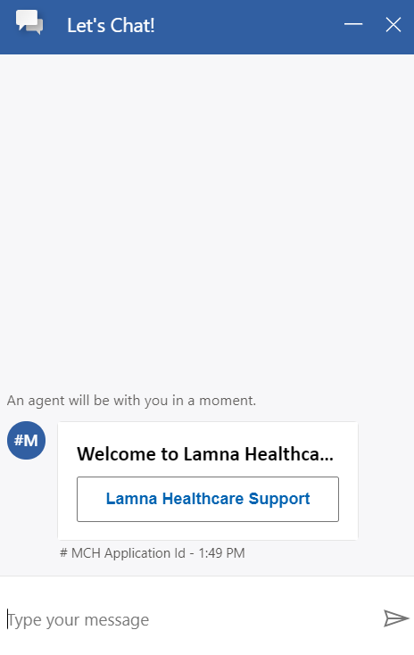
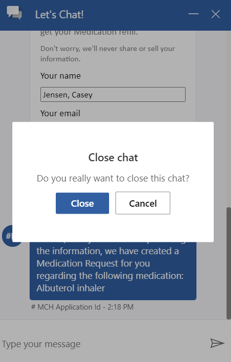
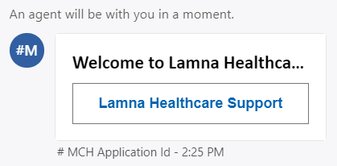
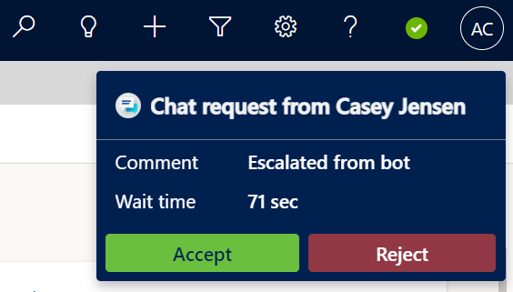
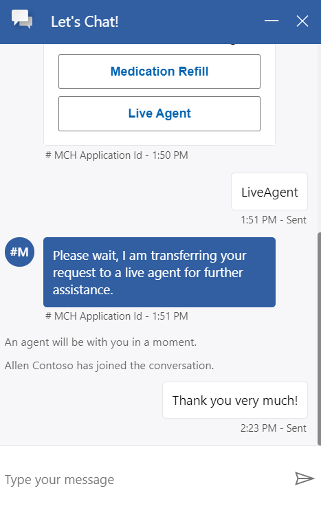
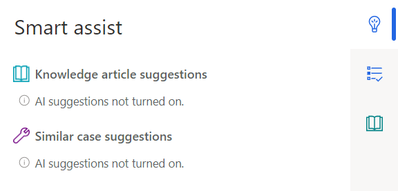
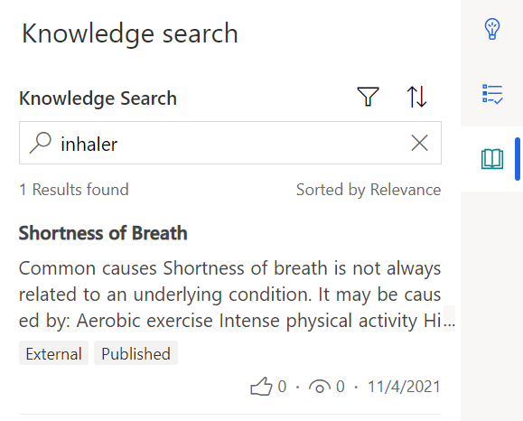
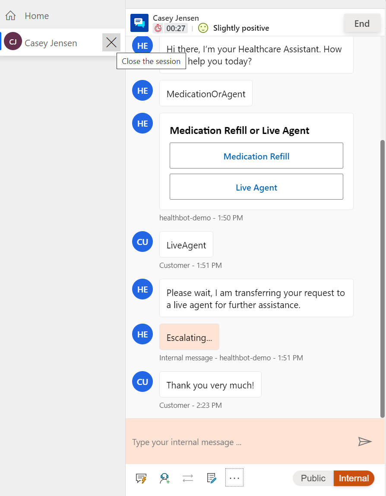

In this exercise, you will test the end-to-end escalation experience that you set up for the Patient Service Center agent. This process starts from when the patient signs in to the portal website, continues with a health bot conversation, and then ends with an escalation to a human agent who will provide proper care by using agent scripts and knowledge articles from Dynamics 365.

The following screen shows Patient Service Center after a patient call has been escalated to a call agent. This lab will conclude by combining all components that you've set up in previous exercises, and then it will show how the call agent can give personalized experiences with proposed insights directly in the application.

> [!div class="mx-imgBorder"]
> 

### Task 1: Sign in to Healthcare Patient Portal and Patient Service Center

In this task, you will sign in to Healthcare Patient Portal and Patient Service Center.

1. Go to [http://make.powerapps.com](http://make.powerapps.com/?azure-portal=true) and open **Healthcare Patient Portal**.

1. Sign in to Healthcare Patient Portal as **Casey Jensen** by using the credentials that you created.

    > [!div class="mx-imgBorder"]
    > 

1. You should be directed to the home page. If you are on the profile page, select the Lamna Healthcare name/logo in the upper-left corner to go to the homepage.

    > [!div class="mx-imgBorder"]
    > 

1. Your patient is ready in Healthcare Patient Portal. Now, you will ensure that an agent is available for the patient when the Health Bot needs to escalate.

    > [!NOTE]
    > Before opening Patient Service Center, make sure that you have completed adding the Omnichannel agent role to your user, as shown in the Azure Health Bot lab.

1. If you didn't assign the Omnichannel agent role in the Azure Health Bot lab, go to **Users** in Dynamics 365, select your user, select **Manage Roles**, assign the **Omnichannel agent** role, and then select **OK**. Changes might take 15 minutes to reflect properly.

    > [!div class="mx-imgBorder"]
    > 

1. Go to the **Apps** list in Power Apps and open the **Patient Service Center** app.

    > [!div class="mx-imgBorder"]
    > 

1. In the **Patient Service Center**, a "Loading..." screen will display that goes through percentages. This process ensures that the live agent status is captured properly.

    > [!div class="mx-imgBorder"]
    > 

1. If the loading screen doesn't appear and/or the presence indicator continuously spins or appears dimmed, then escalation into the Patient Service Center app from the health bot won't work properly.

    1. Refresh again, or close and reopen Patient Service Center until the loading screen appears. You might need to close all other apps or close the InPrivate or Incognito window and then sign in again.

    1. If you assigned the Omnichannel agent role, it might take up to 15 minutes to apply and for the presence to show for your user.

When your presence indicator is green, you are ready to accept patient escalations.

   > [!div class="mx-imgBorder"]
   > 

   > [!div class="mx-imgBorder"]
   > 

Congratulations, you've successfully signed in as the patient and the live agent. Now, you can start the Health Bot conversation.

### Task 2: Patient escalates through Azure Health Bot to live agent

In this task, you will experience the patient call escalation through the Azure Health Bot to a live agent.

1. Select the Azure Health Bot **Let's Chat** widget in the lower-right corner of the portal.

    > [!div class="mx-imgBorder"]
    > 

1. The Health Bot should go through the same conversation that you created in the Azure Health Bot lab. If the conversation doesn't start, check the following factors:

    a.  Make sure that you have set the automatic welcome message in the Health Bot portal.

    b.  Verify the settings that you made in the Azure Health Bot lab (Teams and human handoff enabled). Also, make sure that you added the widget snippet to the Patient Healthcare chat widget code in Portal Management.

1. Select the **Lamna Healthcare Support** button to start a support conversation.

    > [!div class="mx-imgBorder"]
    > 

1. The Health Bot responds with options to refill a medication or escalate to a live agent.

    > [!div class="mx-imgBorder"]
    > 

1. Select **Medication Refill** because Casey wants to refill the inhaler medication. Fill in Casey Jensen's **name** and **email** information and enter **Albuterol inhaler** in the **Medication Requested** field.

    > [!div class="mx-imgBorder"]
    > 

1. Select **Submit**, and you will receive a response that confirms your request.

    > [!div class="mx-imgBorder"]
    > 

1. In the next steps, assume that Casey was out of refills for her medication. For this case, you will test the process of escalating to a live agent to refill Casey's medication another way.

1. **Close** the Azure Health Bot chat.

    > [!div class="mx-imgBorder"]
    > 

1. Select **Let's Chat** to open a new Health Bot conversation.

    > [!div class="mx-imgBorder"]
    > 

1. Select **Lamna Healthcare Support**.

    > [!div class="mx-imgBorder"]
    > 

1. Select **Live Agent** in the next prompt to escalate to an agent.

    > [!div class="mx-imgBorder"]
    > 

   The chat will soon notify you that **An agent will be with you in a moment**.

    > [!div class="mx-imgBorder"]
    > 

1. Switch over to the **Patient Service Center** app so that you can accept the escalation as an agent.

   The upper-right corner will show a notification indicating that you have a **Chat request** from your user.

    > [!div class="mx-imgBorder"]
    > 

1. Select **Accept** to start a conversation with the patient.

    > [!div class="mx-imgBorder"]
    > 

   The page should reload and show the patient record, active chat, and **Productivity** pane, as shown in the following screenshot. Your status should now show as red (busy).

    > [!div class="mx-imgBorder"]
    > 

1. The chat will be directly embedded on the left side of the window. Explore the command bar under the chat to try various options such as auto replies, adding/transferring agents, and so on.

    > [!div class="mx-imgBorder"]
    > 

1. You can chat with internal employees only by selecting **Internal**. Select **Public** again to include the patient in the chat.

    > [!div class="mx-imgBorder"]
    > 

1. Notice that the **patient sentiment analysis** in the upper portion of the chat indicates **Neutral**.

    > [!div class="mx-imgBorder"]
    > 

1. Go to the **Healthcare Patient Portal**. Acting as Casey, type **Thank you very much!** in the chat.

    > [!div class="mx-imgBorder"]
    > 

1. Return to **Patient Service Center** and notice that the **patient sentiment analysis** has changed from **Neutral** to **Slightly positive** from the patient feedback in the chat.

    > [!div class="mx-imgBorder"]
    > 

    > [!div class="mx-imgBorder"]
    > 

1. Go to the **Productivity** pane on the right side of the screen, which includes **Smart assist**, agent scripts, and knowledge articles. You can expand and collapse this panel as needed.

    > [!div class="mx-imgBorder"]
    > 

1. The **Smart assist** tab will show suggested articles and cases based off the chat discussion. Because you haven't configured the **Smart assist** option, these articles won't show at this time. When this training is expanded, steps for this functionality will be added.

    > [!div class="mx-imgBorder"]
    > 

1. Select the **Agent script** tab and complete the steps by selecting the button to the right of the step name. The text will turn green, and a check mark will appear to the left of the step name.

    > [!div class="mx-imgBorder"]
    > 

    > [!div class="mx-imgBorder"]
    > 

1. Go to the **Knowledge Article** tab and search for **breath** or **inhaler**. Notice that your article appears.

    > [!div class="mx-imgBorder"]
    > 

1. Select the knowledge article in the list to open in the larger tab.

    > [!div class="mx-imgBorder"]
    > 

1. Launch the **Knowledge Article** pane from the chat options.

    > [!div class="mx-imgBorder"]
    > 

1. In the **Knowledge Article** pane, you can search for articles.

    > [!div class="mx-imgBorder"]
    > 

1. When completed with the conversation, the agent can select **End** to stop the conversation.

    > [!div class="mx-imgBorder"]
    > 

1. After you have ended the conversation, you can still chat internally. You can also close the session on the left side of the screen.

    > [!div class="mx-imgBorder"]
    > 

1. After closing the session, you'll be directed to the Omnichannel Agent Dashboard and your status will turn green (available).

    > [!div class="mx-imgBorder"]
    > 

Congratulations, you've completed the full experience from signing in as a patient to the portal, conversing with the Health Bot, and escalating into Patient Service Center to navigate the features as a live agent.
