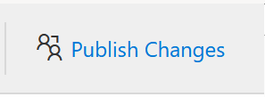
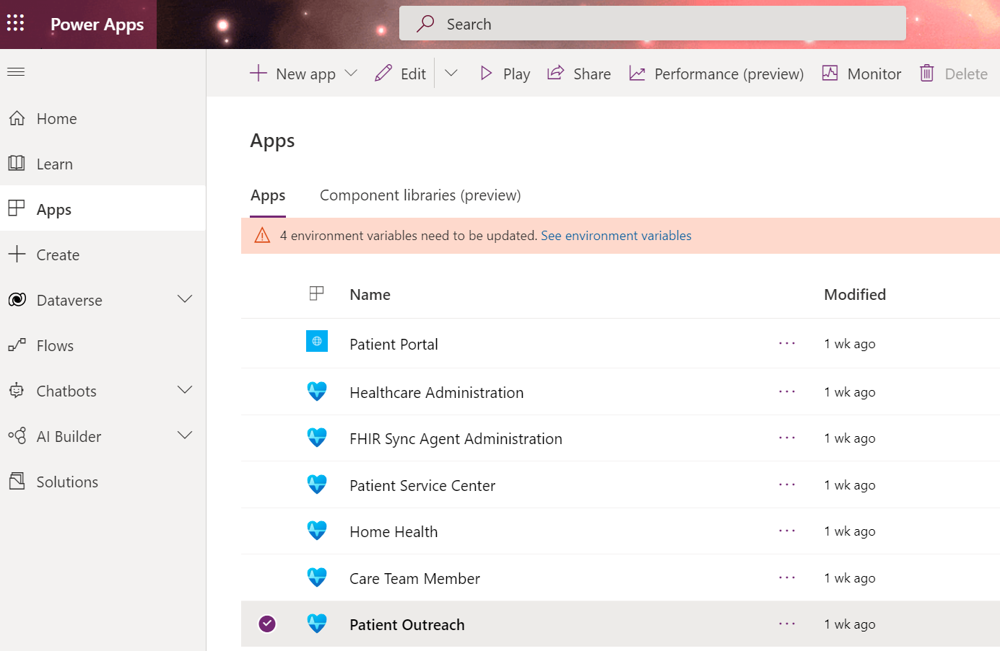
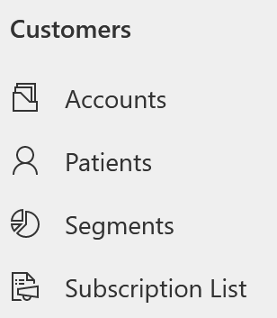
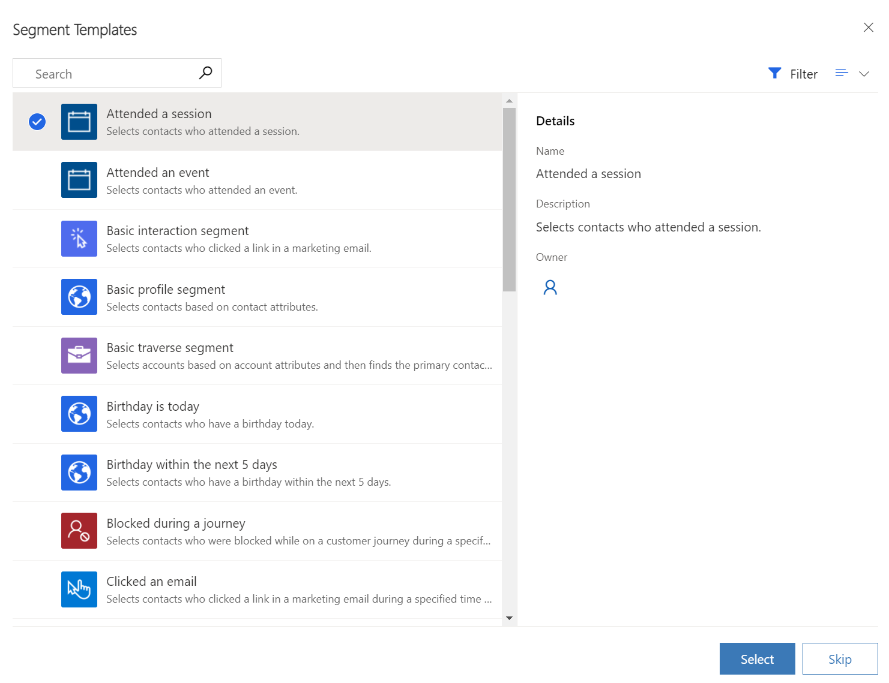

In this exercise, you will create a patient segment by using the Patient Outreach app in Microsoft Cloud for Healthcare. You can use a patient segment to group patients into cohorts based on similar characteristics so that they can be better targeted with marketing communications. In this example, you will create a patient segment for patients with hypermetropia (a vision condition in which nearby objects appear blurry).

1.  While signed in to your Microsoft 365 tenant, go to [https://make.powerapps.com](https://make.powerapps.com/?azure-portal=true).

1.  Go to **Apps** and open **Marketing**.

	> [!div class="mx-imgBorder"]
	> 

1.  In the lower-left corner of the screen, change the dropdown selection from **Marketing** to **Settings**.

	> [!div class="mx-imgBorder"]
	> 

1.  On the **Settings overview** screen, select **Dataset configuration** under the **Data management** section.

	> [!div class="mx-imgBorder"]
	> 

1.  Scroll down and select the **Condition (msemr\_condition)** entity.

	> [!div class="mx-imgBorder"]
	> 

1.  Select **Publish Changes** in the upper-right corner of the screen.

	> [!div class="mx-imgBorder"]
	> 

	> [!NOTE]
	> While it might take up to 30 minutes for changes to take effect, they are generally ready in a few minutes.

1.  Return to the **Apps** list and open **Patient Outreach**.

	> [!div class="mx-imgBorder"]
	> 

1.  Select **Segments** on the left navigation bar to create a new specific group of patients.

	> [!div class="mx-imgBorder"]
	> 

1.  Select **+ New** to create a new patient segment and then select **+ New Dynamic Segment**.

	> [!div class="mx-imgBorder"]
	> 

	> [!TIP]
	> Static segments enable you to choose and add segment members manually based on existing lists or search results. Dynamic segments, which you will define by using a set of rules and conditions, are constantly and automatically changing based on information in your database. For this example, because you want your group to change depending on database information, you will select the **Dynamic Segment** option.

1. When prompted to choose a segment template option, select **Skip** because you will create your own segment.

	> [!div class="mx-imgBorder"]
	> 

1. Name the new segment **Patients with Hypermetropia**.

	> [!div class="mx-imgBorder"]
	> 

1. Select **Add query block** to create a new segment for active patients who have a hypermetropia condition where the contact has a status of **Active**, and the related condition description contains **Hypermetropia**. Configure this new segment by following these steps:

    1.  Leave **Contact** as the main entity.

    1.  Select **Status** from the list of fields and set **Equals** to **Active**.

    1.  Select **Add > Add related entity**. It should default to **AND**.

    1.  In the **Select related entity** dropdown menu, select **Condition (Condition > Contact (Patient))**.

    1.  Select the nested **Add > Add condition** and change it to **Condition**.

    1.  Select the attribute **Description**.

    1.  Change the operator to **Contains** and then type **Hypermetropia**.

	> [!div class="mx-imgBorder"]
	> 

1. Select **Save** and then select **Go live** to publish the segment (you won't be able to use it in a customer journey until it goes live, even if you've saved it).

	> [!div class="mx-imgBorder"]
	> 

1. Wait for about a minute and then select **Refresh** on the command bar to refresh the page. A **Members** tab should have been added.

1. Select **Members** to view the patients who have been added to the Dynamic segment.

	> [!div class="mx-imgBorder"]
	> 

Congratulations, you have completed the steps to create a patient segment that can be used for patient outreach. This patient segment will be used in the tasks in the next exercise.

