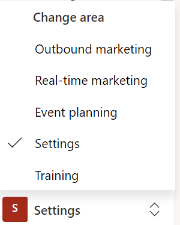
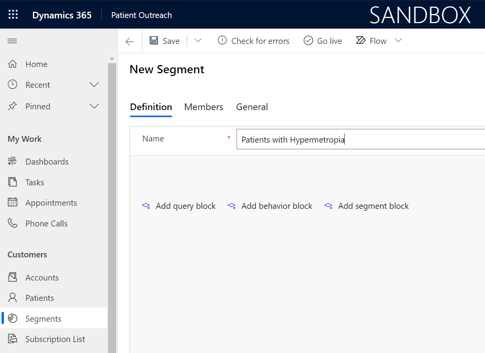

In this exercise, you will create a Patient Segment using the Patient Outreach app in Microsoft Cloud for Healthcare. A **Patient Segment** is used to group patients into cohorts based on similar characteristics so that they can be better targeted with marketing communications. In this example, you will create a Patient Segment for patients with hypermetropia (a vision condition in which nearby objects are blurry).

1.  While logged into your Microsoft 365 tenant, navigate to [https://make.powerapps.com](https://make.powerapps.com/?azure-portal=true).

1.  Go to **Apps** and open **Marketing**.

	> [!div class="mx-imgBorder"]
	> 

1.  Navigate to the **bottom left on the screen** and change the drop-down selection from Marketing to **Settings**.

	> [!div class="mx-imgBorder"]
	> 

1.  On the Settings overview screen, select **Dataset configuration** under Data management.

	> [!div class="mx-imgBorder"]
	> 

1.  Scroll down and select the **Condition (msemr\_condition)** entity.

	> [!div class="mx-imgBorder"]
	> 

1.  **Publish Changes** on the top right.

	> [!div class="mx-imgBorder"]
	> 

	> [!NOTE]
	> While it may take up to 30 minutes for changes to take effect, they are generally ready in a few minutes.

1.  Go back to **Apps** and open **Patient Outreach**.

	> [!div class="mx-imgBorder"]
	> 

1.  Click **Segments** on the left navigation bar to create a new specific group of patients.

	> [!div class="mx-imgBorder"]
	> 

1.  Click **New** to create a new Patient Segment. Select **+ New** **Dynamic Segment**.

	> [!div class="mx-imgBorder"]
	> 

	> [!TIP]
	> **Static segments** enable you to choose and add segment members manually based on existing lists or search results. **Dynamic Segments**, which you define by using a set of rules and conditions, are constantly and automatically changing based on information in your database. Since we want our group to change depending on database information, we are choosing the dynamic segment option.

1. When prompted to choose a Segment Template option, click **Skip** since we will create our own Segment.

	> [!div class="mx-imgBorder"]
	> 

1. **Name** the new Segment "Patients with Hypermetropia".

	> [!div class="mx-imgBorder"]
	> 

1. Select **Add query block** to create a new Segment for Active Patients who have a Hypermetropia condition where the Contact has a Status of Active, and the related Condition Description contains "Hypermetropia". Configure this new segment by doing the following:

    1.  Leave **Contact** as the main entity

    1.  Select **Status** from the list of fields and set it **equal** to **Active**

    1.  Click **Add** **Add related entity**. It should default to **AND**.

    1.  In Select related entity drop down, choose **Condition** **(Condition > Contact (Patient))**

    1.  Click nested **Add** **Add condition** to **Condition**

    1.  Select attribute **Description**

    1.  Change the operator to **Contains** and type **Hypermetropia**

	> [!div class="mx-imgBorder"]
	> 

1. Select **Save** and then select **Go live** to publish the segment (you won't be able to use it in a customer journey until it goes live, even though you've saved it).

	> [!div class="mx-imgBorder"]
	> 

1. Wait for about a minute and then select **Refresh** on the command bar to refresh the page. You should now see that a **Members** tab has been added.

1. Click **Members** to see the Patients who have been added to the Dynamic Segment.

	> [!div class="mx-imgBorder"]
	> 

**Congratulations**! You have completed the steps to create a patient segment that can be used for patient outreach. This patient segment will be used in the next set of tasks in the next exercise.

