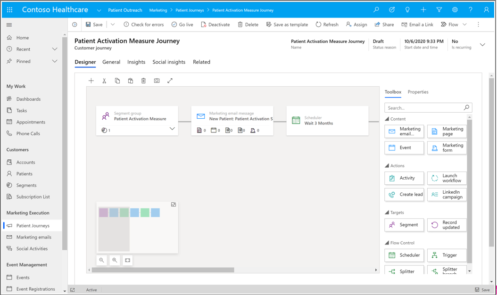
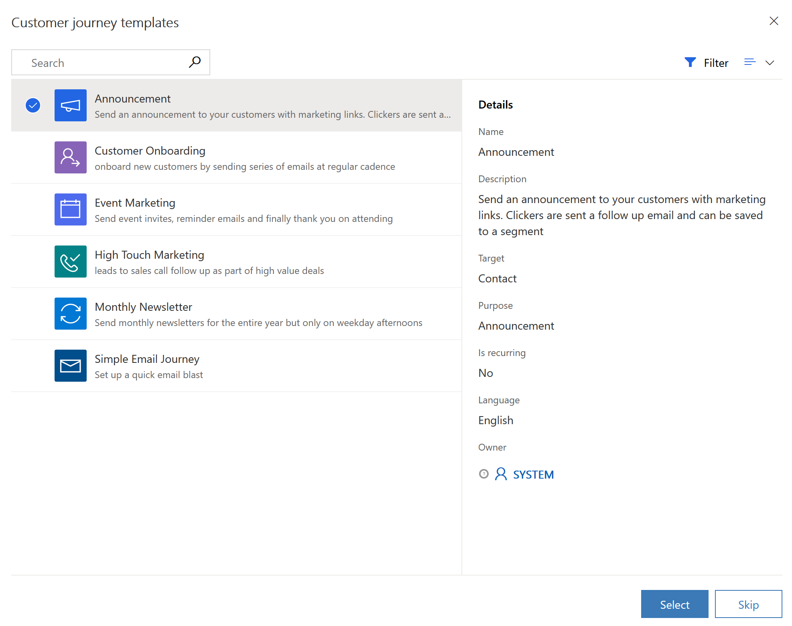
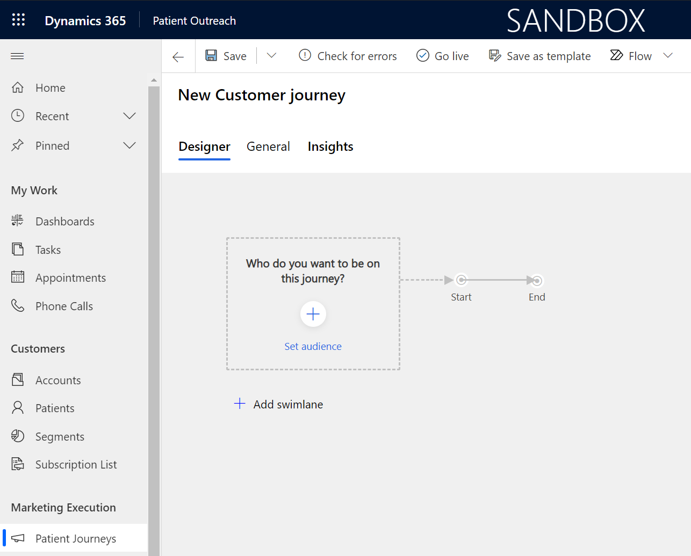
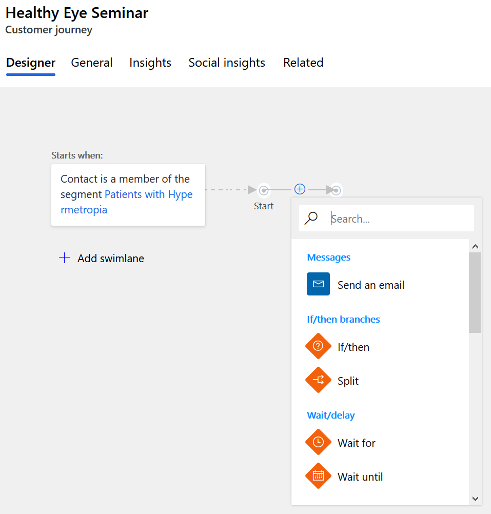
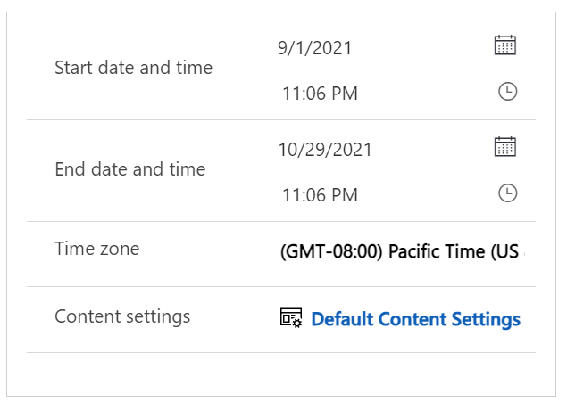
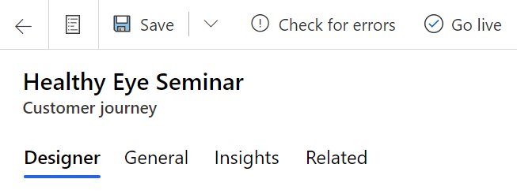

In this exercise, you will create a Patient Journey for the patient segment that you created in the first exercise. A **Patient Journey** can expand your organization's patient outreach marketing capabilities by helping healthcare organizations guide the members of a selected segment through the communication process. It does this by using automated messaging, activity generation, interactive decision points, and more.

Here is an example of a configured **Patient Journey**, which focuses on the Patient Activation Measure segment group and sends them a marketing email after a 3-month waiting period.

> [!div class="mx-imgBorder"]
> 

1.  In the Patient Outreach app in [https://make.powerapps.com](https://make.powerapps.com), click **Customer journeys** under Marketing execution on the Site map.

	> [!div class="mx-imgBorder"]
	> 

1.  Click **New** to create a new Patient Journey.

	> [!div class="mx-imgBorder"]
	> 

1.  When prompted to choose a Customer journey template option, click **Skip** as we will create our own customer journey.

	> [!div class="mx-imgBorder"]
	> 

1.  In the Designer view under "Who do you want to be on this journey", select the plus sign to **Set audience.**

	> [!div class="mx-imgBorder"]
	> 

1.  In the Audience panel that shows on the right, **search** for the "Patients with Hypermetropia" segment that you created in the previous task.

	> [!div class="mx-imgBorder"]
	> 

1.  Select "Patients with Hypermetropia" for the source segment.

	> [!div class="mx-imgBorder"]
	> 

1.  Click the **General** view and rename the record to "Healthy Eye Seminar". Click **Save**.

	> [!div class="mx-imgBorder"]
	> 

1.  Go back to the **Designer** view. On the canvas between the gray arrows after the starting box, select **+** that appears when you scroll over it.

	> [!div class="mx-imgBorder"]
	> 

1.  Select **Send an email** from the contextual menu.

	> [!div class="mx-imgBorder"]
	> 

1. In the panel on the right for the Email field, select the marketing email **Email Invitation - Healthy Eye Seminar** that you created in the previous exercise.

	> [!div class="mx-imgBorder"]
	> 

	> [!div class="mx-imgBorder"]
	> 

1. Click **Save.**

	> [!div class="mx-imgBorder"]
	> 

1. Switch to **General** view and configure the run schedule for your customer journey. Enter a **Start and End** date and time that makes sense for your event. If you want to see insights for the journey, choose an upcoming Start time on today's date. Remember the dates you enter for the next exercise.

	> [!div class="mx-imgBorder"]
	> 

1. Click **Save**.

1. Your journey is now ready to go. To start the journey, navigate back to the Designer view and publish it by selecting **Go live** on the command bar.

	> [!div class="mx-imgBorder"]
	> 

1. Dynamics 365 Marketing copies the journey to its email marketing service, which executes the journey by processing contacts, performing actions, and collecting results during the time it is set to run. Watch the journey's **Status Reason** as it sequences through **Going Live** to **Live**.

	> [!div class="mx-imgBorder"]
	> 

1. Once your patient journey runs, you will be able to gather **key metrics and insights** from the record. When this information is available depends on the date and time, you chose for the start of the customer journey. You may come back to see the results later if they aren't yet available.

**Congratulations**! You have created a patient journey by utilizing the patient segment and marketing email that you created in the previous exercise

