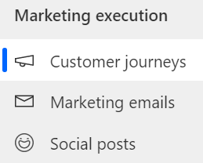
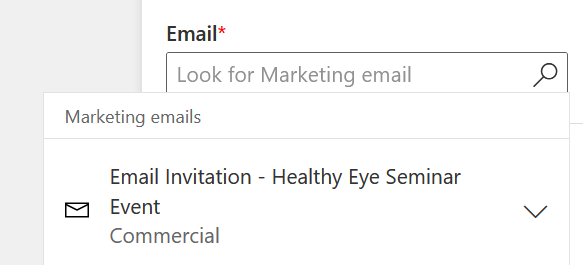
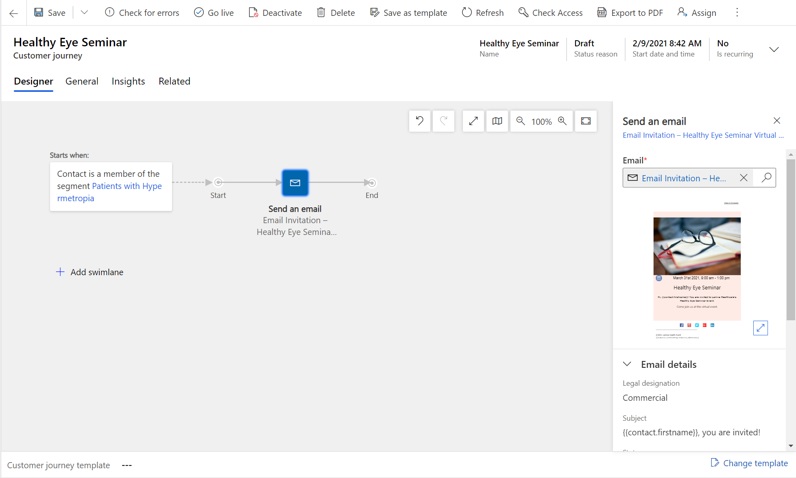
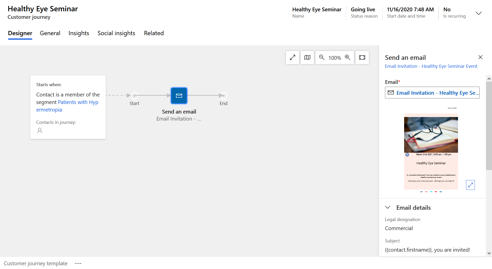

In this exercise, you will create a patient journey for the patient segment that you created in the first exercise. A patient journey can expand your organization's patient outreach marketing capabilities by helping healthcare organizations guide the members of a selected segment through the communication process. It completes this action by using automated messaging, activity generation, interactive decision points, and more.

The following screenshot shows an example of a configured patient journey that focuses on the Patient Activation Measure segment group and sends them a marketing email after a three-month waiting period.

> [!div class="mx-imgBorder"]
> 

Now let’s make our own patient journey for patients with hypermetropia.

1. In the Patient Outreach app in [https://make.powerapps.com](https://make.powerapps.com/?azure-portal=true), select **Patient journeys** under **Marketing execution** on the site map.

    > [!div class="mx-imgBorder"]
    > 

1. Select **+ New** to create a new patient journey.

    > [!div class="mx-imgBorder"]
    > 

1. When prompted to choose a customer journey template option, select **Skip** because you will create your own customer journey.

    > [!div class="mx-imgBorder"]
    > 

1. In the **Designer** view, under the "Who do you want to be on this journey" area, select the plus sign (**+**) to **Set audience**.

    > [!div class="mx-imgBorder"]
    > 

1. In the **Audience** panel that appears, search for the **Patients with Hypermetropia** segment that you created in the previous task.

    > [!div class="mx-imgBorder"]
    > 

1. Select **Patients with Hypermetropia** for the source segment.

    > [!div class="mx-imgBorder"]
    > 

1. Select the **General** view and rename the record to **Healthy Eye Seminar**. Select **Save**.

    > [!div class="mx-imgBorder"]
    > 

1. Return to the **Designer** view. On the canvas between the gray arrows, after the starting box, select the plus icon (**+**) that appears when you scroll over it.

    > [!div class="mx-imgBorder"]
    > 

1. Select **Send an email** from the contextual menu.

    > [!div class="mx-imgBorder"]
    > 

1. In the right panel, in the **Email** field, select the **Email Invitation - Healthy Eye Seminar** marketing email that you created in the previous exercise.

    > [!div class="mx-imgBorder"]
    > 

    > [!div class="mx-imgBorder"]
    > 

1. Select **Save**.

    > [!div class="mx-imgBorder"]
    > 

1. Switch to the **General** view and configure the run schedule for your customer journey. Enter a **Start date and time** and **End date and time** that makes sense for your event. If you want to view insights for the journey, choose an upcoming start time on today's date. Remember the dates that you enter for the next exercise.

    > [!div class="mx-imgBorder"]
    > 

1. Select **Save**.

1. Your journey is now ready to go live. To start the journey, return to the **Designer** view and publish it by selecting **Go live** on the command bar.

    > [!div class="mx-imgBorder"]
    > 

1. Dynamics 365 Marketing copies the journey to its email marketing service, which will start the journey by processing contacts, performing actions, and collecting results during the time that it is set to run. Watch the journey's **Status reason** as it sequences through **Going live** to **Live**.

    > [!div class="mx-imgBorder"]
    > 

1. After your patient journey has started, you will be able to gather key metrics and insights from the record. This information will become available at a time that is based on the date and time that you chose for the start of the customer journey. You can return to view the results later if they aren't yet available.

Congratulations, you have created a patient journey which will send the invitation email to the Healthy Eye Seminar to members of the Patients with Hypermetropia segment.
