The Registration and booking portal is deployed as part of the MVM deployment, but there are some post-deployment steps that you need to do before using the portal. This exercise details those post-deployment steps.

## Task 1: Update Bing API key and map settings

The appointment scheduling portal lets you search for appointment locations using Bing maps. Update the portal settings to use your Bing map keys so that users can use this feature in Registration and booking portal. You can also update the default latitude and longitude settings (currently set to the Seattle region) to ensure that the default region of the map is shown appropriately when the maps are displayed for the first time to the users.

In this task, you'll learn how to update the Bing API key and other default map settings.

1. Create a [Bing Maps account](/bingmaps/getting-started/bing-maps-dev-center-help/creating-a-bing-maps-account/?azure-portal=true) and [generate an API key](/bingmaps/getting-started/bing-maps-dev-center-help/getting-a-bing-maps-key/?azure-portal=true).

   > [!Note]
   > If you are in an official training course, then this step is just informational, and no action is required from you because the Bing Map account would have already been set up and the API key would have been provided to you by your instructor.

1. Navigate to [Power Apps](https://make.powerapps.com/?azure-portal=true).

1. Select **Apps** on the left navigation bar and then you can view the list of solutions deployed in the environment.

    > [!div class="mx-imgBorder"]
    > 

1. Find the **Portal Management** App and select it to open it. This app consists of all the Portal settings and its metadata.

    > [!div class="mx-imgBorder"]
    > 

1. In the left pane, select **Site Settings.**

    > [!div class="mx-imgBorder"]
    > [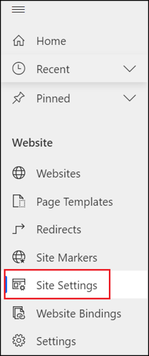](../media/3-3-site-settings.png#lightbox)

1. In the **Name** column, search for names that begin with "Vaccination Management/Map".

    > [!div class="mx-imgBorder"]
    > 

1. Select each of the following records and select edit to update the values as per the below instructions.

   - **Vaccination Management/Map/Credentials**: Set the Bing API key provided by your lab instructor.

   - **Vaccination Management/Map/DefaultLatitude**: Set the default latitude that the map needs to display on load. For Ex: 47.6740 for Redmond.

   - **Vaccination Management/Map/DefaultLongitude**: Set the default longitude that the map needs to display on load. For Ex: -122.1215 for Redmond.

   - **Vaccination Management/Map/DefaultZoom**: Set the default zoom level to your preferred resolution when the map is loaded. More details on the pixel and zoom level mapping can be found in [Map Control: Zoom Levels -> Resolution | Maps Blog (bing.com)](https://blogs.bing.com/maps/2006/02/25/map-control-zoom-levels-gt-resolution/?azure-portal=true).

    > [!div class="mx-imgBorder"]
    > 

## Task 2: Update portal binding

By default, the portal points to the Starter Portal configuration, which is the default template for a blank portal. After deploying the solution, you must change the binding of the portal to point to the new portal configuration instead of the starter portal.

In this task, you'll learn how to update the portal binding after the solution deployment.

1. Navigate to [Power Apps](https://make.powerapps.com/?azure-portal=true).

1. Select **Apps** on the left navigation bar and then you can view the list of solutions deployed in the environment.

1. Find the **Registration and booking portal**. This is the portal used for Registration and booking appointments.

   > [!Note]
   > The portal name might be different in your environment but there is only one Portal App and it is the one that needs to be selected.

    > [!div class="mx-imgBorder"]
    > [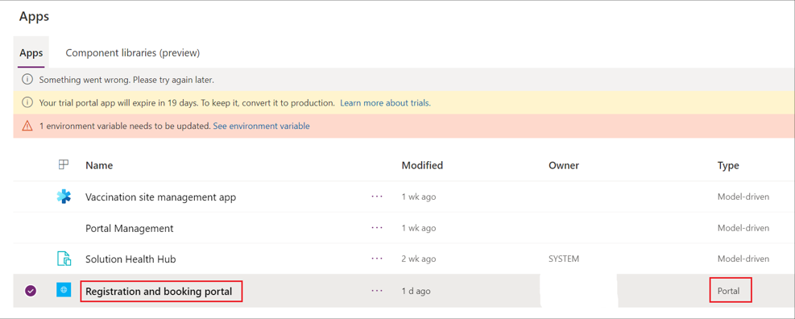](../media/3-6-registration-book-portal.png#lightbox)

1. Select **More Commands (...)**, then **Browse**. This opens the **Registration and booking** **portal**. You may also select the app name or select Browse on the top command bar to open it.

    > [!div class="mx-imgBorder"]
    > 

1. You should see the Starter Portal template in the Registration and booking portal.

    > [!div class="mx-imgBorder"]
    > [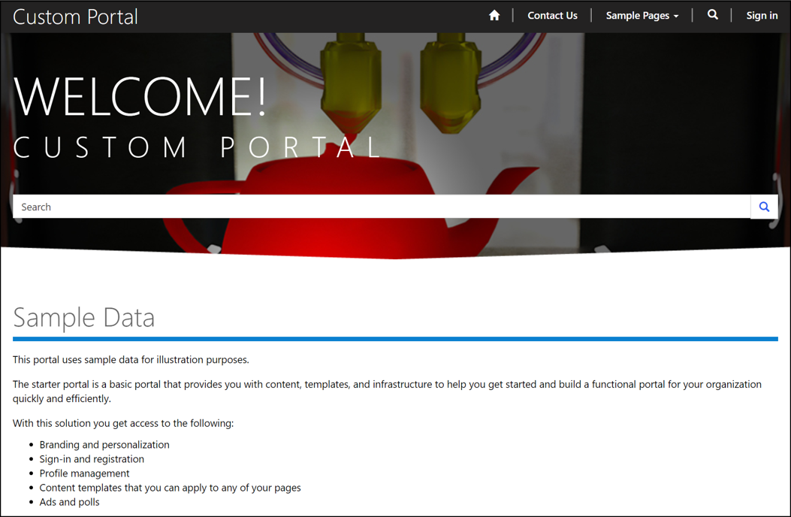](../media/3-8-custom-portal.png#lightbox)

1. Close the Registration and booking portal website. Now you'll configure it to the Vaccination Management Registration Portal template.

1. Return to the Power Apps screen in the Apps section.

1. Select the **Registration and booking portal** app if it isn't already selected.

1. Select **More Commands (...)** > **Settings**. This will pop out the **Portal settings** panel on the right.

    > [!div class="mx-imgBorder"]
    > [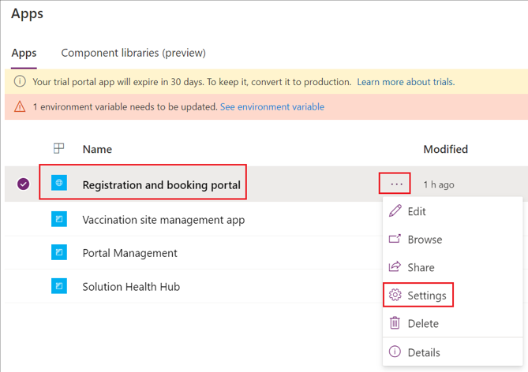](../media/3-9-settings.png#lightbox)

1. In the right pane, select **Administration** to open Power Apps Portals Admin Center in a new tab page.

    > [!div class="mx-imgBorder"]
    > [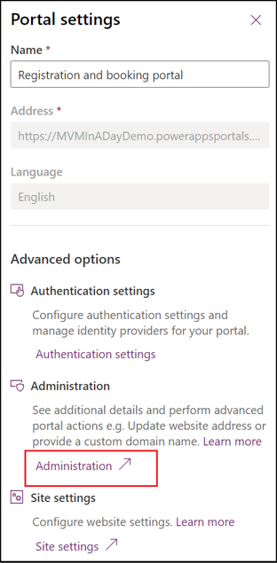](../media/3-10-administration.png#lightbox)

1. This will open a new tab, the **Power Apps Portals admin center**, where you can do portal administrative tasks.

1. The page should open in the **Portal Details** tab of the Power Apps Portals admin center.

1. Scroll down to **Update Portal Binding**, open the **Select Website Record** drop-down list, and change the current value (**Starter Portal**) to **Vaccination Management Registration Portal** and then select the **Update** button.

    This binds the **Vaccination Management Registration Portal** template to this portal URL and shows the proper user interface to the user.

    > [!div class="mx-imgBorder"]
    > [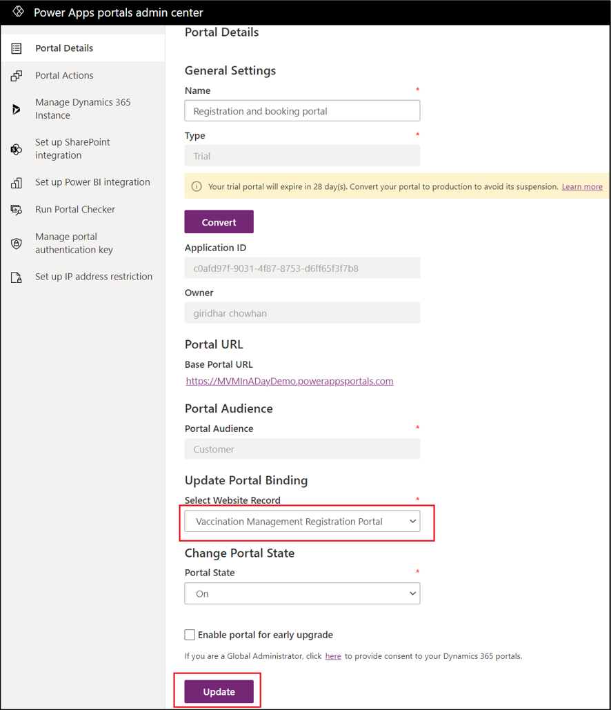](../media/3-11-portal-admin-center.png#lightbox)

1. In left pane, select **Portal Actions** and then select **Restart** to restart the portal for the changes to take effect.

    > [!div class="mx-imgBorder"]
    > [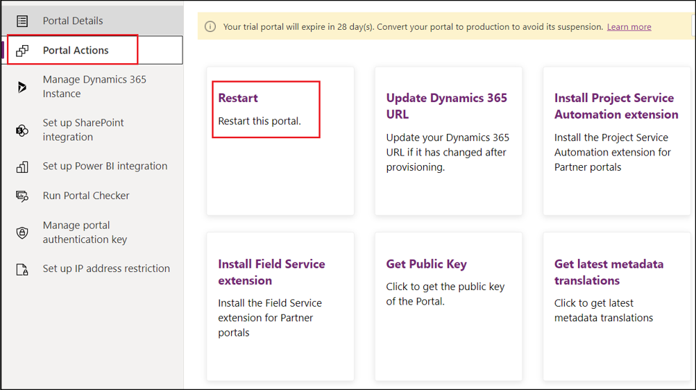](../media/3-12-restart.png#lightbox)

1. When prompted, confirm the **Restart** for the portal.

    > [!div class="mx-imgBorder"]
    > [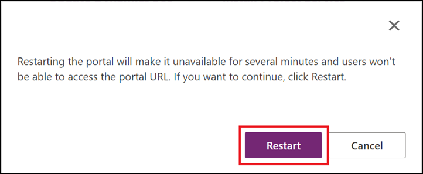](../media/3-13-restart.png#lightbox)

1. Wait 1-5 minutes for the portal to restart. (Feel free to refill your water or stretch those legs!)

    > [!tip]
    > You may also jump ahead to the next exercise, as we will open the portal later in the next exercise.

1. Navigate back to the Registration and booking portal.

    1. Navigate to [Power Apps](https://make.powerapps.com/?azure-portal=true).

    1. Select **Apps** , then the **Registration and booking Portal** app.

    1. Open the app by selecting the app name or selecting Browse.

    > [!div class="mx-imgBorder"]
    > 

1. If you see the following error, the portal is still restarting.

    > [!div class="mx-imgBorder"]
    > [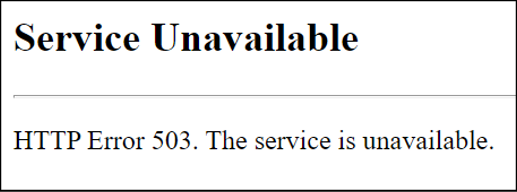](../media/3-14-unavailable.png#lightbox)

1. Once the Portal is opened and running properly, it should look like the following image. Also, **copy and store the portal URL** (without 'https://') as you'll be using it to update the environment variable in the next exercise.

    > [!div class="mx-imgBorder"]
    > 

## Task 3: Enable the virtual waiting room

Virtual waiting room feature in MVM Registration and booking portal:

- Allows you to streamline demand during burst load situations.

- Takes out the unpredictability element.

- Provides a predictable user experience which users expect from a consumer grade site.

Enabling this feature will limit the number of people allowed on the site through a virtual queue mechanism. When the queue is full, new users are placed in waiting room and provided with a default page that is configurable. Every minute more users are automatically allowed into the site depending on the queue length configuration.

As part of this task, you'll learn the steps to enable virtual waiting room and its parameters. In an actual customer implementation, contact Product Group before setting up any of these parameters so that based on the expected volumes, if necessary, product group can scale the portal and provide the expected parameter values.

1. Navigate to [Power Apps](https://make.powerapps.com/?azure-portal=true).

1. Select **Apps** on the left navigation bar and then you can view the list of solutions deployed in the environment.

1. Find the **Portal Management** App and select it to open it. This app consists of all the Portal settings and its metadata.

    > [!div class="mx-imgBorder"]
    > 

1. In the left pane, select **Settings.**

    > [!div class="mx-imgBorder"]
    > [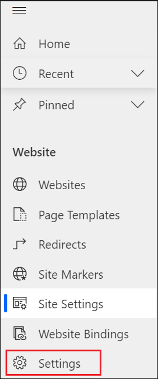](../media/3-16-settings.png#lightbox)

1. Select each of the following records and select edit to update the values as per the below instructions.

   - On the record ending with **EnableThrottling:**

     To enable the virtual waiting room feature, set the value to **true.**

   - On the record ending with **ThrottlingCounterThreshold:**

     The value in this field indicates the number of users to be allowed within a specified time. In this task, to experience the waiting room feature, set the value to **1** which means only one session is allowed per minute and other sessions are expected to be in the virtual waiting room. However, in an actual customer implementation, contact Product Group before setting up this parameter so that based on the expected volumes, if necessary, product group can scale the portal and suggest the expected value.

   - On the record ending with **ThrottlingTimeout:**

     The value in this field indicates the time limit within which the maximum number of users are to be allowed. In this task, to experience the waiting room feature, set the value to **00:01:00** which means that one session is allowed per minute.

    > [!div class="mx-imgBorder"]
    > 

1. Navigate back to the Registration and booking portal.

    1. Navigate to [Power Apps](https://make.powerapps.com/?azure-portal=true).

    1. Select **Apps**, then **Registration and booking portal** app.

    1. Open the app by selecting the app name or selecting Browse.

    > [!div class="mx-imgBorder"]
    > 

1. It should look like the following image.

    > [!div class="mx-imgBorder"]
    > 

1. Immediately copy and paste the portal URL into a different browser and you would see the virtual waiting room page. If you're a bit late, then try to open the portal in different tab pages and you'll notice the difference.

    > [!div class="mx-imgBorder"]
    > [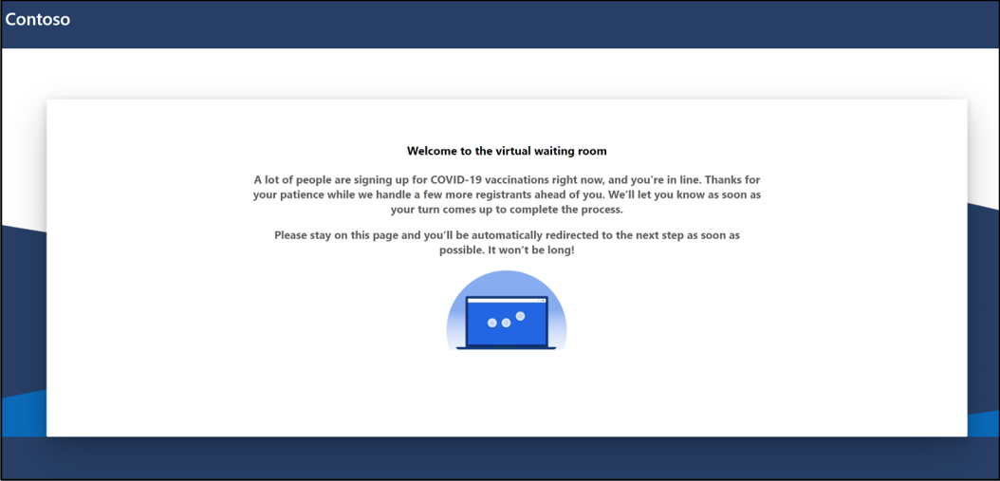](../media/3-18-wait.png#lightbox)

1. Wait for a minute on the same page and you'll see the actual homepage of the registration portal.

    > [!div class="mx-imgBorder"]
    > 

1. Navigate back to the Portal Management Settings page.

    1. Find the **Portal Management** App and select it to open it. This app consists of all the Portal settings and its metadata.

        > [!div class="mx-imgBorder"]
        > 

    1. In the left pane, select **Settings**.

    1. Disable the virtual waiting room feature by updating the value to **false** on the record ending with **EnableThrottling**.

**Congratulations!** You completed the post deployment steps to configure the Registration and booking Portal. After updating the bindings and restarting the portal, the website should now show as Vaccination Management Registration Portal template rather than Starter Portal. You've also learned the steps to enable the virtual waiting room feature.
