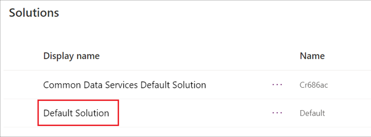
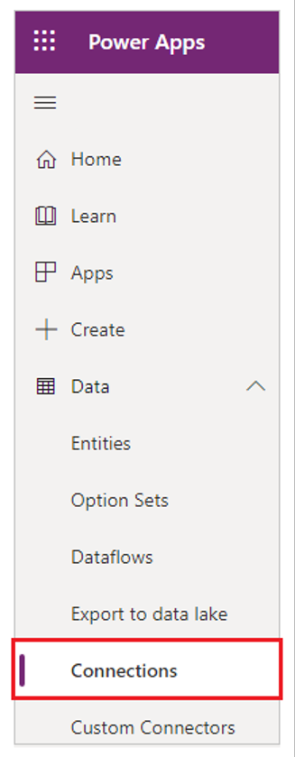
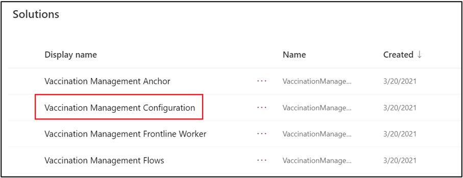
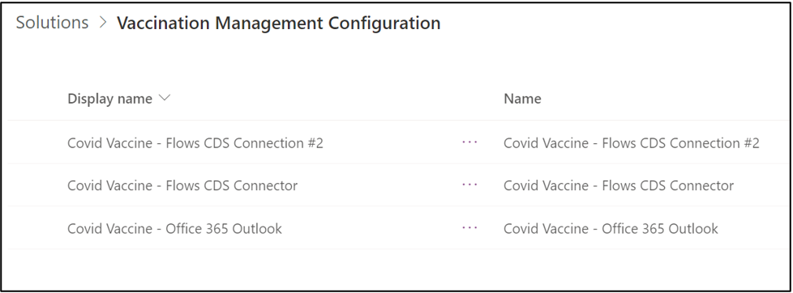
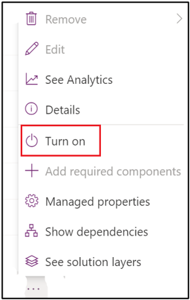
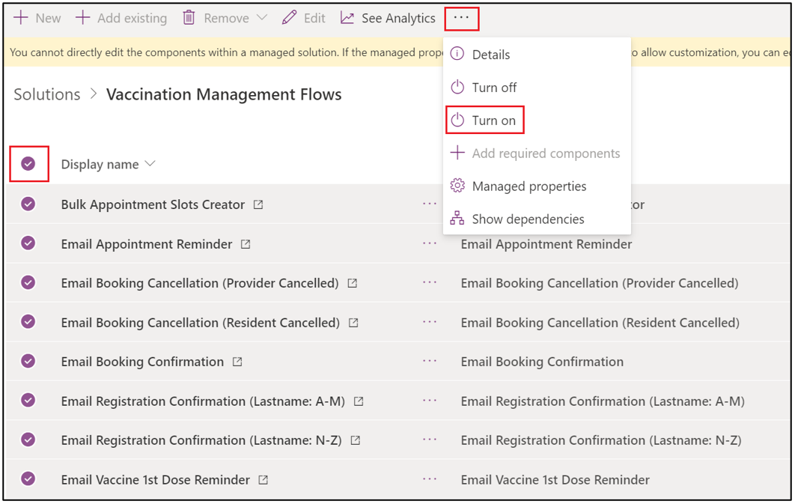

Power Automate flows are used in Microsoft Vaccination Management to automate multiple business processes such as sending registration confirmation emails, appointment reminder emails, vaccine dose reminder emails, and creating bulk appointment slots.

In this exercise, you will play the role of a system administrator, where you will explore the included Microsoft Vaccination Management flows, enable the Power Automate flows, and customize the flows.

## Task 1: Update the environment variable

Some Power Automate flows handle the sending of emails. These emails are based on a defined template that is filled with dynamic data. In the emails, such as appointment booking/cancellations, the URL of the **Registration and booking portal** is often mentioned.

In this task, you'll change that URL in the **RegistrationPortalUrl** environment variable from the default to the one that is specific to your **Registration and booking portal**. This action will ensure that all automatically generated emails will have the correct URL to your portal without modifying the individual flows.

For more information, see [Environment Variables](/power-platform-release-plan/2019wave2/microsoft-powerapps/new-solution-components-get-full-support/?azure-portal=true).

1. Go to [Power Apps](https://make.powerapps.com/?azure-portal=true).

1. Select **Apps** on the left navigation pane and then view the list of apps that are deployed in the environment.

    > [!div class="mx-imgBorder"]
    > 

1. Select **See environment variable**.

    > [!div class="mx-imgBorder"]
    > 

1. A pop-up screen will appear on the right to provide the **RegistrationPortalUrl** environment variable. Paste the portal URL value that you copied in the last step of the previous exercise; however, make sure that you do not include the **https://** part in the value.

    > [!div class="mx-imgBorder"]
    > 

1. Select the **Save and Close** button.

1. The **1 environment variable needs to be updated** warning message will disappear. If you need to update it again (for example, if you updated the wrong value in previous steps), follow the subsequent steps. Otherwise, you can skip the following steps and proceed to the next task.

    1. In the left pane, select **Solutions**.

        > [!div class="mx-imgBorder"]
        > 

    1. In the upper-right corner, search for and select the term **Default Solution**.

        > [!div class="mx-imgBorder"]
        > 

       All environment variables will display.

        > [!div class="mx-imgBorder"]
        > 

    1. In the upper-right corner, search for the **RegistrationPortalUrl** environment variable.

        > [!div class="mx-imgBorder"]
        > 

    1. Select the **RegistrationPortalUrl** environment variable to update the URL.

        > [!div class="mx-imgBorder"]
        > 

    1. On the right pane, update the **Current Value** field with the correct portal URL value (without **https://**) and then select the **Save** button.

        > [!div class="mx-imgBorder"]
        > 

## Task 2: Create new Power Automate connections

A connection is a proxy or a wrapper around an API that allows the underlying service to talk to Microsoft Power Automate, Microsoft Power Apps, and Microsoft Azure Logic Apps. A connection provides a way for users to connect their accounts and use a set of prebuilt actions and triggers to build their apps and workflows.

In this task, you'll learn how to add the connections, such as **Office 365 Outlook** and **Microsoft Dataverse**, which will be used in later tasks to associate it with connection references.

For more information, see [Power Automate Connections](/power-automate/add-manage-connections/?azure-portal=true).

1. In the left navigation pane, expand **Data** and select **Connections**.

    > [!div class="mx-imgBorder"]
    > 

1. To add an **Office 365 Outlook** connection, select **+ New connection**.

    > [!div class="mx-imgBorder"]
    > 

1. Search for **Office 365 Outlook** in the search bar, located in the upper-right corner, and then select the plus (**+**) button to add the connection.

    > [!div class="mx-imgBorder"]
    > 

1. Select the **Create** button on the dialog box.

    > [!div class="mx-imgBorder"]
    > 

1. This connector will prompt for credentials. These account/connection details will be used by the **Office 365 Outlook** connector in the **MVM Power Automate** email-related flows to send emails. Therefore, this account will be considered the **From** email address in all outgoing emails that use this connector.

    Provide the **no-reply** email account credentials that were provided by your lab instructor.

1. To add a **Microsoft Dataverse** connection, select **+ New connection** again.

1. Search for **Microsoft Dataverse** in the search bar, located in the upper-right corner, and then select the plus (**+**) button to add the connection.

    > [!div class="mx-imgBorder"]
    > 

1. Select the **Create** button on the dialog box.

    > [!div class="mx-imgBorder"]
    > 

1. This connector will prompt for credentials. These account/connection details will be used by the **Microsoft Dataverse** connector in the **MVM Power Automate** flows to perform CRUD operations on this environment's database.

    For this task, you can use your **MVM In A Day** user account (credentials that you're using to sign in to [Power Apps](https://make.powerapps.com/?azure-portal=true)) to establish the connection; however, in a customer's environment, make sure that you use a dedicated service account instead of a user's account.

## Task 3: Link connections to Microsoft Vaccination Management connection references

A connection reference is a solution component that contains information about a connector. The operations within a Power Automate flow bind to a connection reference. You can update the connection references that are used by Microsoft Vaccination Management to point to the connections that are created as part of the earlier task.

For more information, see [Connection references](/powerapps/maker/data-platform/create-connection-reference/?azure-portal=true) and [Connectors](/connectors/?azure-portal=true).

In this task, you will be using an unmanaged solution, **Vaccination Management Configuration**, and then you will update the connection on the connection references with the new connections that were created as part of the earlier task.

1. In the left pane, select **Solutions** and then view the list of solutions that are deployed in the environment.

    > [!div class="mx-imgBorder"]
    > 

1. On the **Solutions** page, select the **Vaccination Management Configuration** solution.

    > [!div class="mx-imgBorder"]
    > 

1. After opening the **Vaccination Management Configuration** solution, you can view the connection references that are used in the Microsoft Vaccination Management flow. This unmanaged solution allows you to link the connection references to the appropriate connections that were created as part of a previous task.

    > [!div class="mx-imgBorder"]
    > 

1. On the **Covid Vaccine - Office 365 Outlook** connection, select the **More Commands** ellipsis (**...**) and then select **Edit**.

    > [!div class="mx-imgBorder"]
    > 

1. On the **Edit Connection Reference** pane, in the **Connection** field, select an existing Office 365 Outlook connection from the list that was created as part of Task 2.

    > [!div class="mx-imgBorder"]
    > 

1. Repeat steps 3 and 4 to establish connections on the connection references for **Covid Vaccine - Flows CDS Connector** and **Covid Vaccine - Flows CDS Connection #2**.

## Task 4: Explore and enable Power Automate flows in Microsoft Vaccination Management

In this task, you'll explore and turn on the included Power Automate flows in Microsoft Vaccination Management.

1. In the left pane, select **Solutions** and then view the list of solutions that are deployed in the environment.

    > [!div class="mx-imgBorder"]
    > 

1. On the **Solutions** page, select **Vaccination Management Flows**. This solution consists of all Power Automate flows and their related components that shipped as part of Microsoft Vaccination Management.

    > [!div class="mx-imgBorder"]
    > 

    You can now view the list of included Power Automate flows in Microsoft Vaccination Management that can help you accomplish multiple business requirements.

    > [!div class="mx-imgBorder"]
    > 

1. Change the search category from **All** to **Cloud flow**. This change will apply the filter to list only the cloud flows.

    > [!div class="mx-imgBorder"]
    > 

1. Make sure that the **Status** shows as **On** for each of the following base flows because they are used as child flows in other flows.

    - **Send Email (Phase Opening)** - This flow is used as a child flow by the **Process Phase Opening** flow.

    - **Send Email (Registration)** - This flow is used by the **Email Registration Confirmation** flows to send emails to the residents.

    - **Send Email with Attachment (Base)** - This flow is used as a child flow by the **Email VIS Document** flow to send a vaccine information statement as an attachment after the resident has received the vaccine.

    - **Send Email (Generic)** - This flow is used as a child flow by all other remaining flows that send emails.

1. If any of the base flows aren't turned on, select the **More Commands** ellipsis (**...**) and then select **Turn on**.

    > [!div class="mx-imgBorder"]
    > 

1. Based on the customer requirements, you can turn on the required flows in the remaining list of flows. 

    For more information, see [MVM Flows Definitions | Microsoft Docs](/dynamics365/industry/vaccination-management/extend/?azure-portal=true#microsoft-vaccination-management-flows)

1. Change the search category from **All** to **Cloud flow**. This change will apply the filter to list only the cloud flows.

    > [!div class="mx-imgBorder"]
    > 

1. For this task, you can turn on all flows by selecting all flows, selecting the **More Commands** ellipsis (**...**), and then selecting **Turn on** in the command bar because you'll be using them in the later sets of exercises. If you see errors, turn on each flow.

    > [!div class="mx-imgBorder"]
    > 

## Task 5: Create a solution

In this task, you will learn how to create a solution to group all changes that you will make in the subsequent tasks and exercises. Solutions are used to transport apps and components from one environment to another or to apply customizations to existing apps. A solution can contain one or more apps and other components such as site maps, tables, processes, web resources, choices, flows, and more.

Solutions are the mechanisms for implementing application lifecycle management (ALM) in Power Apps and other Microsoft Power Platform products, such as Power Automate. For more information, see [Overview of ALM with Microsoft Power Platform](/power-platform/alm/overview-alm/?azure-portal=true).

For more information, see [Solutions](/powerapps/developer/data-platform/introduction-solutions/?azure-portal=true).

1. In the left pane, select **Solutions** and then view the list of solutions that are deployed in the environment.

    > [!div class="mx-imgBorder"]
    > 

1. On the **Solutions** page, select **New solution** in the command bar.

1. In the right pane, select the **Publisher** dropdown list and then select **+ Publisher** to create a new published record on a new tab page in your browser.

    The solution publisher indicates who developed the app. For this reason, you should create a solution publisher that is meaningful. For more information, see [Solution publisher](/power-platform/alm/solution-concepts-alm#solution-publisher/?azure-portal=true). After you have set up a publisher, it can be linked to every (new) solution that is created.

    > [!div class="mx-imgBorder"]
    > 

1. In the **New Publisher** form, enter the following required and optional information:

    - **Display Name** - Enter the display name for the publisher, for example, **MVM In A Day**.

    - **Name** - Enter the unique name for the publisher. This name is generated by using the value that you enter in the **Display Name** field. You can edit this field before you save the publisher record. For example, you can edit the **Name** field to **mvminaday**.

    - **Prefix** - Enter the publisher prefix that you want, such as **mvmiad**.

    - **Option Value Prefix** - This column generates a number based on the publisher prefix. This number is used when you add options to choices and it provides an indicator of which solution was used to add the option.

    - **Contact Details** - Optionally, you can add contact and address information.

1. Select **Save and Close** in the upper-left corner.

    > [!div class="mx-imgBorder"]
    > 

1. On the Power Apps screen, in the right pane, enter the following required and optional values to create a solution:

    - **Display name** - The name will be displayed in the list of solutions, for example, **MVM In A Day**.

    - **Name** - The unique name of the solution. This name is generated by using the value that you enter in the **Display Name** column. You can edit this value before you save the solution, but after you save the solution, you can't change it. For example, you can edit the value to **MVMInADay**.

    - **Publisher** - We recommended that you create a publisher for your organization to use consistently across your environments where you'll use the solution. For example, **MVM In A Day**.

    - **Version** - Enter a number for the version of your solution. This value is important if you export your solution. The version number will be included in the file name when you export the solution, for example, **1.0.0.0**.

    > [!div class="mx-imgBorder"]
    > 

1. Select **Create**.
