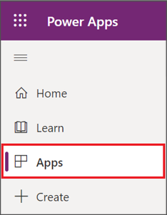
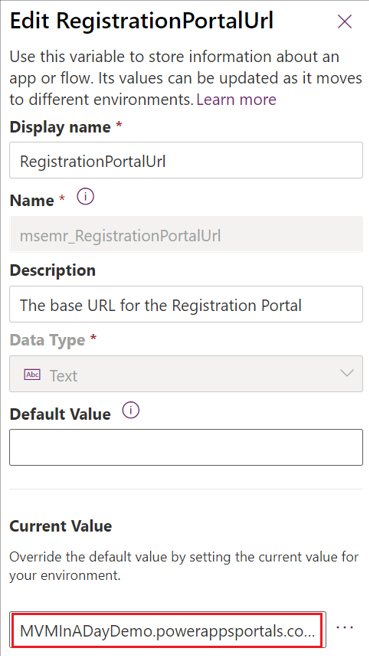
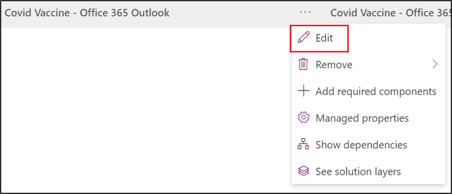
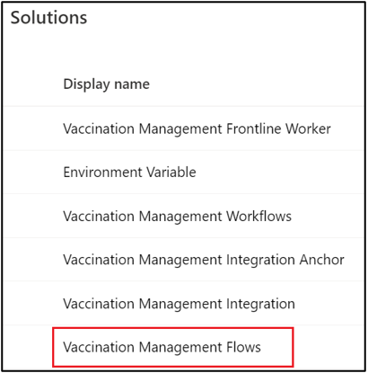
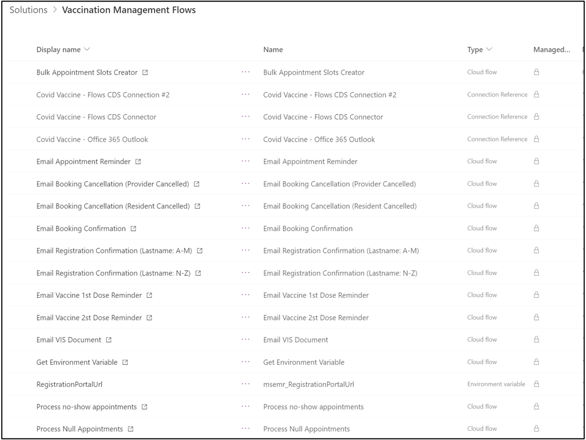

Power Automate flows are used in Microsoft Vaccination Management (MVM) to automate multiple business processes such as sending registration confirmation emails, appointment reminder emails, vaccine dose reminder emails, and bulk appointment slots creation.

In this exercise, you play the role of a System Administrator and explore the included MVM flows, enable the power automate flows, and customize the flows.

## Task 1: Update environment variable

Some of the Power Automate Flows handle sending of emails. These emails are based on a defined template that is filled with dynamic data. In the emails such as Appointment booking/cancellations, the URL of the Registration and booking portal is often mentioned.

In this task, you'll change that URL in the environment variable **RegistrationPortalURL** from the default one to the one that is specific to your Registration and booking Portal. This will ensure that all automatically generated emails will have the right URL to your Portal without modifying the individual flows.

See the following documentation to learn more about the [Environment Variables](/power-platform-release-plan/2019wave2/microsoft-powerapps/new-solution-components-get-full-support/?azure-portal=true).

1. Navigate to [Power Apps](https://make.powerapps.com/?azure-portal=true).

1. Select **Apps** on the left navigation bar and then you can view the list of Apps deployed in the environment.

    > [!div class="mx-imgBorder"]
    > 

1. Select **See environment variable.**

    > [!div class="mx-imgBorder"]
    > 

1. A pop-up screen will appear on the right to provide the environment variable **RegistrationPortalUrl**. Paste the portal URL value copied in the last step of previous exercise however make sure not to include in the value.

    > [!div class="mx-imgBorder"]
    > 

1. Select the button **Save and close.**

1. Once you've done this, the "1 environment variable needs to be updated" warning message disappears. If you need to update it again (if you updated a wrong value in earlier steps), follow the below steps. Otherwise, you can skip the below steps and proceed to the next task.

    1. In the left pane, select **Solutions**.

        > [!div class="mx-imgBorder"]
        > 

    1. On the top-right corner, search for the term **Default Solution.**

        > [!div class="mx-imgBorder"]
        > 

    1. Select **Default Solution** and it will display all the environment variables.

        > [!div class="mx-imgBorder"]
        > 

    1. On the top-right corner, search for the environment variable **RegistrationPortalURL**

        > [!div class="mx-imgBorder"]
        > 

    1. Select the environment variable **RegistrationPortalUrl** to update the URL.

        > [!div class="mx-imgBorder"]
        > 

    1. On the right pane, update the value in the field **Current Value** with the correct portal URL value (without 'https://') and then select **Save** button.

        > [!div class="mx-imgBorder"]
        > 

## Task 2: Create new Power Automate connections

A connection is a proxy or a wrapper around an API that allows the underlying service to talk to Microsoft Power Automate, Microsoft Power Apps, and Azure Logic Apps. It provides a way for users to connect their accounts and use a set of pre-built actions and triggers to build their apps and workflows.

In this task, you'll learn to add the connections such as **Office 365 Outlook** and **Common Data Service (current environment)** which will be used in later tasks to associate it with Connection references.

See the following documentation to learn more about the [Power Automate Connections](/power-automate/add-manage-connections/?azure-portal=true).

1. In the left navigation, expand **Data** and select **Connections**.

    > [!div class="mx-imgBorder"]
    > 

1. To add an **Office 365 Outlook connection**, select + **New connection**.

    > [!div class="mx-imgBorder"]
    > 

1. Search for **Office 365 Outlook** in the search bar located in the top-right edge and then select **+** to add the connection.

    > [!div class="mx-imgBorder"]
    > 

1. Select the **Create** button on the dialog box.

    > [!div class="mx-imgBorder"]
    > 

1. This connector will prompt for credentials. These account/connection details will be used by the **Office 365 Outlook** connector in the **MVM Power Automate** email-related flows to send emails. So this account will be considered the "From email address" in all outgoing emails that use this connector.

    Provide the **no-reply** email account credentials provided by your lab instructor.

1. To add a **Microsoft Dataverse** connection, select + **New connection** again.

1. Search for **Microsoft Dataverse** in the search bar located in the top-right edge and then select **+** to add the connection.

    > [!div class="mx-imgBorder"]
    > 

1. Select the **Create** button on the dialog box.

    > [!div class="mx-imgBorder"]
    > 

1. This connector will prompt for credentials. These account/connection details will be used by the **Microsoft Dataverse** connector in the **MVM Power Automate** flows to perform CRUD operations on this environment's database.

    For this task, you can use your **In A Day** user account (credentials that you're using to sign in to [Power Apps](https://make.powerapps.com/?azure-portal=true)) to establish the connection however in a customer's environment, make sure to use a dedicated service account instead of a user's account.

## Task 3: Link connections to MVM connection references

A connection reference is a solution component that contains information about a connector. The operations within a Power Automate flow bind to a connection reference. Update the connection references used by Microsoft Vaccination Management to point to the connections created as part of the earlier task.

See the following documentation to learn more about the [Connection references](/powerapps/maker/data-platform/create-connection-reference/?azure-portal=true) and [Connectors](/connectors/?azure-portal=true).

In this task, you will be using an unmanaged Solution **Vaccination Management Configuration** and update the connection on the connection references with the new connections that were created as part of the earlier task.

1. In the left pane, select **Solutions** and then you can view the list of solutions deployed in the environment.

    > [!div class="mx-imgBorder"]
    > 

1. On the **Solutions** page, select **Vaccination Management Configuration** solution.

    > [!div class="mx-imgBorder"]
    > 

1. Upon opening the **Vaccination Management Configuration** solution, you can view the connection references used in the MVM flow. This is an unmanaged solution that allows you to link them to the appropriate connections created as part of earlier task.

    > [!div class="mx-imgBorder"]
    > 

1. On the **Covid Vaccine - Office 365 Outlook**, select **More Commands** (...), then **Edit**.

    > [!div class="mx-imgBorder"]
    > 

1. On the **Edit Connection Reference** pane, in the **Connection field**, select an existing Office 365 Outlook connection from the list that was created as part of Task 2.

    > [!div class="mx-imgBorder"]
    > 

1. Repeat steps 3 and 4 to establish connections on the connection references for **Covid Vaccine - Flows CDS Connector** and **Covid Vaccine - Flows CDS Connection #2**.

## Task 4: Explore and enable MVM Power Automate flows

In this task, you'll explore the included MVM Power Automate Flows and turn on the MVM Power Automate Flows.

1. In the left pane, select **Solutions** and then you can view the list of solutions deployed in the environment.

    > [!div class="mx-imgBorder"]
    > 

1. On the **Solutions** page, select **Vaccination Management Flows**. This solution consists of all the Power Automate flows and its related components shipped as part of MVM.

    > [!div class="mx-imgBorder"]
    > 

    You can now view the list of included MVM power Automate flows that help in accomplishing multiple business requirements.

    > [!div class="mx-imgBorder"]
    > 

1. Change the search category from **All** to **Cloud flow**. This will apply the filter to list only the Cloud Flows.

    > [!div class="mx-imgBorder"]
    > 

1. Make sure that the **Status** on each of the below four base flows are **On** as these flows are used as child flows in other flows.

    - **Send Email (Phase Opening)** - This is used as a child flow by the **Process Phase Opening** flow.

    - **Send Email (Registration)** - This is used by the **Email Registration Confirmation** flows to send emails to the residents.

    - **Send Email with Attachment (Base)** - This is used as a child flow by the **Email VIS Document** flow to send vaccine information statement as an attachment once resident receives the vaccine.

    - **Send Email (Generic)** - This is used as a child flow by all other remaining flows that send emails.

1. If any of them aren't turned on, select **More Commands** (...), then **Turn On**.

    > [!div class="mx-imgBorder"]
    > 

1. Based on the customer requirements, you can turn on the required flows in the remaining list of flows. The definitions for each of the flows are listed in the below links:

    [MVM Flows Definitions | Microsoft Docs](/dynamics365/industry/vaccination-management/extend/?azure-portal=true#microsoft-vaccination-management-flows)

1. Change the search category from **All** to **Cloud flow**. This will apply the filter to list only the Cloud Flows.

    > [!div class="mx-imgBorder"]
    > 

1. For this task, we can turn on all the flows by selecting all flows and then select **More Commands** (...), then **Turn On** in the command bar as we'll be using them in the later sets of exercises. If you see any errors, turn on each of the flows.

    > [!div class="mx-imgBorder"]
    > 

## Task 5: Create a solution

In this task, you will learn to create a solution to group all the changes that you will be doing in the subsequent tasks and exercises. Solutions are used to transport apps and components from one environment to another or to apply a set of customizations to existing apps. A solution can contain one or more apps and other components such as site maps, tables, processes, web resources, choices, flows, and more.

Solutions are the mechanism for implementing application lifecycle management (ALM) in Power Apps and other Power Platform products, such as Power Automate. For detailed information about the solution concepts and how solutions are used for application lifecycle management, see [Overview of ALM with Microsoft Power Platform](/power-platform/alm/overview-alm/?azure-portal=true) in the Power Platform ALM guide.

See the following documentation to learn more about the [Solutions](/powerapps/developer/data-platform/introduction-solutions/?azure-portal=true).

1. In the left pane, select **Solutions** and then you can view the list of solutions deployed in the environment.

    > [!div class="mx-imgBorder"]
    > 

1. On the **Solutions** page, select **New solution** in the command bar.

1. In the right pane, select the **Publisher** drop-down list and then select **+ Publisher** to create a new Published record in a new tab page in your browser.

    The solution publisher indicates who developed the app. For this reason, you should create a solution publisher that is meaningful. For more information about the solution publisher, see [Solution publisher](/power-platform/alm/solution-concepts-alm#solution-publisher/?azure-portal=true) in the Power Platform ALM guide. Once a publisher has been set up, it can be linked to every (new) solution created.

    > [!div class="mx-imgBorder"]
    > 

1. In the **New Publisher** form, enter the required and optional information:

    - **Display Name:** Enter the display name for the publisher. For example, MVM In A Day.

    - **Name:** Enter the unique name for the publisher. This is generated using the value you enter in the Display Name. You can edit this before you save the publisher record. For example, mvminaday.

    - **Prefix:** Enter the publisher prefix you want. For example, mvmiad.

    - **Option Value Prefix**: This column generates a number based on the publisher prefix. This number is used when you add options to choices and provides an indicator of which solution was used to add the option.

    - **Contact Details:** Optionally, you can add contact and address information.

1. Select **Save and Close** on the top left.

    > [!div class="mx-imgBorder"]
    > 

1. On the Power Apps screen, In the right pane, enter the required and optional values to create a solution:

    - **Display name :** The name will be displayed in the list of solutions. For example, MVM In A Day.

    - **Name:** The unique name of the solution. This is generated using the value you enter in the Display Name column. You can edit this before you save the solution, but after you save the solution, you can't change it. For example, MVMInADay.

    - **Publisher:** We recommended creating a publisher for your organization to use consistently across your environments where you'll use the solution. For example, MVM In A Day.

    - **Version:** Enter a number for the version of your solution. This is important if you export your solution. The version number will be included in the file name when you export the solution. For example, 1.0.0.0.

    > [!div class="mx-imgBorder"]
    > 

1. Select **Create**.
