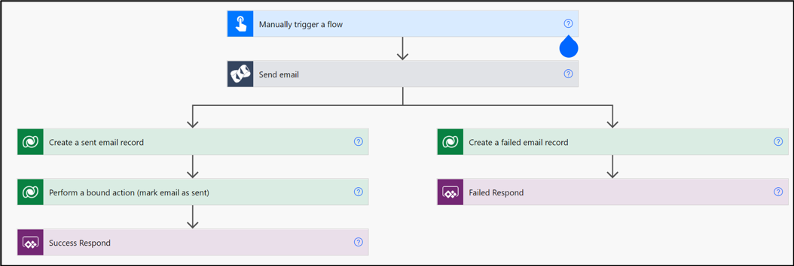
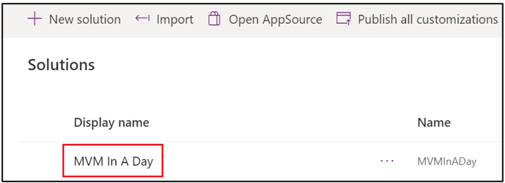
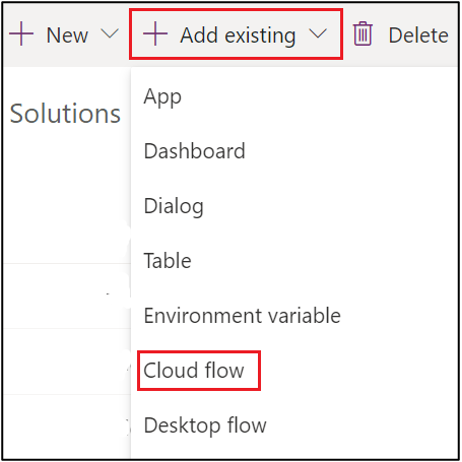
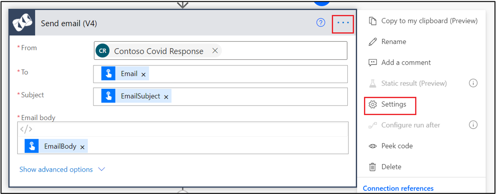
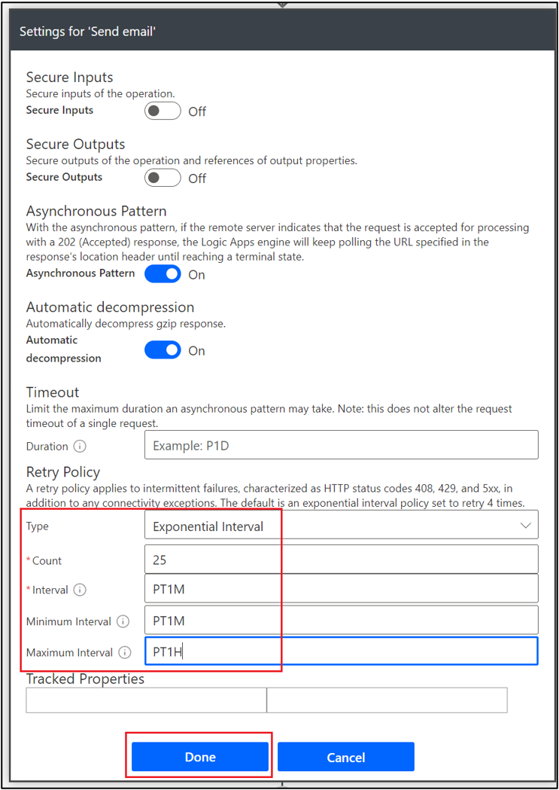
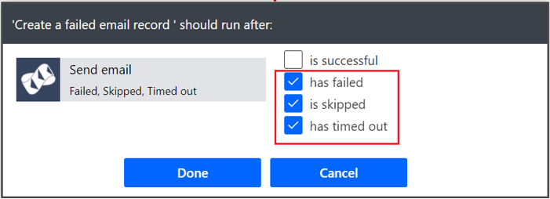
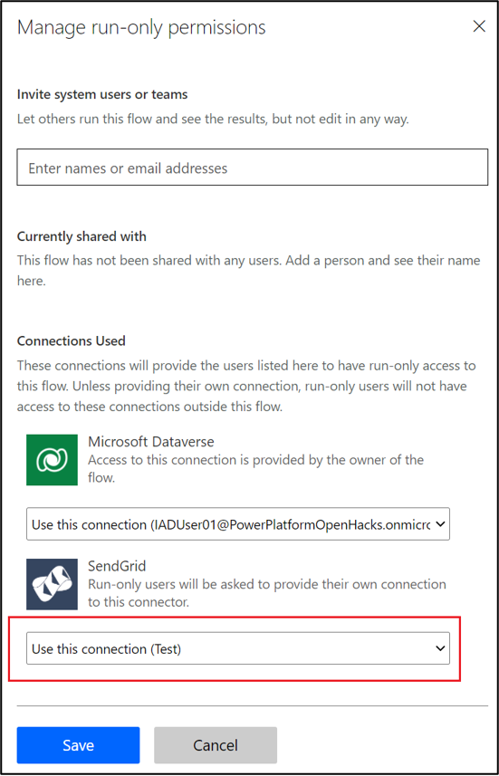
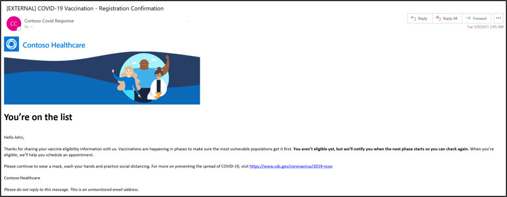

[Microsoft Exchange Online](https://www.microsoft.com/microsoft-365/exchange/exchange-online/?azure-portal=true) isn't a bulk email service, and it has a limit of 10,000 emails each day for each mailbox, which won't suffice for typical email volumes that are required for vaccination management scenarios. Therefore, those scenarios require customers to have their own bulk email service, according to their choice and compliance needs, that they can use to send emails for various scenarios including registration confirmation, booking invitations, appointment confirmation and cancellations, appointment reminders, and maintaining immunization records. While the actual number of sent emails will vary for each deployment based on your registration and vaccination volumes, the number of emails can be *excessively high each day during peak times*.

Customer implementations can extend the [standard Power Automate flows](/dynamics365/industry/vaccination-management/configure-security-portal-flows/?azure-portal=true#configure-power-automate-flows) in Microsoft Vaccination Management to integrate Microsoft Vaccination Management with an external bulk email provider of their choice.

Popular bulk email services, such as [SendGrid](https://azuremarketplace.microsoft.com/marketplace/apps/SendGrid.SendGrid?tab=Overview&azure-portal=true), have standard Power Automate connectors that customers can use, or they have other bulk email services that customers can integrate by building a Power Automate custom connector.

In this exercise, you'll learn how to extend an email flow to integrate with SendGrid as an example of sending higher volumes of emails.

For more information, see [Sending limits in Exchange](/office365/servicedescriptions/exchange-online-service-description/exchange-online-limits/?azure-portal=true#receiving-and-sending-limits).

## Task 1: Extend an email flow to integrate with bulk email service

In this task, you'll learn how to use the SendGrid connector as an example of sending higher volumes of emails.

For more information, see [SendGrid Connector](/connectors/sendgrid/?azure-portal=true).

> [!div class="mx-imgBorder"]
> 

1. Create a SendGrid account directly in [SendGrid](https://sendgrid.com/?azure-portal=true) or through [Microsoft Azure portal](/azure/sendgrid-dotnet-how-to-send-email/?azure-portal=true#create-a-sendgrid-account) and then create an API key.

    > [!NOTE]
    > If you are in an official training course, then this step is informational only and no action will be required because the SendGrid account is already set up and the API key is provided to you.

1. Go to [Power Apps](https://make.powerapps.com/?azure-portal=true).

1. In the left pane, select **Solutions** and then view the list of solutions that are deployed in the environment.

    > [!div class="mx-imgBorder"]
    > 

1. On the **Solutions** page, select the **MVM In A Day** solution.

    > [!div class="mx-imgBorder"]
    > 

1. In the **MVM In A Day** solution, select **+ Add existing > Cloud flow** in the command bar.

    > [!div class="mx-imgBorder"]
    > 

1. On the right pane, select the **Send Email (Generic)**, **Send Email (Phase Opening)**, **Send Email (Registration)**, and **Send Email with Attachment (Base)** flows, and then select **Add** to add them into the solution.

    > [!div class="mx-imgBorder"]
    > 

1. On the **Send Email (Registration)** flow, select the **More Commands** ellipsis (**...**) and then select **Edit** to open and edit the flow on a new tab in the browser.

    > [!div class="mx-imgBorder"]
    > 

1. Select the plus (**+**) button to add a new step in between the **Manually trigger a flow** and the **Send an email** steps to the flow.

    > [!div class="mx-imgBorder"]
    > 

1. Search for SendGrid, and then select the **Send email (V4)** action and rename it to **Send email**.

    > [!div class="mx-imgBorder"]
    > 

1. Provide a **Connection name** (for example, **MVM In A Day SendGrid**), enter the API key in the **SendGrid API Key** field, and then select **Create** to establish a connection with the SendGrid server.

    > [!NOTE]
    > If you are in an official training session, use the SendGrid API key that was provided by your lab instructor.

    > [!div class="mx-imgBorder"]
    > 

1. Provide the following details in the **Send email (V4)** dialog box:

    - **From** - Use a no-reply email address.

        > [!Note]
        > If you are in an official training session, use the no-reply email address that was provided by your lab instructor.

    - **To** - Add the **Email** dynamic content.

    - **Subject** - Add the **EmailSubject** dynamic content.

    - **Email body** - Select the code (**</>**) icon on the format bar in **Email body** and replace the code with the **EmailBody** dynamic content.

    > [!div class="mx-imgBorder"]
    > 

    > [!div class="mx-imgBorder"]
    > 

1. Select the **More commands** ellipsis (**...**) and then select **Settings**.

    > [!div class="mx-imgBorder"]
    > 

1. Set up a retry policy on this step so that the step will run again if intermittent failures occur based on settings that are defined as follows:

    - **Type** - Select **Exponential Interval**.

    - **Count** - Set the retry count to **25**.

    - **Interval** - Set the interval in ISO 8601 format. For example, for one minute, update it to **PT1M**.

    - **Minimum Interval** - Set the minimum interval in ISO 8601 format. For example, for one minute, update it to **PT1M**.

    - **Maximum Interval** - Set the maximum interval in ISO 8601 format. For example, for one hour, update it to **PT1H**.

    > [!div class="mx-imgBorder"]
    > 

1. Delete the **Send an email** step by selecting the **More commands** ellipsis (**...**) and then **Delete**.

    > [!div class="mx-imgBorder"]
    > 

1. On the **Create a failed email record** step, select **Configure run after**.

    > [!div class="mx-imgBorder"]
    > 

1. Select the three statuses as shown in the following screenshot, and then select **Done** so that this set of steps runs only when the email run step has failed, is skipped, or has timed out.

    > [!div class="mx-imgBorder"]
    > 

1. Select the **Save** button on the upper edge of the flow editor and then make sure that no errors show in the **Flow checker**.

    > [!div class="mx-imgBorder"]
    > 

1. Select the **Back** button to return to the overview screen.

1. Select **Edit** on the **Run only users** section.

    > [!div class="mx-imgBorder"]
    > 

1. Select **Use this connection (MVM In A Day SendGrid)** from the dropdown list and then select **Save** so that this connection will be used when this child flow is used in the parent flows.

    > [!div class="mx-imgBorder"]
    > 

1. If the **Status** of the flow is **Off**, then select **Turn on** to enable the flow. You can skip this step if the flow is already enabled.

1. (Optional) You can use the same steps from this task to replace the Office 365 Outlook connector with the SendGrid connector on the other email flows: **Send Email (Phase Opening)**, **Send Email with Attachment (Base)**, and **Send Email (Generic)**.

## Task 2: Test the Power Automate flow changes

In this task, you'll test the Power Automate flow changes that were done as part of this exercise by registering in the **Registration and booking portal** and then you will verify the email.

1. Go to [Power Apps](https://make.powerapps.com/?azure-portal=true).

1. To test the email flow, select **Apps** on the left navigation bar and then you can view the list of apps that are deployed in the environment.

    > [!div class="mx-imgBorder"]
    > 

1. Find and select the **Registration and booking portal** to open it on a new tab page in the browser. This portal is used for registering and booking appointments.

1. Select **Start registration** in the portal.

1. Don't set **Yes** for any of the questions in the questionnaire.

1. After filling in the questionnaire, provide all required resident details and then make sure that you provide a last name starting between the letters A-M.

1. At the end of the page, enter the year in the **Date of birth** field as **1990** and then provide a valid email address.

1. At the end of the review page, select the confirmation checkbox and then select the **Complete registration** button.

    > [!div class="mx-imgBorder"]
    > 

After one to three minutes, **Email Registration Confirmation (Lastname: A-M)** will pass the required details to its child flow, **Send Email(Registration)**, to send an email to the resident. Within three minutes, you'll also receive a registration confirmation email to the email address that you provided in the **Registration and booking portal**.

> [!div class="mx-imgBorder"]
> 

1. If you haven't received the registration email by five minutes after submission, then follow these steps:

    1. Check for the email in your **Junk** folder.

    1. If you can't find the registration email in your **Junk** folder, then verify whether the steps in Exercise 1, Task 1, Steps 4 and 5 were followed and then redo this task.

    1. If you can't find the registration email even after following the preceding steps, then open the latest runs in the **Email Registration Confirmation (Lastname: A-M)** and **Send Email(Registration)** flow history to troubleshoot it further.

1. You can also verify the **28-day run history** for the run status and detailed run history in the **Email Registration Confirmation (Lastname: A-M)** and **Send Email(Registration)** flows.

1. If you're receiving the same email every three minutes, then it could stem from an incorrect setup of values in the flow.

    1. Turn off the **Send Email(Registration)** flow immediately and compare all values that are set in your **Send Email(Registration)** flow as part of Exercise 4, Task 1, Steps 15 and 16.

    1. If you don't see a difference, then open the latest run from the **Send Email(Registration)** flow history to troubleshoot it further.

    1. Don't turn on the flow again until you have found the difference in the setup and have corrected it.

Congratulations, you've learned how to integrate a bulk email service with Microsoft Vaccination Management email flows.
