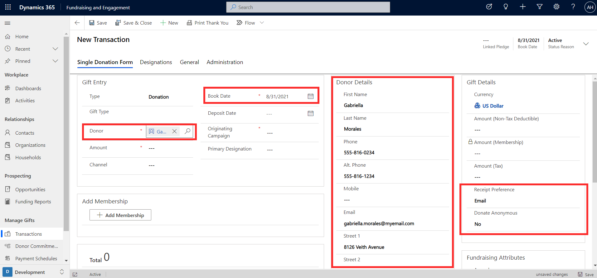
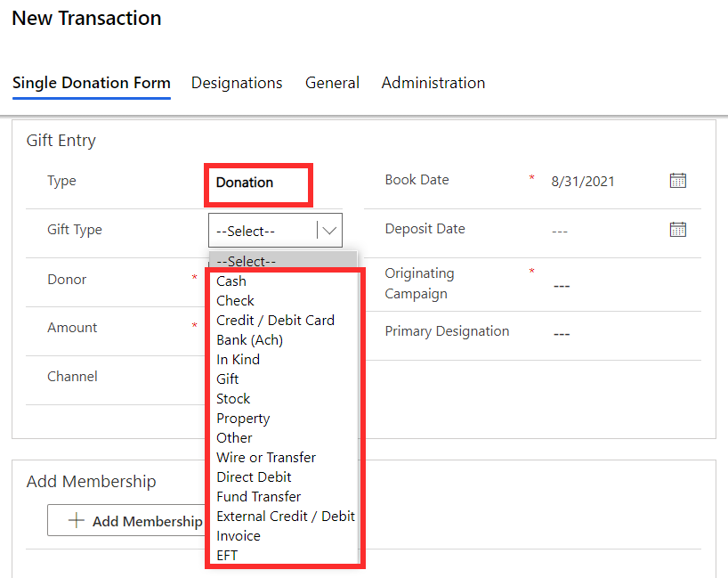
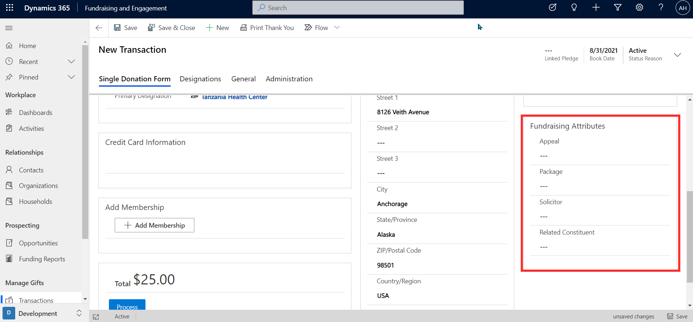
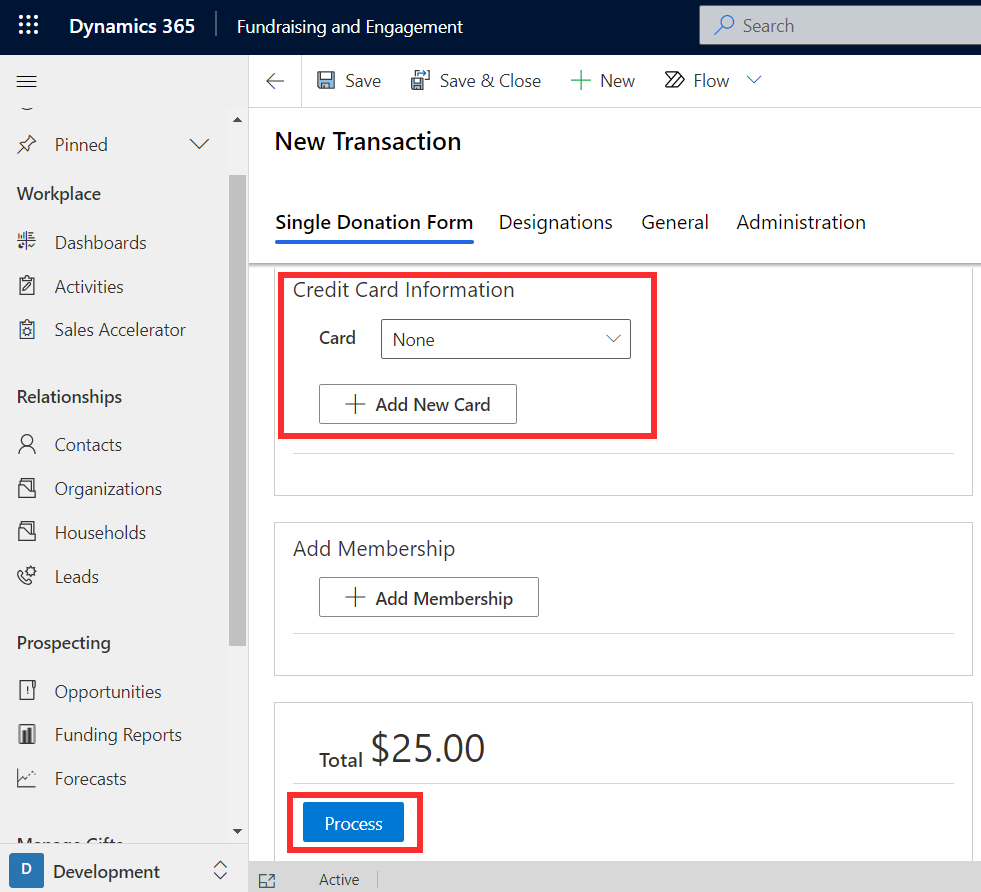
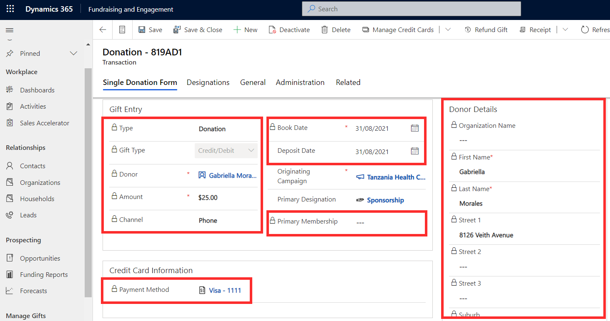
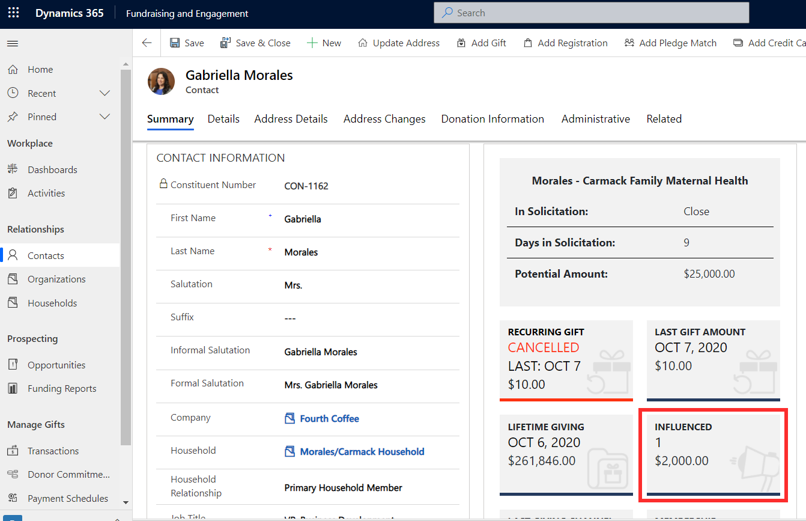

In Fundraising and Engagement, gifts can be transactions, donor commitments, or payment schedules. They're monetary or in kind donations received from or pledged by a donor to a nonprofit organization. Gifts can be made by either a contact or an organization. They can't be made by a household. You can view the history and summary of gifts on contact and organization records.

All transactions, payment schedules, and donor commitments are linked to a campaign and a designation. Campaigns allow you to track and report on activities, responses, and gifts in response to your fundraising efforts in a particular area. Designations allow you to connect debit and credit GL codes to gifts, to indicate how funds will be allocated, and to help with reconciliation with the financial system.

Throughout this module, you'll take a closer look at the three main types of gifts: transactions, donor commitments, and payment schedules.

## Understand transactions

A transaction in Fundraising and Engagement is used for recording and processing gifts. It's core to the application, because all kinds of gifts (one off giving, recurring giving, pledges for future giving), will all eventually result in a transaction. Transactions work with the built-in payment gateway to process payments and are the records of revenue received through gifts. A transaction can be either a:

- **Donation**: A monetary payment or gift in kind from a constituent to the nonprofit organization.

- **Soft Credit**: Where an individual or organization was the key influencer in a donation but didn't make the donation themselves (such as peer-to-peer fundraising). Soft credits show differently on the donor record summary as influenced donations in a separate section. This lets you filter them out when doing financial reconciliation.

## Create and process a transaction

You can create a transaction directly from a contact or organization record in Fundraising and Engagement. The **Add Gift** button at the top of the record will create a new transaction for the constituent.

> [!div class="mx-imgBorder"]
> 

Information such as current date, donor details, and receipt preference will autopopulate in the new transaction record.

> [!div class="mx-imgBorder"]
> 

In the Gift Entry section of the record, start by selecting the type of transaction: either donation or soft credit. If donation is selected, you can then specify gift type (payment method or type of in kind donation). The screenshot below shows the possible gift type values.

> [!div class="mx-imgBorder"]
> 

Enter the donation value, book date, and the related campaign where the donation originated. You can record the source or channel (such as direct mail, phone, social, online) if you want to be able analyze and report on your donation sources. The primary designation column can be used to track the GL code and allocation of the received revenue.

> [!div class="mx-imgBorder"]
> 

The Fundraising Attributes section on the transaction record allows you to store optional information relevant to the transaction by linking an appeal, package, solicitor, and related constituent for the transaction. These extra categories can enable more granular reporting and campaign tracking.

> [!div class="mx-imgBorder"]
> 

If credit or debit was specified as the gift type, you can add a new credit card or select an existing card stored (securely tokenized) against the constituent's record. Once the details of the transaction have been completed, clicking the **Process** button will process the transaction through the payment gateway. You can then view the transaction results.

> [!div class="mx-imgBorder"]
> 

## View transaction results

Once the transaction is processed, certain columns become read-only and will be locked on the record. Read-only columns include the donor details, payment method, and type and amount of donation.

> [!div class="mx-imgBorder"]
> 

The General tab of the transaction record will display more details, such as whether the transaction was processed successfully or not. When the transaction has been successfully processed, the status will change to Completed.

> [!div class="mx-imgBorder"]
> 

## Gifts in kind

A gift in kind is a donation made in the form of goods or services that have real value and isn't a gift of money. If the donation is a gift in kind, it can be processed by specifying the **gift type** as **In Kind** on the transaction record, as shown below.

> [!div class="mx-imgBorder"]
> 

If in kind is selected, a new section containing appraisal information will appear on the transaction record. Here you can record information such as a description of the gift, and details of the party who it was appraised by.

> [!div class="mx-imgBorder"]
> 

## Soft credits

A soft credit transaction is created in a similar method to monetary donations and can be attributed to a contact or organization. To create a soft credit, the type column on the transaction record is set to soft credit. This will remove the payment method-related column from the record.

> [!div class="mx-imgBorder"]
> 

The value of all a constituent's soft credits can be found on the influenced tile in the snapshot on the contact or organization's record.

> [!div class="mx-imgBorder"]
> 
