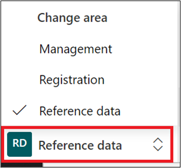

In this exercise, you will assume the persona of a vaccine program administrator who will open a vaccination phase. This action will trigger notifications to the registered residents against that phase and will allow them to book their appointments through a booking link.

## Task 1: Open a phase to allow bookings for completed registrations
To open a phase to allow bookings for completed registrations, follow these steps:

1.  Launch an internet browser in **InPrivate** or **Incognito** mode and then go to 'make.powerapps.com' by using the user credentials that were shared by your coach.

1.  Select your allocated environment from the **Environments** dropdown list.

	> [!div class="mx-imgBorder"]
	> 

1.  Go to the **Apps** section, locate **Vaccination site management app**, select the ellipsis (**...**), and then select **Play**.

	> [!div class="mx-imgBorder"]
	> 

1.  In the app that opens, go to the lower-left corner and set the **Change area** to **Reference data**.

	> [!div class="mx-imgBorder"]
	> 

1.  Go to **Phases** and select **Phase 1** (the phase record that you noted in Exercise 1, Task 2, step 6).

	> [!div class="mx-imgBorder"]
	> 

1.  When the **Phase** record opens, set the following field values and then select **Save and Close**.

	- **Booking open** - Yes
	
	- **To Send** - 5

	If the **Booking open** value is already set to **Yes**, then skip this step

	> [!div class="mx-imgBorder"]
	> 

> [!NOTE]
> The recommended **To Send** batch size is approximately 500 each hour. This process ensures equity and determines the number of participants that will receive an invite for the booking process.

## Task 2: Verify Dataverse changes after phase opening

In this task, you will verify what changed on your **COVID Vaccination Eligibility** record after the phase opened. A **Vaccination Recommendation** record should be auto populated against the **COVID Vaccination Eligibility** record, indicating that you can now book an appointment against your registration.

1.  In the **Vaccine Management app**, set the **Change area** on the application to **Registration**.

	> [!div class="mx-imgBorder"]
	> 

1.  Go to the same **COVID Vaccination Eligibility** record that you viewed in the previous exercise.

The **Vaccination Recommendation** record should be updated now. If it does not appear immediately, give it a few minutes before you select refresh and it should show up on your record.

> [!div class="mx-imgBorder"]
> 

Congratulations, you have now opened a phase to allow bookings for registered residents and have also sent invites to them for the booking process. When you receive the email notification to schedule the vaccine, you can move on to the next exercise where you will book your appointment for the vaccination.

