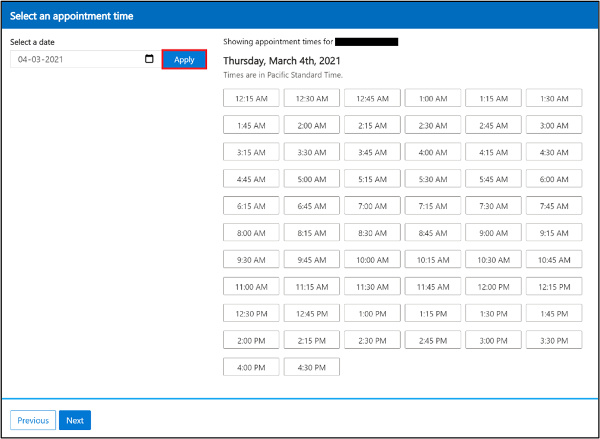
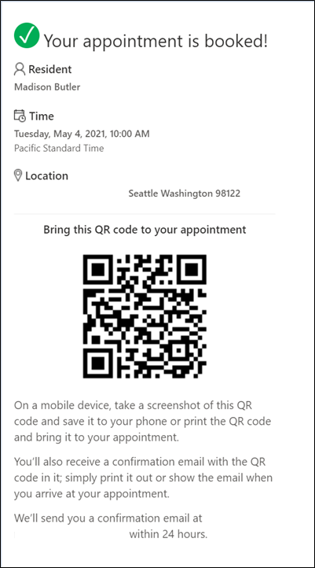

In this exercise, you will assume the persona of a public user who has registered for vaccination through the portal and now wants to book an appointment slot for a vaccination. This exercise can be done after the eligibility notification email has triggered so that you can start the booking experience from the appointment link that is embedded in the email.

## Task 1: Go to the portal and book an appointment
In this exercise, you will go to the portal and book your vaccination appointment.

1.  At the end of exercise 3, you should have received a confirmation email with an appointment link. To launch the booking experience, select **Schedule an appointment** in the email.

	> [!div class="mx-imgBorder"]
	> 

1.  A portal page should launch in your browser. In the page, enter the same date of birth that you entered in Exercise 1, Task 1, step 10 and then select **Submit**.

	> [!NOTE]
	> It is important that you enter the exact date that the system validates you against for this data.

	> [!div class="mx-imgBorder"]
	> 

1.  If you registered by using an event code in Exercise 1, then the preselected vaccination site should show up automatically. Select the **Select** button to continue with the booking process.

	If you did not use an event code during registration, skip this step and go to the next step to search for vaccination sites.

	> [!div class="mx-imgBorder"]
	> 

1.  In the **Zip/Postal code** field, enter **98052**. Select **Any** from the **Vaccine type** dropdown menu and then select **Search**. The search results should display the vaccination sites that are open for booking.

	> [!div class="mx-imgBorder"]
	> 

1.  When the available vaccination site displays with open slots, choose your appointment slot by selecting the **Select** button.

	> [!div class="mx-imgBorder"]
	> 

1.  Set the **Date** to today's date and then select **Apply**.

	> [!div class="mx-imgBorder"]
	> 

1.  Choose any available slot to book and then select **Next**.

	> [!div class="mx-imgBorder"]
	> 

1.  View the appointment confirmation and generated QR code.

	> [!div class="mx-imgBorder"]
	> 

## Task 2: Verify Dataverse records that were created post booking process

In this task, you will assume the persona of a system user and will sign in to the Dataverse environment and view the records that were created/edited after the booking process.

1.  Launch an internet browser in **InPrivate** or **Incognito** mode and then go to 'web.powerapps.com' by using the user credentials that were shared by your coach.

1.  Select your allocated environment from the **Environments** dropdown list.

	> [!div class="mx-imgBorder"]
	> 

1.  Go to the **Apps** section, locate **Vaccination site management app**, select the ellipsis (**...**), and then select **Play**.

	> [!div class="mx-imgBorder"]
	> 

1.  The **Vaccination site management** app will launch in the next tab. Go to **Change area** in the navigation panel and set it to **Registration**.

	> [!div class="mx-imgBorder"]
	> 

1.  Locate the **Covid Vaccine Eligibility** record that you viewed in Exercise 1, Task 2. Select the **Related** tab and then select **Immunization Recommendations**.

	> [!div class="mx-imgBorder"]
	> 

1. Select and view the associated **Vaccination Recommendation** record and note the entry in the **Active Appointment** field.

	> [!div class="mx-imgBorder"]
	> 

The **Active Appointment** field indicates that you have completed the booking process and have been associated to an appointment. You can also select and open the appointment record to view the details of the slot and time.

Congratulations, you have booked an appointment for a vaccination in the portal and have verified how it manifests in Dataverse. This exercise completes the scenarios for the registration and booking process. Now, you will move on to other scenarios that are supported in Microsoft Vaccine Management.

