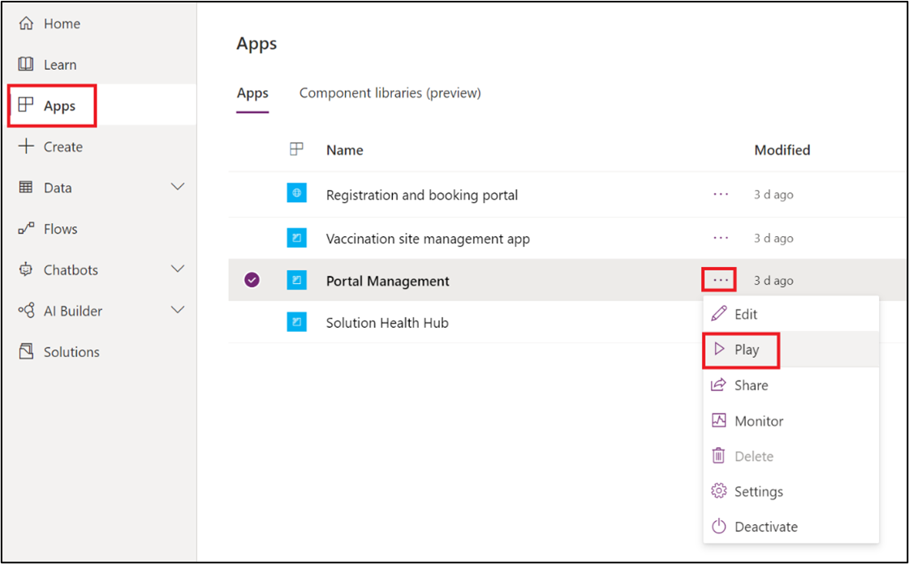
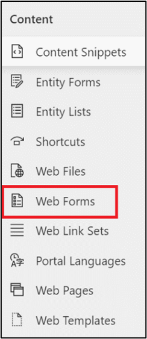
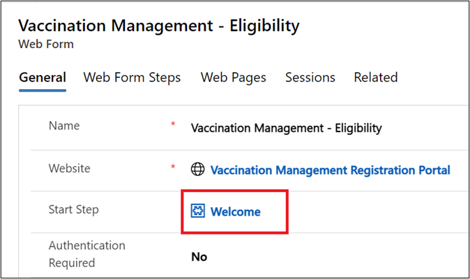
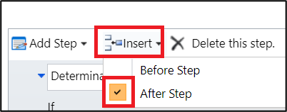
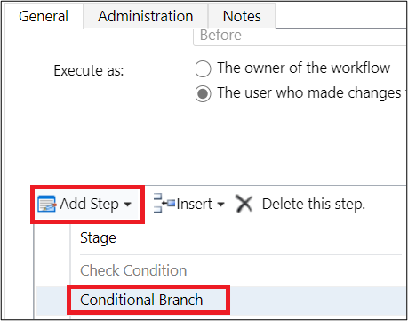
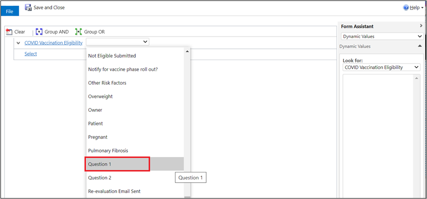
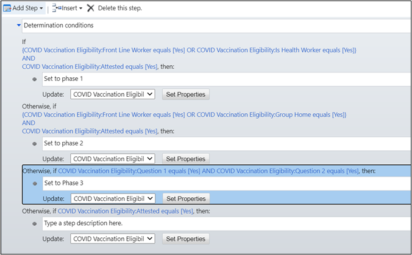
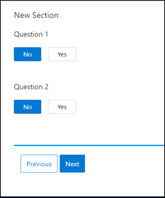

In this exercise, you will mimic onboarding the MVM solution for a new locale/geo that has different COVID vaccination eligibility rules. In that case, you would be required to override most of the existing portal behavior and replace it with new rules. You would also be required to edit the overall eligibility workflow that evaluates if a person is eligible according to the configured rules so that the new set of rules is honored during eligibility computation.

## Task 1: Customize existing components and add new components in a solution 

In this task, you will re-use the existing solution that you created in Lab 1 and add a few components that will be customized to reflect the new question on the portal

1.  Navigate to the solution you created in Lab 1 called **MVM in a Day** and search for **Covid Vaccination Eligibility** table and click on it.

1.  Once the table opens, click on **Add column** and set the following details:

    **Display Name** : Question 1

    **Data type** : Yes/No

    Click on **Done**.

	> [!div class="mx-imgBorder"]
	> 

1.  Once column is added, click on **Save Table**.

1.  Repeat steps 2 to 3 for adding another column with following details:

	**Display Name** : Question 2
	
	**Data type** : Yes/No

1.  This is how your table **Columns** should look like now.

	> [!div class="mx-imgBorder"]
	> 

1.  Click on solution name **MVM In A Day** to navigate back and **Publish all customizations**.

	> [!div class="mx-imgBorder"]
	> 

1.  Once published, click again on **Covid Vaccination Eligibility** table in the solution.

1.  In the list that appears, navigate to **Forms** tab and click **Vaccination Management - Portal Web Form**.

	> [!div class="mx-imgBorder"]
	> 

1.  This should launch the form for editing. Now click on **First Dose** tab and then **+Component** in the navigation bar.

	> [!div class="mx-imgBorder"]
	> 

1. Now click **1-column tab** from the left navigation and see it reflect on the form as shown.

	> [!div class="mx-imgBorder"]
	> 

1. Now click on the **New Tab** and update the **Label** to "New Questions".

	> [!div class="mx-imgBorder"]
	> 

1. Now click on **+Form Field** in the navigation bar and click on **Question1** and **Question2** to add them to the newly created tab.

	> [!div class="mx-imgBorder"]
	> 

1. Once added, here is how your form tab will look like:

	> [!div class="mx-imgBorder"]
	> 

1. Click on **Save** and then **Publish**.

1. Click on **Back** to exit from the form. Then click on solution name and **Publish all customizations**.

	> [!div class="mx-imgBorder"]
	> 

## Task 2: Edit portal webform steps to show your page

In this task, you will edit the portal settings to reflect a new page with your questions. While you move from one page to the other on the portal, you are essentially navigating from one tab to the other on the form. To achieve this, each tab on the form is bound as a web form step on the portal. Introducing a new page requires changing the flow of the tabs and injecting a web form step in between. And that is exactly what we would do in this task. The original form step sequence is **Welcome** - **WorkHistory** followed by other tabs. You will alter the sequence to **Welcome** - **New Questions** - **WorkHistory** followed by other tabs.

1.  Launch **web.powerapps.com** using your user credentials and ensure the **Environment** is showing up correctly.

1.  Click on **Apps** and locate **Portal Management** app, click on **...** and **Play**.

	> [!div class="mx-imgBorder"]
	> 

1.  This will launch the **Portal Management** app in another tab.

1.  In the **Portal Management** app, click on **Web Forms** in the left navigation bar.

	> [!div class="mx-imgBorder"]
	> 

1.  In the list that appears, click on **Vaccination Management - Eligibility**.

	> [!div class="mx-imgBorder"]
	> 

1.  Once the web form opens, click on the start step **Welcome** to open the web form step.

	> [!div class="mx-imgBorder"]
	> 

1.  Web form step should open up. In the start step value that shows **Work History**,click on **X** to clear the value and then click on search icon to create a new Web form step.

	> [!div class="mx-imgBorder"]
	> 

1.  Click on **New Web Form Step** to launch a create form for web form step.

	> [!div class="mx-imgBorder"]
	> 

1.  Set following values in the Web Form Step and click **on Save**.

    Name: **New Questions**

    Web Form: **Vaccination Management - Eligibility**

    Type: **Load Form**

    Target Entity Logical Name: **COVID Vaccination Eligibility**

    Next Step: **Work History**

    Move Previous Permitted: **Yes**

    Enable Entity Permissions: **Yes**

	> [!div class="mx-imgBorder"]
	> 

1. Now navigate to **Form Definition** tab on the form and set the following values and then click on **Save and Close**.

    Form Name: **Vaccination Management - Portal Web Form**

    Tab Name: **New Questions**

	> [!div class="mx-imgBorder"]
	> 

1. You will land on the **Welcome** web form step again. Now set the Next step to the web form that you created - **New Questions**.

	> [!div class="mx-imgBorder"]
	> 

1. Once done, **Save** the form and close.

## Task 3: Edit workflow to change eligibility logic

In this task, you will edit the current eligibility logic to take into account the responses to your new questions and compute eligibility accordingly.

1.  Navigate back to your **MVM in a Day** solution and click on **+Add existing** and select **Process**.

	> [!div class="mx-imgBorder"]
	> 

1.  Search for 'Eligibility Phase'. Select the process named **Vaccination - Eligibility Phase Determination** and click on **Add**.

	> [!div class="mx-imgBorder"]
	> 

1.  Once added, click on the process **Vaccination - Eligibility Phase Determination.** This will launch the process designer in a new tab.

1.  Click on **Deactivate** button in the top ribbon. In the dialog that opens, click on **Deactivate**.

	> [!div class="mx-imgBorder"]
	> 

	> [!div class="mx-imgBorder"]
	> 

    Now the process designer will open up with the editable version of the Process.

1.  In the process designer, click on **Insert** and then select **After Step**. If it is pre-selected, then move to the next step.

	> [!div class="mx-imgBorder"]
	> 

1.  Then click on the **Otherwise if** written on the step that says **Phase 2**. This will highlight the whole conditional step as shown below.

	> [!div class="mx-imgBorder"]
	> 

1.  Once the step is selected, click on **Add Step - Conditional Branch.** This will insert a new step post the selected conditional step.

	> [!div class="mx-imgBorder"]
	> 

1.  The step appears in the workflow as shown below. Click on **\<condition\>(click to configure)**.

	> [!div class="mx-imgBorder"]
	> 

1.  In the dialog box that opens, begin selecting the first condition. Set Primary entity dropdown to **COVID Vaccination Eligibility**.

	> [!div class="mx-imgBorder"]
	> 

1. Now click on the next dropdown and select **Question 1** from the list.

	> [!div class="mx-imgBorder"]
	> 

1. Add the following conditions and select **Equals**.

	> [!div class="mx-imgBorder"]
	> 

1. Now click on the **...** to select values from the options shown.

	> [!div class="mx-imgBorder"]
	> 

1. In the dialog that pops up, select **Yes**, and then click on **\>\>\>** and then on **OK**.

	> [!div class="mx-imgBorder"]
	> 

1. This is how your workflow step will look like now.

	> [!div class="mx-imgBorder"]
	> 

1. Repeat steps 9-13 for **Question 2**. This is how your workflow step will look like after you are done. Click on **Save and Close**.

	> [!div class="mx-imgBorder"]
	> 

1. Once the dialog closes, your workflow designer should look like below screenshot. Now select the row shown below and click on it. Then click on **Add step** - **Update record**.

	> [!div class="mx-imgBorder"]
	> 

1. In the window that opens, set the **Phase** to 'Phase 3' as shown below and click **Save and Close**.

	> [!div class="mx-imgBorder"]
	> 

1. This is how your final workflow looks like. Click **Save** and then click **Activate**.

	> [!div class="mx-imgBorder"]
	> 

## Task 4: Restart portal and verify your changes

1.  In the same browser where you have logged in to the lab environment, open a new tab and navigate to [**https://admin.powerplatform.microsoft.com/**](https://admin.powerplatform.microsoft.com/)

1.  In the navigation pane, click on **Resources** dropdown and then **Portals**.

	> [!div class="mx-imgBorder"]
	> 

1.  In the Search box, search for \<Your allocated environment Name\> and you can find the **Registration Portal** show up as a search result. Click on **...** and then **Manage**.

	> [!div class="mx-imgBorder"]
	> 

1.  This should launch the Portal Admin Center in a new tab. In the Admin Center, click on **Portal Actions** and then **Restart Portal**.

	> [!div class="mx-imgBorder"]
	> 

1.  Once the portal restarts, navigate back to your portal page and follow the process of checking eligibility as done in Exercise 1. Follow through until you reach on the Step 2 of Eligibility questionnaire to verify your new question now shows up in the portal.

	> [!div class="mx-imgBorder"]
	> 

**Congratulations!** You have created a new eligibility questionnaire and plugged it in to fire in the eligibility process according to the response.

