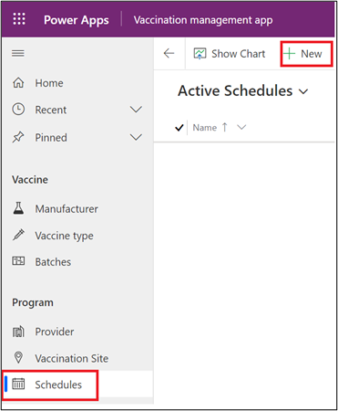
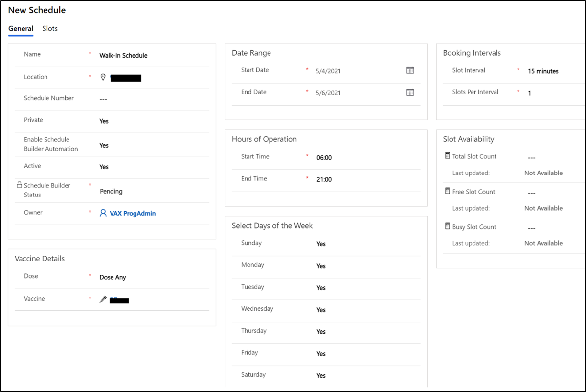
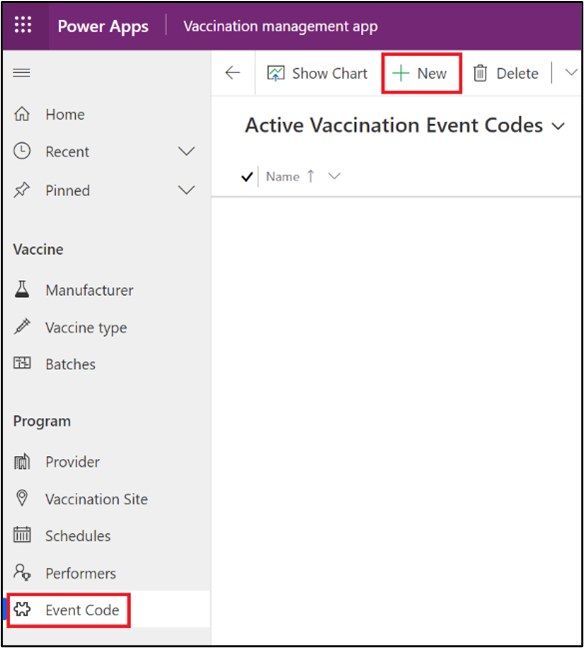

In this exercise, you will assume the persona of a Vaccine Program Administrator who wants to open up a vaccination site for walk-ins. To enable this, you will create a new private schedule for a vaccination site and generate an event code tagged to that schedule. Once the event code is shared with residents, they can use it to register and book their appointments. The slots generated on this schedule would not be visible to residents who do not have the event code, hence preventing anyone else from booking against them.

## Task 1: Create a private schedule with open slots

In this task, you will assume the persona of a system user and login to the Dataverse environment and create a new private Schedule with open slots.

1.  Launch in-private/incognito mode in your browser and navigate to 'web.powerapps.com' using the user credentials shared by your coach.

1.  Select your allocated environment from the list of environments in the dropdown.

	> [!div class="mx-imgBorder"]
	> 

1.  Navigate to **Apps** and locate **Vaccination site management app** and click on '...', then **Play**.

	> [!div class="mx-imgBorder"]
	> 

1.  The Vaccination Site Management app launches in the next tab. Navigate to **Change area** in the navigation panel and click on it to set to **Management**.

	> [!div class="mx-imgBorder"]
	> 

1.  In the left navigation, select **Schedules** and click on **+New**.

	> [!div class="mx-imgBorder"]
	> 

1.  In the form that opens up, set the following field values and **Save and close**.

    **Name :** Walk-in Schedule

    **Location :** \<Select any Location created in previous labs\>

    **Private :** Yes

    **Dose :** Dose Any

    **Vaccine :** \<Select any Vaccine created in previous labs\>

    **Start Date :** \<Select today's date\>

    **End Date :** \<Select today's date + 2\>

    **Start Time :** 06:00

    **End Time :** 21:00

    **Days of the Week :** \<Select **Yes** for all days of week Sunday through Saturday\>

    **Slot Interval :** 15 minutes

    **Slots per Interval :** 1

	> [!div class="mx-imgBorder"]
	> 

## Task 2: Create an event code to share with walk-in residents

1.  In the Vaccination Site Management app, select **Event Code** in the navigation pane. Then click on **+New**.

	> [!div class="mx-imgBorder"]
	> 

1.  In the **EventCode** record that opens up, set the following fields and **Save.**

    **Name:** SampleEventCode

    **Expiration Date:** \<Set any date in future\>

    **Schedule :** \<Select the schedule record created in above task \>

	> [!div class="mx-imgBorder"]
	> 

1.  After you save the **EventCode** record, the **Code** field would be autopopulated with a generate code. Copy and Save it.

	> [!div class="mx-imgBorder"]
	> 

**Congratulations!** You have now created an Event Code that can be used to register residents against a specific schedule.

