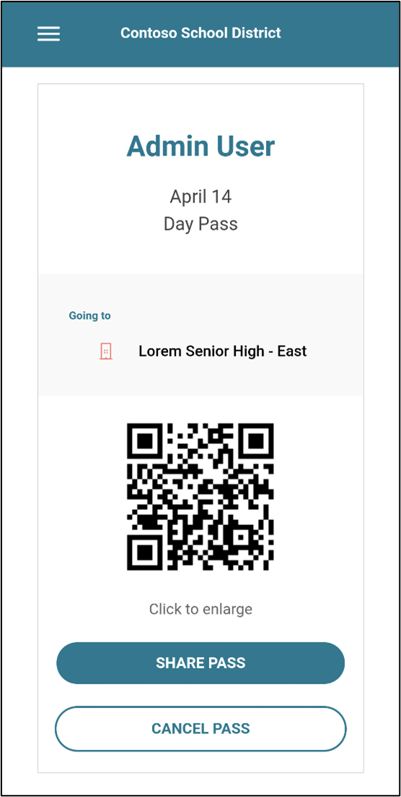
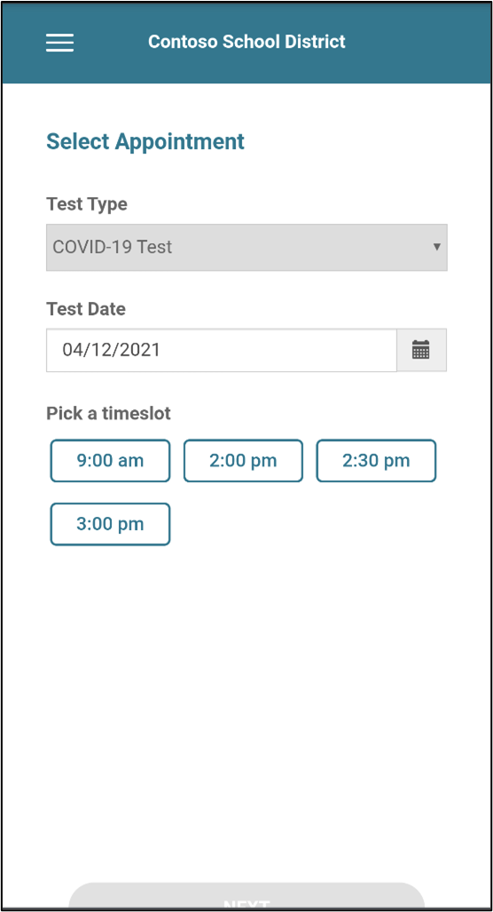
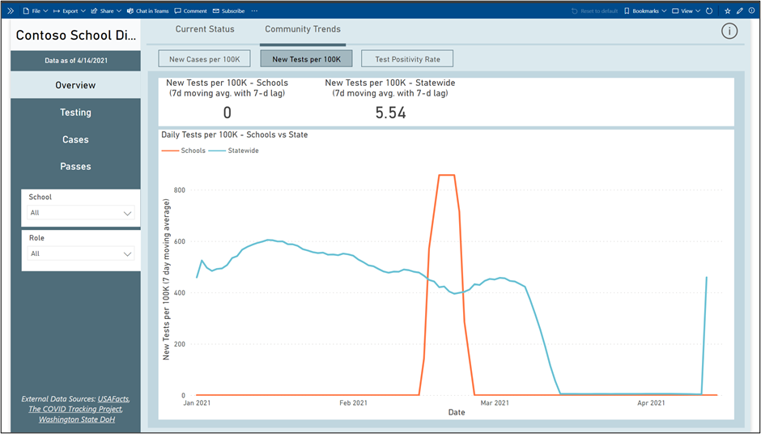
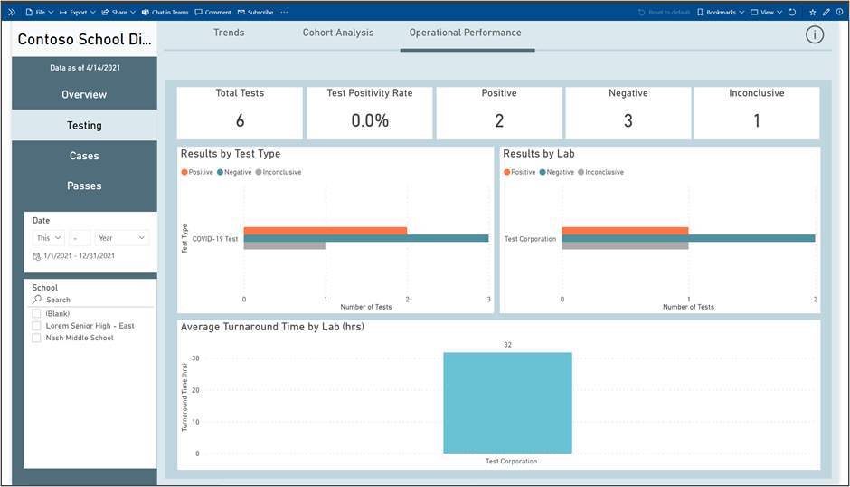

The Return to School solution features a Power App and a Power Apps portal designed to facilitate many tasks to enable building entry for activities such as appointments or testing. Based on your location's specific expectations for returning, you can make several options available to help do this safely.

**School Management app** and **Portal app** give school administrators the tools they need to monitor and manage the return of students and staff to school. These apps help schools with daily attestation and access controls, periodic testing, case management, and manual contact tracing. The Portal app is designed as a self-service tool for students, parents, guardians, and staff.

**Dashboard and analytics** help school administrators view historical trends of key program measurements, such as daily attestations and cases. Dashboards show metrics for reopening and analytics measure testing efficacy and operational performance.

## Return to School management app and portal

The Return to School Management app is a model-driven app that allows you to directly control the settings for your portal and configure details such as the definition of your reopening phases, schools, and services. Access to a school can be determined using many different settings. A school might have reopening phases to define total allowed occupancy and available entry times to stagger access to reduce bottlenecks at entry points. An individual user can be flagged for no entry allowed after a positive test result, or failed attestation.

The portal will then take building visitors through a series of options for obtaining and using a building entry pass, scheduling testing appointments or submitting results, or registering dependents to do the same.

> [!div class="mx-imgBorder"]
> 

The portal is a web-based application that is presented to a user in a standard internet browser like Microsoft Edge. The application has a responsive design so that your users will have a good experience if it's consumed on a mobile phone, a tablet, or even a desktop with a full-sized browser. The look and feel of your portal is configurable using the portal studio and the portal management app. To learn more about customizing portals visit this [Learning Path](https://docs.microsoft.com/learn/paths/work-power-apps-portals/?azure-portal=true).

A school may need to control the flow of visitors to their buildings. Students, faculty, parents, and other guests can use the portal to request a building pass to comply with these expectations. Only authenticated users can request building access. A user will be presented with a set of questions to confirm eligibility for a pass. The answers will be saved in an attestation record.

A building pass will be created for a same day visit.

On the pass below you will notice a QR code. This is a setting that has been enabled to allow for contactless building access. If your facility does not support the scanning of such codes, you can disable this setting. You will learn more about the settings later in this module.

> [!div class="mx-imgBorder"]
> 

A portal user might also need to schedule an appointment for a test time. Once you have configured your testing locations and available times, the portal user can book an appointment for their test. As part of the booking process, they will be presented with a series of questions you define to help you confirm test eligibility before the appointment can be confirmed. These questions can have yes/no, date/time, or text answers.

After answering the questions, the user is presented with available appointments.

> [!div class="mx-imgBorder"]
> 

The user will receive a confirmed appointment screen once the selection has been made.

> [!div class="mx-imgBorder"]
> 

A building pass will not automatically be created for this user for their confirmed appointment. Appointments can be scheduled days in advance and passes are created for same day entry. Power Automate would make it possible to automate the creation of this using a flow. Additionally, you could consider other automations such as emailing a confirmation of the appointment or reminders for the appointment. To learn more about using Power Automate visit this [Learning Path](https://docs.microsoft.com/learn/paths/automate-process-power-automate/?azure-portal=true).

## Dashboards and analytics

The Return to School solution has a Power BI dashboard ready for you to use. This dashboard is comprehensive and presents you with data analysis from your data as well as regional and federal trends. The more information that you track in your system, the more comparative analysis you have available. Below is a sample of some of the information available.

The dashboard contains analytics and data for Overview, Testing, Case, and Passes. Each of these has other grouping available to help you keep track of statuses and continue making plans for reopening phases.

> [!div class="mx-imgBorder"]
> 

> [!div class="mx-imgBorder"]
> 

> [!div class="mx-imgBorder"]
> 

Often the first analysis performed is the simplest. In the model-driven app, you have views available to display information about the relevant data being tracked for returning to school. Appointments, test results, daily passes, visits, and cases are each available in the app and display current data to help you keep track. Standard features of model-driven apps allow an administrator to customize these views for all users or allow individual users to create their own personal views to see the data that is relevant to them.

The solution comes with charts available to visualize information about the status of your Active Cases. The chart can be viewed directly inline with the records as you can see in the image below.

> [!div class="mx-imgBorder"]
> 