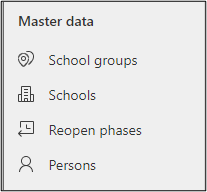
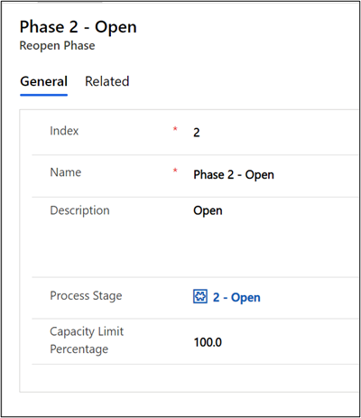
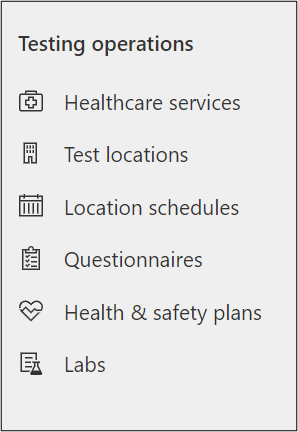
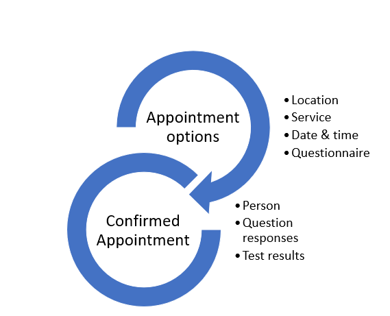
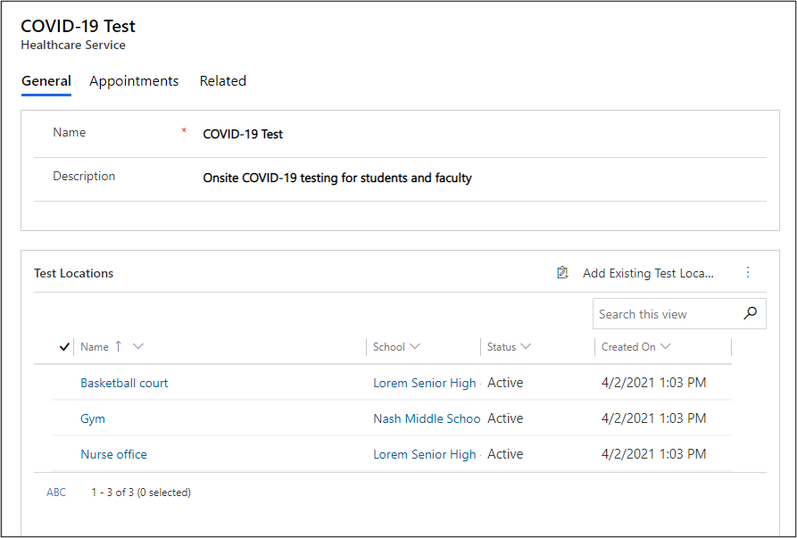

The Return to School apps have several settings to configure. Some of these items can be found in the Return to School Management app and others are configured in the portal management app or portal studio.

## Return to School management

The following configurations are completed in the **Return to School Management** model-driven app, in the **Solutions Settings** area. You can navigate to this area from the selector at the bottom left of the app as shown in the image below.

> [!div class="mx-imgBorder"]
> 

### General settings

**General settings** is a record you create that holds important data to help define options for the user experience. Items such as the text in the **General Terms and Agreement**, **Health Terms and Agreement**, or **Resources Text** columns allow you to place formatted text using HTML. Other information you may include on this record include:

|     Information                                |     Details                                                                                                                                                                                                   |
|------------------------------------------------|---------------------------------------------------------------------------------------------------------------------------------------------------------------------------------------------------------------|
|     Name                                       |     Name the solution settings record.                                                                                                                                                                        |
|     Portal header                              |     The text that will be displayed in the header of the portal   application.                                                                                                                                |
|     Daily passes                               |     Set to Yes to enable the Daily Passes menu item on the portal   application's home page.                                                                                                                  |
|     Allow storing of negative health checks    |     Set to Yes to have the application create a record when a user   does not agree to the attestation statement so you can follow up with that   user later.                                                 |
|     Allow QR codes                             |     Set to Yes to have the application add a QR code to the daily   pass.  If your facility or guests do   not have the equipment to support scanning of codes, make sure to select No   for this setting.    |
|     Allow users to register dependents         |     Enables users to register guests under their contact.                                                                                                                                                     |
|     Testing supported                          |     Enables booking of an appointment, submission of test results, and   viewing test results.                                                                                                                |

### Master data

Also in the Solution Settings area, you configure your Master Data. This will include details about your schools, school groups, reopen phases and persons.

> [!div class="mx-imgBorder"]
> 

#### Schools and school groups

Schools can belong to school groups. School groups allow you to organize in a logical way, schools that might have similar characteristics and similar reopening phases. One example would be to group schools by grade levels, as different ages may have different reopening phases based on regional guidelines. Or, if a school district crosses county lines, they may wish to group schools by geography instead.

For an individual school you will capture standard information such as location, but also other data specific to our purposes of enabling you to define your safe return criteria. A school record will also include its reopen phase, test locations, and more captured on the record.

> [!div class="mx-imgBorder"]
> 

#### Reopen phases

As you plan your reopening, you can capture those requirements here and build out the supporting information to allow you to enforce expected policy for staff and guests to return to school. There are several steps to creating and managing the reopening phase records. Before you can add guidance or automation, you must first define the phases. A phase will contain a relationship to the process stage and a capacity limit that will be used for calculations and policy enforcement.

> [!div class="mx-imgBorder"]
> 

#### Persons

Persons tracked here are contacts. In addition to the standard contact data you might expect, in this solution you will find portal access settings, dependent information, and a record of their access, notification, appointments, test results and other related records to support their return. To invite a person to use the portal, set the Requires portal access to Yes.

> [!div class="mx-imgBorder"]
> 

### Testing operations

As part of the reopening of your school, you may set up testing operations. You can configure and set up options in the testing operations group of the solutions setting area.

> [!div class="mx-imgBorder"]
> 

The exact configuration of the test plans can vary, but all share some common elements. You will create the options such as locations and services offered at a location; available time slots for appointments, and the questions for the user questionnaire that is presented during the appointment booking process. You will build and maintain the appointment options that are presented to persons wanting an appointment. Once the appointment is confirmed that record will contain their question responses and test results once available.

> [!div class="mx-imgBorder"]
> 

#### Configure healthcare services

The system will allow you to build the services offered for any given location. In the example shown here, we have configured a service for COVID-19 testing. You might also want to build a service for temperature checks to take place in another room of the school. Each service can happen at any location you have created. Once you have created the services offered, you do not have to add more items here unless you add services.

> [!div class="mx-imgBorder"]
> 

#### Configure test locations

The test location will define what services are offered there. You will also have the related records for schedules and appointments. Once your list of locations is completed, you won't have to add more records unless you add more testing locations.

> [!div class="mx-imgBorder"]
> 

#### Configure test location schedule 

Each location will have its own schedule. Any given school can have more than one location available for services and appointments, and each one will need to have its appointments and timeslots configured. These schedules will need to be kept up to date. You may add or remove capacity and that may affect appointment availability. Consider creating a regular cadence of options based on anticipated needs. Persons wanting an appointment will be bound by the constraints you define here.

> [!div class="mx-imgBorder"]
> 

#### Configure questionnaires and questions

When a person wanting an appointment is in the process of booking that appointment, they will be presented with a list of questions to complete prior to the appointment being finalized. These questions are based on the service selected. In our example, we have questions being asked as it relates to testing and potential exposure. If you added another service, you would likely need different questions and you can define those different questions for a new service.

> [!div class="mx-imgBorder"]
> 

## Return to School portal user configuration

The Return to School portal allows administrators to provide an easy-to-use web-based way to register and manage building access. This portal is intended to be simple to set-up and use. To learn more about more advanced options for customizing portals, visit this [Learning Path](https://docs.microsoft.com/learn/paths/work-power-apps-portals/?azure-portal=true).

Configuration of some features has already been completed via the model-driven app Back to School. There is where you enable and disable features for Daily Passes, QR Codes, and Dependent's Access. It is also the data in that app that will be available here for users such as contact information, schools, school access, appointments, and more.

Because the portal may contain some sensitive information, one of the first things you will do is provide access only to properly authenticated users. Those authenticated users come perform the following tasks:

-   Create a pass

-   View existing passes

-   Book an appointment

-   Submit test results

-   Register dependents

-   View appointments

-   View test results

-   View resources

-   Update their profile

Detailed steps for configuring the portal authentication can be found [here](https://docs.microsoft.com/dynamics365/industry/return-to-school/portal-app#authenticated-access-to-the-portal/?azure-portal=true).

