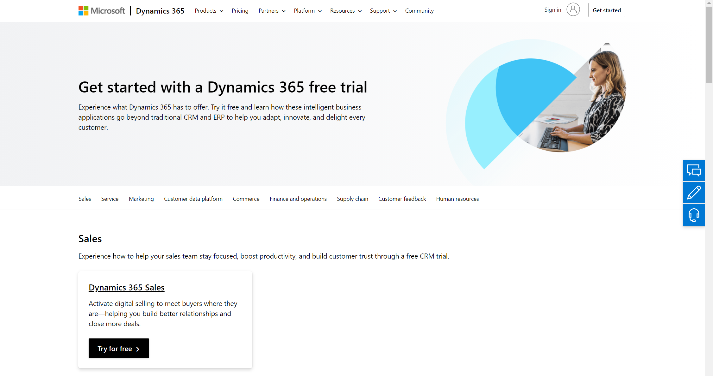
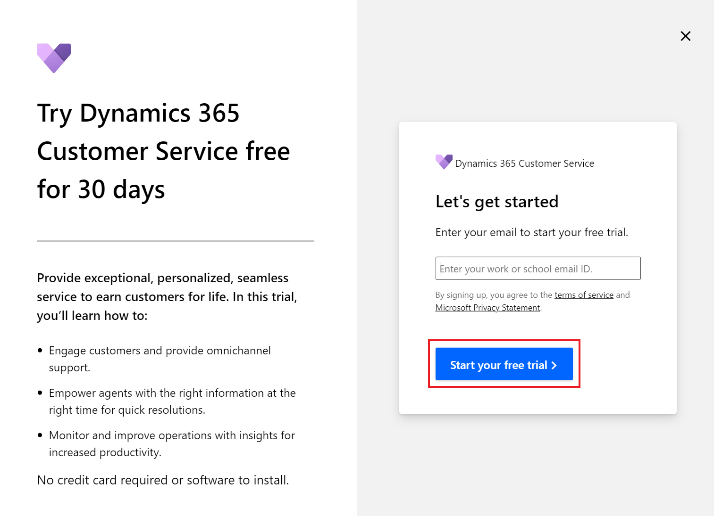
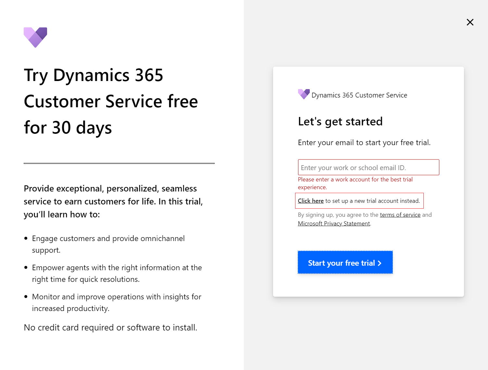
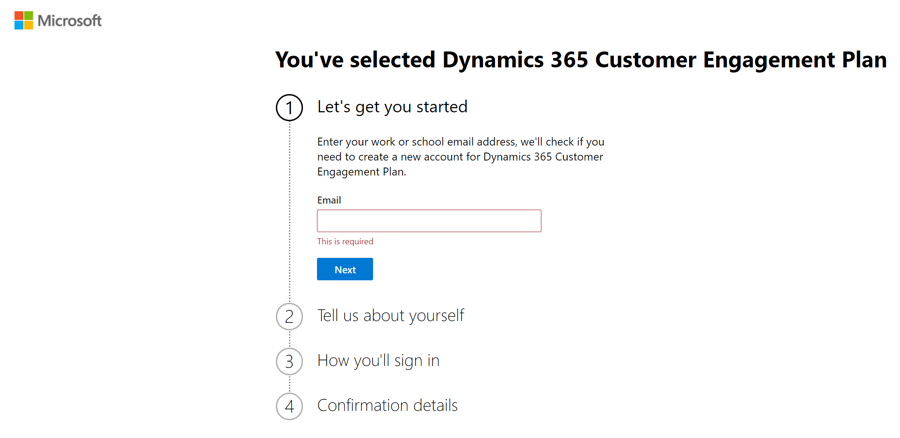
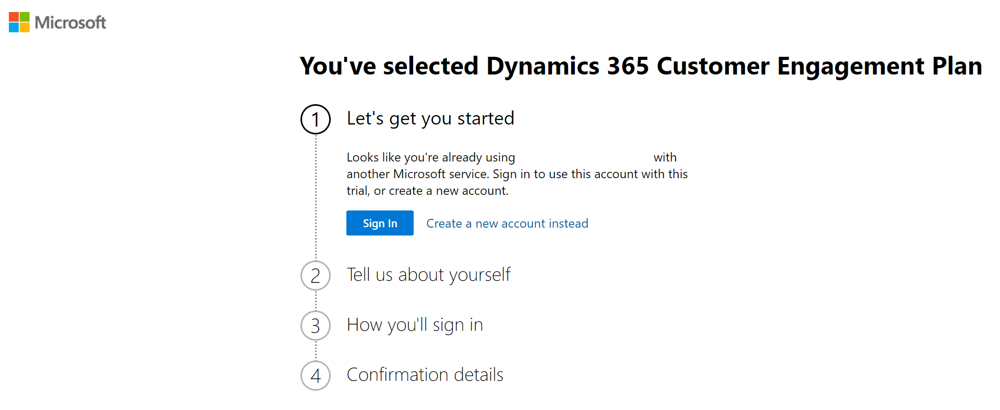
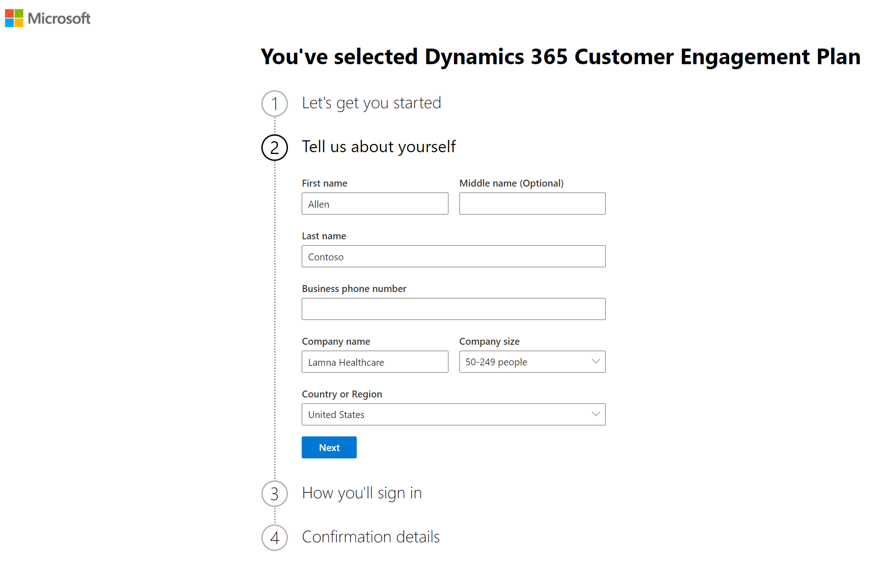
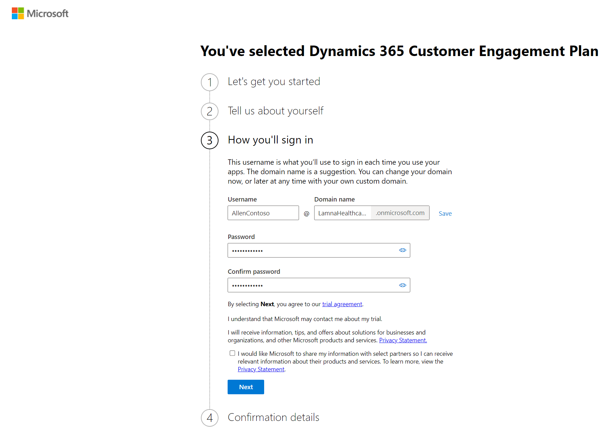
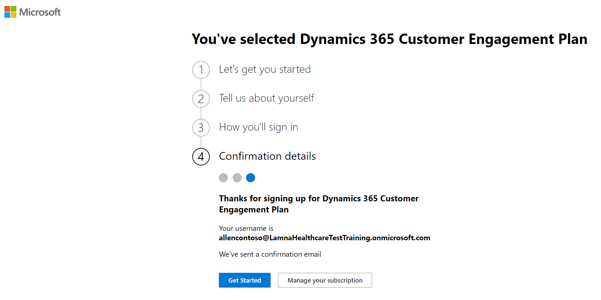

To deploy Microsoft Cloud for Healthcare in a Microsoft Dataverse environment, you need to add a tenant and the prerequisite licenses. 

In this exercise, you will learn how to create a demo tenant. You can skip this exercise if you have already created a demo tenant and added the trial licenses.

## Create a Microsoft 365 tenant 

In this task, you will learn how to create a trial tenant along with the required Microsoft Dynamics 365 and Microsoft 365 trial licenses. You can skip this task if you already have a tenant. 

1.  Open an internet browser in In-Private or Incognito mode. 

1.  Go to [https://trials.dynamics.com](https://trials.dynamics.com/?azure-portal=true), scroll down, and select **Try for free** in the **Dynamics 365 Customer Service** card. 

	> [!div class="mx-imgBorder"]
	> 

	> [!div class="mx-imgBorder"]
	> 

1.  A pop-up window will appear, asking you to enter your email address to start the free trial. Leave the **Email ID** field blank and select **Start your free trial**. 

	> [!div class="mx-imgBorder"]
	> 

1.  You will be shown an error asking to provide a valid work or school email ID with a link below to select and set up a new trial account instead. Select the link **Click here to set up a new trial account instead**. 

	> [!div class="mx-imgBorder"]
	>   

1.  This will lead to a new account creation flow for Dynamics 365 Customer Engagement Plan. Get started by entering your email address. 

	> [!div class="mx-imgBorder"]
	> 

1.  If the email is already using other Microsoft Services, it will throw the following warning:
"Looks like you're already using \[email\] with another Microsoft service. Sign in to use this account with this trial, or create a new account." Select \"**Create a new account instead**\".

	> [!div class="mx-imgBorder"]
	>  

1.  After selecting **Create a new account instead**, it will ask for more details. Provide the necessary information. Enter a valid phone number where you can receive text message to validate the sign-up process.  

	> [!div class="mx-imgBorder"]
	>    

1.  Once the verification completes, request a valid domain name. Enter a username and password and select Next.

	> [!div class="mx-imgBorder"]
	>    

Your Microsoft 365 tenant has been successfully created, along with the Dynamics 365 Customer Engagement Plan license that includes a Microsoft Power Apps license. 

> [!div class="mx-imgBorder"]
> 

You have successfully set up your Dynamics 365 trial environment. In the next module, we will show you how to obtain the various trial licenses that are required to fully run the Microsoft Cloud for Healthcare.
