Microsoft Cloud for Healthcare relies on various components from Dynamics 365, Microsoft 365, and Microsoft Azure. In turn, these components highlight various capabilities in Microsoft Cloud for Healthcare. To use these capabilities, you will need to obtain the following trial licenses:

|     Microsoft Cloud for Healthcare Capability      |     Required   Microsoft Technology License     |
|----------------------------------------------------|-------------------------------------------------|
|     Patient Insights                               |     Dynamics 365 Sales                          |
|     Microsoft Cloud for Healthcare (all   apps)    |     Microsoft Cloud for Healthcare              |
|     Patient Outreach                               |     Dynamics 365 Marketing                      |
|     Patient Service Center                         |     Omnichannel Customer Service   Messaging    |
|     Virtual Visits                                 |     Microsoft Teams                             |

## Task 1: Obtain the Dynamics 365 Customer Service Digital Messaging add-on trial

In this task, we will add the necessary add-on to deploy and use the Patient Service Center application.

1.  Go to [Microsoft 365 admin center](https://admin.microsoft.com/?azure-portal=true).

1.  Go to **Billing > Purchase services**, select **Add-ons** under “View by category”. You may also use the search box. Find the Customer Service Digital Messaging add-on and select **Details**.

	> [!div class="mx-imgBorder"]
	> [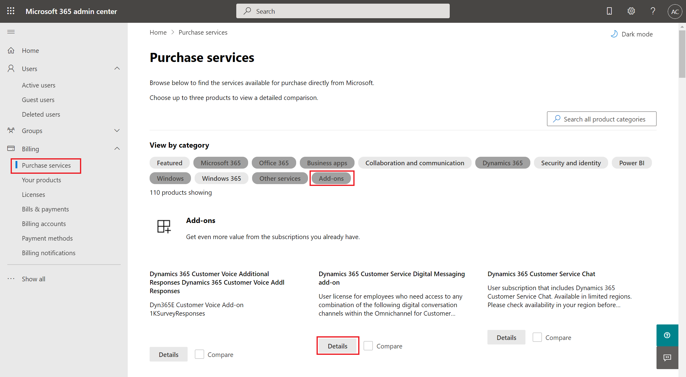](../media/details.png#lightbox)

1.  Select **Start free trial**.

	> [!div class="mx-imgBorder"]
	> 

1.  Select **Try now** and then select **Continue** to return to the admin center.

	> [!div class="mx-imgBorder"]
	> [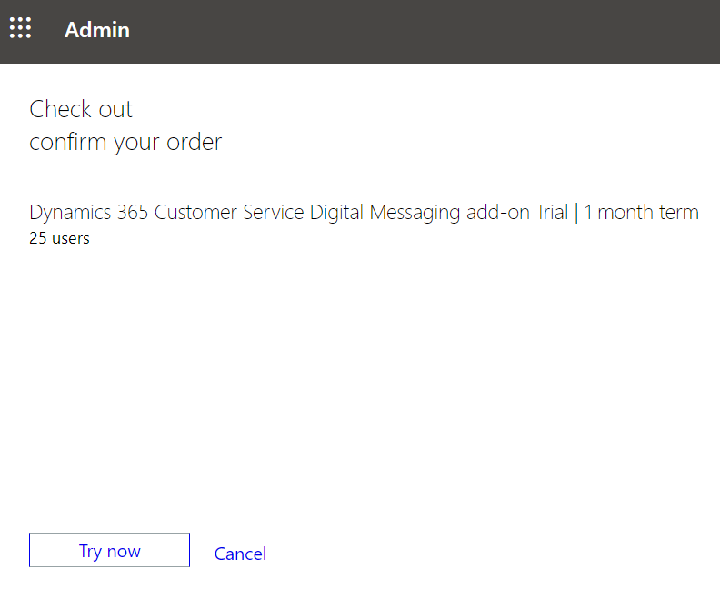](../media/try-now.png#lightbox)

	> [!div class="mx-imgBorder"]
	> [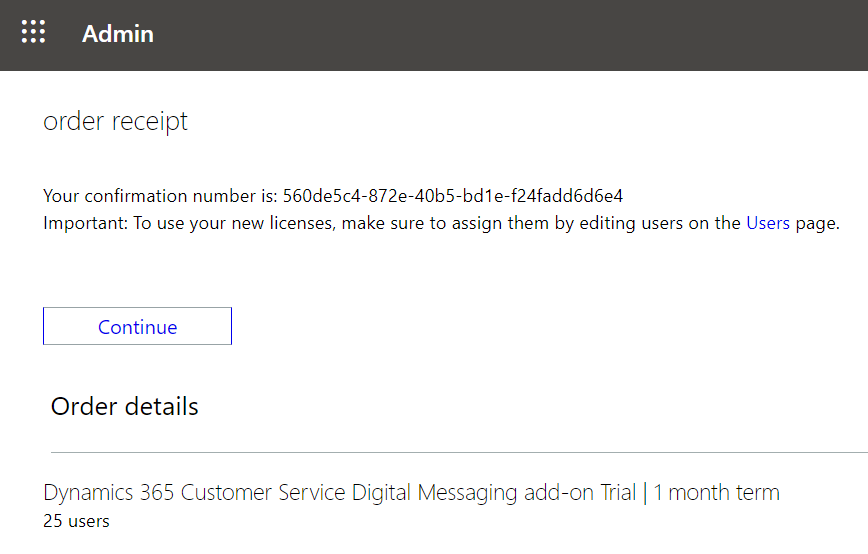](../media/continue.png#lightbox)

1.  Assign the newly acquired Customer Service Digital Messaging add-on trial license to your user by going to **Users > Active users**. Select your user and then select **Manage product licenses**.

	> [!div class="mx-imgBorder"]
	> 

1.  Select the **Dynamics 365 Customer Service Digital Messaging add-on** license and then select **Save changes**.

	> [!div class="mx-imgBorder"]
	> [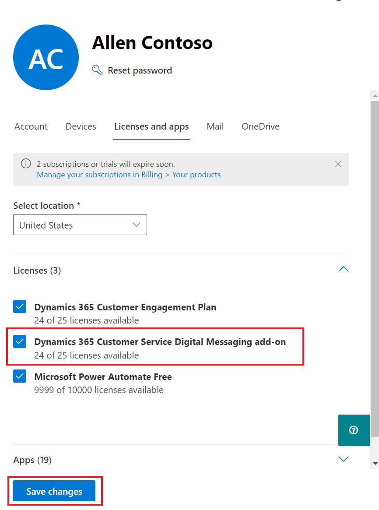](../media/digital-messaging.png#lightbox)

> [!NOTE]
> It may take up to 24 hours for Omnichannel for Customer Service to become available in your Dynamics 365 apps after you obtain the trial license.

## Task 2: Obtain a Microsoft Office E5 trial

In this task, we will add the necessary Office 365 trial to use Microsoft Teams for Virtual Visits.

1.  Go to [Microsoft 365 admin center](https://admin.microsoft.com/?azure-portal=true).

1.  Go to **Billing > Purchase Services**, select **Office 365**, scroll down to **Office 365 E5**, and then select **Details**. You may also use the upper right search box.

	> [!div class="mx-imgBorder"]
	> [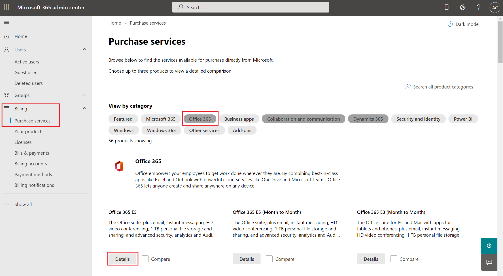](../media/purchase-services.png#lightbox)

1.  Select **Start free trial**.

	> [!div class="mx-imgBorder"]
	> 

1.  Enter a **valid phone number** to prove that you're not a robot, select **Try now** to start your free trial, and then select **Continue** to return to the admin center.

	> [!div class="mx-imgBorder"]
	> [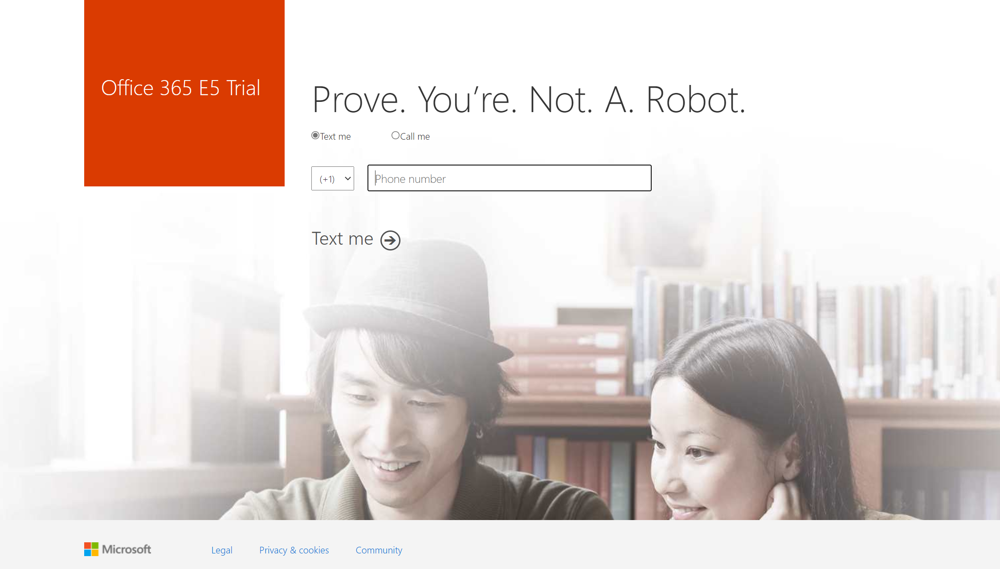](../media/phone-number.png#lightbox)

	> [!div class="mx-imgBorder"]
	> [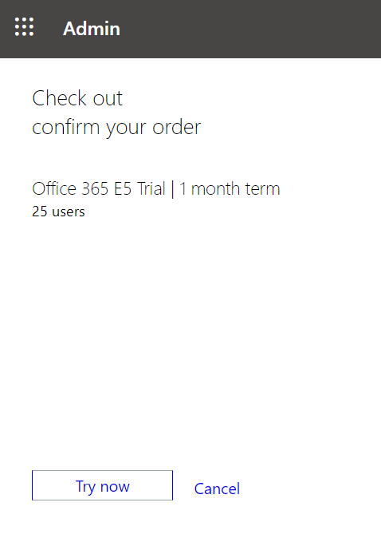](../media/try-now-button.png#lightbox)

	> [!div class="mx-imgBorder"]
	> 

1.  Assign the newly acquired Office 365 E5 trial license to your user by going to **Users > Active users**. Select your user and then select **Manage product licenses**.

	> [!div class="mx-imgBorder"]
	> 

1.  Select the **Office 365 E5** license and then select **Save changes**.

	> [!div class="mx-imgBorder"]
	> 

## Task 3: Obtain a Microsoft Cloud for Healthcare trial license

In this task, we will request and add the Microsoft Cloud for Healthcare add-on to deploy and use all the capabilities it provides.

1.  Go to [Microsoft Forms](https://aka.ms/MCHTrial/?azure-portal=true) and fill out the required information in the **Trial Request for Microsoft Cloud for Healthcare** form.

1.  You will receive an email with a URL that contains an offer code that you can use to claim a 30-day trial license for Microsoft Cloud for Healthcare. After you have received that email, copy the URL, open a new tab while signed in to your tenant, and then paste the URL.

1.  Enter the **email address** that is associated with your tenant and then select **Next**.

	> [!div class="mx-imgBorder"]
	> [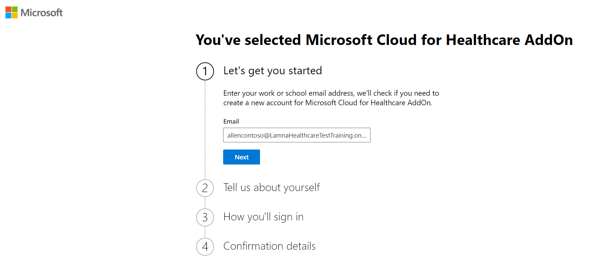](../media/email-address.png#lightbox)

1.  Select **Sign in > Try now > Continue**.

	> [!div class="mx-imgBorder"]
	> [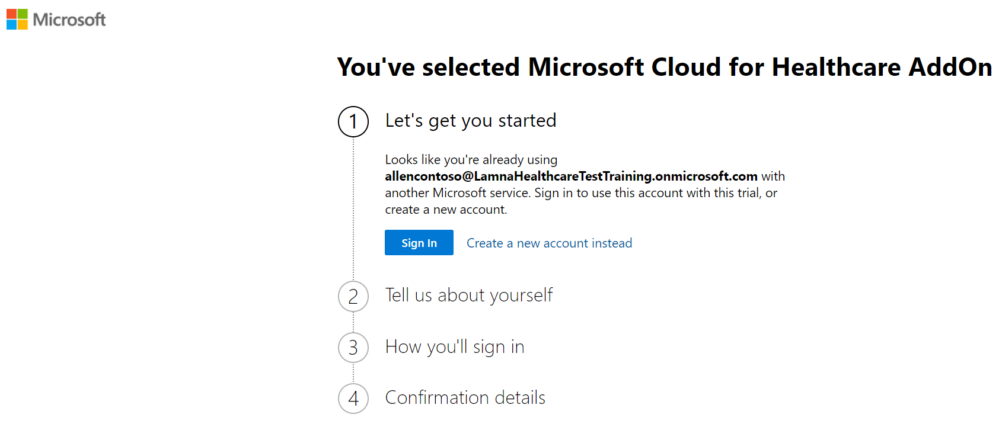](../media/sign-in-button.png#lightbox)

	> [!div class="mx-imgBorder"]
	> [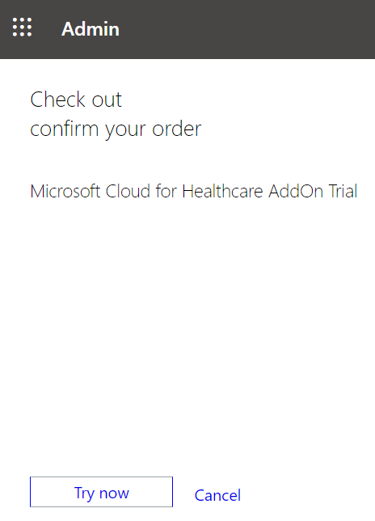](../media/try.png#lightbox)

	> [!div class="mx-imgBorder"]
	> [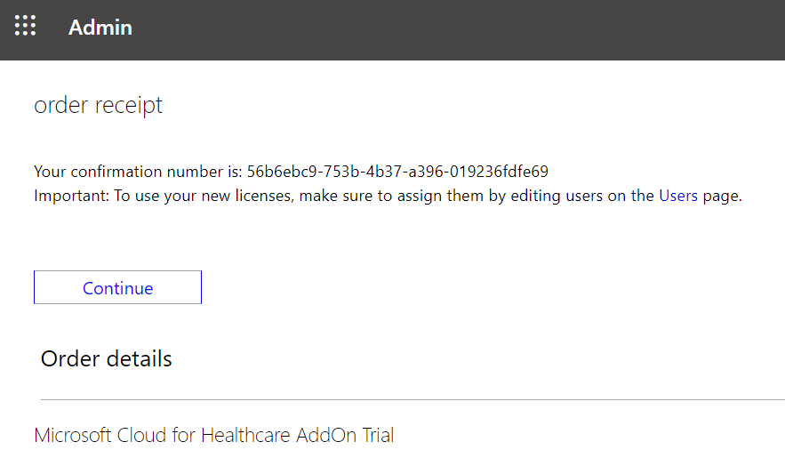](../media/order-receipt-continue.png#lightbox)

1.  Assign the newly acquired **Microsoft Cloud for Healthcare AddOn Trial** license to your user by going to **Users > Active users**. Select your user and then select **Manage product licenses**.

	> [!div class="mx-imgBorder"]
	> 

1.  Select the **Microsoft Cloud for Healthcare AddOn** license and then select **Save changes**.

	> [!div class="mx-imgBorder"]
	> [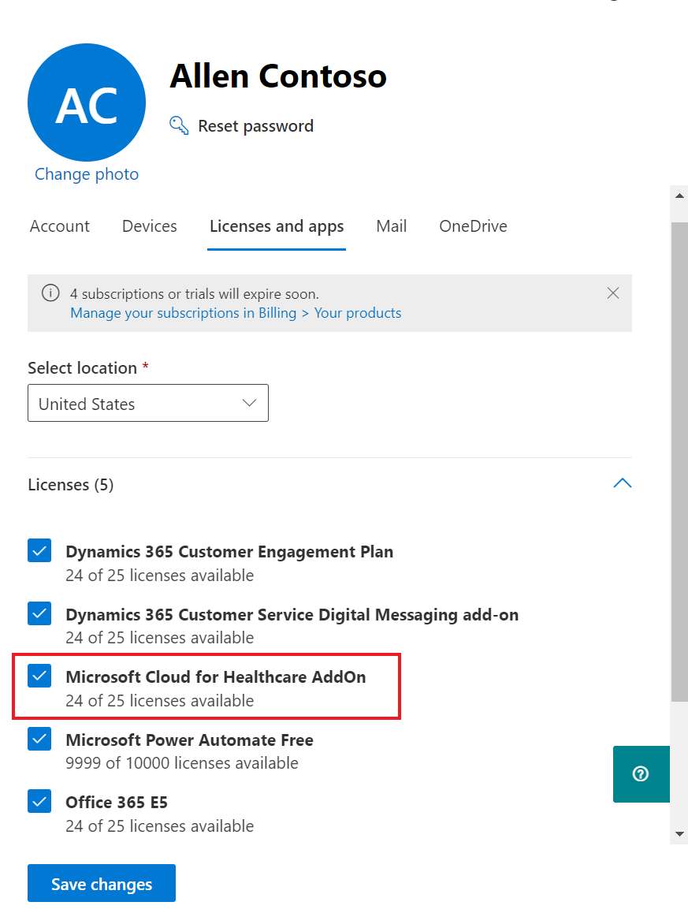](../media/healthcare.png#lightbox)

## Task 4: Obtain a Dynamics 365 Marketing trial

In this task, we will obtain a trial license for Dynamics 365 Marketing to deploy and use the Patient Outreach application. The environment created in this task will be the one used to complete the training labs. We will continue to add other necessary applications to this environment in the next task.

1.  Make sure that you are signed in to your Microsoft 365 tenant and then go to the [trial overview page](https://dynamics.microsoft.com/marketing/overview/?azure-portal=true). Select the **Try for free** button.

	> [!div class="mx-imgBorder"]
	> [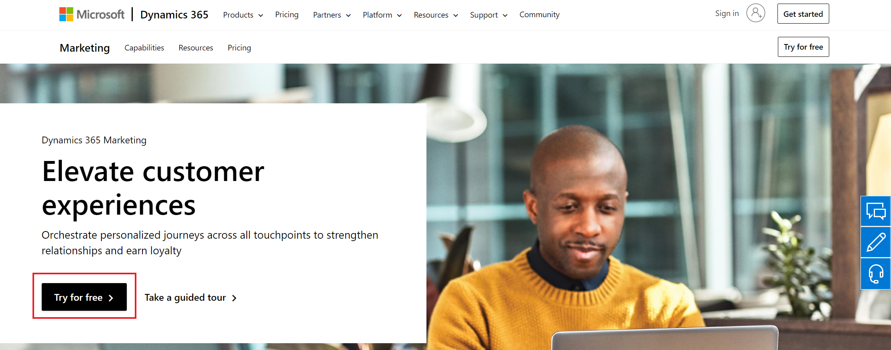](../media/trial-button.png#lightbox)

1.  Enter the same email address that is associated with your Microsoft 365 tenant and then select **Start your free trial**.

	> [!div class="mx-imgBorder"]
	> [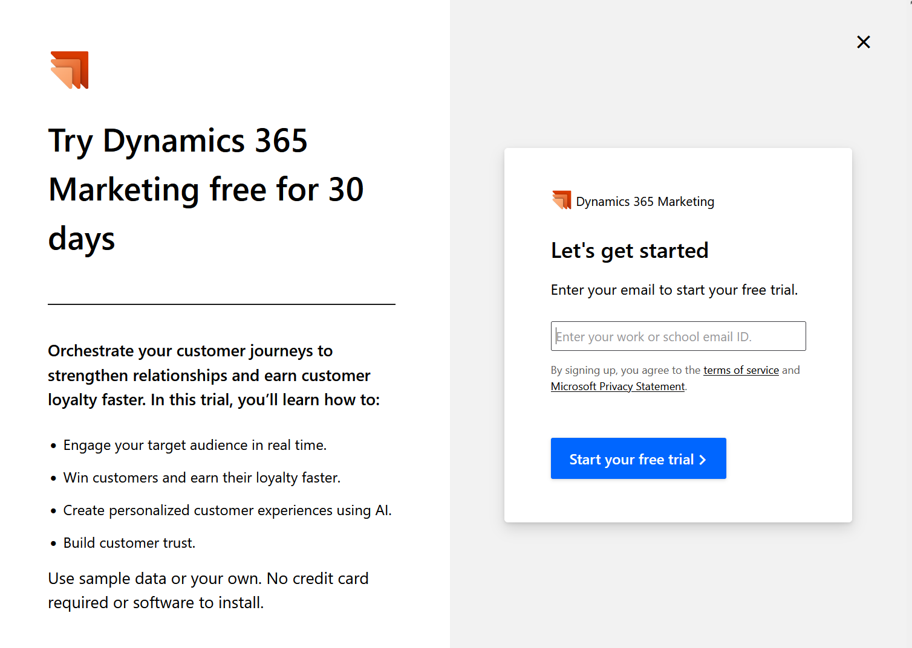](../media/free-trial.png#lightbox)

1.  Select **United States** as your **Country/region**, enter a valid phone number, and then select **Submit**.

	> [!div class="mx-imgBorder"]
	> [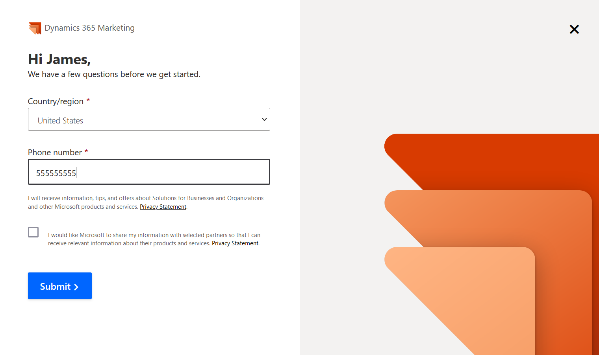](../media/submit.png#lightbox)

	> [!div class="mx-imgBorder"]
	> 

    You will now be directed to your newly created Dynamics 365 Marketing trial environment.

	> [!div class="mx-imgBorder"]
	> [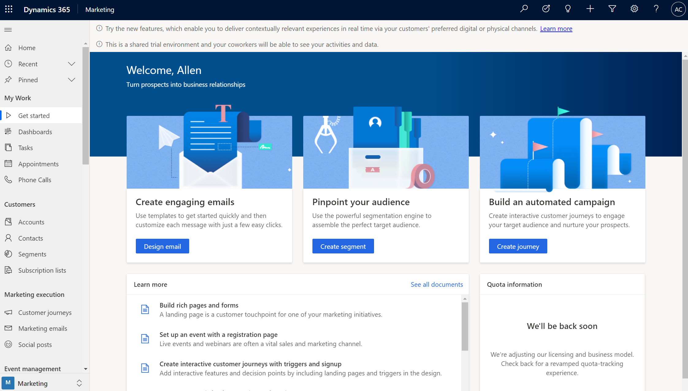](../media/environment.png#lightbox)

1.  Now that Dynamics 365 Marketing trial has been created, you can go to [Microsoft Power Platform admin center](https://admin.powerplatform.microsoft.com/?azure-portal=true) in your tenant to make more changes. Go to the admin center to find your newly created Marketing trial in the environments list and then open it.

	> [!div class="mx-imgBorder"]
	> 

1.  Edit the name of the environment to better reflect the training purposes of this module. In the environment **Details** section, select **Edit**.

	> [!div class="mx-imgBorder"]
	> [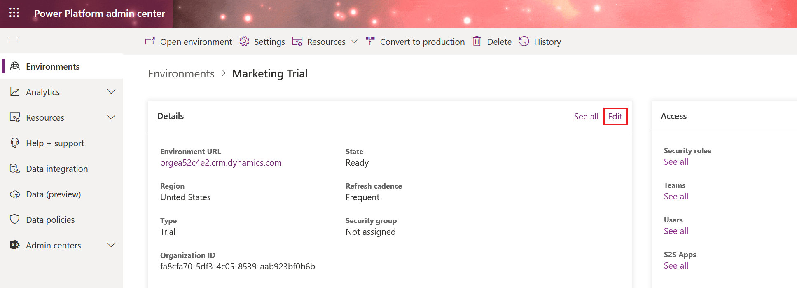](../media/edit.png#lightbox)

1.  Enter a valid name and URL for the environment and then select **Save**.

	> [!NOTE]
	> As of this posting, Microsoft Cloud for Healthcare is only available in select regions.  For more information, see [International availability of Microsoft Cloud for Healthcare](/industry/healthcare/availability/?azure-portal=true). 

	> [!div class="mx-imgBorder"]
	> [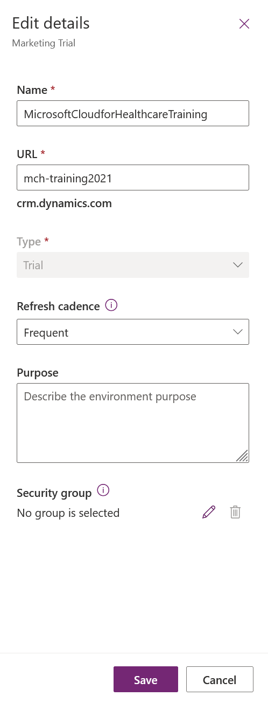](../media/edit-details.png#lightbox)

## Task 5: Enable Dynamics 365 apps

In this task, we will enable Microsoft Dynamics 365 Field Service and Microsoft Dynamics 365 Sales on the newly created environment. These apps are required to utilize the Home Health and Health Assistant apps in Microsoft Cloud for Healthcare.

1.  In [Microsoft Power Platform admin center](https://admin.powerplatform.com/?azure-portal=true), expand **Resources** and go to **Dynamics 365 apps** to search for available apps at the tenant level.

	> [!div class="mx-imgBorder"]
	> 

1.  In the upper right search bar, search for **Field Service** and then select **Install**.

	> [!div class="mx-imgBorder"]
	> 

1.  Select your newly created trial environment from the dropdown menu, agree to the terms, and then select **Install**.

	> [!div class="mx-imgBorder"]
	> [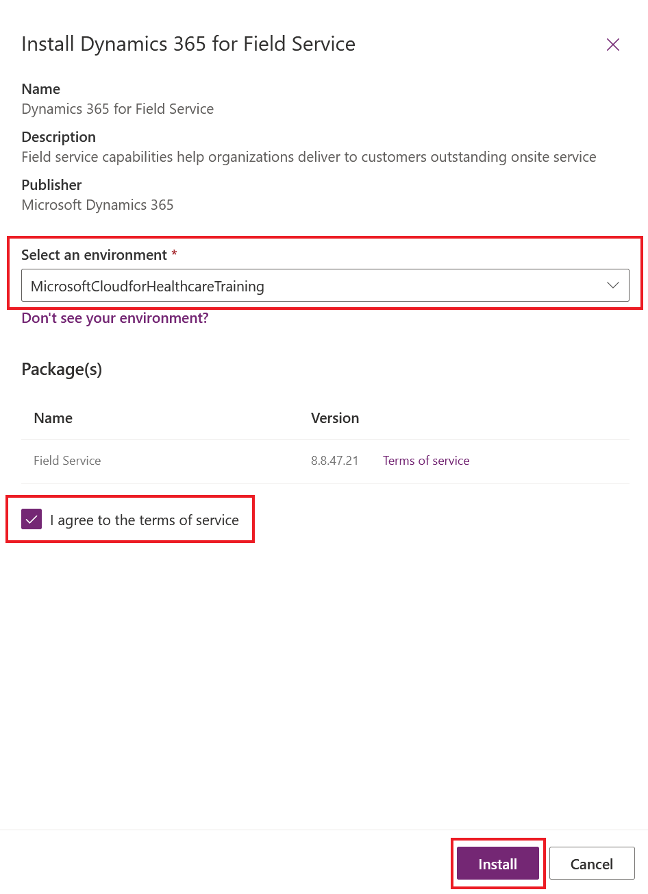](../media/terms.png#lightbox)

1.  Return to **Dynamics 365 apps** under the **Resources** menu and then search for **Sales**.

	> [!div class="mx-imgBorder"]
	> 

	> [!div class="mx-imgBorder"]
	> 

1.  Select your newly created trial environment from the dropdown menu, agree to the terms, and then select **Install**.

	> [!div class="mx-imgBorder"]
	> [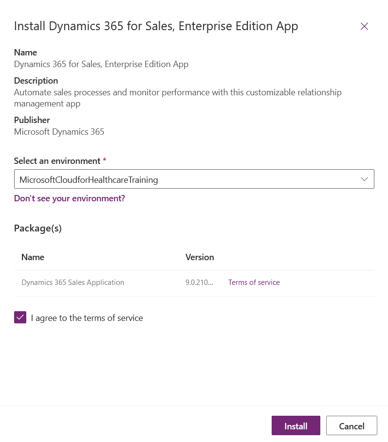](../media/environment-terms-install.png#lightbox)

1.  Track your installs on your environment's Dynamics 365 apps page. These installs will take several hours to complete.

	> [!div class="mx-imgBorder"]
	> 

You successfully added the necessary trial licenses to your training environment. Once they have completed installation, you may proceed to the next exercise to configure the remaining prerequisite applications and deploy Microsoft Cloud for Healthcare.

