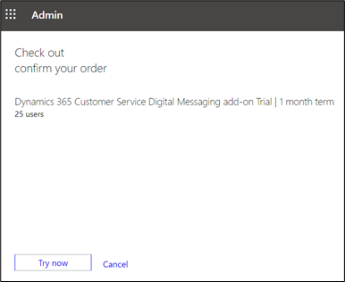
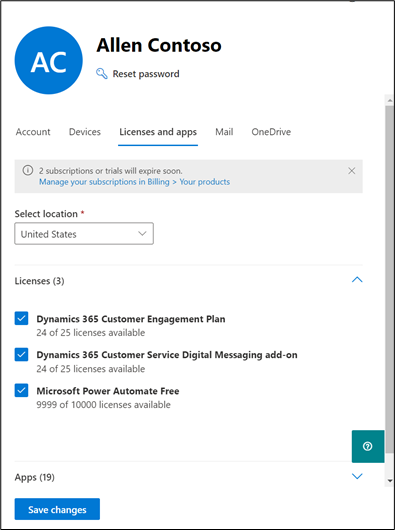
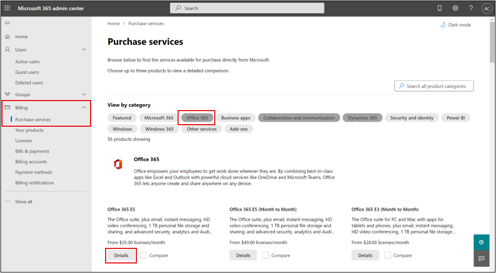
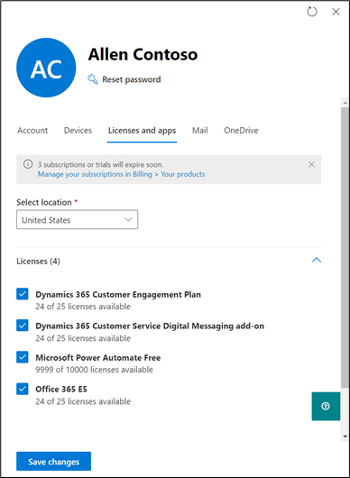

Microsoft Cloud for Financial Services relies on various components from Dynamics 365 and Microsoft 365. In turn, these components light up various capabilities in the Microsoft Cloud for Financial Services. To light up these capabilities, we'll need to obtain the following trial licenses:

| Capability | License |
|------------|---------|
| Unified Customer Profile | PowerApps, Dynamics Customer Insights (optional) |
| Customer onboarding | Power Apps, Power Automate |
| Collaboration Manager for Loans | Office E3+ |
| Banking Customer Engagement | Dynamics Customer Service with Omnichannel |

## Task 1: Create a database

In this task, we'll walk through the steps to obtain a trial license for Microsoft Teams to enable the Collaboration Manager for Loans capability in Microsoft Cloud for Financial Services.

1. Navigate to [https://make.powerapps.com](https://make.powerapps.com/?azure-portal=true) and in the left navigation, select **Solutions**. Then select **Create a database**.

    > [!div class="mx-imgBorder"]
    > 

1. Set currency = **USD** and language = **English** and select **Create my database**.

    > [!NOTE]
    > As of this posting, Microsoft Cloud for Financial Service is only available in the **United States** and **United Kingdom** regions.

    > [!div class="mx-imgBorder"]
    > 

## Task 2: Enable Dynamics 365 apps

In this task, we'll install Customer Service in our newly created environment. This app is required to use the Banking Customer Engagement app in Microsoft Cloud for Financial Services.

1. In the Power Platform admin center, expand Resources and go to Dynamics 365 apps.

    > [!div class="mx-imgBorder"]
    > 

1. Search for "Customer Service Enterprise Trial "and select **Install**.

    > [!div class="mx-imgBorder"]
    > 

1. Select your newly created environment from the drop-down menu, agree to the terms, and select **Install**.

    > [!div class="mx-imgBorder"]
    > 

The install can take a couple of hours.

## Task 3: Obtain Dynamics 365 Customer Service Digital Messaging add-on trial

1. Go to the [Microsoft 365 Admin Center](https://admin.microsoft.com/?azure-portal=true).

1. Go to **Billing** > **Purchase Services**, select **Add-ons**, find the Customer Service Digital Messaging add-on and select **Details**.

    > [!div class="mx-imgBorder"]
    > 

1. Select **Start free trial**.

    > [!div class="mx-imgBorder"]
    > 

1. Select **Try now**, then select **Continue** to return to the Admin center.

    > [!div class="mx-imgBorder"]
    > 

    > [!div class="mx-imgBorder"]
    > 

1. Assign the newly acquired Customer Service Digital Messaging add-on trial license to your user by going to **Users** > **Active Users**, select your user and select **Manage product licenses**.

    > [!div class="mx-imgBorder"]
    > 

1. Select the **Dynamics 365 Customer Service Digital Messaging add-on** license and select **Save**.

    > [!div class="mx-imgBorder"]
    > 

## Task 4: Obtain a Microsoft Office 365 E5 trial

1. Go to the [Microsoft 365 admin center](https://admin.microsoft.com/?azure-portal=true).

1. Go to **Billing** > **Purchase Services**, select **Office 365**, scroll down to Office 365 E5, and select **Details**.

    > [!div class="mx-imgBorder"]
    > 

1. Select **Start free trial**.

    > [!div class="mx-imgBorder"]
    > 

1. Enter a **valid phone number** to prove you're not a robot, select **Try now** to start your free trial, and then select **Continue** to return to the Admin center.

    > [!div class="mx-imgBorder"]
    > 

    > [!div class="mx-imgBorder"]
    > 

    > [!div class="mx-imgBorder"]
    > 

1. Assign the newly acquired Office E5 trial license to your user by going to **Users** > **Active Users**, select your user and select **Manage product licenses**.

    > [!div class="mx-imgBorder"]
    > 

1. Select the **Office 365 E5** license and select **Save changes**.

    > [!div class="mx-imgBorder"]
    > 

## Task 6: Obtain a Microsoft Cloud for Financial Services trial license

1. To obtain a trial license for Microsoft Cloud for Financial Services, navigate to this Microsoft Form and fill out the required information: [Trial Request for Microsoft Cloud for FSI](https://aka.ms/FSITrial/?azure-portal=true).

1. You'll then receive an email with a URL that contains an offer code. Use it to claim a 30-day trial license for Microsoft Cloud for Financial Services. Once you receive that email, copy the URL, open a new tab while logged into your tenant and paste the URL.

1. Enter the **email address** associated with your tenant, and select **Next**.

    > [!div class="mx-imgBorder"]
    > 

1. Select **Sign In**, select **Try now**, and **Continue**.

    > [!div class="mx-imgBorder"]
    > 

    > [!div class="mx-imgBorder"]
    > 

    > [!div class="mx-imgBorder"]
    > 

1. Assign the newly acquired Microsoft Cloud for Healthcare Addon trial license to your user by going to **Users > Active Users**, select your user and select **Manage product licenses**.

1. Select the **Microsoft Cloud for Healthcare Addon** license and select **Save changes**.

    > [!div class="mx-imgBorder"]
    > 
