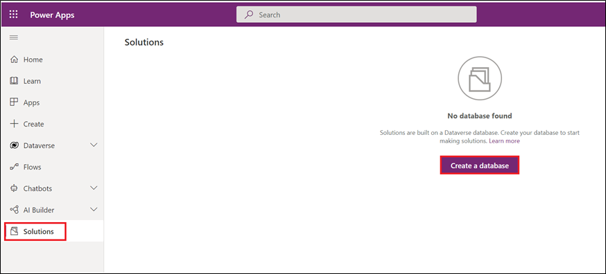
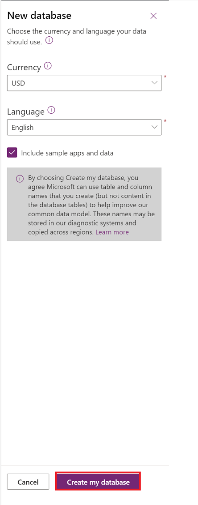
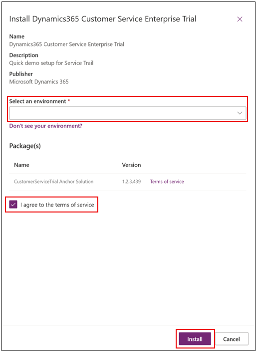
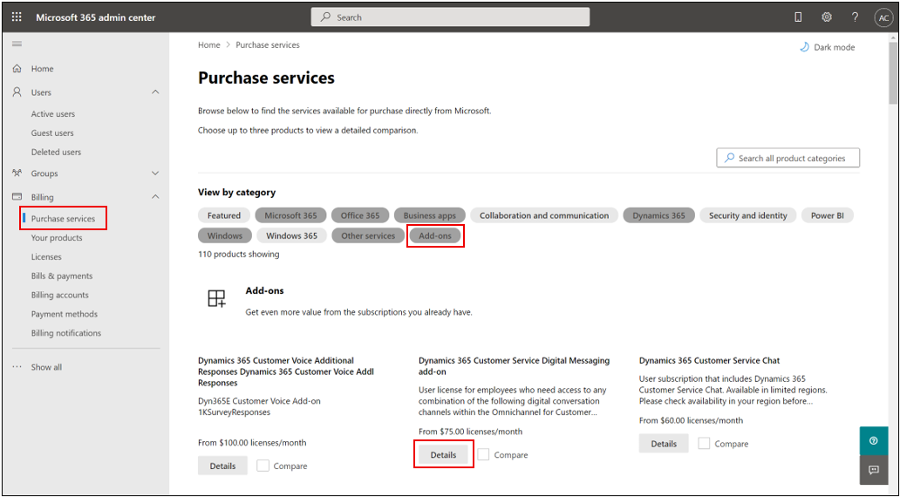
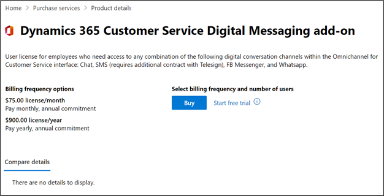
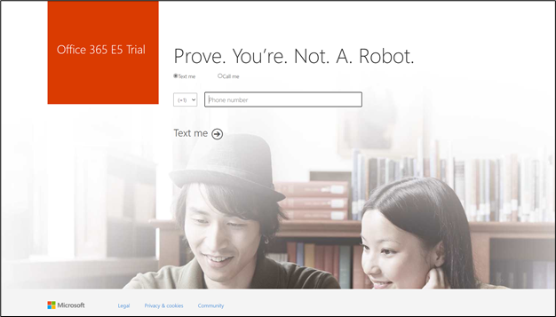
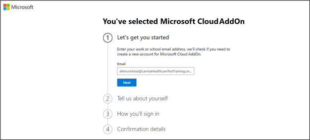
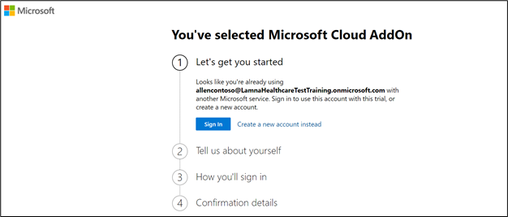
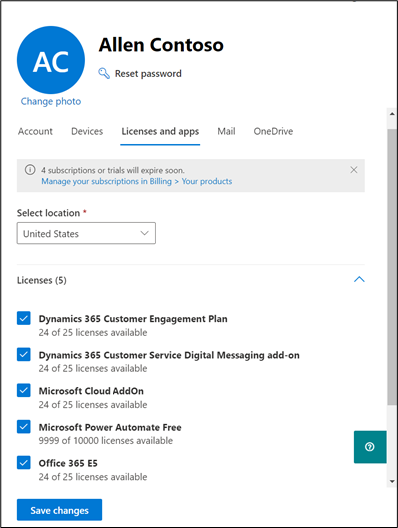

Microsoft Cloud for Financial Services relies on various components from Dynamics 365 and Microsoft 365. In turn, these components highlight various capabilities in Microsoft Cloud for Financial Services. To activate these capabilities, you'll need to obtain the following trial licenses.

| Capability | License |
|------------|---------|
| Unified Customer Profile | Microsoft PowerApps, Microsoft Dynamics 365 Customer Insights (optional) |
| Customer onboarding | Microsoft Power Apps, Microsoft Power Automate |
| Collaboration Manager for Loans | Microsoft Office E3+ |
| Banking Customer Engagement | Omnichannel for Customer Service |

## Task 1: Create a database

Follow these steps to obtain a trial license for Microsoft Teams to enable the Collaboration Manager for Loans capability in Microsoft Cloud for Financial Services.

1. Go to [https://make.powerapps.com](https://make.powerapps.com/?azure-portal=true), and in the left navigation, select **Solutions > Create a database**.

    > [!div class="mx-imgBorder"]
    > 

1. Set the **Currency** option to **USD** and the **Language** option to **English**. Select **Create my database**.

    > [!NOTE]
    > As of this posting, Microsoft Cloud for Financial Services is only available in the **United States** and **United Kingdom** regions.

    > [!div class="mx-imgBorder"]
    > 

## Task 2: Enable Dynamics 365 apps

In this task, you'll install Microsoft Dynamics 365 Customer Service in your newly created environment. This app is required to use the Banking Customer Engagement app in Microsoft Cloud for Financial Services.

1. In Microsoft Power Platform admin center, expand **Resources** and then select **Dynamics 365 apps**.

    > [!div class="mx-imgBorder"]
    > 

1. Search for "Customer Service Enterprise Trial "and then select **Install**.

    > [!div class="mx-imgBorder"]
    > 

1. Select your newly created environment from the dropdown menu, agree to the terms, and then select **Install**.

    > [!div class="mx-imgBorder"]
    > 

The install can take a couple of hours.

## Task 3: Obtain the Dynamics 365 Customer Service Digital Messaging add-on trial

Follow these steps to obtain a free trial for the Dynamics 365 Customer Service Digital Messaging add-on:

1. Go to [Microsoft 365 admin center](https://admin.microsoft.com/?azure-portal=true).

1. Go to **Billing > Purchase services**, select **Add-ons**, find the Customer Service Digital Messaging add-on, and then select **Details**.

    > [!div class="mx-imgBorder"]
    > 

1. Select **Start free trial**.

    > [!div class="mx-imgBorder"]
    > 

1. Select **Try now** and then select **Continue** to return to Microsoft 365 admin center.

    > [!div class="mx-imgBorder"]
    > 

    > [!div class="mx-imgBorder"]
    > 

1. Assign the newly acquired Customer Service Digital Messaging add-on trial license to your user by going to **Users > Active users**. Select your user and then select **Manage product licenses**.

    > [!div class="mx-imgBorder"]
    > 

1. Select the **Dynamics 365 Customer Service Digital Messaging add-on** license and then select **Save changes**.

    > [!div class="mx-imgBorder"]
    > 

## Task 4: Obtain a Microsoft Office 365 E5 trial

Follow these steps to obtain a free trial for Microsoft Office 365 E5.

1. Go to [Microsoft 365 admin center](https://admin.microsoft.com/?azure-portal=true).

1. Go to **Billing > Purchase services** and then select **Office 365**. Scroll down to **Office 365 E5** and then select the **Details** button.

    > [!div class="mx-imgBorder"]
    > 

1. Select **Start free trial**.

    > [!div class="mx-imgBorder"]
    > 

1. Enter a valid phone number to prove that you're not a robot, select **Try now** to start your free trial, and then select **Continue** to return to Microsoft 365 admin center.

    > [!div class="mx-imgBorder"]
    > 

    > [!div class="mx-imgBorder"]
    > 

    > [!div class="mx-imgBorder"]
    > 

1. Assign the newly acquired Office E5 trial license to your user by going to **Users > Active users**. Select your user and then select **Manage product licenses**.

    > [!div class="mx-imgBorder"]
    > 

1. Select the **Office 365 E5** license and then select **Save changes**.

    > [!div class="mx-imgBorder"]
    > 

## Task 5: Obtain a Microsoft Cloud for Financial Services trial license

To obtain a trial license for Microsoft Cloud for Financial Services, follow these steps:

1.  Go to [Trial Request for Microsoft Cloud for FSI](https://aka.ms/FSITrial/?azure-portal=true) and fill out the required information.

1. You'll receive an email with a URL that contains an offer code. Use this code to claim a 30-day trial license for Microsoft Cloud for Financial Services. After you have received that email, copy the URL, open a new tab while signed in to your tenant, and then paste the URL.

1. Enter the email address that is associated with your tenant. Select **Next**.

    > [!div class="mx-imgBorder"]
    > 

1. Select **Sign In > Try now > Continue**.

    > [!div class="mx-imgBorder"]
    > 

    > [!div class="mx-imgBorder"]
    > 

    > [!div class="mx-imgBorder"]
    > 

1. Assign the newly acquired Microsoft Cloud for Healthcare Addon trial license to your user by going to **Users > Active users**. Select your user and then select **Manage product licenses**.

1. Select the **Microsoft Cloud for Healthcare Addon** license and then select **Save changes**.

    > [!div class="mx-imgBorder"]
    > 
