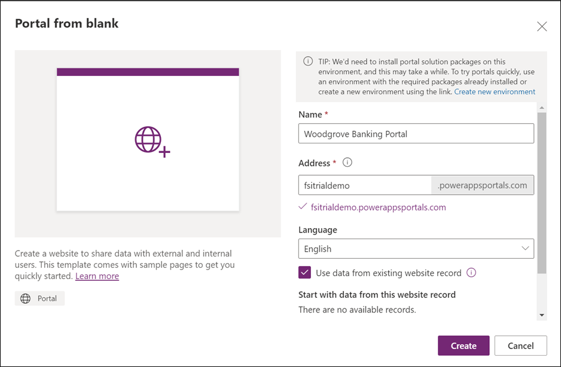
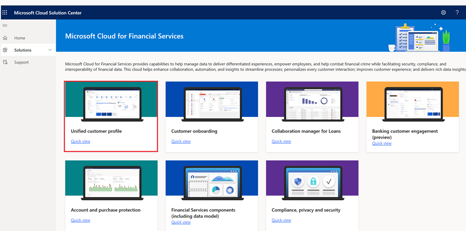
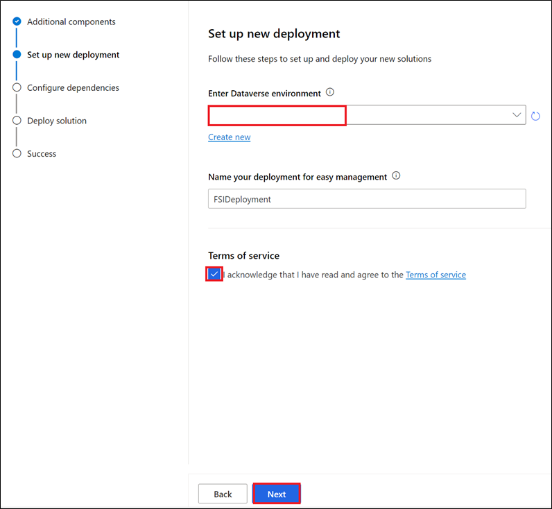
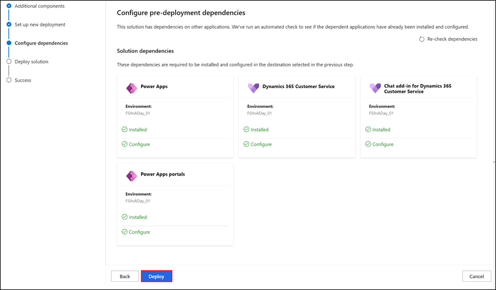

In this exercise, you'll deploy Microsoft Cloud for Financial Services in your Microsoft 365 tenant.

## Task 1: Create a Power Apps portal

In this task, you'll create a Power Apps portal that you can use as a sample portal by the Customer onboarding capability.

1. While signed in to your Microsoft 365 tenant, open a new tab and then go to [https://make.powerapps.com](https://make.powerapps.com/?azure-portal=true).

1. Change your **Environment** from default to the trial environment that you created in the previous section.

    > [!div class="mx-imgBorder"]
    > 

1. In the left navigation, select **Apps** and then select **+ New app > Portal**.

    > [!div class="mx-imgBorder"]
    > 

1. Set the following new portal properties and then select **Create**.

    - **Name** - Woodgrove Banking Portal

    - **Address** - fsitrialdemo

1. Select **Use data from existing website record**.

    > [!div class="mx-imgBorder"]
    > 

Your portal will provision in the background. This process will take several minutes, so you can pause before proceeding to the next task.

## Task 2: Enable advanced Teams integration

In this task, you'll enable advanced Microsoft Teams integration that is used in the Collaboration Manager for Loans application.

1. Using your tenant credentials, go to [https://make.powerapps.com](https://make.powerapps.com/?azure-portal=true) and select your environment. Select the settings icon and then select **Advanced settings**.

    > [!div class="mx-imgBorder"]
    > 

1. The Dynamics application will launch in another tab. Select **Settings > Administration**.

    > [!div class="mx-imgBorder"]
    > 

1. Select **System Settings**.

    > [!div class="mx-imgBorder"]
    > 

1. The **System Settings** window will open. Set both **Microsoft Teams Integration** checkboxes to **Yes** and then select **OK**.

    > [!div class="mx-imgBorder"]
    > 

## Task 3: Deploy Microsoft Cloud for Financial Services

In this task, you'll deploy all Microsoft Cloud for Financial Services capabilities.

1. While signed in to your Microsoft 365 tenant, open a new tab and then go to [https://aka.ms/solutioncenter](https://aka.ms/solutioncenter/?azure-portal=true) to access the Microsoft Cloud Solution Center. Select the **Microsoft Cloud for Financial Services** button to begin setup.

    > [!div class="mx-imgBorder"]
    > 

1. Select the **Unified customer profile** capability.

    > [!div class="mx-imgBorder"]
    > 

1. In the **Filter by capability** dropdown menu, select **All**.

    > [!div class="mx-imgBorder"]
    > 

1. Select the **Add all FSI Capabilities** checkbox and then clear the **Customer intelligence** capability. Select **Deploy**.

    > [!div class="mx-imgBorder"]
    > 

1. In the **Additional components** section, select the **Sample data** and **Sample portal** checkboxes and then select **Next**.

    > [!div class="mx-imgBorder"]
    > 

1. In the **Enter Dataverse environment** dropdown menu, select your environment. Select the **Terms of service** checkbox and then select **Next**.

    > [!div class="mx-imgBorder"]
    > 

1. All pre-deployment dependencies will be installed and set up. Select **Deploy** to complete the installation.

    > [!div class="mx-imgBorder"]
    > 

Congratulations, you've now deployed Microsoft Cloud for Financial Services. The deployment will take several hours to complete. You can monitor this screen to check the deployment status, or you can view the status of the apps by going to [https://aka.ms/ppac](https://aka.ms/ppac/?azure-portal=true).
