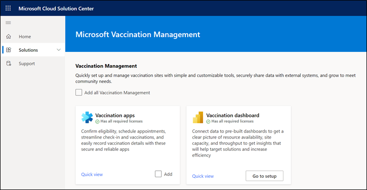
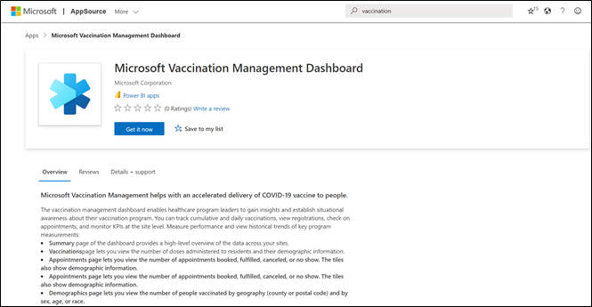
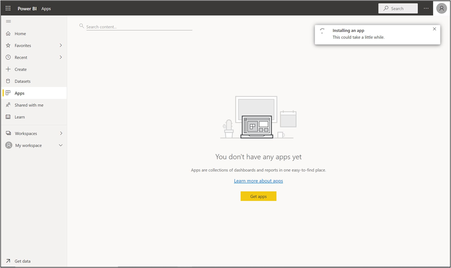
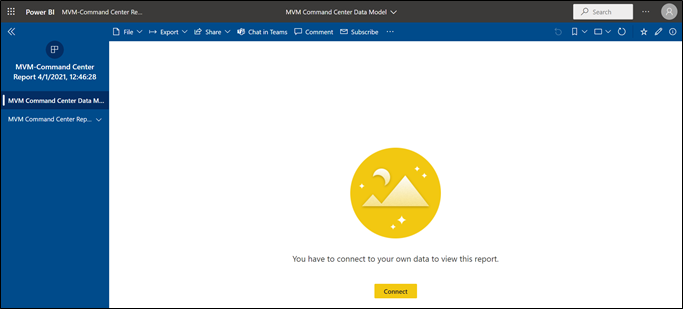
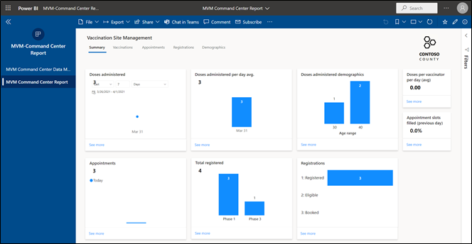

The Microsoft Vaccination Management Dashboard offers a vaccination management dashboard created in Microsoft Power BI, which enables healthcare program leaders to obtain various insights and establish situational awareness about their vaccination program. They can track cumulative and daily vaccinations, view registrations, bookings and shipments, and monitor KPIs at the site level.

> [!div class="mx-imgBorder"]
> 

In this exercise, you will learn how to configure the Microsoft Vaccination Management Dashboard from AppSource, connect to your data, and load the Microsoft Vaccination Management Dashboard in a Power BI (PBI) Online workspace to view the report.

**Task 1: Install Microsoft Vaccination Management Dashboard from Microsoft AppSource**

In this task, you will retrieve the Microsoft Vaccination Management Dashboard from AppSource and configure it in Power BI (PBI) Online where a new workspace and Application will be auto created.

Once MVM is more widely available, you can configure the application directly from Microsoft Cloud Solution Center instead of through AppSource, as seen below.

> [!div class="mx-imgBorder"]
> 

While we are privately available and for this training, you will retrieve the application from AppSource.

1.  Navigate to [Microsoft AppSource](https://appsource.microsoft.com/en-US/). (Incognito/InPrivate mode)

2.  Search Apps for **vaccination** using the top search bar.

    > [!div class="mx-imgBorder"]
    > 

3.  Select the **Microsoft Vaccination Management Dashboard.**

    > [!div class="mx-imgBorder"]
    > 

4.  Select **Get it now.**

    > [!div class="mx-imgBorder"]
    > 

5.  Enter your provided **training user email** if prompted. Select **Sign in**.

    > [!div class="mx-imgBorder"]
    > 

6.  In the prompt, fill in your **training** **user email**, a **dummy phone number**, select **Country/region**, and check the permissions box. 

    > [!NOTE]
    > If you're in an official training, use the email provided to you.

    > [!div class="mx-imgBorder"]
    > 

7.  Select **Continue**.

8.  Power BI Online will load and prompt to install the Power BI app. Select **Install**.

    > [!div class="mx-imgBorder"]
    > 

9.  The app should begin to install.

    > [!div class="mx-imgBorder"]
    > 

10. Once complete, you should see a prompt that your app is ready. Select **Go to app**.

    > [!div class="mx-imgBorder"]
    > 

11. If you miss the prompt, you can select **Apps** on the left navigation bar and **Select** your new app.

    > [!div class="mx-imgBorder"]
    > 

12. The Microsoft Vaccination Management Dashboard Data Model app will open. Select **Connect** in the center to connect data.

    > [!div class="mx-imgBorder"]
    > 

13. You will be prompted to add **DataverseName** and **UTCZoneOffset.**

    > [!div class="mx-imgBorder"]
    > 

14. To get the Dataverse name, navigate to [Power Apps](https://make.powerapps.com/) (Incognito or InPrivate session).

15. Log in using the credentials supplied in the training for your user.

16. Select the correct environment from the upper right **Environment** drop-down.

    > [!div class="mx-imgBorder"]
    > 

17. Select **Apps** on the left navigation bar.

    > [!div class="mx-imgBorder"]
    > 

18. Find the **Vaccination site management** **app** and select on the app name.

    > [!div class="mx-imgBorder"]
    > 

19. Once loaded, copy the **URL** ending in **crm.dynamics.com** (don't include https://).

    > [!div class="mx-imgBorder"]
    > 

20. Navigate back to PBI Desktop and paste the **DataverseName** URL (without https:// and trailing /).

21. Add your **UTCZoneOffset**. UTCZoneOffset is the number of hours your local time is offset from UTC. Depending on location, your value may be negative (for example, PT = 8, IST = -5.5).

    > [!div class="mx-imgBorder"]
    > 

22. Select **Next.**

23. You will be prompted for an Authentication method to connect. Keep OAuth2 selected in the drop-down. Select the **pencil** under **Privacy setting for this data source** to edit.

    > [!div class="mx-imgBorder"]
    > 

24. For Privacy level setting for this data source, select **Organizational**.

    > [!div class="mx-imgBorder"]
    > 

25. Select **Sign in and Continue.**

    > [!div class="mx-imgBorder"]
    > 

26. **Log in** with your training user credentials.

27. You will now see a blank report showing on the screen. This file only contains the Data Model.

    > [!div class="mx-imgBorder"]
    > 

28. Select the **MVM Command Center Report** on the left site map. The report should load, and you should see the visualizations lit up with the data in your environment.

    > [!div class="mx-imgBorder"]
    > 

**Congratulations!** You successfully installed the Microsoft Vaccination Management Dashboard from AppSource into a new Power BI workspace in your tenant and connected to your data.

