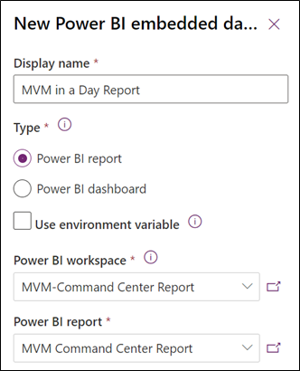
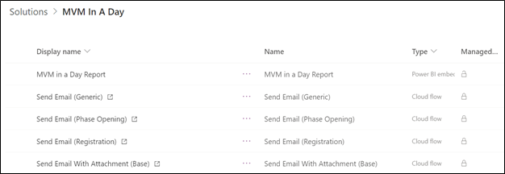
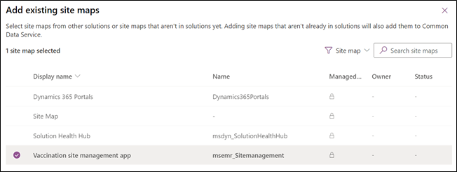
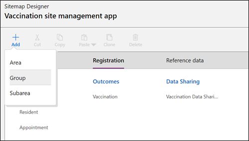
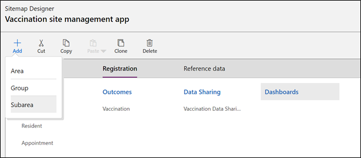
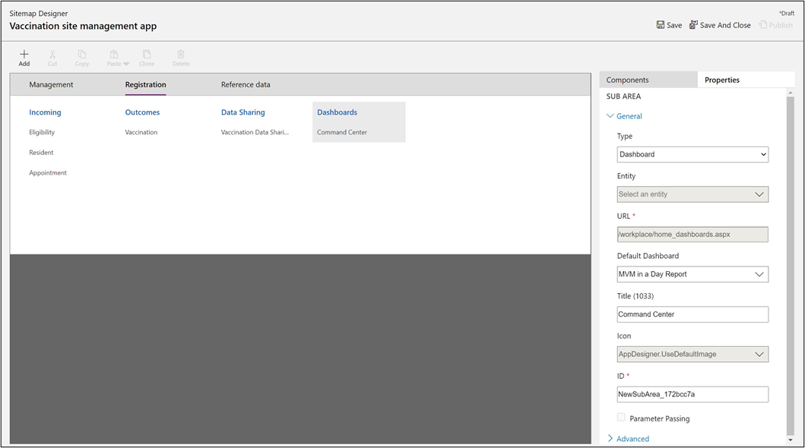
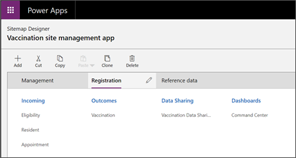
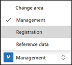
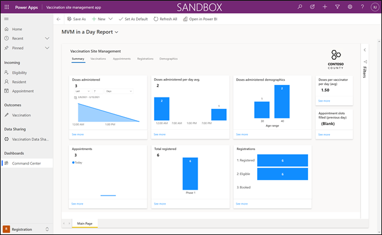

In this exercise, you will learn how to embed the Microsoft Vaccination Management Dashboard into the Vaccination Management model-driven application so that users can access the visualizations from their device. You will first add a dashboard that connects to the Power BI report that you created previously. Then, you will add that dashboard to the site map so that vaccination site managers can quickly access the insights and analytics directly alongside registration data. You will make all changes in the **MVM in a Day** solution for proper management.

1.  Make sure that you are in **Incognito** or **InPrivate** mode and then go to [Power Apps](https://make.powerapps.com/).

2.  Sign in by using the credentials that were supplied in the training for your user.

3.  Select the correct environment from the **Environment** dropdown list in the upper-right corner.

    > [!div class="mx-imgBorder"]
    > 

4.  Select **Solutions** on the left navigation bar. Select the **MVM in a Day** solution to edit.

    > [!div class="mx-imgBorder"]
    > 

5.  Go to **New > Dashboard > Power BI embedded**.

    > [!div class="mx-imgBorder"]
    > 

6.  Add dashboard details as follows:

    a.  **Name** - MVM in a Day Report

    b.  **Type** - Power BI report

    c.  **Power BI workspace** - MVM-Dashboard Report

    d.  **Power BI Report** - MVM Dashboard Report

    > [!div class="mx-imgBorder"]
    > 

7.  Select **Save**.

    You should now see the new dashboard in your **MVM In A Day** solution component list.

    > [!div class="mx-imgBorder"]
    > 

8.  Select **Add existing > Other > Site map**.

    > [!div class="mx-imgBorder"]
    > 

10. Select **Vaccination site management app**.

    > [!div class="mx-imgBorder"]
    > 

11. Select **Add**.

12. Select **Vaccination site management app** in the list and then select **Edit**.

    > [!div class="mx-imgBorder"]
    > 

13. You will be directed to the **Sitemap Designer** page, where you can define the areas, groups, and subareas that are shown in the navigation bar in the model-driven application.

    > [!div class="mx-imgBorder"]
    > 

14. On the **Sitemap Designer** page, select the **Registration** area.

    > [!div class="mx-imgBorder"]
    > 

15. Select **+ Add > Group**.

    > [!div class="mx-imgBorder"]
    > 

16. You can also drag and drop from the **Components** area onto the canvas.

    > [!div class="mx-imgBorder"]
    > 

17. In the **Title** field, enter **Dashboards** as the new group title.

    > [!div class="mx-imgBorder"]
    > 

18. While in the new **Dashboards** group, select **+ Add > Subarea**.

    > [!div class="mx-imgBorder"]
    > 

19. Enter the following details for your new subarea:

    a.  **Type** - Dashboard

    b.  **Default Dashboard** - MVM in a Day Report (The dashboard that you created in this exercise.)

    c.  **Title** - Vaccination Management Dashboard

    > [!div class="mx-imgBorder"]
    > 

20. Select **Save** and then **Publish**.

21. Now, the site map has a new subarea called **Dashboards** in the **Registration** area, with the MVM Dashboard Report embedded and accessible from the site map.

    > [!div class="mx-imgBorder"]
    > 

22. Select **Save and Close** or close the browser window.

23. Return to the **MVM in a Day** solution in Power Apps. Two new rows should now show: the **Vaccination site management app** row, with **site map** listed as its type, and the **MVM in a Day Report** row, with **Power BI embedded** shown as its type. Select **Publish all customizations** while in your **MVM in a Day** solution.

    > [!div class="mx-imgBorder"]
    > 

24. Go to **Apps > Vaccination site management app**. Select the name of the app or select **Play** to open it.

    > [!div class="mx-imgBorder"]
    > 

25. By default, the application will open in the **Management** area. In the lower-left corner, change the dropdown area to **Registration**, where you previously added the **Dashboards** group and the **Vaccination Management Dashboard** subarea.

    > [!div class="mx-imgBorder"]
    > 

26. After you have changed the area to **Registration**, the **site map** will appear on the left and will include the new **Dashboards** area.

27. Select **Dashboard Report** on the left to go to the Power BI embedded report. After the report has loaded, you will see the report embedded directly as a dashboard in the **Vaccination site management** app.

    > [!div class="mx-imgBorder"]
    > 

Congratulations, you have successfully embedded the Microsoft Vaccination Management Dashboard Power BI report as a dashboard in the **Vaccination site management** model-driven application.

