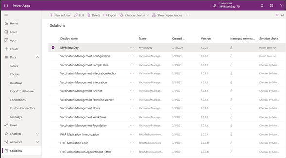
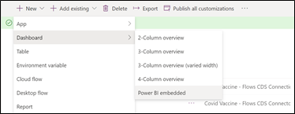
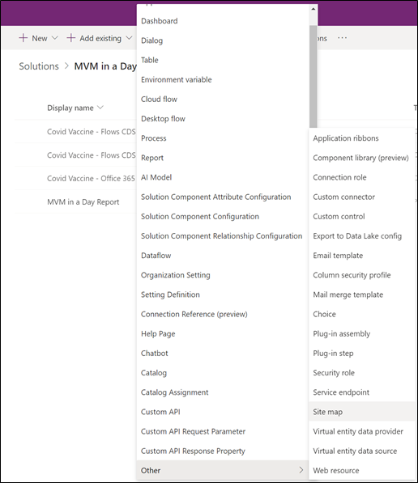
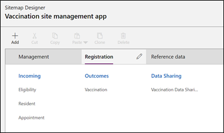
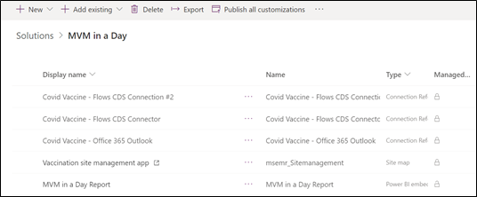
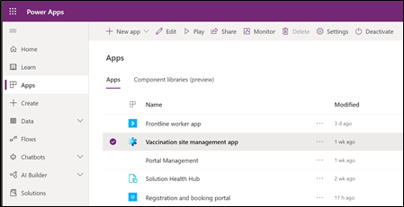

In this exercise, you will learn how to embed the Vaccination Management Dashboard into the Vaccination Management model-driven application so that users can access the visualizations right from their device. You will first add a Dashboard that connects to the Power BI report you created previously. Then we will add that Dashboard to the Sitemap so vaccination site managers can quickly access the insights and analytics directly alongside registration data. We will make all changes in the MVM in a Day solution for proper management.

1.  Navigate to [Power Apps](https://make.powerapps.com/) (Incognito or InPrivate session).

2.  Log in using the credentials supplied in the training for your user.

3.  Select the correct environment from the upper right **Environment** drop-down.

    > [!div class="mx-imgBorder"]
    > 

4.  Select **Solutions** on the left navigation bar. Select **MVM in a Day** solution to **edit**.

    > [!div class="mx-imgBorder"]
    > 

5.  Go to **New** > **Dashboard** > **Power BI embedded**

    > [!div class="mx-imgBorder"]
    > 

6.  Add Dashboard details as follows:

    a.  **Name**: MVM in a Day Report

    b.  **Type**: Power BI report

    c.  **Power BI workspace**: MVM-Dashboard Report

    d.  **Power BI Report**: MVM Dashboard Report

    > [!div class="mx-imgBorder"]
    > 

7.  Select **Save**.

8.  You should now see the new Dashboard in your MVM in a Day Solution component list.

    > [!div class="mx-imgBorder"]
    > 

9.  Select **Add Existing** > **Other** > **Site map**.

    > [!div class="mx-imgBorder"]
    > 

10. Select the **Vaccination site management app.**

    > [!div class="mx-imgBorder"]
    > 

11. Select **Add**.

12. Select the **Vaccination site management app** in the list and select **Edit.**

    > [!div class="mx-imgBorder"]
    > 

13. You will be landed in the site map designer. This is where you can define the areas, groups, and subareas shown in the navigation bar in the model-driven application.

    > [!div class="mx-imgBorder"]
    > 

14. In the site map designer, select the **Registration** area.

    > [!div class="mx-imgBorder"]
    > 

15. Select **New** > **Group**.

    > [!div class="mx-imgBorder"]
    > 

16. You can also drag and drop from the right-hand side **Components** area onto the canvas.

    > [!div class="mx-imgBorder"]
    > 

17. Title the new group **Dashboards**.

    > [!div class="mx-imgBorder"]
    > 

18. While selected on the new Dashboards group, select **Add** > **Subarea**.

    > [!div class="mx-imgBorder"]
    > 

19. Enter the following details for your new subarea:

    a.  **Type**: Dashboard

    b.  **Default Dashboard**: MVM in a Day Report (The dashboard you created in this exercise)

    c.  **Title**: Vaccination Management Dashboard

    > [!div class="mx-imgBorder"]
    > 

20. Select **Save**. Then select **Publish**.

21. Now the Sitemap has a new subarea called Dashboards in the Registration area with the MVM Dashboard Report embedded and accessible from the sitemap.

    > [!div class="mx-imgBorder"]
    > 

22. Select **Save and Close** or close the browser window.

23. Navigate back to the MVM in a Day solution in Power Apps. You should now see the two other rows for the Vaccination site management app site map and MVM in a Day Report embedded Power BI. Select **Publish all customizations** while in your MVM in a Day solution.

    > [!div class="mx-imgBorder"]
    > 

24. Navigate to **Apps** > **Vaccination site management app**. Select the name or select **Play** to open it.

    > [!div class="mx-imgBorder"]
    > 

25. The application will by default open in the Management area. In the bottom-left corner, change the drop-down area to **Registration**. This is where we added the Dashboards group and Vaccination Management Dashboard subarea.

    > [!div class="mx-imgBorder"]
    > 

26. Once the area is changed to Registration, you will see the **site map** on the left, which includes the new Dashboards area.

27. Select **Dashboard Report** on the left to navigate to the Power BI embedded report. Once loaded, you will see the report embedded directly as a dashboard in the vaccination site management app.

    > [!div class="mx-imgBorder"]
    > 

**Congratulations!** You successfully embedded the MVM Vaccination Management Dashboard Power BI Report as a Dashboard in the Vaccination site management model-driven application.

