In this final exercise, you'll use the items that you configured in the previous exercises to schedule a virtual visit between Reed Flores and his practitioner, Alex Johnson.

## Task 1: Schedule an instant virtual appointment

In this task, you'll sign in to the Patient Portal as Reed Flores and schedule an instant virtual appointment. First we need to register Reed for the patient portal.

1. Go to [make.powerapps.com](https://make.powerapps.com/)

1. Go to the Virtual Clinic application and select **People** from the sitemap. Change the view to Active Patients, if not already on it and open the **Reed Flores** record.

   > [!div class="mx-imgBorder"]
   > 

1. Select **Create Invitation** from the command bar.

   > [!div class="mx-imgBorder"]
   > 

1. **Save** the record.

   > [!div class="mx-imgBorder"]
   > [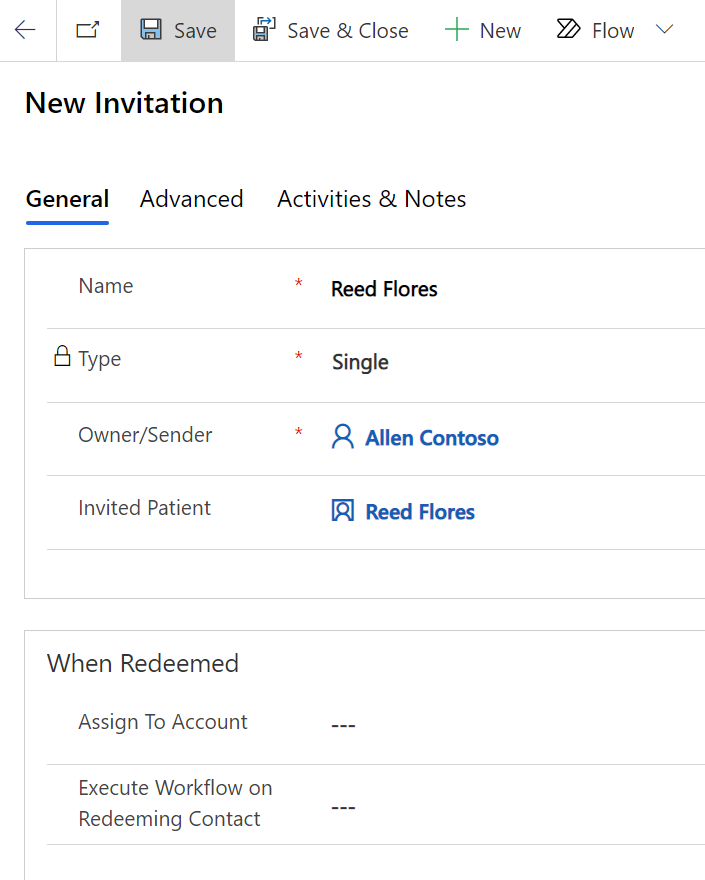](../media/invitation.png#lightbox)

1. Go to the **Advanced** tab and copy the **Invitation Code** to use in the patient portal.

   > [!div class="mx-imgBorder"]
   > [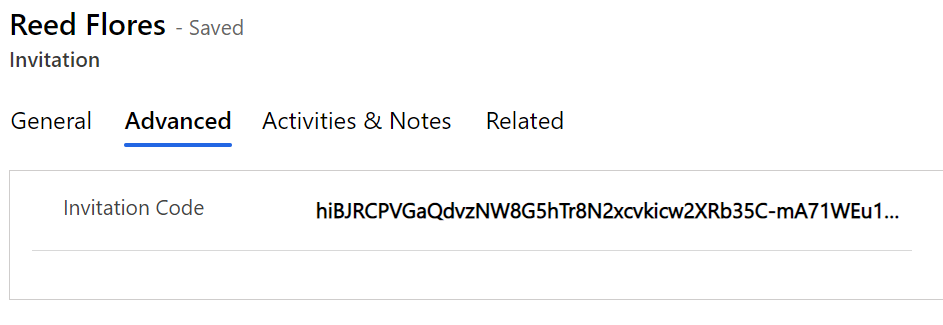](../media/code.png#lightbox)

1. Go to [https://make.powerapps.com](https://make.powerapps.com/?azure-portal=true), navigate to Apps, and open the **Patient Portal**.

   > [!div class="mx-imgBorder"]
   > [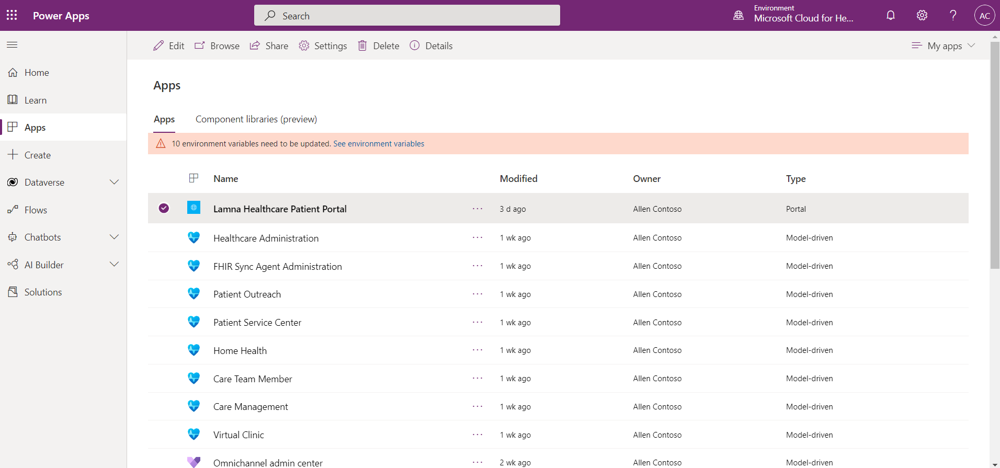](../media/portal.png#lightbox)

1. Select **Sign in** on the landing page.

   > [!div class="mx-imgBorder"]
   > 

1. Go to the **Redeem invitation** tab. Paste the **Invitation Code** you retrieved in the previous task. Leave the box unchecked for returning customer. Select **Register**.

   > [!div class="mx-imgBorder"]
   > [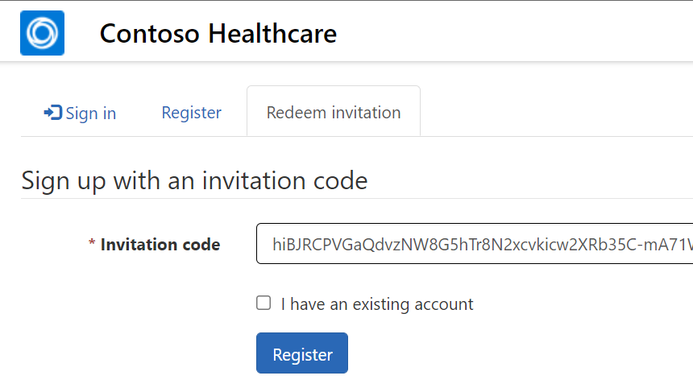](../media/invitation-code.png#lightbox)

1. Enter a username and password for **Reed Flores**. Something you'll remember. Select **Register**.

   > [!div class="mx-imgBorder"]
   > [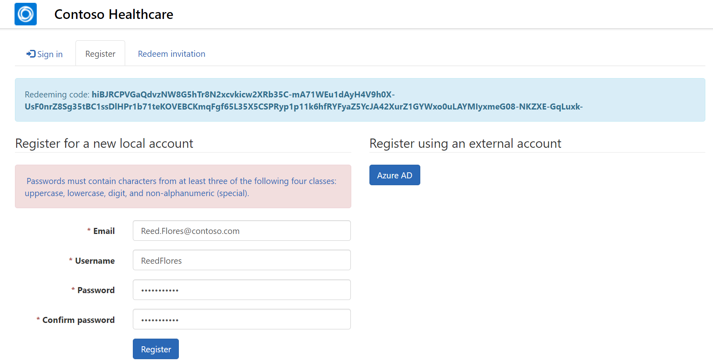](../media/user-name.png#lightbox)

1. You may land on the profile page. Select the logo in the upper right to go to the **homepage**.

   > [!div class="mx-imgBorder"]
   > [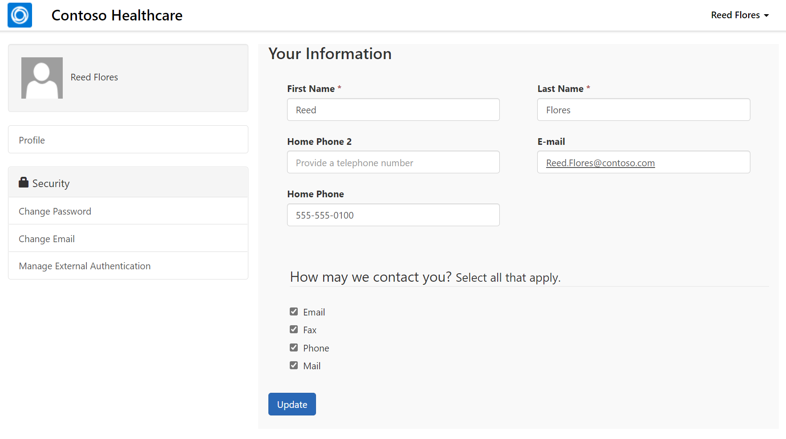](../media/profile.png#lightbox)

1. Go to **Appointments** and select **Schedule new**.

   > [!div class="mx-imgBorder"]
   > [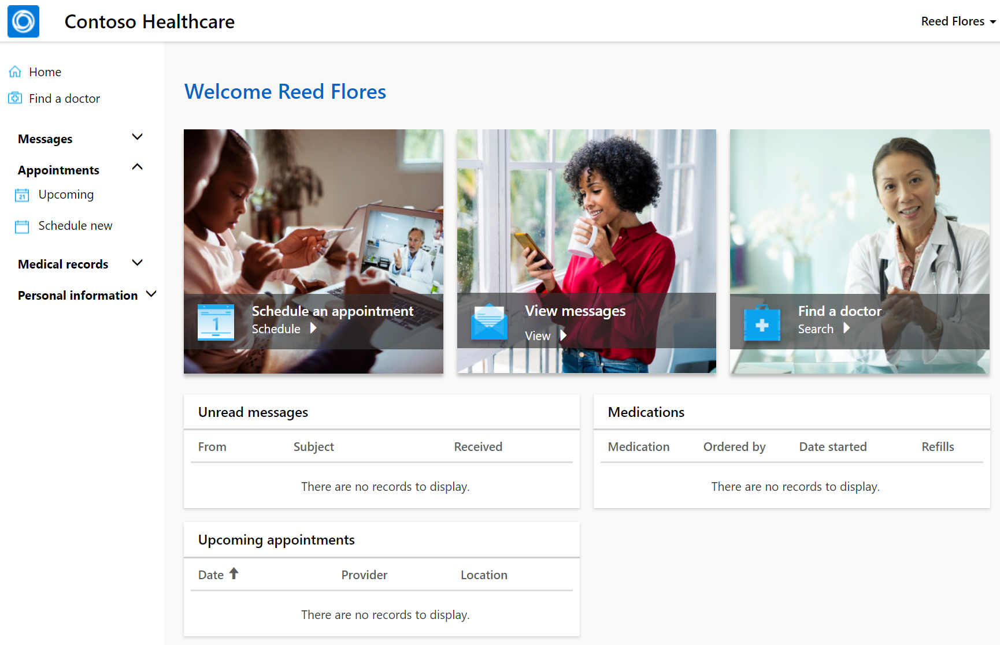](../media/appointments.png#lightbox)

1. Select **Instant virtual appointment**.

   > [!div class="mx-imgBorder"]
   > 

1. Select the **General Medicine** option that you created earlier in the lab as the reason for the visit.

   > [!div class="mx-imgBorder"]
   > 

1. Scroll down and select **Next**.

1. Select **+ Add Insurance**.

   > [!div class="mx-imgBorder"]
   > 

1. Fill out the required fields with any information and select **Next**.

   > [!div class="mx-imgBorder"]
   > 

1. Select **Next**.

   > [!div class="mx-imgBorder"]
   > [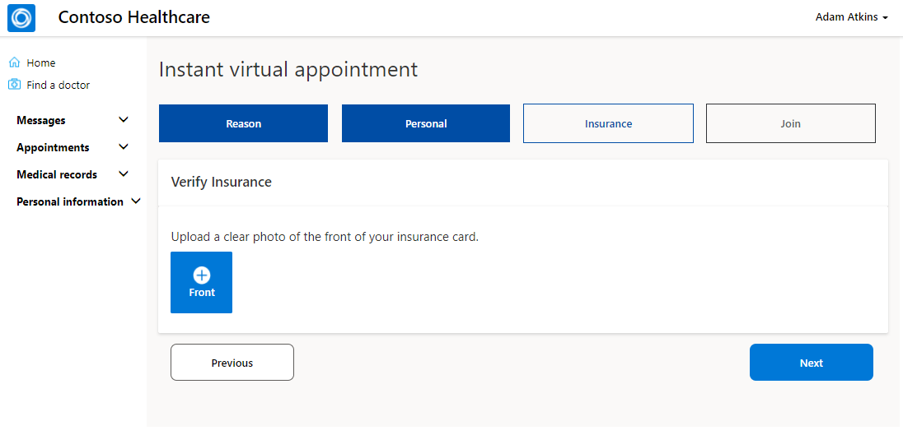](../media/verify.png#lightbox)

1. **Check the box** for Consent Terms and then select **Join queue**.

   > [!div class="mx-imgBorder"]
   > [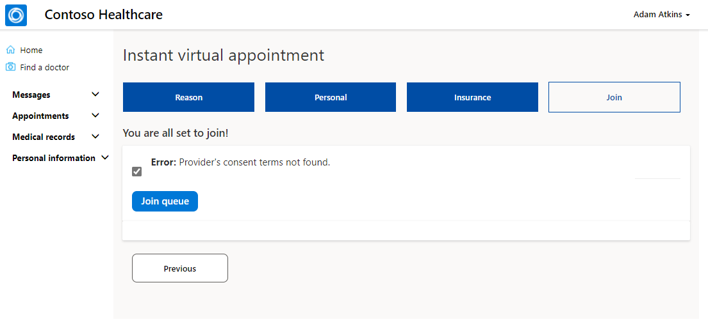](../media/consent-terms.png#lightbox)

1. A new internet browser tab will open and may be blank. **Select the link** provided to join the appointment.

   > [!div class="mx-imgBorder"]
   > 

1. Open a new tab in your browser and go to [teams.microsoft.com](https://teams.microsoft.com/?azure-portal=true). Navigate to the Virtual Clinic app that you embedded in the **Lamna Healthcare - Redmond** Teams channel. On the Instant Virtual Appointment Dashboard, you'll see that Reed Flores has arrived for a virtual appointment. Double-click to open the record.

   > [!div class="mx-imgBorder"]
   > [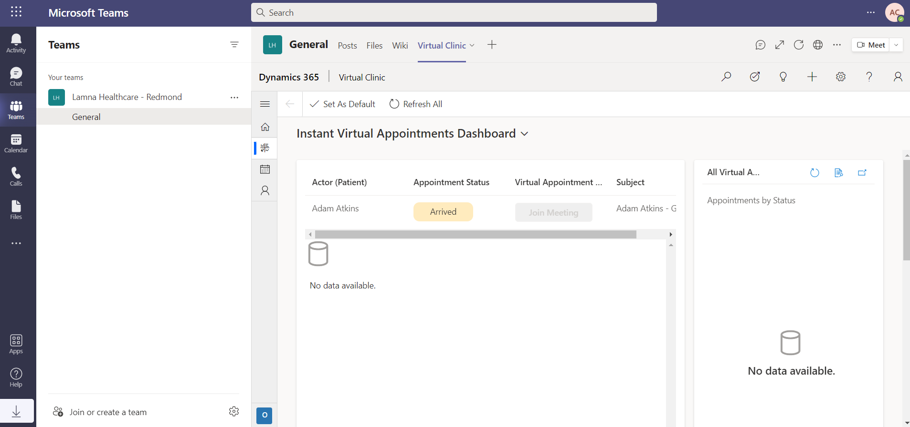](../media/instant-dashboard.png#lightbox)

1. When Reed Flores's patient record opens, select **Join Meeting**.

   > [!div class="mx-imgBorder"]
   > [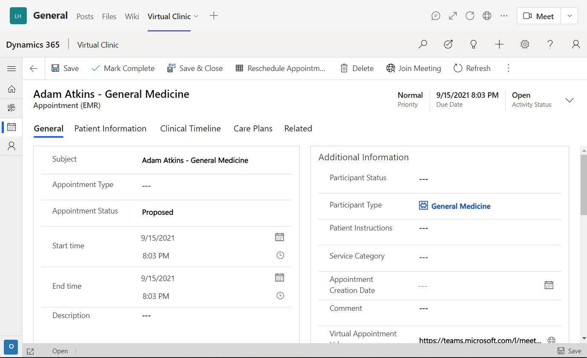](../media/join-meeting.png#lightbox)

1. Select **Cancel** as we won't open the Microsoft Teams desktop app in this example.

   > [!div class="mx-imgBorder"]
   > 

1. Select **Continue on this browser** to continue with opening the virtual meeting.

   > [!div class="mx-imgBorder"]
   > 

1. Select **Join now** to join the virtual meeting.

   > [!div class="mx-imgBorder"]
   > 

1. Select **Teams** on the right to reduce the size of the meeting and see the full holistic experience for a practitioner.

   > [!div class="mx-imgBorder"]
   > 

   > [!div class="mx-imgBorder"]
   > [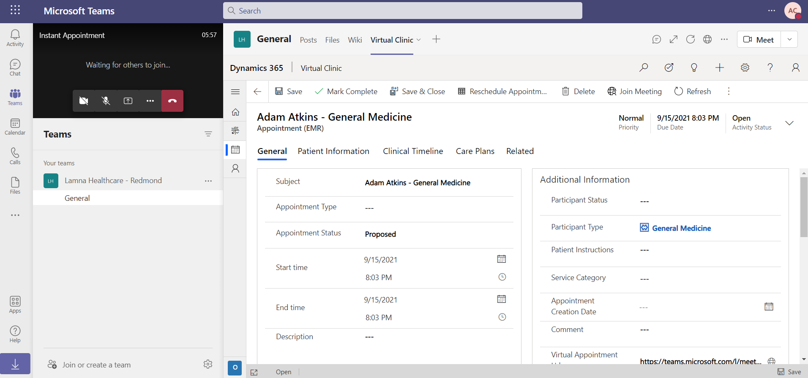](../media/patient.png#lightbox)

**Congratulations!** You've scheduled an instant virtual appointment using the patient portal and joined the appointment as a practitioner using the Virtual Clinic app embedded in Microsoft Teams.
