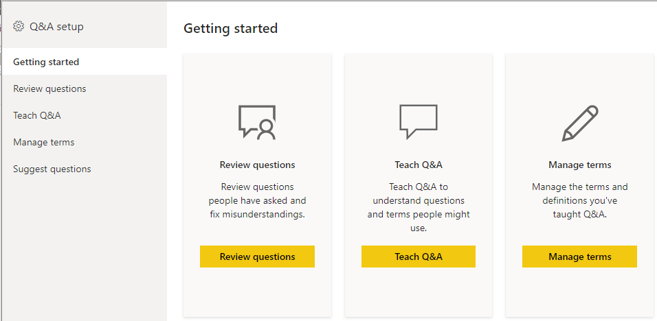
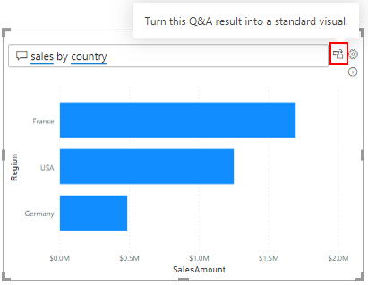

The **Q&A** feature in Power BI lets you explore your data in your own words by allowing you to ask natural language questions and then providing you with answers to those questions.

This ability to ask questions is valuable to you, as the report author, and to your report users. It gives you ideas for the type of visuals that you can display in your report and lets you quickly add those visuals. Additionally, it gives your report users an effective tool that they can use to get quick answers to their questions about the data, independently. This self-help aspect to Power BI saves time for everyone involved.

Power BI records all questions that are asked, and you can use this information to set up the **Q&A** feature to be more effective. When the **Q&A** feature answers so many questions, you'll have fewer people turning to you for those answers.

Consider a situation where you've created a report for the Supply Chain team, and now the team members have questions about various views or insights that they are interested in. You have become inundated with questions and don't have time to address each one individually. Consequently, you have decided to implement the **Q&A** feature so that users can ask questions and get answers by themselves.

## Add the Q&A visual to your report canvas

To get access to the **Q&A** feature, you need to add the **Q&A** visual to your report. You can double-click anywhere on the canvas, and the visual should appear. Alternatively, you can select the **Q&A** icon on the **Visualizations** pane.

> [!div class="mx-imgBorder"]
> 

The **Q&A** feature is also available as a button, which is a useful option if you want to save space on your report canvas.

> [!div class="mx-imgBorder"]
> 

When the **Q&A** visual or button is added to your report, you can reposition and resize it. You can also customize the formatting in the same way that you would for any other type of visual or button.

You can start asking questions immediately by selecting one of the suggested questions or by entering a question into the question box. As you type, Power BI will automatically display suggestions to help you complete your question.

> [!div class="mx-imgBorder"]
> 

## Set up the Q&A feature

When you have added the **Q&A** visual to your report, you can set up the underlying Q&A feature so that it improves in answering questions about your data. Basically, you will teach the **Q&A** feature to better understand people. This setup can be useful from the outset so that you can get the visual ready for active use. However, setup does not stop at that point; you can proactively monitor and review the questions that are coming through from users, and then you can address misunderstandings or common typos. You can also manage the key terms that are associated with your data, so you can add a library of synonyms that might be entered by different users across the organization when they are asking questions about the data. You can constantly calibrate the **Q&A** feature so that it provides better answers to your organization's questions.

In this example, you receive feedback from users saying that they can't get data on sales by country. To assess the problem, you enter **sales by country** into the question box. The visual does not update; it does not answer your question. The following image shows that the word *country* is underlined in red. When a red underline occurs, Power BI is telling you that it does not understand this term. Knowing that the word *country* is not used in your dataset, you decide to use the term *region* instead and ultimately discover why the question is not being answered. Accordingly, you realize that you need to teach Power BI what you mean by adding a new term to its thesaurus.

> [!div class="mx-imgBorder"]
> 

Select the settings icon to the right of the question box to open the **Q&A setup** window. Then, select the **Teach Q&A** option.

> [!div class="mx-imgBorder"]
> 

Enter your question again, and then select the **Submit** button. In the **Define the terms Q&A didn't understand** section that displays, enter your alternative term or synonym. In this case, you will enter **region**. The following image shows that Power BI displays a preview result so that you can see if this new term will return the results that you are looking for. If this result is correct, select **Save**.

> [!div class="mx-imgBorder"]
> 

Now, when users search for sales by country, Power BI will know that they really mean sales by region and will automatically display the associated data in the visual.

> [!div class="mx-imgBorder"]
> 

## Use the Q&A feature to build visuals

When Power BI answers a question, and you find the visual result to be engaging or helpful, you can add it as a standard visual to your report.

For example, if you review the questions that are being asked, and you see that several users are asking the same question, you can add the answer to this question as a standard visual in the report so they no longer have to ask the question. Similarly, you can also use the **Q&A** feature to start building your report by asking questions and adopting the suggested visual result formats from Power BI.

To turn a **Q&A** result into a standard visual, select the icon next to the question box.

> [!div class="mx-imgBorder"]
> 

The **Q&A** feature is unique in that it does not require users to have knowledge of Power BI to use the visual; users can ask their questions and they, too, can create insightful visuals.
