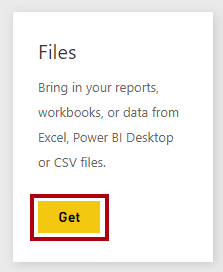
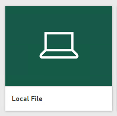
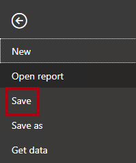
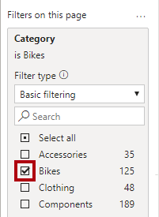
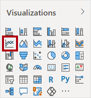
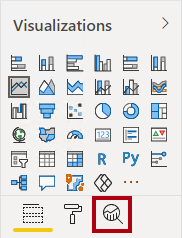
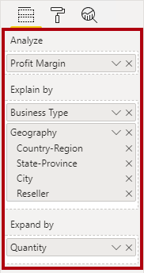

**The estimated time to complete the lab is 45 minutes**

In this lab, you'll create the **Sales Exploration** report.

In this lab you learn how to:

- Create animated scatter charts.

- Use a visual to forecast values.

- Work with the decomposition tree visual.

- Work with the key influencers visual.

### Lab story

This lab is one of many in a series of labs that was designed as a complete story from data preparation to publication as reports and dashboards. You can complete the labs in any order. However, if you intend to work through multiple labs, for the first 10 labs, we suggest you do them in the following order:

1. [Prepare data in Power BI Desktop](/learn/modules/get-data/lab-prepare/?azure-portal=true)

1. [Load data in Power BI Desktop](/learn/modules/clean-data-power-bi/8-lab/?azure-portal=true)

1. [Model data in Power BI Desktop, part 1](/learn/modules/design-model-power-bi/8-lab/?azure-portal=true)

1. [Model data in Power BI Desktop, part 2](/learn/modules/design-model-power-bi/9-lab/?azure-portal=true)

1. [Create DAX calculations in Power BI Desktop, part 1](/learn/modules/create-measures-dax-power-bi/6-lab/?azure-portal=true)

1. [Create DAX calculations in Power BI Desktop, part 2](/learn/modules/create-measures-dax-power-bi/8-lab/?azure-portal=true)

1. [Design a report in Power BI Desktop, part 1](/learn/modules/visuals-power-bi/8-lab/?azure-portal=true)

1. [Design a report in Power BI Desktop, part 2](/learn/modules/data-driven-story-power-bi/13-lab/?azure-portal=true)

1. [Create a Power BI dashboard](/learn/modules/create-dashboards-power-bi/9-lab/?azure-portal=true)

1. **Perform data analysis in Power BI Desktop** << You are here. This is the lab for the current module.

1. [Create a Power BI paginated report](/learn/modules/create-paginated-reports-power-bi/6-lab/?azure-portal=true)

> [!NOTE]
> Each lab starts with a PBIX file that has all of the previous lab work completed. If you should lose your work for any reason, you can open the PBIX file that includes the progress up to that point from the folder indicated at the beginning of the next lab.

## Exercise 1: Create the report

In this exercise you will create the **Sales Exploration** report.

### Task 1: Get started – Sign in

In this task you'll set up the environment for the lab by signing in to Power BI.

> [!Important]
> If you have already signed in to Power BI in a previous lab, continue from the next task.

1. To open Microsoft Edge, on the taskbar, select the Microsoft Edge program shortcut.

1. In the Microsoft Edge browser window, navigate to [https://powerbi.com](https://powerbi.com).

    > [!Tip]
    > You can also use the Power BI Service favorite on the Microsoft Edge favorites bar.

1. Select **Sign In** (located at the top-right corner).

1. Enter the account details provided to you.

1. If prompted to update the password, reenter the provided password, and then enter and confirm a new password.

    > [!Important]
    > Be sure to record your new password.

1. Complete the sign in process.

1. If prompted by Microsoft Edge to stay signed in, select **Yes**.

1. In the Microsoft Edge browser window, in the Power BI service, in the **Navigation** pane, expand **My Workspace**.

    > [!div class="mx-imgBorder"]
    > 

1. Leave the Microsoft Edge browser window open.

### Task 2: Get started – Create a dataset

In this task you'll set up the environment for the lab by creating a dataset.

> [!Important]
> If you have already published the dataset in the **Create a Power BI Dashboard** lab, continue from the next task.

1. In the Microsoft Edge browser window, in the Power BI service, in the **Navigation** pane, at the bottom, select **Get Data**.

1. In the **Files** tile, select **Get**.

    > [!div class="mx-imgBorder"]
    > 

1. Select the **Local File** tile.

    > [!div class="mx-imgBorder"]
    > 

1. In the **Open** window, navigate to the **D:\DA100\Labs\create-power-bi-dashboard\Solution** folder.

1. Select the **Sales Analysis.pbix** file, and then select **Open**.

1. If prompted to replace the dataset, select **Replace**.

### Task 3: Create the report

In this task you will create the **Sales Exploration** report.

1. To open the Power BI Desktop, on the taskbar, select the Microsoft Power BI Desktop shortcut.

    > [!Important]
    > If you already have Power BI Desktop open (from a previous lab), close that instance.

1. To close the getting started window, at the top-right corner of the welcome screen, select **X**.

1. If Power BI Desktop is not signed in to the Power BI service, at the top-right, select **Sign in**.

1. Complete the sign in process using the same account used to sign in to the Power BI service.

1. To save the file, select the **File** ribbon tab to open the backstage view.

1. Select **Save**.

    > [!div class="mx-imgBorder"]
    > 

1. In the **Save As** window, navigate to the **D:\DA100\MySolution** folder.

1. In the **File Name** box, enter **Sales Exploration**.

    > [!div class="mx-imgBorder"]
    > 

1. To create a live connection to the **Sales Analysis** dataset, on the **Home** ribbon tab, from inside the **Data** group, select **Power BI Datasets**.

    > [!div class="mx-imgBorder"]
    > 

1. In the **Select a Dataset to Create a Report** window, select the **Sales Analysis** dataset.

1. Click **Create**.

1. Save the Power BI Desktop file.

   You'll now create four report pages, and on each page you’ll work with a different visual to analyze and explore data.

## Exercise 2: Create a scatter chart

In this exercise, you'll create a scatter chart that can be animated.

### Task 1: Create an animated scatter chart

In this task, you'll create a scatter chart that can be animated.

1. Rename **Page 1** as **Scatter Chart**.

    > [!div class="mx-imgBorder"]
    > 

1. Add a scatter chart visual to the report page, and then position and resize it so that it fills the entire page.

    > [!div class="mx-imgBorder"]
    > 

    > [!div class="mx-imgBorder"]
    > 

1. Add the following fields to the visual wells:

    The labs use a shorthand notation to reference a field. It looks like this: **Reseller | Business Type**. In this example, **Reseller** is the table name and **Business Type** is the field name.

    - Legend: **Reseller | Business Type**

    - X Axis: **Sales | Sales**

    - Y Axis: **Sales | Profit Margin**

    - Size: **Sales | Quantity**

    - Play Axis: **Date | Quarter**

    > [!div class="mx-imgBorder"]
    > 

    The chart can be animated when a field is added to the **Play Axis** well.

1. In the **Filters** pane, add the **Product | Category** field to the **Filters on this page** well.

1. In the filter card, filter by **Bikes**.

    > [!div class="mx-imgBorder"]
    > 

1. To animate the chart, in the bottom-left corner, select **Play**.

    > [!div class="mx-imgBorder"]
    > 

1. Watch the entire animation cycle from **FY2018 Q1** to **FY2020 Q4**.

    The scatter chart allows you to see the measure values simultaneously. In this case, you can see order quantity, sales revenue, and profit margin.

    Each bubble represents a reseller business type. Changes in the bubble size reflect increased or decreased order quantities. Horizontal movements represent increases or decreases in sales revenue. Vertical movements represent increases or decreases in profitability.

1. When the animation stops, select one of the bubbles to reveal its tracking over time.

1. Hover the cursor over any bubble to reveal a tooltip that describes the measure values for the reseller type at that point in time.

1. In the **Filters** pane, filter by **Clothing** only, and notice that it produces a different result.

1. Save the Power BI Desktop file.

## Exercise 3: Create a forecast

In this exercise, you will create a forecast to determine possible future sales revenue.

### Task 1: Create a forecast

In this task, you will create a forecast to determine possible future sales revenue.

1. Add a new page, and then rename the page to **Forecast**.

    > [!div class="mx-imgBorder"]
    > 

1. Add a line chart visual to the report page, and then reposition and resize it so that it fills the entire page.

    > [!div class="mx-imgBorder"]
    > 

    > [!div class="mx-imgBorder"]
    > 

1. Add the following fields to the visual wells:

    - Axis: **Date | Date**

    - Values: **Sales | Sales**

    > [!div class="mx-imgBorder"]
    > 

1. In the **Filters** pane, add the **Date | Year** field to the **Filters on this page** well.

1. In the filter card, filter by two years: **FY2019** and **FY2020**.

    > [!div class="mx-imgBorder"]
    > 

    When forecasting over a time line, you will need at least two cycles (years) of data to produce an accurate and stable forecast.

1. Add the **Product | Category** field to the **Filters on this page** well, and then filter by **Bikes**.

    > [!div class="mx-imgBorder"]
    > 

1. To add a forecast, beneath the **Visualizations** pane, select the **Analytics** pane.

    > [!div class="mx-imgBorder"]
    > 

1. Expand the **Forecast** section.

    > [!div class="mx-imgBorder"]
    > 

    If the **Forecast** section is not available, it's likely because the visual hasn't been correctly configured. Forecasting is only available when two conditions are met:

    - The axis has a single field of type Date,
    - and only one value field exists.

1. Select **Add**.

    > [!div class="mx-imgBorder"]
    > 

1. Configure the following forecast properties:

    - **Forecast length** - 1 month

    - **Confidence interval** - 80%

    - **Seasonality** - 365

1. Select **Apply**.

    > [!div class="mx-imgBorder"]
    > 

1. In the line visual, notice that the forecast has extended one month beyond the history data.

    The gray area represents the confidence. The wider the confidence, the less stable and, therefore, the less accurate the forecast is likely to be.

    When you know the length of the cycle, in this case annual, you should enter the seasonality points. Sometimes, it could be weekly (7), or monthly (30).

1. In the **Filters** pane, filter by **Clothing** only, and notice that it produces a different result.

1. Save the Power BI Desktop file.

## Exercise 4: Work with a decomposition tree

In this exercise, you will create a decomposition tree to explore the relationships between reseller geography and profit margin.

### Task 1: Work with a decomposition tree

In this task, you'll create a decomposition tree to explore the relationships between reseller geography and profit margin.

1. Add a new page, and then rename the page to **Decomposition Tree**.

    > [!div class="mx-imgBorder"]
    > 

1. On the **Insert** ribbon, from inside the **AI visuals** group, select **Decomposition Tree**.

    > [!TIP]
    > The AI visuals are also available in the **Visualizations** pane.

    > [!div class="mx-imgBorder"]
    > 

1. Reposition and resize the visual so that it fills the entire page.

    > [!div class="mx-imgBorder"]
    > 

1. Add the following fields to the visual wells:

    - Analyze: **Sales | Profit Margin**

    - Explain by: **Reseller | Geography** (the entire hierarchy)

    > [!div class="mx-imgBorder"]
    > 

1. In the **Filters** pane, add the **Date | Year** field to the **Filters on this page** well, and then set the filter to **FY2020**.

    > [!div class="mx-imgBorder"]
    > 

1. In the **Decomposition Tree** visual, notice that the root of the tree is **Profit Margin** at **-0.94%**

    > [!div class="mx-imgBorder"]
    > 

1. Select the plus icon (**+**), and in the context menu, select **High value**.

    > [!div class="mx-imgBorder"]
    > 

   Notice that the decision tree presents resellers, ordered by highest profit margin.

1. To remove the level, at the top of visual, beside the **Reseller** label, select **X**.

    > [!div class="mx-imgBorder"]
    > 

1. Select the plus icon again and then expand to the **Country-Region** level.

1. Expand from the **United States** to the **State-Province** level.

1. Use the down-arrow located at the bottom of the visual for **State-Province**, and then scroll down to the less profitable states.

1. Notice that **New York** state has negative profitability.

1. Expand from **New York** to the **Reseller** level.

1. Notice that it is easy to isolate root cause.

    > [!div class="mx-imgBorder"]
    > 

    **United States** is not producing profit in **FY2020**. **New York** is one state that is not achieving positive profit, and it's due to four resellers paying less than standard costs for their goods.

1. Save the Power BI Desktop file.

## Exercise 5: Work with key influencers

In this exercise, you will use the **Key influencers** AI visual to determine what influences profitability within reseller business types and geography.

### Task 1: Work with key influencers

In this task, you will use the **Key influencers** AI visual to determine what influences profitability within reseller business types and geography.

1. Add a new page, and then rename the page to **Key Influencers**.

    > [!div class="mx-imgBorder"]
    > 

1. On the **Insert** ribbon, from inside the **AI visuals** group, select **Key influencers**.

    > [!TIP]
    > AI visuals are also available in the **Visualizations** pane.

    > [!div class="mx-imgBorder"]
    > 

1. Reposition and resize the visual so that it fills the entire page.

    > [!div class="mx-imgBorder"]
    > 

1. Add the following fields to the visual wells:

    - Analyze: **Sales | Profit Margin**

    - Explain by: **Reseller | Business Type** and **Reseller | Geography** (the entire hierarchy)

    - Expand by: **Sales | Quantity**

    > [!div class="mx-imgBorder"]
    > 

1. At the top left corner of the visual, notice that **Key influencers** is in focus, and the specific influence is set to understand what influences profit margin to increase.

    > [!div class="mx-imgBorder"]
    > 

1. Review the result, which is that the city of **Bothel** is likely to increase.

1. Modify the target to determine what influences the profit margin to *decrease*.

    > [!div class="mx-imgBorder"]
    > 

1. Review the result.

1. To detect segments, in the upper-left corner, select **Top segments**.

    > [!div class="mx-imgBorder"]
    > 

1. Notice that the target is now to determine segments when profit margin is likely to be high.

1. When the visual displays the segments (as circles), select one of them to reveal information about it.

1. Review the segment results.

### Task 2: Finish up

In this task, you'll complete the lab.

1. Select the **Scatter Chart** page.

1. Save the Power BI Desktop file.

1. To publish the file to your workspace, on the **Home** ribbon tab, from inside the **Share** group, click **Publish**.

1. Close Power BI Desktop.

    > [!WARNING]
    > If you leave the lab open, it will time out after one to four hours. Your work in the *current* module's lab will be lost, but each lab after the first one includes a PBIX file with the work from all previous labs completed so that you don't need to start over.

[!INCLUDE ]
