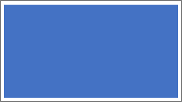
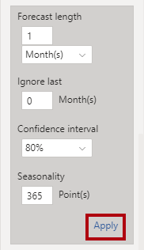
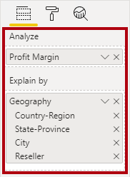
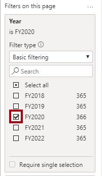

Your task in this lab is to create the **Sales Exploration** report.

In this lab, you will learn how to:

-   Create animated scatter charts.

-   Use a visual to forecast values.

-   Work with the **Decomposition Tree** visual.

-   Work with the **Key influencers** visual.

**Lab Preparation: Publishing Sales Analysis report to Power BI.** 
In this task, you will publish **Power BI file Sales Analysis.pbix** to Power BI. 
 
1.	To open the Power BI Desktop, on the taskbar, click the Microsoft Power BI Desktop shortcut.

1.	At the top-right corner of the welcome screen, click X.
 
1.	Click the **File** ribbon tab to open the backstage view, and then select **Open Report**. 

1.	In the **Open Report** window, click **Browse reports**, navigate to the **D:\DA100\Lab08A\Starter** folder, select **Sales Analysis.pbix file**. 

1.	Click **Open** and save the Power BI Desktop file.

1.	To publish the file, on the **Home** ribbon tab, from inside the Share group, click **Publish**.
 
1.	You will be prompted to login to your Power BI account. Enter your Power BI credentials and password. 

1.	In the **Publish to Power BI** window, select your workspace. 

1.	Click **Select**.
 
1.	When the file has been successfully published, click **Got it**.
 
1.	Click **X** to close the Power BI Desktop and select **Save to the file**. 

## Create the report

In this exercise, you will create the **Sales Exploration** report.

> [!NOTE]
> The exercise will require you to sign in to Power BI service. Use your existing account to sign in before starting the lab.

1.  Open Power BI Desktop and dismiss the welcome screen.

	> [!div class="mx-imgBorder"]
	> 

1.  Save the file to the **D:\DA100\MySolution** folder as **Sales Exploration**.

	> [!div class="mx-imgBorder"]
	> 

1.  Create a live connection to your **Sales Analysis** dataset.

	> [!TIP]
	> Use the **Get Data** command on the **Home** ribbon tab, and then select **Power BI datasets**.

	> [!div class="mx-imgBorder"]
	> 

You will now create four report pages. On each page, you'll work with a different visual to analyze and explore data.

## Create an animated scatter chart

In this exercise, you will create a scatter chart that can be animated.

1.  Rename **Page 1** as **Scatter Chart**.

	> [!div class="mx-imgBorder"]
	> 

1.  Add a scatter chart visual to the report page, and then reposition and resize it so that it fills the entire page.

	> [!div class="mx-imgBorder"]
	> 

	> [!div class="mx-imgBorder"]
	> 

1.  Add the following fields to the visual wells:

	-   Legend: **Reseller | Business Type**
	
	-   X Axis: **Sales | Sales**
	
	-   Y Axis: **Sales | Profit Margin**
	
	-   Size: **Sales | Quantity**
	
	-   Play Axis: **Date | Quarter**

	> [!div class="mx-imgBorder"]
	> 

	The chart can be animated when a field is added to the **Play Axis** well.

1.  In the **Filters** pane, add the **Product | Category** field to the **Filters on this page** well.

1.  In the filter card, filter by **Bikes**.

	> [!div class="mx-imgBorder"]
	> 

1.  To animate the chart, in the lower-left corner, select **Play**.

	> [!div class="mx-imgBorder"]
	> 

1. Watch the entire animation cycle from **FY2018 Q1** to **FY2020 Q4**.

	The scatter chart allows you to see the measure values simultaneously, which in this case are order quantity, sales revenue, and profit margin.

	Each bubble represents a reseller business type. Changes in the bubble size reflect increased or decreased order quantities. Horizontal movements represent increases/decreases in sales revenue, while vertical movements represent increases/decreases in profitability.

1. When the animation stops, select one of the bubbles to reveal its tracking over time.

1. Hover the cursor over any bubble to reveal a tooltip that describes the measure values for the reseller type at that point in time.

1. In the **Filters** pane, filter by **Clothing** only, and notice that it produces a different result.

1. Save the Power BI Desktop file.

## Create a forecast

In this exercise, you will create a forecast to determine possible future sales revenue.

1. Add a new page, and then rename the page to **Forecast**.

	> [!div class="mx-imgBorder"]
	> 

1. Add a line chart visual to the report page, and then reposition and resize it so that it fills the entire page.

	> [!div class="mx-imgBorder"]
	> 

	> [!div class="mx-imgBorder"]
	> 

1. Add the following fields to the visual wells:

	-   Axis: **Date | Date**
	
	-   Values: **Sales | Sales**

	> [!div class="mx-imgBorder"]
	> 

1. In the **Filters** pane, add the **Date | Year** field to the **Filters on this page** well.

1. In the filter card, filter by two years: **FY2019** and **FY2020**.

	> [!div class="mx-imgBorder"]
	> 

	When forecasting over a time line, you will need at least two cycles (years) of data to produce an accurate and stable forecast.

1. Add the **Product | Category** field to the **Filters on this page** well, and then filter by **Bikes**.

	> [!div class="mx-imgBorder"]
	> 

1. To add a forecast, beneath the **Visualizations** pane, select the **Analytics** pane.

	> [!div class="mx-imgBorder"]
	> 

1. Expand the **Forecast** section.

	> [!div class="mx-imgBorder"]
	> 

	If the **Forecast** section is not available, it's likely because the visual hasn't been correctly configured. Forecasting is only available when two conditions are met: the axis has a single field of type Date and only one value field exists.

1. Select **Add**.

	> [!div class="mx-imgBorder"]
	> 

1. Configure the following forecast properties:

	-   **Forecast length** - 1 month
	
	-   **Confidence interval** - 80%
	
	-  **Seasonality** - 365

1. Select **Apply**.

	> [!div class="mx-imgBorder"]
	> 

1. In the line visual, notice that the forecast has extended one month beyond the history data.

	The gray area represents the confidence. The wider the confidence, the less stable and, therefore, the less accurate the forecast is likely to be.
	
	When you know the length of the cycle, in this case annual, you should enter the seasonality points. Sometimes, it could be weekly (7), or monthly (30).

1. In the **Filters** pane, filter by **Clothing** only, and notice that it produces a different result.

1. Save the Power BI Desktop file.

## Work with a decomposition tree

In this exercise, you will create a decomposition tree to explore the relationships between reseller geography and profit margin.

1. Add a new page, and then rename the page to **Decomposition Tree**.

	> [!div class="mx-imgBorder"]
	> 

1. On the **Insert** ribbon, from inside the **AI visuals** group, select **Decomposition Tree**.

	> [!TIP]
	> The AI visuals are also available in the **Visualizations** pane.

	> [!div class="mx-imgBorder"]
	> 

1. Reposition and resize the visual so that it fills the entire page.

	> [!div class="mx-imgBorder"]
	> 

1. Add the following fields to the visual wells:

	-   Analyze: **Sales | Profit Margin**
	
	-   Explain by: **Reseller | Geography** (the entire hierarchy)

	> [!div class="mx-imgBorder"]
	> 

1. In the **Filters** pane, add the **Date | Year** field to the **Filters on this page** well, and then set the filter to **FY2020**.

	> [!div class="mx-imgBorder"]
	> 

1. In the **Decomposition Tree** visual, notice that the root of the tree is **Profit Margin** at **-0.94%**

	> [!div class="mx-imgBorder"]
	> 

1. Select the plus (**+**) icon, and in the context menu, select **High value**.

	> [!div class="mx-imgBorder"]
	> 

   Notice that the decision tree presents resellers, which are ordered from the highest profit margin.

1. To remove the level, at the top of visual, beside the **Reseller** label, select **X**.

	> [!div class="mx-imgBorder"]
	> 

1. Select the plus (**+**) icon again and then expand to the **Country-Region** level.

1. Expand from the **United States** to the **State-Province** level.

1. Use the arrow that is located at the bottom of the visual for **State-Province** to scroll down to the lower profitable states.

1. Notice that **New York** state has negative profitability.

1. Expand from **New York** to the **Reseller** level.

1. Notice that root cause can be clearly isolated.

	> [!div class="mx-imgBorder"]
	> 

	United States is not producing profit in FY2020. New York is one state that is not achieving positive profit, and it's due to four resellers paying less than standard costs for their goods.

1. Save the Power BI Desktop file.

## Work with key influencers

In this exercise, you will use the **Key influencers** AI visual to determine what influences profitability within reseller business types and geography.

1. Add a new page, and then rename the page to **Key Influencers**.

	> [!div class="mx-imgBorder"]
	> 

1. On the **Insert** ribbon, from inside the **AI visuals** group, select **Key influencers**.

	> [!TIP]
	> AI visuals are also available in the **Visualizations** pane.

	> [!div class="mx-imgBorder"]
	> 

1. Reposition and resize the visual so that it fills the entire page.

	> [!div class="mx-imgBorder"]
	> 

1. Add the following fields to the visual wells:

	-   Analyze: **Sales | Profit Margin**
	
	-   Explain by: **Reseller | Business Type** and **Reseller | Geography** (the entire hierarchy)
	
	-   Expand by: **Sales | Quantity**

	> [!div class="mx-imgBorder"]
	> 
			
1. In the upper left of the visual, notice that **Key influencers** is in focus, and the specific influence is set to determine **What influences Profit Margin to increase**.

	> [!div class="mx-imgBorder"]
	> 

1. Review the result, which is that the city of **Bothel** is likely to increase.

1. Modify the target to determine what influences the profit margin to *decrease*.

	> [!div class="mx-imgBorder"]
	> 

1. Review the result.

1. To detect segments, in the upper-left corner, select **Top segments**.

	> [!div class="mx-imgBorder"]
	> 

1. Notice that the target is now to determine segments when profit margin is likely to be high.

1. When the visual displays the segments (as circles), select one of them to reveal information about it.

1. Review the segment results.

### Complete the lab

In this task, you will complete the lab.

1. Save the Power BI Desktop file.

1. Select the **Scatter Chart** page.

1. Publish the file to your **Sales Analysis** workspace.

1. Close Power BI Desktop.
