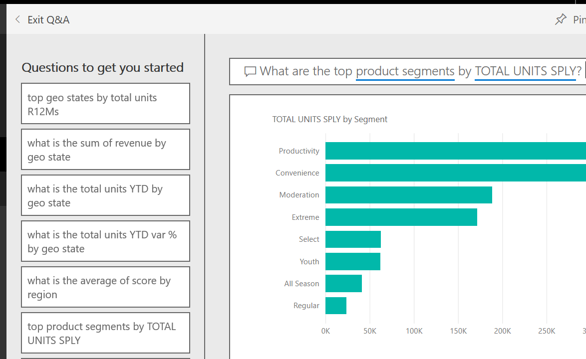

Sometimes, the fastest way to get answers about your data is by asking questions in the Q&A feature of Power BI. 

> [!NOTE]
> Though Power BI Q&A only currently supports answering queries that are asked in English, a preview is available for Spanish that can be enabled by your Power BI administrator.

**Explore Q&A**

You can use Q&A to explore your data by using the intuitive, natural language capabilities of Power BI and receive answers in the form of charts and graphs. 

## Ask a question

Ask a question about your data in Q&A by using natural language. Natural language refers to the ordinary language that humans use to communicate with one another every day. An example would be, “What are the total units by region?”

Q&A is available on dashboards and reports in Power BI. To open the Q&A screen, go to the dashboard and place your cursor in the question box.

If the visuals' axis labels and values include the words *sales*, *account*, *month*, and *opportunities*, then you can confidently ask questions that use those values. For example, "Which account has the highest opportunity" or "Show sales by month as a bar chart."

Other helpful items are provided on the side of the screen. For each dataset, Q&A shows you keywords and occasionally shows you some sample or suggested questions. Select any item to add them to the question box.

Another way that Q&A helps you ask questions is with prompts, autocomplete, and visual cues.

### Q&A visuals

Q&A picks the best visual based on the data being displayed. For example, numbers may be displayed as a line chart while cities are more likely to be displayed as a map.

You can also tell Q&A which visual to use by adding it to your question. Q&A will prompt you with a list of workable visual types. Using the previous example, you could ask, "What are the total units by region *by pie chart*?"

**Words and terminology that Q&A recognizes**

The best way to determine if Power BI recognizes a keyword is by typing it in the question box. If the word or term appears dimmed, then Power BI doesn't recognize it.
The keywords in the following table use singular and present tense, but all tenses and pluralities are recognized. 

For more detailed information, see:
[Tips for asking questions in Power BI Q&A](https://docs.microsoft.com/power-bi/consumer/end-user-q-and-a-tips)

|     Category         |     Keywords                                                                                                                                                                                                                                                                                                                                                                                           |
|----------------------|--------------------------------------------------------------------------------------------------------------------------------------------------------------------------------------------------------------------------------------------------------------------------------------------------------------------------------------------------------------------------------------------------------|
|    Aggregates        |    total, sum, amount, number, quantity, count, average, most, least, fewest, largest, smallest, highest, biggest, maximum, max, greatest, lowest, littlest,   minimum, min                                                                                                                                                                                                                        |
|    Comparisons       |    vs,   versus, compared to, compared with                                                                                                                                                                                                                                                                                                                                                            |
|    Dates             |    Power   BI recognizes most date terms (day, week, month, year, quarter, decade, and so on)   |
|    Relative dates    |    today,   right now, current time, yesterday, tomorrow, the current, next, the coming,   last, previous, ago, before now, sooner than, after, later than, from, at,   on, from now, after now, in the future, past, last, previous, within, in,   over, N days ago, N days from now, next, once, twice. Example: Count of   orders in the past 6 days.                                               |
|    Query commands    |    sorted, sort by, direction, group, group by, by, show, list, display, give me, name,   just, only, arrange, rank, compare, to, with, against, alphabetically,   ascending, descending, order                                                                                                                                                                                                      |
|    Range             |    greater,   more, larger, above, over, >, less, smaller, fewer, below, under, <, at   least, no less than, >=, at most, no more than, <=, in, between, in the   range of, from, later, earlier, sooner, after, on, at, later than, after,   since, starting with, starting from, ending with                                                                                                         |
|    Times             |    AM,   PM, o'clock, noon, midnight, hour, minute, second, hh:mm:ss. Examples: 10 PM,   10:35 PM, 10:35:15 pm, 10 o'clock, noon, midnight, hour, minute, second.                                                                                                                                  

**Q&A helps phrase the question**

Q&A does its best to understand and answer the question by: 
-   Autocompleting words and questions. It uses various strategies, including autocompleting recognized words and previously used questions that returned valid responses. If more than one autocomplete option is available, they're presented in a drop-down list.
-   Correcting spelling.
-   Providing a preview of the answer in the form of a visual. The visual updates as you type and edit the question (it doesn't wait for you to press **Enter**).
-   Suggesting replacement terms from the underlying dataset(s) when you move the cursor back in the question box.
-   Restating the question based on the data in the underlying dataset(s). Q&A replaces the words you used with synonyms from the underlying dataset(s). By reading the restatement, you know whether Q&A understood your question or not.
-   Dimming words it doesn't understand.
