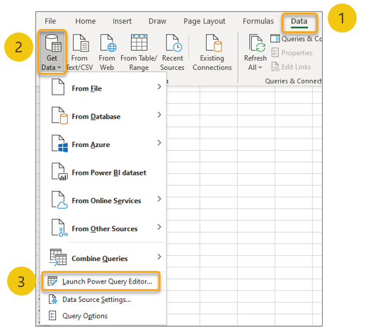
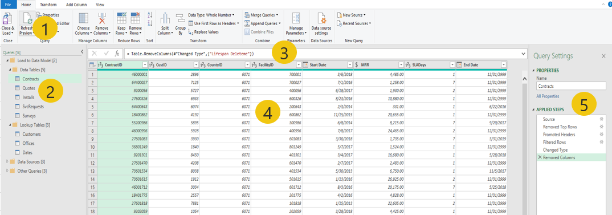

To get started using Power Query in Excel, you must first know where to find it.

> [!div class="mx-imgBorder"]
> 

You can find Power Query in Excel (also known as the Power Query Editor) by following these steps:

1. Go to the **Data** ribbon in Excel.

1. Select the **Get Data** dropdown list.

1. Select the **Launch Power Query Editor** option.

After you've launched Power Query Editor, two windows will display for the Excel application: the Excel workbook and Power Query Editor. We recommend that you maximize the **Power Query Editor** window to full size because the Excel window will be unresponsive with an active **Power Query Editor** window.

> [!div class="mx-imgBorder"]
> 

The preceding screenshot shows the five key UI areas of the **Power Query Editor** window:

- **Ribbon menu (1)** - Power Query Editor has a ribbon that's similar to other Office applications, including tabs and buttons that are organized across context-sensitive groupings for taking various actions.

- **Queries pane (2)** - Shows the names of the queries that are included with the file. You can create multiple queries in one workbook. Queries can be grouped into folders for organization and management.

- **Formula bar** **(3)** - Area for the M language code to be shown. This area is disabled by default and can (and should) be enabled on the **View** tab of the ribbon.

- **Preview** **(4)** - Displays a preview of the results that are generated by the query that is selected in the Queries pane, evaluated up through the selected step within the Query Settings pane.

- **Query Settings (5)** - Contains the query's name and the list of the applied steps. Each action that is performed by the author will add or update a step in this list. You can navigate to the results of each step, rename them for documentation purposes, and reorder them by using this pane.
