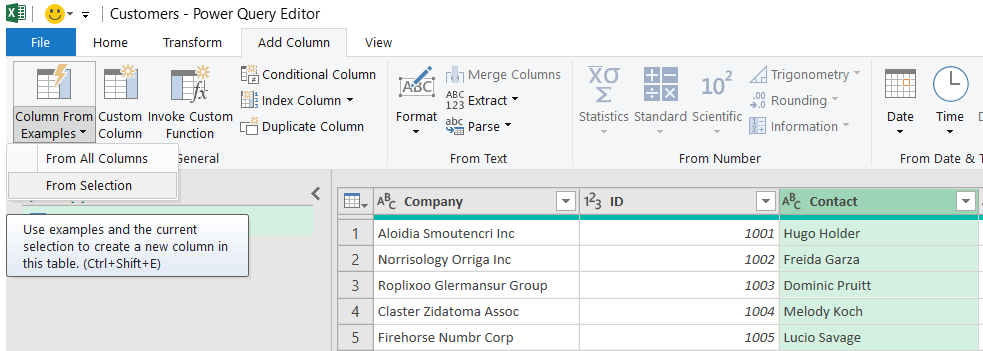
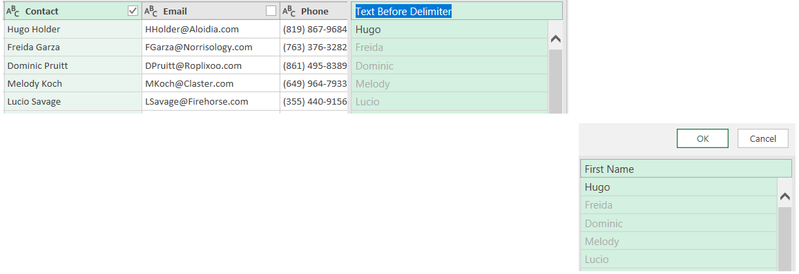
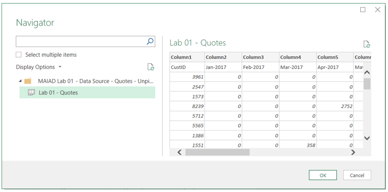
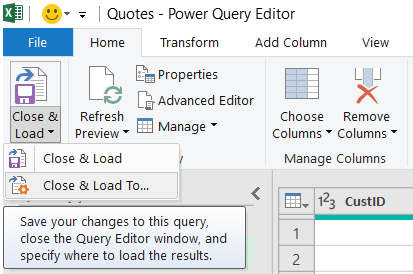
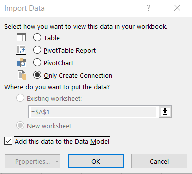

Now is your opportunity to give Power Query a try with this guided, step-by-step use case. Use the provided example data source files to complete the exercises.

## Lab 01 - Analytics in Excel - Using Power Query in Excel

The estimated time to complete this lab is 30 minutes.

In this hands-on learning lab, you complete the following tasks:

1. Use Power Query to connect to a .csv source data file - Customers

1. Use Power Query transformations to splice a column by delimiter - Customers

1. Use Power Query to connect to an Excel source data file - Quotes

1. Use Power Query transformations to unpivot - Quotes

1. Use Power Query transformations to clean - Quotes

## Lab prerequisites

The following prerequisites and setup must be in place for successful completion of the exercises:

- You must be connected to the internet.

- You must have Microsoft Office installed.

- Sign up for [Power BI](https://aka.ms/pbimaiadtraining/?azure-portal=true).

- At minimum, a computer with two cores and 4 GB of RAM running one of the following versions of Windows: Windows 8 / Windows Server 2008 R2, or later.

- If you choose to use Internet Explorer, it will require version 10 or greater. You can also use Microsoft Edge or Chrome.

- Verify whether you have a 32-bit or 64-bit operating system to decide if you need to install the 32-bit or 64-bit applications.

  > [!Note]
  > 64-bit Excel and Power BI Desktop is best.

- Download the Attendee Content: Create a folder called MAIAD on the C: drive of your local machine. Copy all content from the folder called MAIADAttendee to the MAIAD folder you created (C:\MAIAD).

- Download and install Power BI Desktop using any one of the options listed below:

  - If you have Windows 10, use Microsoft App Store to download and install Power BI Desktop application.

  - Download and install [Microsoft Power BI Desktop](https://www.microsoft.com/download/details.aspx?id=45331&azure-portal=true).

- If you already have Power BI Desktop installed, ensure you have the latest version of Power BI downloaded.

## Document structure

Source Data or Starting Files for each Lab are located within each Lab folder.

- Lab 01 is completed using Power Query in the **Excel** application.

- Lab 02A and Lab 02B are completed using **Power BI Desktop** application.

- Lab 03A is completed using **Power BI Desktop**, **Power BI service**, and **Excel** applications.

- Lab 03B is completed using **Excel** and **Power BI service** applications.

Each of the Labs comes with step-by-step instructions to follow and contains screen images throughout the instructions. The key actions for each of the steps are identified by **bold** text. Pay attention to Notes, Tips, and other Important information. Lastly, each Lab contains a completed solution file that can be used as a reference.

## Overview

The estimated time to complete this lab is 30 minutes.

In this lab, you complete the following tasks:

1. Use Power Query to connect to a CSV source data file - Customers

1. Use Power Query transformations to Split Column by Delimiter - Customers

1. Use Power Query to connect to an XLSX source data file - Quotes

1. Use Power Query transformations to Unpivot - Quotes

1. Use Power Query transformations to Clean - Quotes

    > [!NOTE]
    > This lab has been created based on the sales activities of the *fictitious* Wi-Fi company called SureWi which has been provided by [P3 Adaptive](https://p3adaptive.com/?azure-portal=true). The data is property of P3 Adaptive and has been shared with the purpose of demonstrating Excel and Power BI functionality with industry sample data. Any use of this data must include this attribution to P3 Adaptive.

## Exercise 1: Use Power Query to connect to CSV - Customers.csv

In this exercise, you use Excel to connect to a CSV source data file.

### Task 1: Launch Excel

In this task, you launch a new blank worksheet to get started.

1. Launch Excel.

1. Create a new blank workbook.

    > [!div class="mx-imgBorder"]
    > 

### Task 2: Use Power Query to connect to CSV

In this task, you connect to the Customers CSV source data file.

1. Select the **Data** tab on the Main Excel ribbon.

1. Choose **Get Data** > **From File** > **FromText/CSV**.

    > [!div class="mx-imgBorder"]
    > 

1. Navigate to the file **D:\data-cleaning\AttendeeLab MaterialsLab 01 MAIAD Lab 01 - Data Source - Customers.csv**.

1. In the Preview area, you'll see a sample of the Customers data, column names, and values.

    > [!NOTE]
    > This is ONLY a preview of the data.

    > [!div class="mx-imgBorder"]
    > 

1. Select the **Transform Data** button. This will launch the Power Query Editor window.

    > [!NOTE]
    > When working in Power Query, it's best to **maximize** the Power Query Editor window so that you can see a full view of the Power Query window menus, panes, and options.

1. By default, the Queries Pane on the left-hand side of the Power Query Editor Window will be collapsed. Select the **arrow** in the Queries pane to expand and open the Queries pane.

    > [!div class="mx-imgBorder"]
    > 

1. In the Queries Pane, right-click the default query name called "**MAIAD Lab 01 - Data Source - Customers**" and **Rename** the query to "**Customers**".

    > [!div class="mx-imgBorder"]
    > 

    > [!TIP]
    > Queries that will be loaded to use as part of a Data Model should be given a clear, descriptive, user-friendly, noun name that describes what the data represents. For example, Customers, Quotes, Invoices, Products, Geography etc.

## Exercise 2: Use Power Query transformations to Split Column by Delimiter - Customers

In this exercise, you use Power Query to extract the First Name from the Contact column.

### Task 1: Use Column from Example

In this task, you create a new column called **First Name** using the Add Column > Column from Example transformation to split the **Contact** by a delimiter.

1. From the Preview grid, select the **Contacts** column.

1. Then choose from the **Add Column** Tab, the **Columns from Examples** down arrow and the **From Selection** option.

    > [!div class="mx-imgBorder"]
    > 

    > [!NOTE]
    > This opens a NEW user interface window called "Add Columns From Examples" - this window looks like the Power Query Preview grid, but it's separate window allowing you to type in the proposed value so that Power Query can identify the pattern and formula to apply achieving the end results.

1. In the "Add Column From Examples" window, in the column called **Column1**, type the value "**Hugo**" and then enter.

    > [!div class="mx-imgBorder"]
    > 

    > [!NOTE]
    > Once you hit enter, Power Query will then identify if a pattern exists in the data to populate the values for all rows!

1. **Double-click** in the default header called "**Text Before Delimiter**" and rename the new column as "**First Name**." Select the **OK** button.

    > [!div class="mx-imgBorder"]
    > 

    > [!NOTE]
    > Now, in the Power Query Editor preview grid, you will notice the NEW column called **First Name** - created by parsing out the **First Name** from the **Contact** using the Column from Example transformation.

    > [!div class="mx-imgBorder"]
    > 

## Exercise 3: Use Power Query to connect to XLSX - Quotes.xlsx

In this exercise, you use Excel to connect to an XLSX source data file.

### Task 1: Connect to XLSX source data from within the Power Query Editor window

In this task, you start from within the Power Query Editor window.

1. From the Power Query **Home** menu, select the **New Source** > **Excel** file option.

    > [!div class="mx-imgBorder"]
    > 

1. Navigate to the file **D:\data-cleaning\AttendeeLab MaterialsLab 01 MAIAD Lab 01 - Data Source - Quotes.xlsx**.

1. In the Navigator window, select the worksheet called "**Lab 01 - Quotes**".

    > [!NOTE]
    > This is ONLY a preview of the data.

    > [!div class="mx-imgBorder"]
    > 

1. Select the **OK** button to load as a second query in the Power Query Editor window.

1. In the Queries Pane, right-click the default query name called "**Lab 01 - Quotes**" and **Rename** the Query to "**Quotes**."

    > [!div class="mx-imgBorder"]
    > 

## Exercise 4: Use Power Query to unpivot - Quotes

In this exercise, you use Power Query transformations to structure the Quotes data for Power Pivot.

### Task 1: Use First Row as Headers transformation button

In this task, you move the first row with the column header values to the table header.

1. On the **Home** menu, select the **Use First Row as Headers** button.

    > [!div class="mx-imgBorder"]
    > 

### Task 2: Use the Unpivot transformation menu option

In this task, you unpivot the Quotes data.

1. In the Preview Pane, right-click the **CustID** column to display menu options.

1. Then choose the **Unpivot Other Columns** option.

    > [!div class="mx-imgBorder"]
    > 

1. Double-click the column called **Attribute** to **rename** the column to **QuoteDate**.

1. Double-click the column called **Value** to **rename** the column to **QuoteAmt**.

    *Before*

    > [!div class="mx-imgBorder"]
    > 

    *After*

    > [!div class="mx-imgBorder"]
    > 

## Exercise 5: Use Power Query to clean - quotes

In this exercise, you use Power Query transformations to Clean the Quotes data.

### Task 1: Use the Replace transformation

In this task, you use a replace technique to change the **QuoteDate** a full date that can be converted to a Date data type.

1. In the Preview window, right-click the **QuoteDate** column to display menu options.

1. Next, choose the **Replace Values...** option.

    > [!div class="mx-imgBorder"]
    > 

1. In the Replace Values... UI window:

1. Enter a hyphen "-" in the **Value To Find** text box.

1. Enter "/1/" in the **Replace With** text box.

    > [!div class="mx-imgBorder"]
    > 

1. Select the **OK** button.

### Task 2: Use the Data Type icon

In this task, you use the Data Type icon to change the data type from Text to Date.

1. Select the **ABC** icon that indicated the column is a Text data type.

1. Then choose the **Date** data type option from the data type menu options.

    > [!div class="mx-imgBorder"]
    > 

### Task 3: Close and load to the data model

In this task, you load the Customers and Quotes tables to the Data Model.

1. From the Home menu, select **Close & Load** > **Close & Load To...**.

    > [!div class="mx-imgBorder"]
    > 

1. On the Import window, select the **Only Create Connection** radio button.

    > [!div class="mx-imgBorder"]
    > 

1. And check the box next to **Add this data to the Data Model**.

1. Select the **OK** button.

    > [!Note]
    > The loaded tables will be displayed in the Queries & Connections Pane with total number of rows loaded.

    > [!div class="mx-imgBorder"]
    > 

    > [!NOTE]
    > At the point, we have connected to the data sources using Power Query and we have selected the checkbox option to Add this data to the Data Model. However, we have not actually seen where this data has been loaded to. In the next Lab 02A, we will use Power BI Desktop to Import the Power Query connections, Customer table, and Quote table to create the Data Model.

### Task 4: Save the File

In this task, you save the Excel file with the Customers and Quotes query connections.

1. From the Main Excel ribbon, select **File** > **Save**.

1. Navigate to the folder **D:\data-cleaning\AttendeeLab MaterialsLab 01** and then save the file as "**MAIAD Lab 01 - My Solution.xlsx**".

## Summary

In this lab, you used Power Query in Excel to connect to CSV and XLSX source data files, created a new column using Column from Example, unpivoted and applied transformations in Power Query, loaded source data to a Data Model, and saved the Excel file with the data connections.

> [!div class="mx-imgBorder"]
> 
