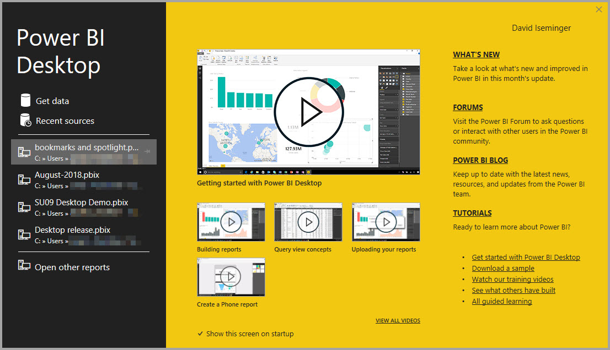

Welcome to the Learning module designed to get you up and running with **Power BI Desktop**. In this module, you learn how to get around in Power BI Desktop, how to connect to data, create visuals and reports, and how to publish those reports to the **Power BI service**.

Power BI Desktop lets you create a collection of queries, data connections, and reports that can easily be shared with others. Power BI Desktop integrates proven Microsoft technologies – the powerful Power Query engine, data modeling, and visualizations – and works seamlessly with the online [**Power BI service**](https://app.powerbi.com/).

With the combination of **Power BI Desktop** (where analysts and others can create powerful data connections, models and reports) and the [**Power BI service**](https://app.powerbi.com/) (where Power BI Desktop reports can be shared so users can view and interact with them), new insights from the world of data are easier to model, build, share, and extend.

Data analysts will find Power BI Desktop a powerful, flexible, and a highly accessible tool to connect with and shape the world of data, build robust models, and craft well-structured reports.

## How Power BI Desktop works
With Power BI Desktop, you *connect to data* (usually multiple data sources), *shape that data* (with queries that build insightful, compelling data models), and use that model to *create reports* (which others can leverage, build upon, and share).

When the steps are completed to your satisfaction – connect, shape, and report – you can save that work in Power BI Desktop file format, which is the .pbix extension. Power BI Desktop files can be shared like any other file, but the most compelling way to share Power BI Desktop files is to upload them (share them) on the [**Power BI service**](https://preview.powerbi.com/). 

Power BI Desktop centralizes, simplifies, and streamlines what can otherwise be a scattered, disconnected, and arduous process of designing and creating business intelligence repositories and reports.

Ready to give it a try? Let’s get started.

## Install and run Power BI Desktop
You can download Power BI Desktop from the **Power BI** service by selecting the **gear** icon, then select **Power BI Desktop**.

You can also install **Power BI Desktop** as an app from the **Microsoft Store**.

Power BI Desktop is installed as an application, and runs on your desktop. When you run Power BI Desktop, a *Welcome* screen is displayed.

You can **Get Data**, see **Recent Sources**, or **Open other reports** directly from the **Welcome** screen (from the links in the left pane). If you close the screen (select the **x** in the top right corner), the **Report** view of Power BI Desktop is displayed.

There are three views in Power BI Desktop: **Report** view, **Data** view, and **Relationships** view. Power BI Desktop also includes **Query Editor**, which opens in a separate window. In **Query Editor**, you can build queries and transform data, then load that refined data model into Power BI Desktop, and create reports.

The following screen shows the three view icons along the left of Power BI Desktop: **Report**, **Data**, and **Relationships**, from top to bottom. The currently displayed view is indicated by the yellow bar along the left. In this case, **Report** view is currently displayed. You can change views by selecting any of those three icons.

With Power BI Desktop installed you’re ready to connect to data, shape data, and build reports (usually in that order). In the following units, we take a tour through each of those activities in turn.
